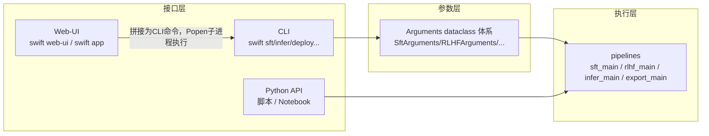
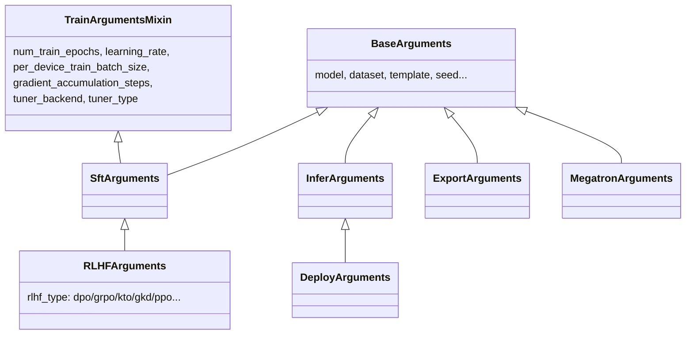
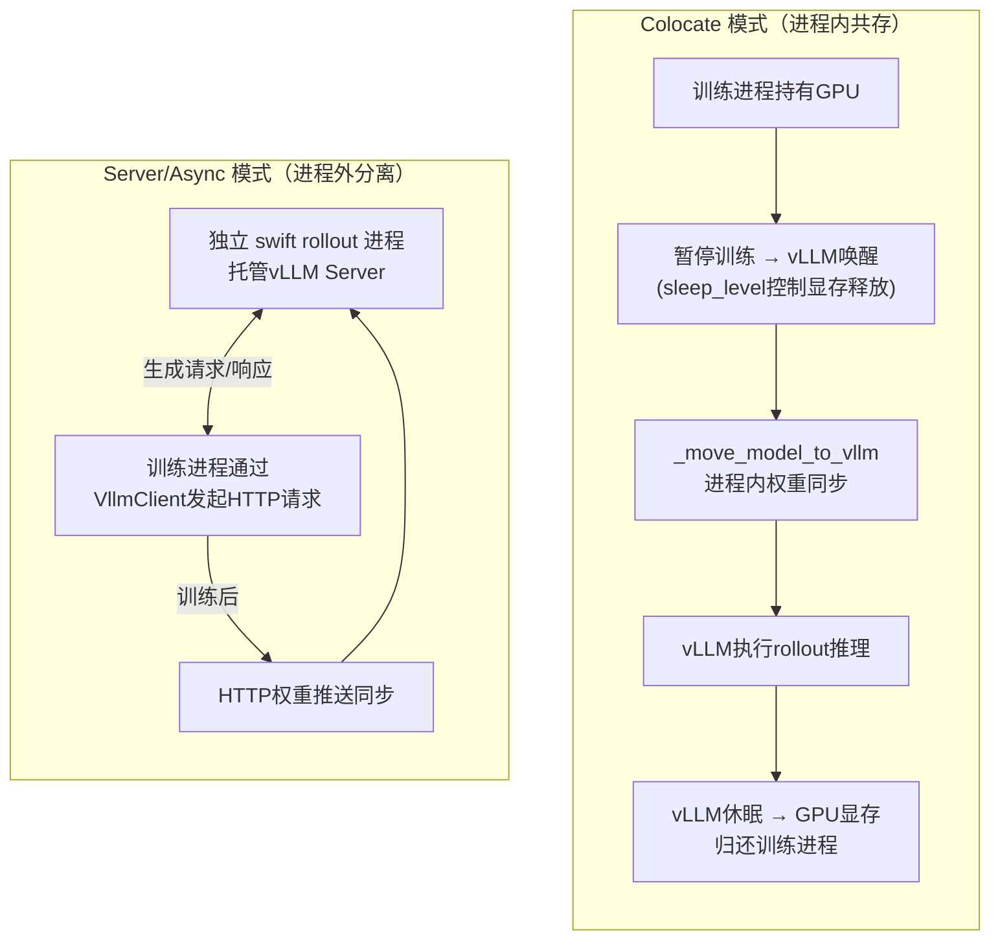
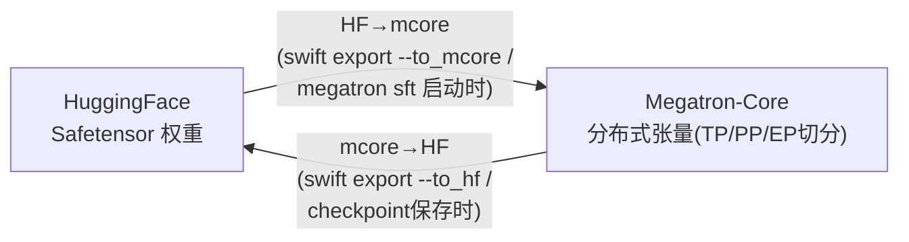
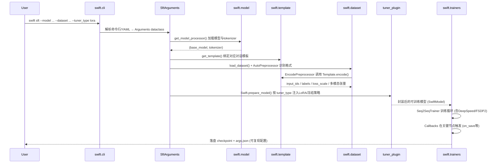
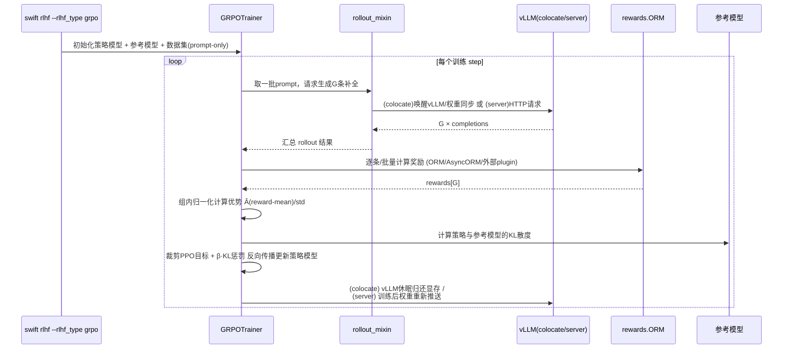
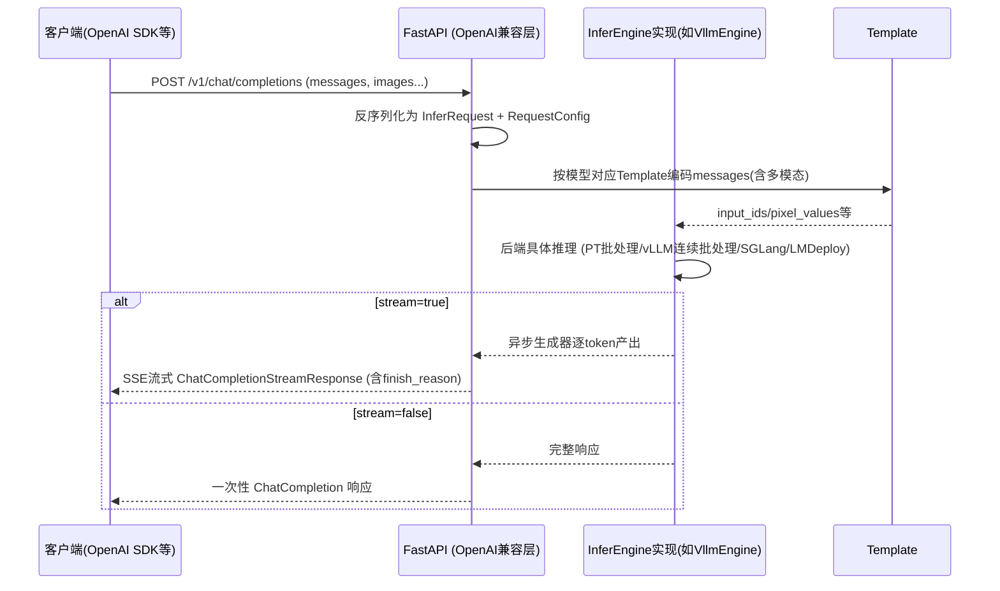
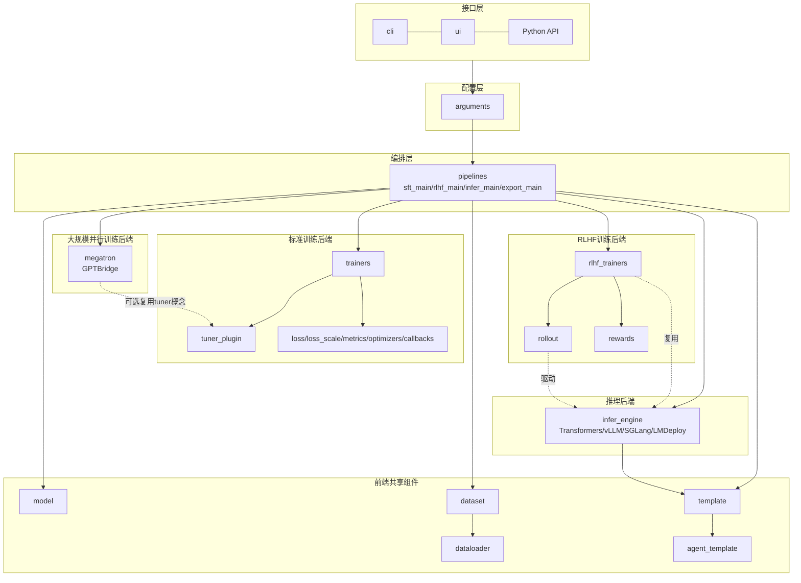

# ms-swift v4.3.0 架构分析文档

> 调研对象：[modelscope/ms-swift](https://github.com/modelscope/ms-swift)（ModelScope 社区大模型/多模态大模型训练与部署框架）
> 版本：v4.3.0（2026 年发布，v4 大版本线的第 4 个功能版本，对应 `Full Changelog: v4.2.0...v4.3.0`）
> 论文：SWIFT: A Scalable lightWeight Infrastructure for Fine-Tuning（AAAI 2025，arXiv:2408.05517）

---

## 1. 项目定位与总体设计理念

ms-swift 是一个覆盖"预训练 → 微调（SFT/PEFT）→ 人类对齐（RLHF）→ 推理 → 评测 → 量化导出 → 部署"全生命周期的大模型/多模态大模型工程框架，由 ModelScope 团队开发维护。截至 v4.3.0，框架已支持 **600+ 纯文本大模型** 与 **300+ 多模态大模型**，并集成 Megatron-Core 并行训练能力与主流强化学习（GRPO 系列）算法族。

v4 大版本相较 v3 是一次**彻底的架构重构**（Issue #7250《Welcome ms-swift v4》），核心设计理念可以概括为四点：

1. **单一职责的一级目录（Top-level Package）拆分**：v3 时代所有 LLM 相关能力集中在 `swift.llm` 单一包中，随着模型数量、任务类型、算法种类的爆炸式增长，该包变得难以维护。v4 将其拆分为 `template`、`dataset`、`model`、`pipelines` 等独立一级包，每个包只负责一类关注点，包之间通过清晰的函数/类接口交互。
2. **model_type 与 template 解耦**：v3 中一个模型可能因为 few-shot / thinking 模式不同而衍生出 `qwen3_thinking`、`qwen3_no_thinking` 等大量冗余 `model_type`。v4 将"模型结构标识"（model_type，对齐 transformers 的 model_type）与"对话模板"（template）彻底解耦，一个 model_type 可以关联多个 template，反之亦然，大幅简化了模型接入与维护成本。
3. **插件化的 mapping 注册机制**：损失函数、loss scale、评测指标、优化器、Tuner、回调、Agent 模板、奖励模型（ORM/PRM）等几乎所有可扩展点都采用"基类继承 + 字典注册（mapping.py）+ 命令行参数按名字引用"的统一模式，用户无需修改框架源码即可注入自定义逻辑。
4. **训练后端与推理后端的正交解耦**：标准训练（HuggingFace `Trainer` 体系）、Megatron-Core 大规模并行训练、RLHF 训练（`rlhf_trainers`）三条训练路径共享同一套 `model`/`template`/`dataset` 前端组件，仅在 Trainer 层和参数体系上分叉；推理侧的 4 种后端（transformers/vLLM/SGLang/LMDeploy）共享同一套 `InferRequest`/`RequestConfig` 协议。这种"前端统一、后端可插拔"的设计是整个框架可扩展性的核心。

---

## 2. 顶层目录结构与模块职责地图

以下目录结构基于官方架构文档（`docs/source/Customization/Architecture.md`）与仓库实际布局整理，是 v4.3.0 的权威模块划分：

```
swift/
├── cli/                # 命令行入口与分发（swift sft / swift infer / swift deploy ...）
├── pipelines/          # 各子命令的主函数实现：sft_main / rlhf_main / infer_main / export_main ...
├── arguments/          # 命令行参数体系：SftArguments / RLHFArguments / InferArguments / ExportArguments 等
├── config/             # DeepSpeed / FSDP2 等分布式训练的内置配置文件（zero2.json 等）
├── model/              # 模型加载与注册：MODEL_MAPPING、ModelMeta、get_model_processor
├── template/           # 对话模板：Template 基类、TemplateMeta、TEMPLATE_MAPPING、多模态编码逻辑
├── dataset/            # 数据集注册、预处理、packing、流式加载
├── dataloader/         # DataLoader 实现（shard 模式 / dispatcher 模式）
├── agent_template/     # Agent/工具调用模板（tools 格式化、tool_call 解析）
├── trainers/           # 预训练/SFT/Embedding/Reranker/序列分类任务的 Trainer 实现（基于 HF Trainer 封装）
├── rlhf_trainers/      # GRPO/GKD/DPO/KTO/PPO/RM 等对齐算法的 Trainer 实现
├── rollout/            # RL 训练中 rollout 采样过程的实现（配合 swift rollout 命令）
├── rewards/            # 奖励函数：ORM（结果奖励模型）、PRM（过程奖励模型）
├── tuner_plugin/       # PEFT/Tuner 插件：LoRA、全参、tuner_type 注册与 prepare_model/save/load 接口
├── loss/               # 可插拔 Loss（causal_lm / reranker / embedding 等）
├── loss_scale/         # Token 级别的 loss 权重策略（用于 Agent/推理链等场景）
├── metrics/            # 评测指标（NLG 指标等），ms-swift 与 Megatron-SWIFT 共用
├── optimizers/         # 自定义优化器（如多模态分学习率、Muon-CLIP 等）
├── callbacks/          # 训练回调（TrainerCallback 派生）
├── infer_engine/       # 推理引擎：TransformersEngine / VllmEngine / SglangEngine / LmdeployEngine
├── megatron/           # Megatron-SWIFT：并行训练、GPTBridge 权重转换、Megatron 版 Trainer
├── ui/                 # swift web-ui 的 Gradio 界面实现
└── version.py
```

对应关系一览：

| 目录 | 关注点 | 关键抽象 |
|---|---|---|
| `arguments` | 命令行/YAML 参数解析 | `SftArguments`, `RLHFArguments`, `InferArguments`, `ExportArguments`, `EvalArguments` |
| `model` | "有哪些模型、怎么加载" | `ModelMeta`, `MODEL_MAPPING`, `get_model_processor()` |
| `template` | "消息怎么变成 token" | `Template`, `TemplateMeta`, `TEMPLATE_MAPPING`, `get_template()` |
| `dataset` | "数据从哪来、怎么预处理" | `AutoPreprocessor`, `EncodePreprocessor`, `load_dataset()` |
| `trainers` / `rlhf_trainers` | "怎么训练" | `Seq2SeqTrainer`, `GRPOTrainer`, `DPOTrainer`, `SwiftMixin` |
| `tuner_plugin` | "怎么参数高效微调" | `Tuner` 基类，`prepare_model/save_pretrained/from_pretrained` |
| `infer_engine` | "怎么推理" | `InferEngine` 基类, `InferRequest`, `RequestConfig` |
| `megatron` | "怎么大规模并行训练" | `GPTBridge`, `BaseMegatronTrainer`, `MegatronModelMeta` |
| `rollout` / `rewards` | "RL 里怎么采样、怎么打分" | `MultiTurnScheduler`, `ORM`, `AsyncORM`, `PRM` |
| `pipelines` | "串起以上所有模块" | `sft_main`, `rlhf_main`, `infer_main`, `export_main` |
| `cli` | "命令行怎么路由" | `ROUTE_MAPPING` 分发表 |
| `ui` | "Web 界面" | `SwiftWebUI`, 各 `LLMTrain/LLMInfer/...` Tab |

---

## 3. 三层用户接口设计

ms-swift 对外暴露三条互相等价、最终汇聚到同一批 pipeline 函数的入口，这是其"易用性"与"可编程性"兼得的关键设计：



### 3.1 CLI 层（推荐的主入口）

`swift/cli/main.py` 内置一张 `ROUTE_MAPPING` 分发表，将子命令名映射到具体的 handler 模块，例如：

| 命令 | Handler 模块 | 参数类 |
|---|---|---|
| `swift sft` / `swift pt` | `swift.cli.sft` | `SftArguments` |
| `swift rlhf` | `swift.cli.rlhf` | `RLHFArguments` |
| `swift infer` | `swift.cli.infer` | `InferArguments` |
| `swift deploy` | `swift.cli.deploy` | `DeployArguments` |
| `swift app` / `swift web-ui` | `swift.cli.app` / `swift.cli.web_ui` | `WebUIArguments` |
| `swift eval` | `swift.cli.eval` | `EvalArguments` |
| `swift export` | `swift.cli.export` | `ExportArguments` |
| `swift rollout` | `swift.cli.rollout` | `RolloutArguments` |
| `swift sample` | `swift.cli.sample` | `SamplingArguments` |
| `megatron sft/rlhf` | Megatron 专属入口 | `MegatronArguments` |

参数既可通过 `--xxx` 命令行 flag 传入，也可通过 `--config a.yaml/json` 一次性传入。分布式训练场景下，`cli_main` 会检测 `NPROC_PER_NODE`/`MASTER_PORT` 等环境变量，自动用 `torch.distributed.run` 包装实际执行命令——这意味着单机多卡/多机多卡训练无需用户手写 `torchrun` 命令。

### 3.2 Web-UI 层

`swift/ui/app.py` 中的 `SwiftWebUI` 组合了 `swift/ui/` 下按功能分 Tab 的子界面类（`LLMTrain`、`LLMRLHF`、`LLMGRPO`、`LLMInfer`、`LLMExport`、`LLMEval`、`LLMSample` 等），所有 Tab 组件继承自 `BaseUI`，负责把 Arguments dataclass 的字段自动映射为 Gradio 控件。**关键实现细节**：Web-UI 本质上是一个"命令行拼接器"——当用户点击"开始训练"按钮时，UI 会把表单值拼接成一条完整的 `swift sft ...` 命令行字符串，再用 `Popen` 在后台子进程中执行，而不是在进程内直接调用 Python 函数。这保证了 Web-UI 与 CLI 在行为上的完全一致性，也是它能天然支持分布式训练启动的原因。

### 3.3 Python API 层

面向脚本化/Notebook 场景，暴露的核心符号包括：`get_model_processor`（加载模型+tokenizer/processor）、`get_template`（实例化对话模板）、`load_dataset`、`EncodePreprocessor`、`Seq2SeqTrainer`、各推理 Engine 类、`InferRequest`/`RequestConfig`。三层接口最终都会走到同一套 `pipelines` 函数与 `Arguments` 体系，因此三种用法在效果上是完全等价的，只是交互形式不同。

---

## 4. 参数与配置体系（arguments）

Arguments 体系是贯穿全框架的"配置总线"，采用 dataclass 继承的方式组织：



- **`tuner_backend`**（默认 `peft`）与 **`tuner_type`**（`lora`/`full`/`lora_llm` 等）两个参数是训练路径分叉的关键开关，由后续 `tuner_plugin` 模块消费。
- **`--adapters` 自动回填**：推理/续训时若指定 `--adapters <ckpt目录>`，框架会读取该目录下训练时自动落盘的 `args.json`，反向恢复模型路径、system prompt 等训练期配置，避免用户重复输入（可用 `--load_args false` 关闭）。
- 模型与数据集来源的解析（ModelScope ID / HuggingFace ID / 本地路径，`--use_hf true` 切换源）在所有接口层与所有 Arguments 子类中是统一实现的，保证行为一致性。

---

## 5. 模型与模板子系统（model / template / dataset）

这三个包共同构成"数据 → 模型可读张量"的前端流水线，是 SFT、RLHF、推理三条链路共享的基础设施。

### 5.1 模型注册（model）

`MODEL_MAPPING` 是一个从模型 ID/model_type 到 `ModelMeta` 描述对象的全局字典，`ModelMeta` 中记录了该模型家族关联的默认 template、模型架构标签（用于后续 Megatron 权重转换、PEFT target_modules 推断等）。`get_model_processor()` 是唯一的模型加载入口，负责解析模型来源、下载/读取权重、并返回 `(model, tokenizer_or_processor)` 二元组。v4.3.0 新增的 `language_model_only` 参数允许多模态模型只加载/训练/保存其语言模型部分，便于做纯文本消融或降低显存占用。

### 5.2 对话模板（template）

`Template` 类是**整个框架中最核心的运行时对象之一**，职责是把 `messages`（对话历史，可含图像/音频/视频/工具调用）编码为 `input_ids`、`labels`、多模态张量（如 `pixel_values`）以及 `loss_scale`。关键设计：

- **`TemplateMeta`**：静态元信息（模板 ID、默认特殊 token、system 前缀等）。
- **编码流程**：`Template.encode()` → `Template.format_messages()` → 拼接各角色 token → 应用 `loss_scale` → 截断策略（`truncation_strategy`）。
- **训练/推理双模式**：同一个 `Template` 实例通过 `set_mode('train'|'infer')` 切换是否生成 `labels`。
- **两种编码后端**：`swift` 原生后端与 `jinja`（chat_template）后端并存，框架内置一致性测试保证两者对齐。
- **v4.3.0 新增 `chat_template_kwargs`**：支持在数据样本粒度配置 `max_pixels`、`enable_thinking` 等参数，OpenAI 兼容部署接口也可透传 `enable_thinking`/`preserve_thinking`，使"是否保留思考链"这类行为可以按请求粒度控制而非仅在启动时全局固定。
- **Agent Template**（独立子包 `agent_template`）：负责将 `tools`/`tool_call`/`tool_response` 格式化进 system 或对话轮次中，并在部署阶段反向解析模型输出为结构化 `Function` 调用（如 `Qwen3CoderAgentTemplate`、`MinimaxM2AgentTemplate`）。Agent Template 与 model_type 解耦，同一份 Agent 数据集格式可以自由切换不同模型训练，无需改数据。

### 5.3 数据集（dataset / dataloader）

`load_dataset()` 通过 `DATASET_MAPPING` 解析内置数据集或直接读取本地文件；`AutoPreprocessor` 自动识别 `messages`/`alpaca`/`query-response` 等常见数据格式；`EncodePreprocessor` 调用 `Template.encode` 完成 token 化。`dataloader` 目录实现了两种数据分发模式（shard 模式与 dispatcher 模式），并支持 packing（多条短样本拼接为一条长序列以提升 GPU 利用率）与流式加载（`--streaming true`，用于超大规模预训练语料）。

---

## 6. 标准训练体系（trainers + tuner_plugin + PEFT 生态）

### 6.1 Trainer 层

`swift/trainers` 中的 `Seq2SeqTrainer` 通过 `SwiftMixin` 对 HuggingFace `Trainer` 进行增强（而非重新实现训练循环），复用了 HF 生态在 DeepSpeed ZeRO-2/3、FSDP/FSDP2、混合精度、梯度累积等方面的成熟能力；同时针对 PEFT/LoRA 模型在 ZeRO-3 权重收集、checkpoint 保存等场景做了专门修复。这一"复用而非重造轮子"的策略大幅降低了标准训练路径的维护成本，也意味着 HF Trainer 生态的新特性能较快被 ms-swift 吸收。

### 6.2 可插拔 Tuner（tuner_plugin）

自定义 PEFT 方法需要继承 `Tuner` 基类并实现三个方法：

| 方法 | 调用时机 | 作用 |
|---|---|---|
| `prepare_model` | 训练开始前 | 对原始模型做封装（如给某些层挂 LoRA、冻结其余参数） |
| `save_pretrained` | 训练/保存 checkpoint 时 | 落盘可训练部分的权重 |
| `from_pretrained` | 推理/断点续训时 | 恢复模型结构并加载权重 |

框架内置的 `LoRALLMTuner` 展示了一种典型混合策略：对 LLM 部分做 LoRA，对 ViT 部分做全参数训练，通过 `--tuner_type lora_llm` 一键启用。这套接口与 v3 时代直接依赖 `peft` 库的方式相比，把"tuner 长什么样"这个决策权交还给了框架自身的注册表，从而能在纯 `peft` 库之外扩展出更多混合训练策略。

### 6.3 Loss / Loss Scale / Metrics / Optimizer / Callback 的统一注册模式

这五类可扩展点在设计上高度同构，均遵循"基类 + `mapping.py` 字典注册 + `--xxx_name` 命令行引用"的模式：

- **Loss**（`swift/loss`）：继承 `BaseLoss` 并实现 `__call__(outputs, labels, **kwargs) -> Tensor`，当前支持 sft/pretrain/reranker/embedding 任务的自定义 loss。
- **Loss Scale**（`swift/loss_scale`）：控制"哪些 token 参与 loss 计算、权重多少"，例如 Agent 场景中希望模型少花注意力在 `<tool_call>` 结构 token 上、多学习实际参数内容，就可以给不同 token 段设置不同权重。支持两种自定义方式：Python 类（`get_loss_scale` 返回 `(片段列表, 权重列表)`）或 JSON 配置（字符串精确匹配 / 正则匹配两种模式，如内置的 `react.json`、`hermes.json`）。RLHF 场景下 loss_scale 只能控制 token 是否参与训练（0/1），不支持连续权重。
- **Metrics**（`swift/metrics`）：ms-swift 侧继承 `EvalMetrics.compute_metrics`，Megatron-SWIFT 侧继承 `Metric.update/compute`，均返回 `Dict[str, float]`，通过 `--eval_metric` 引用。
- **Optimizers**（`swift/optimizers`）：继承 `OptimizerCallback` 并覆盖 `create_optimizer`，典型用例是 `MultimodalOptimizerCallback` 实现的 ViT/Aligner/LLM 分学习率训练。
- **Callbacks**（`swift/callbacks`）：接口与 HF Transformers 的 `TrainerCallback` 完全一致，覆盖 `on_train_begin`/`on_save` 等生命周期钩子。

这种"五件套"同构设计的价值在于：用户一旦掌握其中一种扩展机制的写法，就能立刻类推到其余四种，显著降低了框架的学习曲线，也是官方架构文档单独成篇介绍这五个模块的原因。

---

## 7. RLHF / 强化学习子系统（rlhf_trainers + rollout + rewards）

这是 v4.3.0 相对上游 HF 生态差异化程度最高、迭代最活跃的子系统，覆盖 DPO/KTO/ORPO/SimPO/CPO 等离线算法与 PPO/GRPO 系列在线算法。

### 7.1 GRPO 训练架构

GRPO（Group Relative Policy Optimization）用"组内奖励基线"替代 PPO 中的价值模型：对每个 prompt 采样 G 条补全，优势函数定义为该组内奖励相对均值/标准差的归一化偏差，再套用带 KL 惩罚的裁剪策略梯度损失。ms-swift 在此基础上扩展出一整个算法家族，均通过 `swift rlhf --rlhf_type grpo` 结合不同超参/开关触发：

| 变体 | 关键参数 | 说明 |
|---|---|---|
| GRPO（标准） | `beta`, `epsilon`, `num_generations` | 基础算法（arXiv:2402.03300） |
| DAPO | `dynamic_sample=True`, `overlong_filter=True` | 动态重采样 + 过长惩罚过滤 |
| GSPO / SAPO / CISPO | 各自专属参数 | 序列级/软自适应/裁剪重要性采样等改进目标 |
| RLOO / REINFORCE++ | `advantage_estimator` | 不同优势估计方式 |
| REAL / FIPO | v4.3.0 新增 | 社区贡献的新算法（分别由招商技术团队 li2zhi 贡献） |

**Rollout 两种部署模式**（由 `--vllm_mode` 控制）是 GRPO 工程实现的核心设计决策：



- **Colocate**：训练与 vLLM 推理共享同一批 GPU，通过 `--vllm_gpu_memory_utilization` 控制 KV cache 显存占比，`--sleep_level 1` 在训练阶段释放 vLLM 显存，`--offload_optimizer/--offload_model` 在推理阶段卸载训练态到 CPU，是单机/小规模场景的默认选择，资源利用率高但存在训练-推理互相等待的开销。
- **Server（Async/External）**：`swift rollout` 命令单独拉起一个 vLLM Server 进程，训练进程通过 `VllmClient` 走 HTTP 与之交互，二者物理隔离，适合大规模集群、训练与推理异构算力配比的场景。v4.3.0 新增了对 vLLM 0.16+ dense 模型数据并行的支持。

**奖励函数体系**：`ORM`（结果奖励模型，同步）与 `AsyncORM`（异步，通过 `asyncio.gather` 并行打分）为基类，`orms` 字典注册后通过 `--reward_funcs` 引用，内置 `accuracy`（数学答案校验）、`format`（格式合规检查）、`cosine`（长度加权余弦奖励）、`repetition`（重复惩罚）、`soft_overlong`（平滑长度惩罚）等；`external_plugins` 机制允许用户在不改动核心库代码的前提下注册自定义奖励逻辑。`PRM`（过程奖励模型）用于 `swift sample` 命令中对推理链分步打分。

**多轮训练**：`MultiTurnScheduler` 定义 `check_finished`（何时停止交互）与 `step`（构造下一轮 `RolloutInferRequest`）两个核心接口，配合 v4.3.0 新增的 Gym 环境重构（内置 FrozenLake 完整示例），支持模型与环境的多轮交互式 RL 训练，奖励可直接来自环境反馈而非静态数据集标签。

### 7.2 v4.3.0 在 RL 子系统上的关键新增

- **Megatron + Ray 的 GRPO/GKD 训练支持**：面向超大规模分布式强化学习场景，将 Ray 的弹性调度能力引入 Megatron 训练路径。
- **Megatron GRPO 支持多轮对话训练**，与标准路径的多轮能力对齐。
- **GKD 的 `teacher_server` 重构为基于 `swift deploy` 的部署方式**，教师模型服务化，避免每次蒸馏训练都要显式常驻加载教师模型。

---

## 8. 推理与部署子系统（infer_engine）

### 8.1 统一抽象

四种推理后端（`transformers` / `vllm` / `sglang` / `lmdeploy`）均实现自 `InferEngine` 基类，对外统一消费 `swift/infer_engine/protocol.py` 中定义的两个核心协议对象：

- **`InferRequest`**：`messages`（对话历史）+ `images`/`audios`/`videos`（多模态输入）。
- **`RequestConfig`**：`max_tokens`/`temperature`/`top_p`/`top_k`/`repetition_penalty`/`stop`/`stream` 等生成超参。

| 能力 | transformers | vLLM | SGLang | LMDeploy |
|---|---|---|---|---|
| 流式输出 | ✅ | ✅ | ✅ | ✅ |
| 批处理 | ✅（Queue 排队） | ✅（Continuous Batching） | ✅ | ✅ |
| 多模态 | ✅ 图/视频/音频 | ✅ 图/视频/音频 | ❌ | ✅ 仅图 |
| 量化 | ✅ BNB/HQQ | ✅ AWQ/GPTQ | ✅ | ✅ AWQ |
| 多 LoRA 并发 | ✅ | ✅ | ❌ | ❌ |
| 并行方式 | device_map | TP/PP | TP/PP/DP | TP |

- **TransformersEngine**：兼容性最强的后端，几乎支持所有模型和所有 Tuner；内部用后台线程 + Queue 实现批处理调度（`_infer_worker`），支持不合并（unmerged）的 LoRA adapter 直接推理（基于 `Swift.from_pretrained`）。
- **VllmEngine**：同时支持同步 `LLMEngine` 与异步 `AsyncLLMEngine`，内置 prefix caching、vLLM 原生多 LoRA、以及针对显存泄漏问题的 `patch_vllm_memory_leak` 补丁。
- **SglangEngine**：面向复杂采样与高并行场景，暴露 `tp_size`/`pp_size`/`dp_size`/`ep_size` 等并行配置，支持投机解码（`speculative_algorithm`），也承担了 embedding 任务（`task_type='embedding'`）的推理。
- **LmdeployEngine**：基于 TurboMind/PyTorch 双引擎，支持 KV cache 量化（`quant_policy`）与 `vision_batch_size` 多模态性能调优。

所有引擎的流式响应统一通过 `async_iter_to_iter` 把内部异步生成器转换为同步迭代器对外暴露，返回 `Iterator[ChatCompletionStreamResponse]`，最终块包含 `finish_reason`（`stop`/`length` 等），整体响应格式对齐 OpenAI Chat Completions 协议。

### 8.2 部署与服务化

`swift deploy` 在选定的推理引擎之上再包一层 FastAPI，暴露 OpenAI 兼容的 REST 接口；`swift app` 则在推理引擎之上包一层 Gradio 聊天界面。两者与 `swift infer`（交互式命令行推理）共享同一套引擎实现，区别只在最外层的服务化包装。`swift rollout` 命令本质上是"专供 RLHF 训练消费"的一种特殊部署形态（详见第 7 节），复用同一套 vLLM 引擎能力但对外暴露的是 `VllmClient` 消费的内部协议而非标准 OpenAI API。

---

## 9. Megatron-SWIFT：大规模并行训练子系统

Megatron-SWIFT 是面向超大模型（尤其是 MoE 模型）的独立训练路径，v4 版本用 **megatron-core** 完全替换了 v3 时代对 `megatron-lm` 的依赖，训练循环也做了重写。其最核心的工程创新是 **GPTBridge**——一套 HuggingFace 权重格式与 Megatron-Core 分布式张量格式之间的双向自动转换基础设施。

### 9.1 模型注册体系

- `LLMMegatronModelType`（`qwen`/`qwen2`/`qwen3`/`qwen3_next`/`llama`/`deepseek_v3`/`glm4`/`phi4`/`olmoe` 等）与 `MLLMMegatronModelType`（`qwen_vl`/`qwen3_vl`/`qwen3_5`/`internvl`/`glm4v` 等）两个注册表按纯文本/多模态分类维护所有可用 mcore 模型类型；`gpt` 是覆盖标准 GPT 架构（Qwen2、LLaMA、DeepSeek 稠密变体等）的兜底类型，对于像 Qwen3-Next 这种在结构上有本质差异（GatedDeltaNet 注意力）的模型则单独注册。
- 每个模型家族通过 `MegatronModelMeta` 描述并用 `register_megatron_model` 注册，字段包括对应的 `bridge_cls`（权重转换器）、可选的 `visual_cls`（多模态视觉编码器映射）与 `loader`。

### 9.2 GPTBridge：权重双向转换的核心机制



- **mcore-bridge 训练路径**（v4.3.0 起已拆分为独立仓库 `modelscope/mcore-bridge`）在训练启动时完全**避免任何显式落盘转换步骤**：Bridge 直接在内存中加载 HF 权重、做键名与形状变换、并直接注入到 Megatron 模型的参数张量中，省去了"先转换保存一份 mcore checkpoint 再加载"的中间环节，显著简化了用户的使用体验（这也是 v4.1.0 起大力推广的"像用 transformers 一样简单使用 Megatron 训练"的关键实现）。
- **关键类属性**（子类按模型家族覆盖）：`hf_layers_prefix`（`model.layers`）、`hf_embed_key`（`model.embed_tokens.weight`）、`hf_final_layernorm_key`（`model.norm.weight`）、`hf_lm_head_key`（`lm_head.weight`）、`hf_state_dict_mapping`（额外键名重映射）。
- **注意力/MoE 权重变换**：`_set_attn_state` 负责把 HF 分离的 Q/K/V 按 query group 交织合并为 mcore 的 QKV 联合布局；`_set_moe_state` 负责 MoE 路由权重与专家权重按 Expert Parallel（EP）rank 切分。
- **张量并行切分维度判定**（`_get_tp_split_dim`）：`word_embeddings`/`linear_qkv`/`output_layer` 等按 dim=0（列并行）切分，`linear_proj`/`linear_fc2` 按 dim=1（行并行）切分，`linear_fc1`（门控+上投影合并张量，形状 `[2, X, Y]`）走特殊处理逻辑。
- **多模态支持**：多模态模型的 `visual_cls` 携带 `module_mapping`，在 Bridge 初始化时合并进主 `module_mapping`，从而视觉编码器权重也能被自动路由到正确的 mcore 属性路径上。

### 9.3 v4.3.0 在 Megatron-SWIFT 上的关键新增

- 新增 `deepseek_v4`、`gemma4`、`gemma4_unified`、`bailing_hybrid`、`bailing_moe`、`qwen3_asr` 等 model_type 支持。
- 上下文并行（Context Parallelism，长文本训练关键技术）扩展到 `embedding`、`generative_reranker`、`seq_cls`、`reward_model` 等更多任务类型，不再局限于标准因果语言模型训练。
- Qwen3-Next 默认切换为 Mcore-GDN（GatedDeltaNet）运行方式，支持序列 packing、FP8 训练与上下文并行组合使用。
- `generative_reranker` 任务的 `lm_head` 显存优化：仅提取 positive/negative token 位置的 logits，避免物化完整词表维度的 logits 张量，在大词表场景下显著降低显存峰值。
- 新增 FP4 训练支持（`fp4_format`/`fp4_recipe`/`fp4_param_gather`）与 FP8+LoRA 组合训练示例。
- 新增 `megatron_extra_kwargs` 透传参数、`--attention_backend flash_2/flash_3/flash_4` 手动指定注意力后端、`batch_p2p_comm`（缓解流水线并行卡死问题）。

---

## 10. Web UI 系统

`swift/ui` 是围绕 Gradio 构建的可视化训练/推理/评测/导出控制台，架构上是一个"薄壳"：不实现任何独立业务逻辑，而是把每个 Tab 的表单状态序列化为对应的 CLI 命令并通过子进程执行，运行时状态（loss 曲线、日志尾部等）通过轮询训练进程的 stdout/日志文件回显到界面。这一设计使得 Web-UI 天然继承 CLI 层的全部能力（包括分布式启动），且几乎不存在"UI 支持但 CLI 不支持"或反之的能力错位问题。

---

## 11. 端到端请求生命周期详解

### 11.1 标准 SFT/PT 训练生命周期



关键点：整个链路中 `Template.encode()` 是唯一的"消息 → 张量"转换点，无论后续走哪种 Trainer，前端处理逻辑完全一致；`tuner_plugin` 在 Trainer 构建*之前*完成模型封装，因此 Trainer 层本身对"是否是 LoRA 训练"是无感知的，这正是 v4 架构解耦设计的直接体现。

### 11.2 GRPO（RLHF）训练生命周期



关键点：Rollout 阶段与训练阶段在 Colocate 模式下**互斥使用同一批 GPU**（通过 vLLM 的 sleep/wake 机制切换），而在 Server 模式下**物理隔离**、仅通过 HTTP 交换生成结果与权重，这一分叉是 GRPO 工程实现里对"资源利用率 vs. 架构解耦"权衡的具体体现，用户可根据集群规模自由选择。

### 11.3 推理/部署请求生命周期（以 `swift deploy` 为例）



若请求中包含 `tools` 字段（Agent 场景），Template/Agent Template 会先把工具定义格式化进 system 消息；模型输出后，对应的 `AgentTemplate.get_toolcall()` 负责把输出字符串解析为结构化 `Function` 调用列表返回给客户端。

### 11.4 Megatron 大规模训练生命周期（简述）

`megatron sft` 启动后：`MegatronArguments` 解析 → 根据 model_type 查表得到 `MegatronModelMeta` → `GPTBridge` 以 meta-device 方式加载 HF 模型结构（不读权重，只探查层结构）→ 缓存 `megatron.core.mpu` 各类并行进程组（TP/PP/EP/ETP）→ 在内存中把 HF 权重按 `_get_tp_split_dim` 规则重新切分并注入 mcore `GPTModel` → `BaseMegatronTrainer` 驱动 `get_forward_backward_func` 完成流水线并行前反向 → 训练结束或按 `--save_interval` checkpoint 时，`GPTBridge` 反向执行 mcore→HF 转换（或保留 mcore 原生分片格式，供后续 `swift export --to_hf` 离线转换）。

---

## 12. 模块依赖关系总图



依赖方向的核心结论：

1. `model`、`template`、`dataset` 是**全局共享的无状态基础设施**，被训练三条路径（标准/RLHF/Megatron）与推理路径同时依赖，是整个框架"一次接入模型，处处可用"承诺的技术基础。
2. `pipelines` 是唯一知道"如何组装以上所有模块完成一次完整任务"的编排层，`cli`/`ui`/Python API 三层入口都只依赖 `arguments` + `pipelines`，不直接触碰更底层模块，保证了接口层的稳定性。
3. `rlhf_trainers` 对 `infer_engine`（尤其是 `VllmEngine`）存在**反向依赖**——这是 GRPO 类算法训练期需要在线生成样本这一特性决定的，是整个依赖图中少见的"训练模块依赖推理模块"的方向，也解释了为什么 GRPO 训练要求安装 vLLM。
4. `megatron` 子系统相对独立自成体系（有自己的一套模型注册、Trainer、参数体系），仅在概念层面（而非直接代码依赖）与标准训练路径的 Tuner/PEFT 思想保持一致（例如 Megatron 侧也有自己的 `swift/megatron/tuners/lora.py`）。

---

## 13. 可扩展性设计范式总结

纵观以上各模块，ms-swift v4 贯穿了一套高度一致的"扩展点设计范式"：

```
自定义类（继承对应基类）
        ↓
在对应 mapping.py 字典中注册（key = 自定义名字）
        ↓
命令行 / Arguments 中通过 --xxx_name 引用该 key
        ↓
框架在 pipelines 执行期按 key 查表实例化并注入
```

该范式在 Loss、Loss Scale、Metrics、Optimizer、Callback、Tuner、ORM、PRM、Agent Template、Model、Template 等**十余个扩展点上重复出现**，是官方架构文档反复强调"模块化设计，提升可扩展性和可定制性"的具体落地方式。这种一致性带来两个直接收益：其一，用户在任意一个扩展点上积累的经验可以零成本迁移到其他扩展点；其二，框架维护者在新增扩展点类型时只需复用同一套注册基础设施，降低了框架自身的演化成本。

---

## 14. v4.3.0 相对 v4.2.x 的核心变化速览

| 类别 | 主要变化 |
|---|---|
| Megatron 新模型 | `deepseek_v4`、`gemma4`/`gemma4_unified`、`bailing_hybrid`/`bailing_moe`、`qwen3_asr` |
| Megatron 能力 | CP 扩展到 embedding/reranker/seq_cls/reward_model；Qwen3-Next 默认 Mcore-GDN；FP4 训练；`language_model_only`；`megatron_extra_kwargs`；手动指定 `attention_backend` |
| RL | Megatron+Ray 的 GRPO/GKD；Megatron GRPO 多轮对话；REAL、FIPO 新算法；GKD teacher_server 基于 `swift deploy` 重构；Gym 模块重构（FrozenLake 示例）；vLLM 0.16+ dense 模型数据并行 |
| 训练通用 | `preserve_thinking` 控制历史思考链是否保留；`chat_template_kwargs` 样本级参数配置；昇腾 NPU 上的 Zigzag Ring 序列并行；音频可直接从视频文件读取；Python 3.13 兼容 |
| 新模型接入 | 纯文本：DeepSeek-V4-Flash、MiniCPM5-1B、Ling/Ring-2.6-1T；多模态：MiniCPM-V-4.6、PaddleOCR-VL-1.6、Gemma-4-12B-it、Kimi-K2.5/K2.6 多模态化 |

（后续 v4.3.1、v4.3.2 为该功能版本线上的补丁修复版本。）

---

## 15. 架构评价与设计权衡

**优势：**

- **前端统一、后端可插拔**的整体架构使得新增一个模型/一种训练算法/一种推理后端的边际成本相对可控，模型接入只需在 `model`/`template`（以及可选的 `megatron/model`）中注册元信息，不需要改动上层 pipeline 逻辑。
- **复用 HuggingFace/Megatron-Core/vLLM 等成熟生态**而非重造轮子，使框架能快速跟进上游能力（如 transformers v5.0 新特性、vLLM 新版本数据并行），代价是框架行为在一定程度上受上游版本兼容性约束（README 中大量版本兼容性说明即为佐证）。
- **CLI/UI/API 三层收敛到同一执行路径**的设计避免了功能割裂，Web-UI 通过命令行拼接而非直接函数调用的实现方式虽然略显"重"，但换来了与 CLI 完全一致的分布式训练能力。

**权衡与局限（基于公开资料的客观观察）：**

- GRPO 等在线 RL 算法对 `infer_engine`（尤其 vLLM）的反向依赖，使得该训练路径的环境依赖（CUDA/vLLM 版本等）显著重于纯 SFT 路径，Colocate 模式下训练与推理的显存/时间片切换也带来额外的工程复杂度。
- Megatron-SWIFT 与标准训练路径是两套相对独立的模型注册与 Trainer 体系（`megatron/model` vs. `model`，各自维护 model_type 常量），虽然通过 `GPTBridge` 打通了权重格式，但新模型往往需要在两个体系中分别适配，一定程度上存在维护成本的重复。
- 框架版本迭代速度快（v4.0 → v4.3 约半年内多次功能版本迭代），命令行参数与内部接口存在一定的持续演进，使用长期项目时建议锁定具体版本并关注官方 Release Note 中的 breaking change 提示。

---

## 16. 参考资料

- 官方架构说明文档：《架构介绍》— https://swift.readthedocs.io/zh-cn/latest/Customization/Architecture.html
- GitHub 仓库：https://github.com/modelscope/ms-swift
- v4 重构说明 Issue：《Welcome ms-swift v4》#7250
- v4.3.0 Release Notes（Full Changelog: v4.2.0...v4.3.0）
- DeepWiki 代码级架构索引：https://deepwiki.com/modelscope/ms-swift（System Architecture / Inference Engines / Template System / GRPO Training / Megatron Model Architecture and GPTBridge 等分页）
- 论文：Zhao et al., *SWIFT: A Scalable lightWeight Infrastructure for Fine-Tuning*, AAAI 2025, arXiv:2408.05517

> 说明：本报告基于 ms-swift 官方文档、GitHub 仓库公开信息及第三方代码索引（DeepWiki）整理分析而成，代码级细节（如具体函数行号）会随版本迭代变化，建议以调研时点对应版本的源码为最终依据。