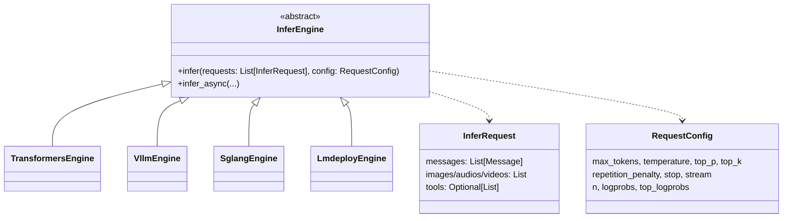
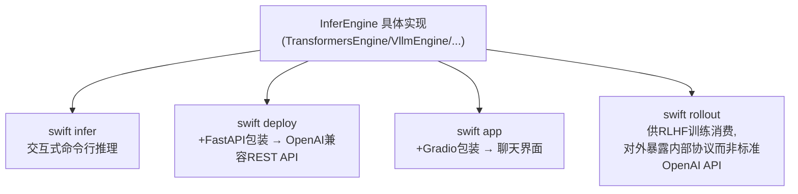

# 深度解析（五）：推理引擎（infer_engine）与部署体系

> 补充文档，配合《ms-swift v4.3.0 架构分析》第 8 节阅读。聚焦 `swift/infer_engine` 四种后端的实现差异，以及 `swift infer`/`swift deploy`/`swift app`/`swift rollout` 四个上层命令如何共享同一套引擎能力。

## 1. 统一协议：InferEngine / InferRequest / RequestConfig

四种推理后端（TransformersEngine / VllmEngine / SglangEngine / LmdeployEngine）均继承自同一个 `InferEngine` 基类，对外暴露一致的调用契约：

这一协议层的统一是"四种后端可自由切换而上层代码零改动"的直接原因——无论 `swift infer --infer_backend transformers` 还是 `--infer_backend vllm`，用户看到的输入输出结构完全一致，切换后端本质上只是切换了 `InferEngine` 的具体子类实例，`Template` 编码逻辑与 `InferRequest`/`RequestConfig` 数据结构本身不受影响。

## 2. 四种后端的差异化定位与实现细节

### 2.1 TransformersEngine：兼容性优先

- 基于原生 `transformers.generate`，是四个后端里**模型覆盖面最广**的一个——任何刚接入 ms-swift 的新模型，第一时间可用的推理后端几乎总是它。
- **批处理机制**：内部用后台线程 + `Queue` 实现的 `_infer_worker` 完成请求排队与批量调度，而非依赖 vLLM/SGLang 那种原生的 Continuous Batching 引擎，因此吞吐上限明显低于专用推理引擎，主要定位是"训练后快速验证效果""调试模板/多模态处理逻辑"等轻量场景。
- **未合并 LoRA 直接推理**：基于 `Swift.from_pretrained` 直接加载"base model + adapter"两段式结构进行推理，无需先 `merge_lora`，这对快速验证多个 LoRA checkpoint 的效果尤其方便。
- 量化支持：BNB、HQQ 等训练时/推理时量化方案在该后端上兼容性最好（因为它就是标准 transformers 生态本身）。

### 2.2 VllmEngine：生产级吞吐优先

- 同时暴露同步 `LLMEngine` 与异步 `AsyncLLMEngine` 两种底层驱动方式，服务化部署（`swift deploy`）与 RLHF rollout（见深挖文档三）场景通常走异步路径以支撑高并发。
- **Prefix Caching**：对共享前缀（如相同 system prompt 的多轮对话）的 KV cache 复用，是长上下文、多轮对话高频调用场景下的关键吞吐优化。
- **原生多 LoRA 支持**：vLLM 自身支持同一份基础模型服务多个 LoRA adapter 并按请求路由，与 `infer_engine` 层的多 LoRA 能力衔接。
- **`patch_vllm_memory_leak`**：ms-swift 针对特定 vLLM 版本已知的显存泄漏问题打了专门补丁，这类"针对上游库已知缺陷的主动修复"在整个框架里是一个反复出现的工程模式（PEFT+ZeRO-3 的修复是另一个类似例子）。
- v4.3.0 相关演进：支持 vLLM 0.16+ 版本下 dense（非 MoE）模型的数据并行（Data Parallelism）能力，进一步扩展了大规模服务化部署的吞吐上限。

### 2.3 SglangEngine：复杂采样与高并行场景

- 暴露 `tp_size`/`pp_size`/`dp_size`/`ep_size` 等更细粒度的并行配置项，尤其在 MoE 模型（`ep_size` 专家并行）服务化场景下有独特优势。
- 支持投机解码（`speculative_algorithm`），用小模型辅助大模型逐 token 验证以提升生成速度。
- 也承担了 **embedding 任务**（`task_type='embedding'`）的推理职责——这一点值得注意：并非所有后端都对等地支持全部任务类型，embedding/reranker 这类"非生成式"任务在后端选择上有更窄的可用范围。
- 当前**不支持多模态**（图/音/视频输入）与**不支持多 LoRA 并发**，是四个后端里能力矩阵相对最窄的一个，但换来了在其擅长场景下更优的性能表现。

### 2.4 LmdeployEngine：昇腾/工业级引擎生态

- 基于 TurboMind 与 PyTorch 双引擎架构，二者在支持的模型范围和优化程度上有所侧重。
- **KV Cache 量化**（`quant_policy`）：对长上下文/高并发服务场景下的显存占用有直接帮助。
- **`vision_batch_size`**：多模态推理场景下视觉编码器批处理大小的专属调优参数，反映出该后端对多模态服务化场景做了针对性优化（相比之下同样支持多模态的 vLLM/TransformersEngine 未必有如此细粒度的图像批处理控制）。
- 该后端仅支持图像模态，不支持音频/视频。

### 2.5 四后端能力矩阵（重录，便于对照）

| 能力 | TransformersEngine | VllmEngine | SglangEngine | LmdeployEngine |
|---|---|---|---|---|
| 覆盖模型范围 | 最广 | 广 | 较窄 | 较窄 |
| 吞吐/并发 | 一般 | 高 | 高 | 高 |
| 流式输出 | ✅ | ✅ | ✅ | ✅ |
| 多模态(图/视频/音频) | ✅ 全支持 | ✅ 全支持 | ❌ 不支持 | ✅ 仅图像 |
| 量化 | BNB/HQQ | AWQ/GPTQ | — | AWQ + KV Cache量化 |
| 多 LoRA 并发 | ✅ | ✅（原生） | ❌ | ❌ |
| 未合并LoRA直接推理 | ✅ | 部分支持 | — | — |
| 投机解码 | — | 部分支持 | ✅ | — |
| embedding任务 | 支持 | 支持 | ✅ 专门支持 | — |
| 细粒度并行配置 | — | TP/PP | TP/PP/DP/EP | TP |

## 3. 流式输出的统一化实现

四个后端各自的底层实现在同步/异步模型上并不完全一致（有的原生同步、有的原生异步），`infer_engine` 通过 `async_iter_to_iter` 工具函数把内部异步生成器**统一转换为同步迭代器**对外暴露，最终返回类型为 `Iterator[ChatCompletionStreamResponse]`，末尾数据块携带 `finish_reason`（`stop`/`length` 等标准 OpenAI 语义值）。这一层抽象的价值在于：上层调用方（无论是 `swift infer` 的交互式命令行、`swift deploy` 的 FastAPI 层、还是 RLHF rollout 的内部调用）都只需要面对一种迭代协议，不需要关心底层某个具体后端的异步实现细节。

## 4. 四个上层命令与推理引擎的复用关系

四者的关系是**同一套引擎能力的四种"外壳"**：
- `swift infer`：最薄的外壳，直接在命令行内交互式调用引擎，常用于效果验证与调试。
- `swift deploy`：在引擎之上包一层 FastAPI，暴露 OpenAI Chat Completions 兼容接口（`/v1/chat/completions`），使任何支持 OpenAI SDK 的客户端都能直接对接。
- `swift app`：在引擎之上包一层 Gradio 聊天界面，面向非工程背景用户做效果演示。
- `swift rollout`：本质上是"专供 RLHF 训练消费"的一种特殊部署形态，复用同一套引擎（通常是 VllmEngine），但对外暴露的是 `VllmClient` 消费的内部协议（用于高频权重同步、结构化生成请求），而非通用 OpenAI API。

这种"核心能力单一实现、外层按用途做薄封装"的模式，与前文 Web-UI 通过拼接命令行调用 CLI 的思路一脉相承，是整个框架反复出现的一种架构惯性：**优先保证核心能力只实现一次，不同使用场景通过外层适配层区分，而不是为每种场景各写一套独立实现**。

## 5. Agent/工具调用在推理侧的落地

当 `InferRequest.tools` 字段非空时，对应模型的 `AgentTemplate` 会在编码阶段将工具定义格式化插入到 system 消息（或其他约定位置）；模型生成完成后，`AgentTemplate.get_toolcall()` 负责把输出字符串中的工具调用片段（格式因模型训练时使用的 Agent Template 而异，如 ReAct 风格或 Hermes 风格）解析为结构化的 `Function` 调用对象，再包装进符合 OpenAI `tool_calls` 字段规范的响应结构返回给客户端。这一"解析"逻辑与 Template 系统深度耦合（依赖训练时使用的同一套格式约定），是多模型统一 Agent 部署时容易出现"格式对不上导致解析失败"问题的常见根源，也是选型/训练时需要格外注意训练与推理阶段 Agent Template 版本一致性的原因。

## 6. 小结

推理引擎子系统的核心架构智慧在于用一层"薄而稳定"的协议（`InferEngine`/`InferRequest`/`RequestConfig`/统一流式迭代器）吸收了四个异构后端在底层实现、并行策略、模态支持范围上的巨大差异，使得后端选择变成了一个**纯粹的性能/兼容性权衡决策**，而不牵涉到上层代码改动。这也解释了为什么 ms-swift 能够在推理侧从容地追加 SGLang、LMDeploy 等后来者，而不需要对已有的部署命令、Web-UI、RLHF rollout 等一系列消费方做任何改动——新增一个后端，本质上只是在这层协议之下新增一个实现类。