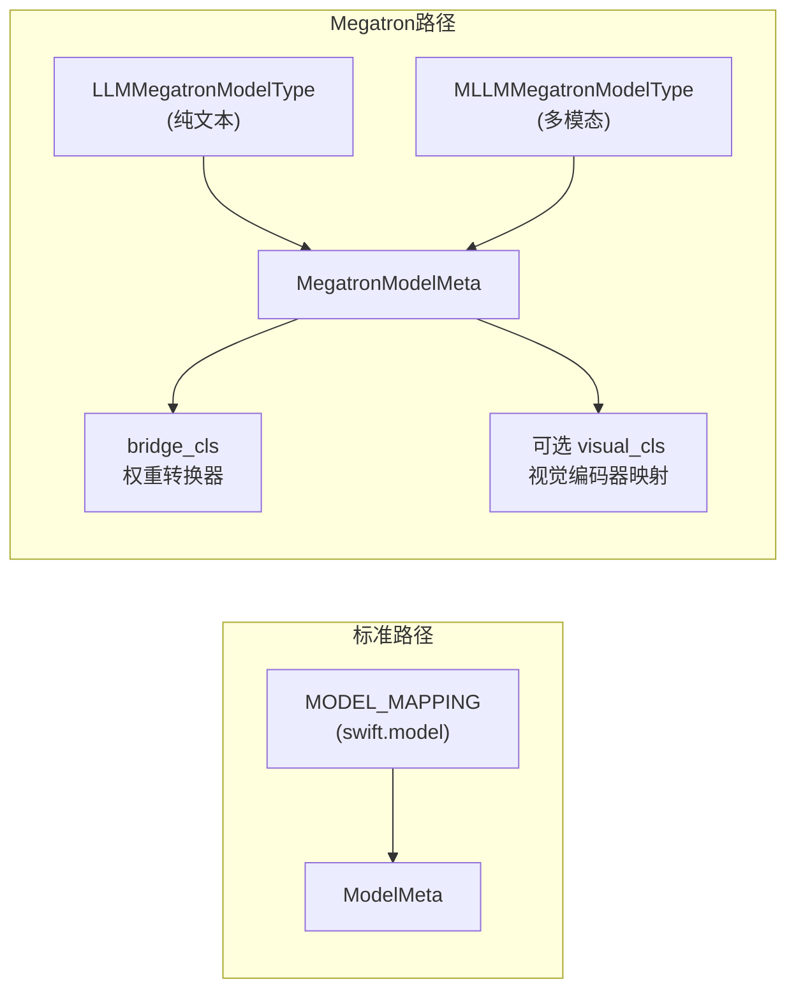
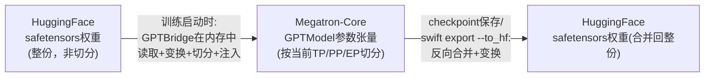

# 深度解析（四）：Megatron-SWIFT 与 GPTBridge 权重桥接机制

> 补充文档，配合《ms-swift v4.3.0 架构分析》第 9 节阅读。聚焦 `swift/megatron` 包的模型注册体系与 GPTBridge 双向权重转换的具体机制。

## 1. 定位：为什么需要一条独立于标准训练路径的并行训练体系

标准训练路径（`swift/trainers` + HuggingFace `Trainer`）依赖 DeepSpeed ZeRO / FSDP2 做分布式，这类"数据并行为主、辅以部分参数切片"的方案在模型规模达到数百亿甚至万亿参数（尤其是超大 MoE 模型）时会遇到通信/显存瓶颈。**Megatron-Core** 提供的张量并行（TP）、流水线并行（PP）、专家并行（EP）、上下文并行（CP）等更细粒度的并行策略是应对这一规模的标准工业方案。ms-swift 因此维护了一条独立的 Megatron-SWIFT 训练路径，与标准路径共享 `template`/`dataset` 前端，但在模型定义、Trainer 实现、参数体系上完全独立成体系。

v4 相较 v3 的关键变化：**弃用 `megatron-lm` 依赖，改用 `megatron-core`**，并重写了整个训练循环——这是 Issue #7250 中明确列出的 v4 断代式变更之一。

## 2. 模型注册体系：与标准路径平行但独立的第二套注册表

- **`LLMMegatronModelType`**：覆盖 `qwen`/`qwen2`/`qwen3`/`qwen3_next`/`llama`/`deepseek_v3`/`deepseek_v4`/`glm4`/`phi4`/`olmoe`/`bailing_moe` 等纯文本模型类型。
- **`MLLMMegatronModelType`**：覆盖 `qwen_vl`/`qwen3_vl`/`qwen3_5`/`internvl`/`glm4v`/`llava_onevision` 等多模态类型。
- **`gpt`** 是覆盖标准 GPT 架构的兜底类型（多数稠密 Transformer，如 Qwen2、LLaMA、DeepSeek 稠密变体均归于此）；而像 **Qwen3-Next** 这种在注意力机制上有本质差异（采用 GatedDeltaNet 而非标准自注意力）的模型，则需要单独注册类型，无法直接复用 `gpt` 通用逻辑。
- 每个模型家族通过 `register_megatron_model(MegatronModelMeta(...))` 完成注册，`MegatronModelMeta` 的核心字段是 `bridge_cls`（该模型家族专属的权重转换器类）和可选的 `visual_cls`（多模态视觉编码器的权重路径映射）。

**这一"平行而非共享"的注册体系设计**是本文档要重点分析的架构权衡点：好处是 Megatron 路径可以对模型结构做更贴近底层并行实现的建模，不受标准路径抽象的约束；代价是新模型接入需要在两套体系中分别适配——这也是在《ms-swift v4.3.0 架构分析》主文档第 15 节中提到的"维护成本重复"问题的具体来源。

## 3. GPTBridge：免落盘的权重双向转换

### 3.1 解决的核心问题

HuggingFace safetensors 权重是"整份、非切分"的存储格式；Megatron-Core 训练时模型参数按 TP/PP/EP 等策略切分到不同 rank 的显存中。二者之间需要一套转换逻辑，而**转换本身的实现方式**对用户体验影响巨大：

- **朴素方案**（v3 及早期 Megatron 工具常见做法）：先把 HF 权重转换为一份独立的 mcore 格式 checkpoint 落盘保存，训练时再加载这份 mcore checkpoint。缺点是需要额外的转换步骤、额外的磁盘占用，且当 TP/PP 切分策略发生变化时（比如换了一个集群规模）通常需要重新转换。
- **ms-swift 的 mcore-bridge 方案**（v4.1.0 起独立为 `modelscope/mcore-bridge` 仓库）：GPTBridge 在训练启动时**直接在内存中**完成"读取 HF 权重 → 键名/形状变换 → 按当前 TP/PP/EP 配置切分 → 注入 mcore 模型参数张量"的全过程，全程不产生中间落盘文件。这是 v4.1.0 README 中"让 Megatron 训练像使用 transformers 一样简单"这句话的具体技术支撑。

### 3.2 关键转换规则

- **层前缀/关键路径映射**：`hf_layers_prefix`（如 `model.layers`）、`hf_embed_key`（如 `model.embed_tokens.weight`）、`hf_final_layernorm_key`（如 `model.norm.weight`）、`hf_lm_head_key`（如 `lm_head.weight`）四个类属性定义了 HF state_dict 中关键路径的名字，子类按具体模型家族的实际命名覆盖这些默认值；`hf_state_dict_mapping` 用于处理额外的、不遵循通用规则的键名重映射（应对各家模型五花八门的命名习惯）。
- **注意力权重变换（`_set_attn_state`）**：HF 格式通常把 Q/K/V 存为三个独立矩阵（或 GQA 场景下 K/V 共享 head），而 Megatron-Core 需要按 query group 交织合并为单一的 QKV 联合权重张量以配合其内部并行 kernel 实现，这一交织合并逻辑是转换中最容易出错、也最需要针对具体模型 attention 变体（MHA/GQA/MLA 等）做适配的部分。
- **MoE 权重变换（`_set_moe_state`）**：MoE 模型的路由权重（router）与各专家（expert）权重需要按 Expert Parallel（EP）rank 重新切分分发，且路由逻辑本身（top-k 选择方式、是否共享专家等）在不同模型家族间差异很大，是 MoE 模型接入 Megatron-SWIFT 时工作量最集中的部分。
- **张量并行切分维度判定（`_get_tp_split_dim`）**：
  - 词嵌入（`word_embeddings`）、QKV 联合权重（`linear_qkv`）、输出层（`output_layer`）等按 **dim=0（列并行）** 切分——这类矩阵的输出维度可以自然地按 TP rank 分片。
  - 输出投影（`linear_proj`）、MLP 第二层（`linear_fc2`）按 **dim=1（行并行）** 切分——这类矩阵的输入维度需要按 TP rank 分片，配合列并行层的输出对齐。
  - **`linear_fc1`（门控+上投影合并张量）特殊处理**：许多现代 MLP 结构把 gate_proj 和 up_proj 合并存储为一个形状形如 `[2, X, Y]` 的张量（第一维区分 gate/up 两部分），这种"合并了语义上两个独立矩阵"的张量在切分时不能简单套用标准列/行并行规则，需要专门逻辑先按语义拆开再分别应用切分策略。

### 3.3 多模态模型的权重路由

多模态模型（如 Qwen3-VL）的 `MegatronModelMeta` 携带一个 `visual_cls`，其内部定义的 `module_mapping` 会在 Bridge 初始化阶段**合并**进主模型的 `module_mapping` 中。这意味着视觉编码器（ViT）的权重转换规则与语言模型部分共用同一套 GPTBridge 基础设施、同一套 TP 切分判定逻辑，只是各自的 `module_mapping` 条目指向不同的子模块路径——这一设计避免了为每个多模态模型重新实现一套独立的权重转换器。

## 4. v4.3.0 在 Megatron-SWIFT 上的具体演进

| 方向 | v4.3.0 新增内容 |
|---|---|
| 新模型 | `deepseek_v4`、`gemma4`/`gemma4_unified`、`bailing_hybrid`、`bailing_moe`、`qwen3_asr` |
| 上下文并行(CP)覆盖面 | 从标准因果语言模型训练扩展到 `embedding`、`generative_reranker`、`seq_cls`（序列分类）、`reward_model` 等更多任务类型 |
| Qwen3-Next | 默认切换为 Mcore-GDN（GatedDeltaNet）运行方式，支持序列 packing、FP8 训练、上下文并行组合使用 |
| 显存优化 | `generative_reranker` 任务的 `lm_head` 计算优化：仅提取 positive/negative token 位置对应的 logits，避免物化完整词表维度的 logits 张量（大词表模型该项优化收益显著） |
| 精度支持 | 新增 FP4 训练支持（`fp4_format`/`fp4_recipe`/`fp4_param_gather`），以及 FP8+LoRA 组合训练示例 |
| 工程细节 | `megatron_extra_kwargs` 透传参数；`--attention_backend flash_2/flash_3/flash_4` 手动指定注意力实现后端；`batch_p2p_comm` 参数用于缓解流水线并行（PP）训练卡住的问题 |
| RL 相关 | Megatron + Ray 的 GRPO/GKD（超大规模分布式RL场景）；Megatron GRPO 支持多轮对话训练 |

## 5. 与标准训练路径的关系再审视

尽管模型注册体系相互独立，Megatron-SWIFT 在**概念层面**仍然与标准路径的 Tuner/PEFT 思想保持一致——例如 Megatron 侧也有自己的 LoRA 实现（`swift/megatron/tuners/lora.py`），支持 `--tuner_type lora_llm` 让 LLM 部分走 LoRA、ViT/Aligner 部分走全参数训练，与标准路径的同名参数语义完全对应。这体现了架构设计上的一种务实分层：**顶层用户体验（命令行参数语义）尽量在两条路径间保持一致，但底层实现允许因并行策略的本质差异而彻底独立**，避免为了形式上的代码复用而牺牲 Megatron 路径应有的并行效率。

## 6. 小结

GPTBridge 的"免落盘、内存中直接转换注入"设计是 Megatron-SWIFT 易用性提升的核心工程创新，其复杂度主要集中在注意力权重交织、MoE 专家权重切分、门控+上投影合并张量的特殊处理这几个"模型结构细节高度耦合"的环节——这也解释了为什么新模型接入 Megatron-SWIFT（尤其是结构上有创新的模型，如 Qwen3-Next 的 GatedDeltaNet）通常需要专门的适配工作量，而不能像标准训练路径那样仅靠注册元信息就"零代码"接入。