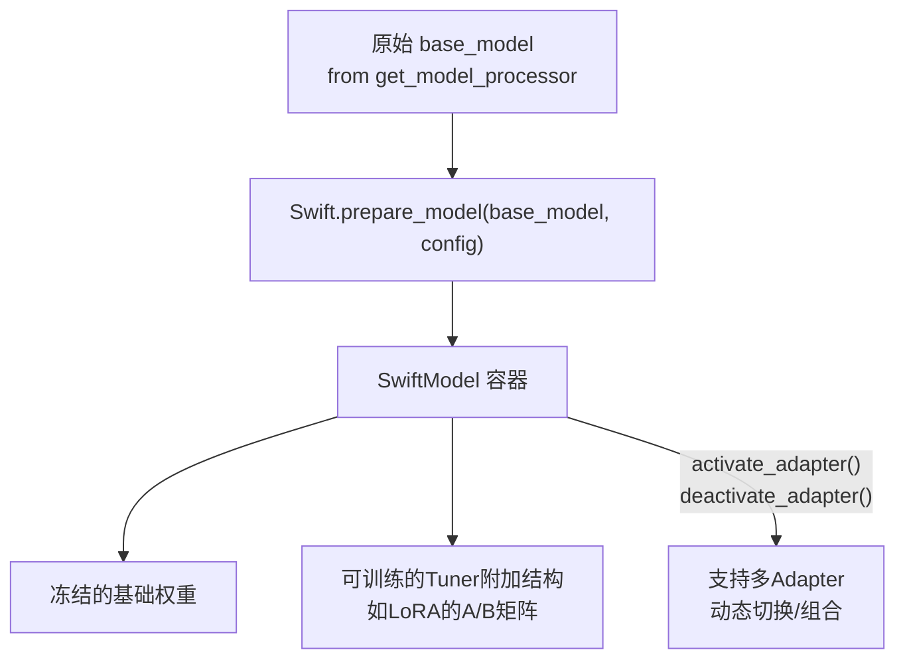

# 深度解析（二）：PEFT / Tuner 插件体系

> 补充文档，配合《ms-swift v4.3.0 架构分析》第 6.2 节阅读。聚焦 `swift/tuner_plugin` 包与 `Swift.prepare_model()` 的封装机制。

## 1. 设计目标：让"用什么方式做参数高效微调"成为可插拔项

ms-swift 从 v3 时代就强调"支持任意 Tuner 组合探索"，v4 进一步把这一能力沉淀为一套标准化的插件接口。核心诉求是：**训练/推理流程本身不应该关心当前用的是 LoRA、全参数训练还是某种混合策略**——这个决策应该在 Trainer 构建*之前*就已经完成，Trainer 只需要拿到一个"已经封装好、知道哪些参数可训练"的模型对象。

## 2. 核心入口：`Swift.prepare_model()` 与 `SwiftModel` 容器



- **`Swift.prepare_model(model, config)`**：统一入口，`config` 通常是 `LoraConfig` 等 Tuner 专属配置类实例，内部按 `tuner_type`/`tuner_backend` 路由到具体 Tuner 实现的 `prepare_model` 方法。
- **`SwiftModel`**：封装后的模型容器，对外表现得仍像一个普通的 `nn.Module`，可以直接喂给标准 `Trainer`；但内部维护了"哪些参数属于哪个 Tuner/哪个 adapter"的映射关系。
- **多 Adapter 支持**：`activate_adapter` / `deactivate_adapter` / `set_active_adapters` 三个接口允许在同一个基础模型上挂载多个 LoRA adapter，并在推理时动态切换甚至组合启用——这是"用一个基础模型 + 多套轻量 adapter 服务多个下游任务"这一生产场景的直接支撑。框架还支持在不同线程中用同一个基础模型、不同 adapter 并发推理，进一步降低多任务部署的显存成本。

## 3. 自定义 Tuner 需要实现的三个方法

```python
class MyTuner(Tuner):
    def prepare_model(self, model, config):
        """训练开始前：给模型挂载可训练结构 / 冻结其余参数，返回封装后的模型"""
        ...

    def save_pretrained(self, model, save_directory, **kwargs):
        """训练/保存checkpoint时：只落盘可训练部分的权重"""
        ...

    @classmethod
    def from_pretrained(cls, model, model_id, **kwargs):
        """推理/续训时：恢复Tuner附加结构并加载对应权重"""
        ...
```

三个方法覆盖了 Tuner 生命周期的全部关键节点：**注入**（训练前）、**持久化**（训练中/后）、**恢复**（推理/续训时）。只要实现了这三个方法并在 `tuner_plugin` 的注册表中登记，该 Tuner 就能被框架其余部分（Trainer、Arguments、CLI、`swift export --merge_lora` 等）无差别地当作内置 Tuner 使用。

## 4. `tuner_type`：从纯 LoRA 到混合精度训练策略

`--tuner_type` 是训练路径分叉的关键开关，v4.3.0 时点上主要取值：

| tuner_type | 语义 | 典型场景 |
|---|---|---|
| `full` | 全参数训练 | 预训练、追求上限效果、显存充裕 |
| `lora` | 标准 LoRA，仅给 `target_modules` 挂低秩矩阵 | 消费级显卡/资源受限微调 |
| `lora_llm` | **LLM 部分 LoRA + ViT/Aligner 部分全参数** | 多模态模型：视觉编码器体量小、值得全参精调，语言模型体量大、用 LoRA 省显存 |
| （QLoRA 组合） | LoRA + 量化基础模型（BNB/HQQ/GPTQ） | 极限显存受限场景，v4.3.0 起 GRPO 训练也支持该组合 |

`lora_llm` 是一个很好的例子，展示了 Tuner 插件体系的组合能力——它并不是一个全新算法，而是在同一个 `prepare_model` 调用内部，对模型的不同子模块（依据 `ModelMeta.model_arch` 标注的 llm/vit/aligner 前缀）分别应用不同的封装策略，体现了"以模块化基础设施拼装出复杂训练模式"的设计思路。

## 5. target_modules 的确定：`all-linear`、显式列表、正则

LoRA 训练需要指定挂载低秩矩阵的模块，ms-swift 提供三种粒度：

1. **`--target_modules all-linear`**：自动挂载模型内所有线性层（最常用的默认值），框架会依据 `ModelMeta`/模型架构自动展开为具体模块名列表。
2. **显式列表**：如 `--target_modules q_proj k_proj v_proj`，精确控制，常用于排查 `all-linear` 报错（如某些自定义/非标准结构模型）时的回退方案。
3. **`--target_regex`**：正则表达式匹配模块名，适合模块命名有规律但数量庞大（如 MoE 模型的专家层）的场景。

v4.0 起，多模态 MoE 模型的 LoRA 还支持 `--target_modules all-router` 这一专门配置，用于覆盖 MoE 路由权重矩阵。

## 6. 与分布式训练框架（DeepSpeed ZeRO-3 / FSDP2）的协同

PEFT/LoRA 模型在与 ZeRO-3（会把参数切片到多张卡）结合时存在一个经典工程陷阱：ZeRO-3 的参数收集（gather）逻辑默认不区分"冻结参数"和"可训练参数"，直接使用会导致收集/保存效率低下甚至出错。ms-swift 在 `SwiftMixin` 中做了针对性修复：

- **`_fix_zero3_gather_all_parameters`**：检测到模型是 LoRA/PEFT 封装后，自动为 ZeRO-3 的参数收集调用设置 `exclude_frozen_parameters`，只收集真正可训练的 LoRA 参数，避免不必要的全量参数搬运。
- **`ds3_gather_for_generation`** 参数：控制 ZeRO-3 下做生成（如训练期评估生成样本、或 RLHF rollout）时是否需要临时收集完整参数——生成阶段通常需要完整权重，与训练阶段的分片状态存在切换开销，该参数让用户可以按需权衡。
- **FSDP2 场景**：框架自动依据 `fsdp_config` 注册一个 `activation_cpu_offload` 回调，用于在 FSDP2 训练中把激活值卸载到 CPU 以节省显存，这与 Tuner 层是否为 LoRA 无关，是训练基础设施层面的通用优化，但常与 LoRA/QLoRA 搭配以进一步压榨显存。

这部分设计再次印证第 6.1 节提到的策略：**能复用 HuggingFace 生态就不重造轮子，但对 PEFT 场景下的已知坑点做针对性修复**，而不是自己重新实现一套分布式训练框架。

## 7. 训练完成后的落地：Merge 与 Export

`swift export --merge_lora true` 是 Tuner 体系与推理/部署衔接的关键一环：将 LoRA 的低秩增量矩阵与基础权重相乘累加，物理合并回一份标准的稠密权重文件，之后即可用任意推理后端（包括不原生支持"unmerged LoRA + base model"两段式加载的后端，如某些量化引擎）直接加载。这一步是可选的——`TransformersEngine`/`VllmEngine` 均支持直接加载"base model + 未合并 adapter"进行推理，合并与否是一个"部署便利性 vs. 磁盘/显存占用"的取舍：不合并可以让同一份基础模型服务多个 LoRA adapter（多任务场景显存友好），合并后则简化了部署链路但会为每个 adapter 产生一份完整模型体积的文件。

## 8. 小结

PEFT/Tuner 子系统是"可插拔扩展点五件套"（Loss/Loss Scale/Metrics/Optimizer/Callback/Tuner）设计范式最先成型、也是打磨最深的一个：三方法接口足够小巧以降低接入门槛，又通过 `lora_llm`、QLoRA+GRPO 组合、多 Adapter 并发等场景证明了这套小接口能够支撑相当复杂的训练策略组合。同时它与分布式训练基础设施（DeepSpeed/FSDP2）之间的适配修复，体现了框架在"复用生态"与"填补生态空白"之间的务实工程取舍。