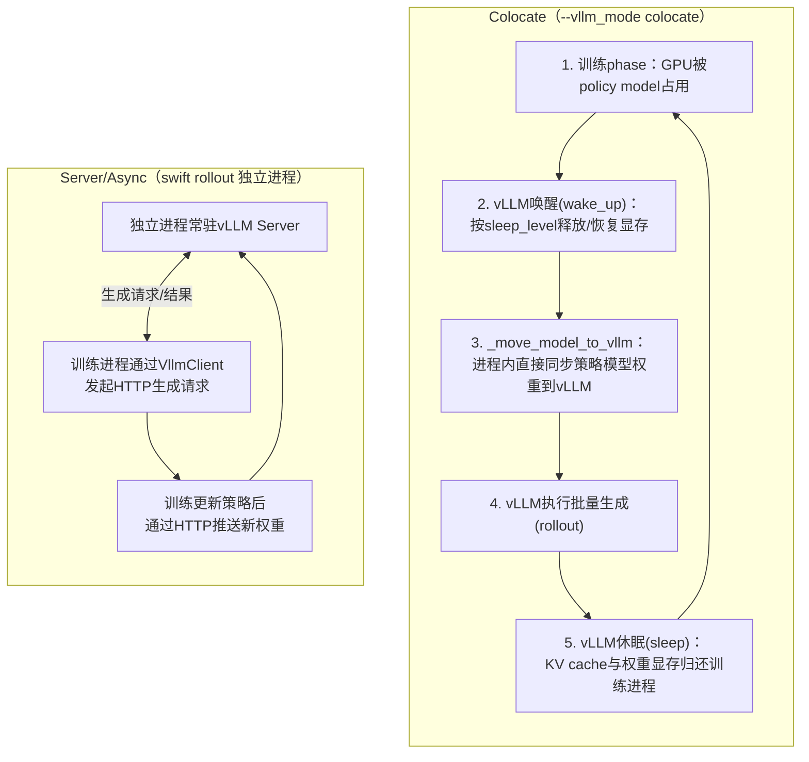

# 深度解析（三）：RLHF / GRPO 强化学习训练系统

> 补充文档，配合《ms-swift v4.3.0 架构分析》第 7 节阅读。聚焦 `swift/rlhf_trainers`、`swift/rollout`、`swift/rewards` 三个包的协同机制，以及 v4.3.0 在该子系统上的具体演进。

## 1. 子系统边界与统一入口

无论是离线算法（DPO/KTO/ORPO/SimPO/CPO/RM）还是在线算法（PPO/GRPO 系列/GKD），统一通过 `swift rlhf --rlhf_type <算法名>` 触发，`RLHFArguments`（继承自 `SftArguments`）在原有 SFT 参数基础上扩展了 `rlhf_type`、`beta`（KL 系数）等 RLHF 专属字段。这种"RLHF 是 SFT 的超集"的参数继承关系，直接反映了两条训练路径共享同一套 `model`/`template`/`dataset` 前端组件的架构事实。

## 2. 离线算法族：DPO / KTO / ORPO / SimPO / CPO

这一族算法的共同特征是**不需要在训练过程中实时采样生成**，直接消费预先构造好的偏好数据（chosen/rejected 配对，或 KTO 的单样本+二元标签）：

| 算法 | 数据形式 | 核心思想 |
|---|---|---|
| DPO | (prompt, chosen, rejected) | 用参考模型对数概率比构造隐式奖励，直接优化策略以偏好 chosen |
| KTO | (prompt, response, label∈{好,坏}) | 不需要成对偏好，单样本+二元反馈即可训练（更贴近真实标注成本） |
| ORPO | (prompt, chosen, rejected) | 无需参考模型，把偏好优化项直接加入到 SFT loss 中 |
| SimPO | (prompt, chosen, rejected) | 用长度归一化的平均对数概率作为隐式奖励，同样无需参考模型 |
| CPO | (prompt, chosen, rejected) | 对比偏好优化，常用于翻译等特定任务 |

这些算法在 Trainer 层面的实现思路高度一致：都是对 `Template.encode()` 产出的 chosen/rejected 双份编码结果，在 loss 函数层面做差异化组合，因此它们复用同一套模板编码与数据加载基础设施，仅在 `rlhf_trainers` 内部的 loss 计算逻辑上分叉，工程复杂度远低于在线算法族。

## 3. 在线算法族：PPO 与 GRPO 系列

### 3.1 为什么 GRPO 成为主推方向

PPO 需要额外训练一个价值模型（Critic）来估计状态价值，这对显存和工程复杂度都是不小的负担。**GRPO**（Group Relative Policy Optimization，源自 DeepSeekMath，arXiv:2402.03300）用"组内相对基线"替代价值模型：对同一个 prompt 采样 G 条补全，用组内奖励的均值和标准差把每条补全的奖励归一化为优势值，从而完全省去 Critic 网络。这一特性使得 GRPO 在训练资源占用上显著低于 PPO，是 ms-swift 里迭代最快、算法变体最多的方向。

### 3.2 GRPO 算法家族一览

| 变体 | 关键开关 | 核心改进点 |
|---|---|---|
| GRPO（标准） | `beta`、`epsilon`、`num_generations` | 基础裁剪策略梯度 + KL 惩罚 |
| DAPO | `dynamic_sample=True`、`overlong_filter=True` | 动态重采样避免"全对/全错"组的梯度浪费 + 过长回复惩罚 |
| GSPO | 序列级重要性采样 | 用整条序列而非逐 token 的重要性比，缓解长序列方差问题 |
| SAPO | 软自适应裁剪 | 自适应调节裁剪范围 |
| CISPO | 裁剪重要性采样 | 另一种重要性采样修正策略 |
| RLOO | `advantage_estimator=rloo` | Leave-one-out 优势估计，省去组内标准差归一化 |
| REINFORCE++ | 对应 advantage_estimator | 经典 REINFORCE 的改良基线版本 |
| GDPO | `--scale_rewards gdpo` | 群体分布策略优化（社区贡献） |
| REAL（v4.3.0 新增） | `--loss_type real` | 招商技术团队贡献，改进的损失形式 |
| FIPO（v4.3.0 新增） | 对应参数 | 同一贡献者提供的另一算法变体 |
| QLoRA GRPO（v4.3.0 支持） | `tuner_type lora` + 量化基础模型 | 在极限显存约束下也能跑 GRPO |

所有变体都通过 `swift rlhf --rlhf_type grpo` 这同一个入口结合不同参数触发，没有为每个变体单开命令，体现了"参数化配置优于命令碎片化"的接口设计取向。

### 3.3 Rollout 的两种部署形态：架构层面最关键的取舍

在线算法训练循环的每一步都需要"用当前策略模型生成一批补全"，这一步天然需要一个高吞吐推理引擎（通常是 vLLM），由此产生了 RLHF 子系统对 `infer_engine` 的**反向依赖**——这是全框架依赖图中唯一"训练模块依赖推理模块"的方向。围绕"训练进程和推理进程是否共享 GPU"这一问题，ms-swift 提供了两种模式：



| 维度 | Colocate | Server(Async) |
|---|---|---|
| GPU 资源关系 | 训练与推理**互斥共享**同一批卡 | **物理隔离**，可异构算力配比 |
| 显存管理关键参数 | `vllm_gpu_memory_utilization`、`sleep_level`、`offload_optimizer`、`offload_model` | 无需在同进程内做显存切换 |
| 权重同步方式 | 进程内直接内存拷贝（`_move_model_to_vllm`） | HTTP 权重推送 |
| 适用规模 | 单机/中小规模，资源利用率高 | 大规模集群，训练/推理算力可独立扩缩 |
| v4.3.0 相关新增 | — | vLLM 0.16+ dense 模型数据并行支持 |
| v4.3.0 Megatron 扩展 | — | Megatron + Ray 的 GRPO/GKD（超大规模分布式RL） |

**LoRA 权重同步优化**：v4.2.x 起 Megatron GRPO/GKD 的权重同步支持"仅同步 LoRA 权重"而非整份基础模型，大幅降低了训练-推理权重同步的通信量，这对 Server 模式尤其重要（HTTP 传输整份大模型权重的开销显著高于仅传输 LoRA 增量）。

## 4. 奖励函数体系（rewards）

- **`ORM`（Outcome Reward Model，结果奖励）**：同步执行，对整条补全的最终结果打分（如数学题答案是否正确）。
- **`AsyncORM`**：异步版本，通过 `asyncio.gather` 并行调用（常用于需要外部 API/沙箱执行代码判分等 I/O 密集型奖励，避免阻塞训练主循环）。
- **内置奖励函数**：`accuracy`（答案校验，常配合 `math_verify` 库）、`format`（结构/格式合规性检查，如是否包含 `<think>` 标签）、`cosine`（对正确回答按长度做余弦加权，抑制"越长越好"的奖励攻击）、`repetition`（重复内容惩罚）、`soft_overlong`（对超长回复做平滑惩罚而非硬截断）。
- **`--reward_funcs`** 命令行参数按名字引用，多个奖励函数可以加权组合（`--reward_weights`）。
- **`external_plugins`**：允许用户以插件文件形式注册自定义奖励函数而不改动框架源码，是"可插拔扩展点五件套"设计范式在 RL 子系统上的具体延伸。
- **`PRM`（Process Reward Model，过程奖励模型）**：对推理链的中间步骤逐步打分，主要用于 `swift sample`（拒绝采样/推理链采样）场景，而非标准 GRPO 训练主循环。

## 5. 多轮训练：MultiTurnScheduler 与 Gym 环境（v4.3.0 重点演进）

标准 GRPO 假设"一个 prompt → 一次生成 → 一次打分"，但许多真实场景（工具调用、游戏、交互式任务）需要模型与环境进行多轮交互后才能获得最终奖励。`MultiTurnScheduler` 定义两个核心接口：

```python
class MultiTurnScheduler:
    def check_finished(self, state) -> bool:
        """判断当前交互是否应该终止"""
        ...
    def step(self, state, model_response) -> RolloutInferRequest:
        """依据模型上一轮输出，构造下一轮的推理请求（可能注入环境反馈）"""
        ...
```

v4.3.0 对这一方向做了两项重要推进：

1. **Gym 模块重构**：提供了更清晰的环境接口抽象，并给出基于 **FrozenLake**（经典强化学习网格世界环境）的完整多轮训练示例，作为"模型与环境交互式 RL"的标准范例，方便用户参照接入自己的环境（如自定义工具沙箱、多步骤任务环境）。
2. **Megatron GRPO 支持多轮对话训练**：使多轮交互式 RL 能力从标准训练路径扩展到大规模并行训练路径，弥补了此前 Megatron GRPO 仅支持单轮的能力缺口。

多轮场景下的奖励来源也从"静态数据集标签"扩展为"环境执行反馈"，这对奖励函数体系（`rewards`）提出了新的要求——奖励计算可能依赖于环境状态而非仅仅是模型输出文本本身。

## 6. 知识蒸馏（GKD/OPSD）子系统

GKD（Generalized Knowledge Distillation）让学生模型学习教师模型在**学生模型自己采样出的序列**上的输出分布（区别于传统蒸馏用教师采样数据），从而缓解训练/推理分布不匹配问题。v4.3.0 的关键演进：

- **`teacher_server` 重构为基于 `swift deploy` 的部署方式**：此前教师模型蒸馏需要在训练进程中显式常驻加载一份完整的教师模型，显存开销大；重构后教师模型作为独立部署服务存在，训练进程通过 API 调用获取教师 logits/生成结果，教师与学生的资源占用彻底解耦，也为教师模型使用不同的并行策略/硬件留出了空间。
- **OPSD（On-Policy Self-Distillation）**：支持把教师模型设置为训练模型本身（自蒸馏），并可配置 `teacher_prompt`，即用同一个模型在不同提示词下的输出作为自身训练信号的思路。
- **GKD/OPSD 支持 `generation_batch_size`/`steps_per_generation` 参数**，以及对 `padding_free`、多模态训练的兼容，与 GRPO 主线在工程能力上逐步对齐。

## 7. 小结：RLHF 子系统的架构启示

RLHF 子系统集中体现了 ms-swift 架构设计的两个深层原则：其一，**离线算法复用训练前端、在线算法反向依赖推理引擎**这一依赖方向上的不对称，是由算法本身的计算模式（是否需要在线生成）决定的，架构设计诚实地反映了这一算法特性而非强行统一；其二，**Colocate/Server 两种 rollout 模式并存**而非二选一淘汰，说明框架设计者认识到"资源利用率"与"架构解耦度/可扩展性"是一对在不同集群规模下此消彼长的权衡，把选择权交给用户而非替用户做决定。