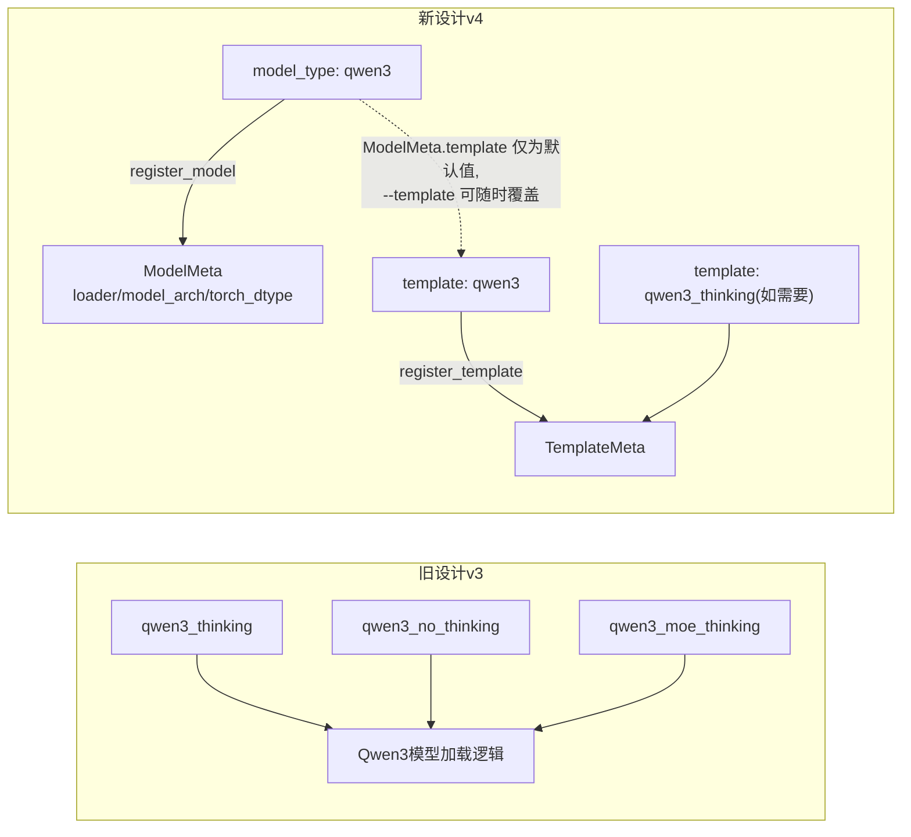
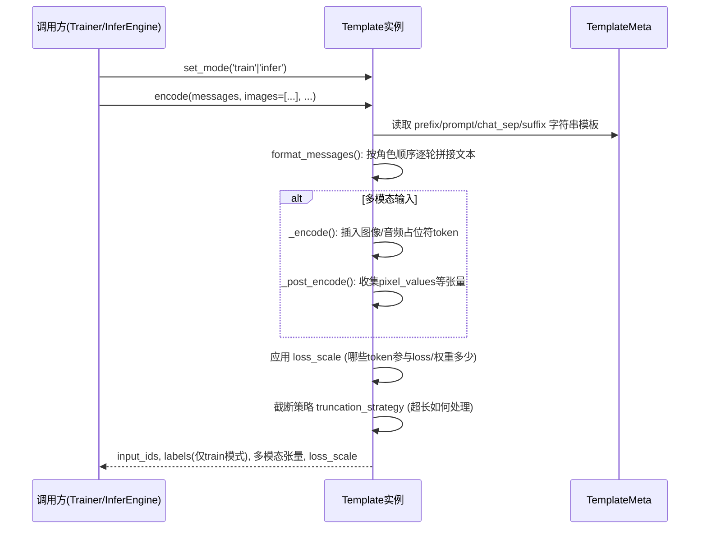

# 深度解析（一）：Template 对话模板系统

> 补充文档，配合《ms-swift v4.3.0 架构分析》第 5.2 节阅读。聚焦 `swift/template` 包的内部机制。

## 1. 为什么 Template 是全框架最核心的运行时对象

在 ms-swift 的架构里，`Template` 承担着"把人类可读的对话（`messages` + 多模态附件）转换为模型可读张量"这一**所有链路都必须经过**的单点职责：

- SFT/PT 训练：`Template.encode()` 产出 `input_ids` / `labels` / `loss_scale` / 多模态张量。
- RLHF（GRPO/DPO/KTO）：训练与 rollout 阶段都复用同一个 Template 做编码，只是 `labels` 是否生成、是否需要 chosen/rejected 双样本编码有所不同。
- 推理/部署：`InferEngine` 在真正调用后端（vLLM/SGLang 等）之前，也要先用 Template 把 `InferRequest.messages` 编码成 `input_ids`。
- Megatron 训练：虽然模型层走的是 mcore 张量并行体系，但数据前处理阶段仍然复用同一套 `swift.template`。

正因为如此，v4 把 `template` 从 v3 的 `swift.llm` 中独立拆分为一级包，并把它与 `model_type` **解耦**——这是本次深挖最值得展开的设计决策。

## 2. model_type 与 template 解耦：解决了什么问题

v3 时代的痛点（源自 Issue #7250）：同一个模型结构（如 Qwen3）因为"是否思考"这种纯粹的对话格式差异，被迫在 `model_type` 层面分裂成 `qwen3`、`qwen3_thinking`、`qwen3_no_thinking`、`qwen3_moe_thinking` 等多个冗余条目，每新增一种对话行为组合就要新增一个 model_type，模型注册表迅速膨胀且难以维护。

v4 的解法：`ModelMeta`（描述"这是什么模型结构，怎么加载"）与 `TemplateMeta`（描述"消息怎么拼接成 prompt"）彻底分离为两张独立注册表 `MODEL_MAPPING` 与 `TEMPLATE_MAPPING`：

关键收益：
1. 一个 `model_type` 可以自由搭配多个 `template`（同一模型可切换是否携带思考链前缀），反之一个 `template` 也可以被多个结构相似的 model_type 复用。
2. 新增"思考模式变体"不再需要新增/复制一份完整的模型加载与架构标注逻辑，只需注册一个新的 `TemplateMeta`。
3. `--model_type` 与 `--template` 在命令行上是两个独立可覆盖的参数，用户可以按需手动组合，而框架的默认推断逻辑仍然保证零配置开箱可用。

## 3. TemplateMeta 的核心字段与编码语法

根据官方 `Customization/Custom-model.md` 文档，`register_template(template_meta)` 中 `TemplateMeta` 的字段设计非常"手术刀式"，把一个对话模板拆解为几个正交的组成部分：

| 字段 | 是否必填 | 含义 | Qwen 系列示例 |
|---|---|---|---|
| `template_type` | 必填 | 模板唯一 ID | `'qwen'` |
| `prefix` | 必填 | 独立于多轮循环之外的前缀（通常含 system、bos） | `[]`（Qwen 无额外前缀） |
| `prompt` | 必填 | `{{RESPONSE}}` 之前的部分，`{{QUERY}}` 为用户输入占位符 | `['<|im_start|>user\n{{QUERY}}<|im_end|>\n<|im_start|>assistant\n']` |
| `chat_sep` | 必填 | 多轮对话每轮之间的分隔符；为 `None` 则不支持多轮 | `['<|im_end|>\n']` |
| `suffix` | 默认 `[['eos_token_id']]` | 独立于循环之外的后缀，通常是 eos | `['<|im_end|>']` |
| `system_prefix` | 默认 `None` | 含 system 时的前缀，`{{SYSTEM}}` 为占位符 | `['<|im_start|>system\n{{SYSTEM}}<|im_end|>\n']` |
| `default_system` | 默认 `None` | `--system` 未指定时的默认值 | `'You are a helpful assistant.'` |
| `stop_words` | 默认 `[]` | 除 eos/suffix 外的额外停止词 | `['<|endoftext|>']` |
| `template_cls` | 默认 `Template` | 自定义编码类，多模态模型通常需要重载 `_encode`/`_post_encode`/`_data_collator` | 多模态模型专属子类 |

这种"前缀/提示词/分隔符/后缀"四段式拆解，本质上是把绝大多数 Chat Template 的共性抽象成了一套小型 DSL，绝大多数纯文本模型接入新模板只需要填几行字符串模板，无需编写过程式代码；只有多模态模型（需要处理图像 token 插入位置、`pixel_values` 收集等）才需要真正继承 `template_cls` 写自定义逻辑。

## 4. 编码流程：从 messages 到张量

两个模式的关键差异：`set_mode('train')` 会为 assistant 回复部分生成非 -100 的 `labels`（其余 token 为 -100 不参与 loss），`set_mode('infer')` 则只需要 `input_ids` 到生成起点为止，不产出 `labels`。同一个 `Template` 类实例通过模式切换服务训练与推理两条链路，避免了逻辑重复实现导致的"训练时编码"和"推理时编码"行为不一致风险（这是很多自研框架早期常踩的坑）。

## 5. 两种编码后端并存：swift 原生 vs. jinja(chat_template)

ms-swift 同时维护两套模板编码实现：

- **swift 原生后端**：即上文的 `TemplateMeta` DSL 驱动实现，是框架历史上一直维护的方式，好处是可以精细控制 `loss_scale`、多模态占位符插入、Agent 工具调用格式等复杂逻辑。
- **jinja（HuggingFace chat_template）后端**：直接复用 `tokenizer.apply_chat_template`，与 transformers/vLLM 生态的标准做法对齐，便于与社区标准 chat_template 文件互通。

框架内置一致性测试保证两个后端在标准对话场景下产出等价结果，用户可以按需选择（尤其在只需要基础对话、不涉及自定义 loss_scale 精细控制的场景下，jinja 后端更贴近生态标准）。

## 6. v4.3.0 引入的样本级模板参数：chat_template_kwargs

在 v4.3.0 之前，`max_pixels`（多模态图像分辨率上限）、`enable_thinking`（是否携带思考链）这类参数通常只能在启动训练/部署时全局配置一次。v4.3.0 引入 `chat_template_kwargs`，允许：

- **训练/推理侧**：数据集里每一条样本可以携带各自独立的 `max_pixels`、`enable_thinking` 等配置，同一批数据里可以混合"高分辨率样本"与"低分辨率样本"、"思考样本"与"非思考样本"。
- **部署侧**：OpenAI 兼容接口的请求体可以直接传入 `enable_thinking`/`preserve_thinking` 字段，客户端按请求粒度决定是否要模型输出思考链、是否保留历史轮次中的思考内容——这对于多轮 Agent 场景（后续轮次通常不需要重复展示前面轮次的思考过程以节省上下文）尤其实用。

这一改动把"是否思考"从一个**启动期全局开关**升级为一个**运行时/样本级可调参数**，是 Template 系统在 v4.3.0 上最直接可感知的能力增量。

## 7. Agent Template：Template 系统的重要延伸

`swift/agent_template` 与 `swift/template` 紧密协作但职责独立：Template 负责基础对话结构，Agent Template 负责在此基础上处理 `tools` 定义的格式化（通常插入 system 部分）以及模型输出中工具调用片段的**结构化解析**（`AgentTemplate.get_toolcall()` 把模型生成的字符串解析为 `Function` 对象列表）。由于 Agent Template 同样与 model_type 解耦，同一份 ReAct/Hermes 风格的 Agent 数据集格式理论上可以跨多个模型家族复用，只需要为目标模型注册（或复用已有）对应的 Agent Template 实现，不需要为每个模型重写一遍工具调用格式的解析逻辑。

## 8. 小结

Template 系统的设计体现了 ms-swift v4 架构重构的两条主线在具体模块上的落地：**用清晰的字段/接口把一个复杂问题拆分为若干正交子问题**（prefix/prompt/chat_sep/suffix 四段式 + `_encode`/`_post_encode` 扩展点），以及**把原本耦合在一起的概念解耦**（model_type vs template，"是否思考"从全局开关变为样本级参数）。这两条主线也会在后续 PEFT/RLHF/Megatron 三份深挖文档中反复出现。