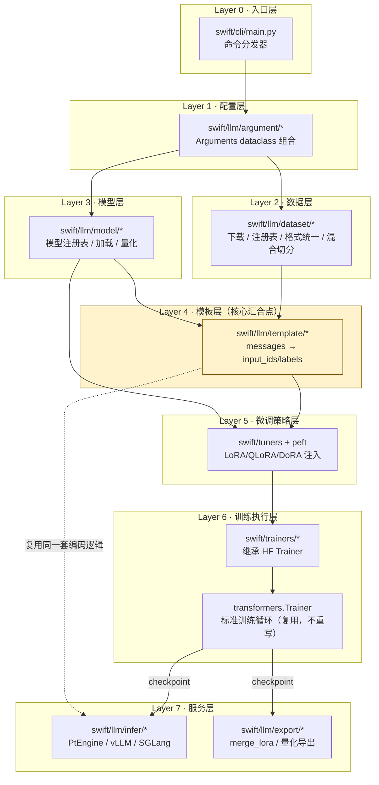
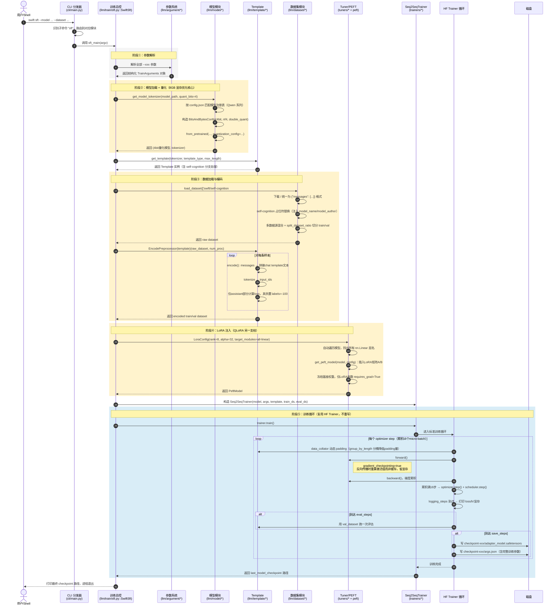
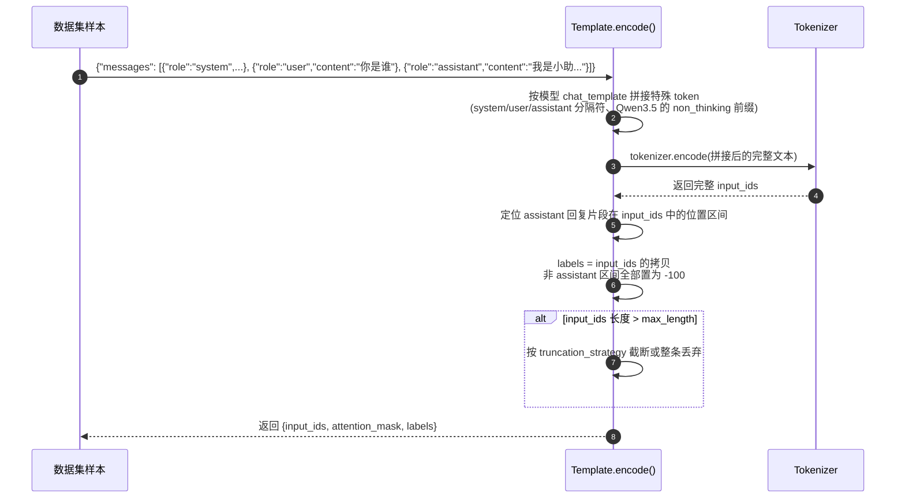
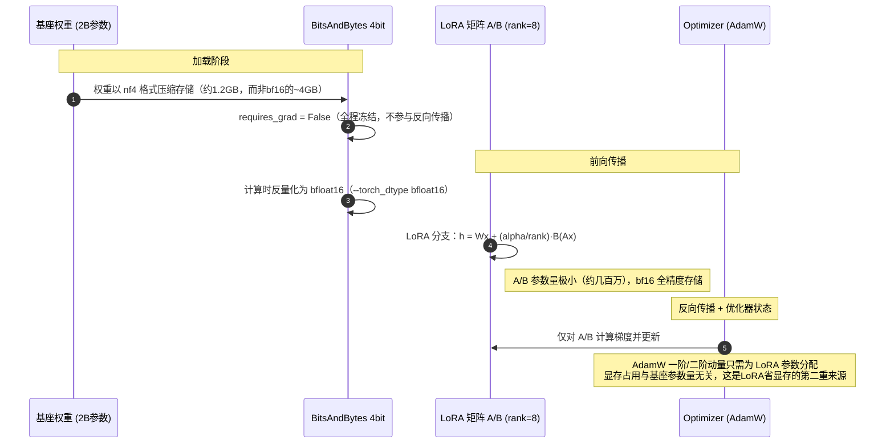
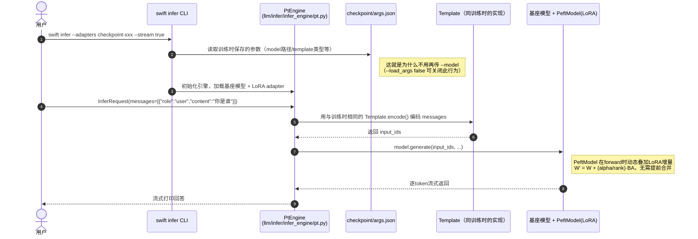
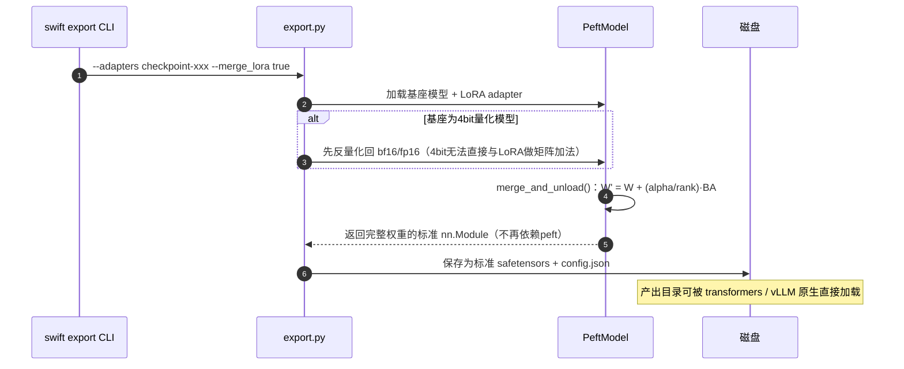
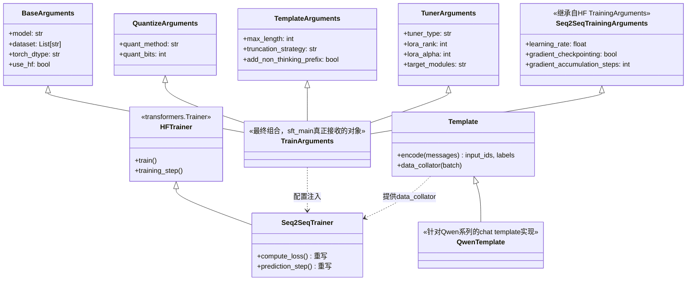
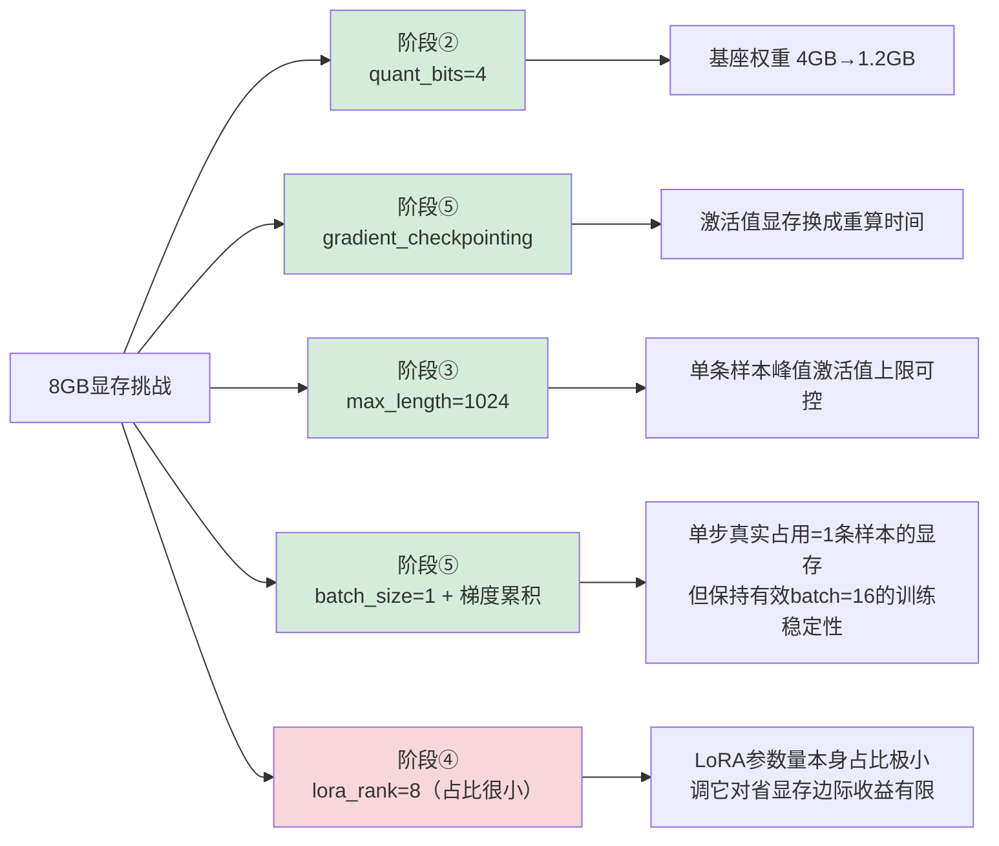

## 一、self-cognition 数据集说明

ms-swift 内置了 `swift/self-cognition` 数据集，专门用于让模型学会回答"你是谁""你是谁开发的"这类身份问题。数据集里的回答用占位符表示模型名字和开发者，需要通过 `--model_name` / `--model_author` 参数（各传中文、英文两个值）来替换model_name 是模型的中文名和英文名，model_author 是模型开发者的中文名和英文名。

⚠️ **重要**：单独用 self-cognition 数据集训练，很容易让模型"过拟合到只会回答身份问题"，通用对话能力会下降（灾难性遗忘）。官方最佳实践是**混入通用指令数据**一起训练CUDA_VISIBLE_DEVICES=0 swift sft --model Qwen/Qwen3-4B-Instruct-2507 --tuner_type lora --dataset 'AI-ModelScope/alpaca-gpt4-data-zh#500' 'AI-ModelScope/alpaca-gpt4-data-en#500' 'swift/self-cognition#500'，所以下面的方案也采用了 alpaca 通用数据 + self-cognition 混合训练。

## 二、完整训练脚本（8GB 显存优化版）

```bash
#!/bin/bash
# ===== 8GB 显存优化：QLoRA + 小max_length + 小batch =====
export PYTORCH_CUDA_ALLOC_CONF=expandable_segments:True
export CUDA_VISIBLE_DEVICES=0

swift sft \
    --model ~/model/Qwen3.5-2B \
    --tuner_type lora \
    --dataset \
        'swift/self-cognition#600' \
        'AI-ModelScope/alpaca-gpt4-data-zh#500' \
        'AI-ModelScope/alpaca-gpt4-data-en#500' \
    --model_name '小叶' 'XiaoYe' \
    --model_author '叶子' 'loveleaves' \
    --add_non_thinking_prefix true \
    --split_dataset_ratio 0.01 \
    --torch_dtype bfloat16 \
    --quant_method bnb \
    --quant_bits 4 \
    --max_steps 5 \
    --bnb_4bit_compute_dtype bfloat16 \
    --bnb_4bit_quant_type nf4 \
    --bnb_4bit_use_double_quant true \
    --num_train_epochs 3 \
    --per_device_train_batch_size 1 \
    --per_device_eval_batch_size 1 \
    --gradient_accumulation_steps 16 \
    --learning_rate 1e-4 \
    --lora_rank 8 \
    --lora_alpha 32 \
    --target_modules all-linear \
    --group_by_length true \
    --max_length 1024 \
    --gradient_checkpointing true \
    --dataloader_num_workers 1 \
    --eval_steps 50 \
    --save_steps 50 \
    --save_total_limit 2 \
    --logging_steps 1 \
    --warmup_ratio 0.05 \
    --output_dir output/Qwen3.5-2B-self-cognition
```

## 三、完整流程

### 1. 环境准备

```bash
pip install ms-swift -U
pip install bitsandbytes -U   # QLoRA 4bit量化依赖
pip install deepspeed         # 可选，本方案单卡不需要
```

### 2. 执行训练

```bash
bash sft.sh 2>&1 | tee train.log
```

训练完成后，权重（LoRA adapter）会保存在类似 `output/Qwen3.5-2B-self-cognition/vx-xxx/checkpoint-xxx` 的目录下。

### 3. 训练后快速推理测试（不合并权重，直接用 adapter）

```bash
CUDA_VISIBLE_DEVICES=0 \
swift infer \
    --adapters output/Qwen3.5-2B-self-cognition/vx-xxx/checkpoint-xxx \
    --stream true \
    --temperature 0 \
    --max_new_tokens 512
```

这会进入交互式命令行，可以直接输入问题测试，例如：

```
<<< 你是谁？
<<< 你是谁开发的？
<<< 介绍一下你自己
<<< What's your name and who created you?
<<< 帮我写一段快速排序的代码   # 验证通用能力是否保留
```

### 4. 合并 LoRA 权重（可选，便于部署）

```bash
swift export \
    --adapters output/Qwen3.5-2B-self-cognition/vx-xxx/checkpoint-xxx \
    --merge_lora true \
    --output_dir output/Qwen3.5-2B-merged
```

合并后用完整模型推理：

```bash
CUDA_VISIBLE_DEVICES=0 \
swift infer \
    --model output/Qwen3.5-2B-merged \
    --stream true \
    --temperature 0 \
    --max_new_tokens 512
```

### 5. 批量效果验证脚本（Python，检查身份认知是否学会 + 通用能力是否保留）

```python
# eval_self_cognition.py
from swift.llm import PtEngine, InferRequest, RequestConfig

engine = PtEngine('output/Qwen3.5-2B-merged')  # 或用 adapters 参数加载 LoRA
request_config = RequestConfig(temperature=0, max_tokens=512)

test_cases = [
    "你是谁？",
    "你是谁开发的？",
    "请自我介绍一下",
    "Who are you and who created you?",
    "你叫什么名字",
    # 通用能力对照组，确认没有明显退化
    "用Python写一个斐波那契数列函数",
    "帮我总结一下三体这本书的主要内容",
]

infer_requests = [InferRequest(messages=[{'role': 'user', 'content': q}]) for q in test_cases]
resp_list = engine.infer(infer_requests, request_config)

for q, resp in zip(test_cases, resp_list):
    print(f"Q: {q}")
    print(f"A: {resp.choices[0].message.content}")
    print("-" * 50)
```

运行：

```bash
python eval_self_cognition.py
```

**判断标准**：
- 身份类问题（前 5 个）应准确报出你设置的 `model_name` / `model_author`；
- 通用能力类问题（后 2 个）回答质量应与未微调前基本一致，若明显变差说明混入的通用数据比例太低或 epoch 太多，可以调低 `num_train_epochs` 或增大 alpaca 数据条数。

## 四、 ms-swift `swift sft` 执行链路深度解读

### 1. 总结

ms-swift 的核心设计是**"注册表 + 组合式 dataclass + 对标准库做最小侵入式继承"**。它没有重新发明训练循环（复用 `transformers.Trainer`），没有重新发明 LoRA 实现（复用 `peft`），自己写的代码集中在"胶水层"：模型/数据集/模板的**统一抽象与注册机制**，这也是它能横向支撑 600+ 模型、150+ 数据集、十几种训练范式（SFT/DPO/GRPO/KTO/...）而不需要每种组合都写一遍训练脚本的原因。

### 2. 系统分层架构图



图中 **Layer 4（Template）被标黄**，是因为它是全框架唯一同时被"训练路径"和"推理路径"复用的模块（图中虚线）。这个设计保证了训练时喂给模型的文本格式和推理时完全一致，从架构上消除了"训练/推理模板不一致导致效果异常"这一类微调项目最常见的坑。

---

### 3. 完整执行时序图

这是本文档的核心图——把 `swift sft` 从敲下命令到 checkpoint 落盘的**全部关键调用**按时间顺序画出来。



注意阶段⑤里 `TR`（ms-swift 的 `Seq2SeqTrainer`）只是**转手**把控制权交给了 `HFT`（`transformers.Trainer` 的标准循环），`Seq2SeqTrainer` 真正 override 的方法很少（典型是 `compute_loss`、`prediction_step`、以及把 `data_collator` 换成 Template 提供的版本），这是一种**"最小化改造第三方库"**的工程策略：升级 `transformers` 版本时，ms-swift 需要适配的面很窄。

---

## 4. 关键子流程时序图

### 4.1 Template.encode() 内部细节（最值得精读的一步）



`labels=-100` 是 PyTorch `CrossEntropyLoss` 的约定——loss 计算时会自动忽略值为 `-100` 的位置。这就是为什么模型只会"学着说 assistant 该说的话"，而不会被要求预测 system/user 说的内容。

`swift/llm/template/base.py` 的 `Template.encode()`；批量调用入口是 `swift/llm/dataset/preprocessor/core.py` 里的 `EncodePreprocessor`（对 dataset 做 `.map()`）。

### 4.2 QLoRA 显存布局：量化与 LoRA 如何叠加



8GB 卡能训 2B 模型的显存账本大致是：**4bit 基座权重（~1.2GB）+ LoRA 参数及其优化器状态（几十MB量级）+ gradient_checkpointing 后的激活值（随 max_length/batch_size 变化，是主要的可调项）**。这也是为什么显存紧张时，`--max_length` 和 `--gradient_accumulation_steps`（间接控制有效 batch）比调 `--lora_rank` 更有效——LoRA 参数本身占比很小，激活值才是大头。

### 4.3 `swift infer` 推理时序（复用 Template，验证一致性）



### 4.4 `swift export --merge_lora` 权重合并时序



---

## 5. 关键类关系



这张图的关键信息是**组合优于继承**（Arguments 层）+ **对第三方库最小侵入继承**（Template/Trainer 层）两种模式并存：
- Arguments 用多重继承把十几个独立关注点（模型/数据/量化/模板/训练超参）拼成一个大对象，**每个子 dataclass 可以单独在别处复用**（比如 `QuantizeArguments` 在 `swift export --quant_method` 场景也会用到）。
- Template/Trainer 走的是"继承但少改"路线，最大化复用生态标准库的正确性和维护成本分摊。

这两种模式的取舍标准很清晰：**框架自己独有的概念（模型/数据集/模板怎么注册和匹配）用组合式设计追求灵活扩展；能复用生态标准库的部分（LoRA实现、训练循环）绝不重复造轮子，只做最小适配。**

---

## 6. 设计模式全景

| 设计模式 | 应用位置 | 解决的问题 |
|---|---|---|
| **注册表模式（Registry）** | `register_model()` / `register_dataset()` / `register_template()` | 新增一个模型/数据集/模板不需要改动框架核心代码，只需在对应文件里注册一条元信息，天然支持"600+模型、150+数据集"的横向扩展 |
| **策略模式（Strategy）** | `--tuner_type lora/full/dora/...`、`--infer_backend pt/vllm/sglang/lmdeploy` | 同一套上层流程，底层实现可插拔切换，互不感知彼此实现细节 |
| **模板方法模式（Template Method）** | `Seq2SeqTrainer` 继承 `transformers.Trainer` 只重写少数 hook 方法 | 复用父类固定的算法骨架（训练循环），只定制变化的步骤（loss计算方式） |
| **组合式配置（Composition over Inheritance，dataclass mixin）** | `TrainArguments` 由多个独立 Arguments 类组合而成 | 避免出现一个几百字段的巨型配置类，关注点分离，便于不同命令（sft/export/infer）复用同一批基础配置类 |
| **适配器模式（Adapter）** | 各数据集的预处理函数把原始字段转换为统一 `messages` 格式 | 让下游 Template/Trainer 只需要认识一种输入格式，不关心数据来源 |
| **对象池/动态代理（PEFT PeftModel）** | LoRA 注入后模型 forward 时动态叠加增量，而非物理修改权重 | 支持训练/推理时不合并权重也能工作，且可以随时切换/叠加多个 adapter |

---

## 7. 参数 → 阶段 → 时序节点 对照表

| 脚本参数 | 所属阶段 | 对应时序图节点 | 一句话作用 |
|---|---|---|---|
| `--model` | 阶段② | `SFT->>MDL: get_model_tokenizer` | 指定基座模型路径 |
| `--dataset` | 阶段③ | `SFT->>DS: load_dataset` | 指定并混合多个数据源 |
| `--model_name` / `--model_author` | 阶段③ | `DS->>DS: 占位符替换` | 写入 self-cognition 数据里的身份信息 |
| `--quant_method` / `--quant_bits` | 阶段② | `MDL->>MDL: 构造BitsAndBytesConfig` | 决定基座权重存储精度（QLoRA支柱之一） |
| `--torch_dtype` | 阶段②④2.2 | 反量化计算dtype | 4bit权重实际计算时用的精度 |
| `--tuner_type/--lora_rank/--lora_alpha/--target_modules` | 阶段④ | `SFT->>TUN: LoraConfig(...)` | 控制LoRA注入位置与秩（QLoRA支柱之二） |
| `--max_length` / `--add_non_thinking_prefix` | 阶段③ | `T->>T: 拼接chat template` | 控制编码长度与Qwen3.5思考模式分支 |
| `--group_by_length` | 阶段③→⑤ | `HFT->>TPL: data_collator` | 减少同批次padding造成的显存浪费 |
| `--per_device_train_batch_size/--gradient_accumulation_steps` | 阶段⑤ | `loop 每个optimizer step` | 控制单步显存占用与有效batch size |
| `--gradient_checkpointing` | 阶段⑤ | `Note right of TUN: 反向传播重算激活值` | 用计算换显存的核心开关 |
| `--learning_rate/--num_train_epochs/--warmup_ratio` | 阶段⑤ | 透传给HF Trainer | 标准训练超参 |
| `--eval_steps/--save_steps` | 阶段⑤ | `alt 到达save_steps` | 定期评估与落盘的时机 |
| `--output_dir` | 阶段⑤末尾 | `HFT->>FS: 写checkpoint` | 产物存放位置 |

---

## 8. 8GB 显存优化在链路中的落点

结合第 3、4.2 节的时序图，本次训练针对 8GB 卡做的每一个改动，都能精确定位到某个阶段：



如果之后还是 OOM，按这张图从左到右排查优先级：先看 `max_length` 能不能再降、`gradient_accumulation_steps` 能不能提高（保持有效batch不变的前提下降低单步真实batch），最后才是调 `lora_rank`——因为它对显存的影响本来就最小。

---

## 9. 建议的源码阅读路径（按依赖顺序）

1. `swift/cli/main.py` —— 建立"一切从这里开始"的整体感，5分钟看完分发逻辑。
2. `swift/llm/train/sft.py` 的 `SwiftSft` —— 对照本文档第3章的主时序图，逐行确认调用顺序与图上一致。
3. `swift/llm/argument/train_args.py` —— 对照第5章类图，看 `TrainArguments` 的多重继承关系。
4. `swift/llm/dataset/loader.py` + self-cognition 的预处理函数 —— 对照第3章阶段③，理解 `#600` 截取与占位符替换的实现。
5. `swift/llm/template/base.py` 的 `Template.encode()` —— 对照第4.1节子时序图，这是全框架最值得逐行精读的方法。
6. `swift/trainers/trainers.py` 的 `Seq2SeqTrainer` —— 搜索它 override 了哪些方法，对照第6章"模板方法模式"的说法验证。
7. `swift/llm/infer/infer_engine/pt.py` —— 对照第4.3节，验证推理是否复用了同一套 Template 逻辑。
8. `swift/llm/export/export.py` —— 对照第4.4节，看 `merge_and_unload()` 前后的量化处理分支。

📍 定位本地安装路径：`python -c "import swift, os; print(os.path.dirname(swift.__file__))"`

---

## 10. 一句话收尾

🔰 理解这条链路后再看任何新的 ms-swift 训练脚本（哪怕换成 DPO/GRPO/多模态），你会发现变化的只是**阶段③（数据集格式与预处理）、阶段④（tuner类型）、阶段⑤（用哪个 Trainer 子类）**，而阶段①②③的骨架完全复用。

🏗️ 这正是"注册表 + 组合式配置 + 最小侵入式继承"这套设计的价值所在：新增一种训练范式，本质是新增一个 Trainer 子类和一套数据预处理逻辑，而不是重写一遍从CLI到训练循环的全部代码。