# 大语言模型监督微调（SFT）技术报告

## 基于 ms-swift 框架的原理、方法与工程实践分析（完整版）

---

## 重要说明与局限性声明

> **请在阅读前仔细阅读本节**
>
> 本报告内容分为两类，请读者注意区分：
>
> **（A）确定性内容**：涉及已发表学术论文的核心结论、通用数学原理（如交叉熵损失、LoRA数学形式、DPO推导）——这部分内容经过交叉验证，可信度较高，但具体数值、超参数建议仍应结合实际场景验证。
>
> **（B）推测性/框架相关内容**：涉及 ms-swift 具体接口、参数名、命令行示例、内部模块划分——由于撰写环境无法实时访问 GitHub 仓库拉取最新代码，这部分内容是基于对同类训练框架通用设计模式的合理推测整理而成，**不能保证与 ms-swift 当前版本的实际实现完全一致**。文中会用 ⚠️ 标记此类内容，读者在实际使用前**务必对照 [ms-swift 官方仓库](https://github.com/modelscope/ms-swift) 最新文档核实**。

---

## 目录

0. 阅读指南
1. 引言：为什么需要 SFT
2. 大模型训练发展脉络与 Related Work
3. SFT 基础原理（含数学深化）
4. 数据处理与模板系统
5. SFT 数据的来源与合成技术
6. 主流参数高效微调技术对比（含理论深化）
7. ms-swift 框架架构解析 ⚠️
8. 训练工程优化技术
9. 多轮对话与长上下文处理
10. 多模态 SFT
11. 灾难性遗忘：机制与缓解技术
12. SFT 之后：与 RLHF/DPO 的衔接（含数学推导）
13. SFT 效果评估方法论
14. 技术发展路线图与未来展望
15. 实践建议与常见问题
16. 总结
17. 学习路径建议

---

## 第〇章 阅读指南：你需要哪些前置知识

在正式进入技术内容之前，先明确阅读本报告的合适知识背景。

**如果你是完全新手**，建议先理解：什么是神经网络的"参数"（模型内部用于存储"知识"的大量数字）、什么是"损失函数"（衡量模型输出与期望输出差距的数值）、什么是"梯度下降"（根据损失变化方向反向调整参数以降低损失的迭代过程）。

**如果你已了解 Transformer 基础结构**，可以直接从第三章开始。

**如果你的目标是动手实践**，建议读完第三、四、五、六章后跳转到第十五章，边看边实验。

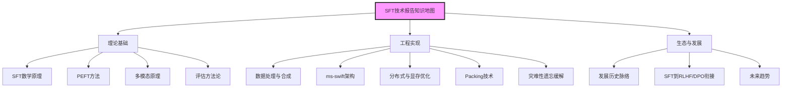

---

## 第一章 引言：为什么需要 SFT

### 1.1 从预训练到对齐的鸿沟

要理解 SFT（Supervised Fine-Tuning，监督微调）存在的必要性，首先需要理解大语言模型训练的完整生命周期。这个过程可以类比为培养一个"博览群书但不懂人情世故的学者"，逐步教育成"能够得体应答的助手"的过程。

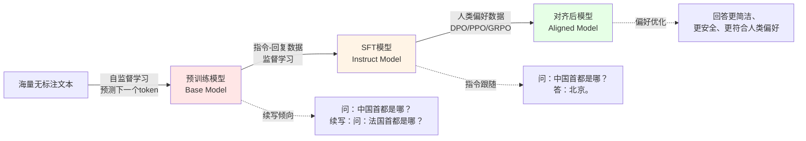

第一阶段是**预训练（Pre-training）**。模型在海量未标注文本语料（通常数万亿token级别）上进行自监督学习，目标函数是标准语言建模损失。这个过程赋予模型强大的语言理解、知识存储和模式补全能力。但预训练模型本质上是"续写机器"，而非"问答机器"——给它一个问题，它可能续写出更多类似的问题，而非直接给出答案，因为预训练数据分布中"问句后紧跟对应答案"只是海量模式中的一种，模型没有被专门训练去识别"这是对话场景，我应该扮演助手角色"这样的任务范式。

第二阶段是 **SFT**。核心思想简洁：用一批高质量的"指令-回复"配对数据，以监督学习方式教会模型这种对话/指令响应的行为模式。

第三阶段（工业界几乎必备）是**基于人类反馈的对齐训练**（RLHF及其变种，如DPO、PPO、GRPO），进一步优化模型输出的"人类偏好对齐度"。

### 1.2 SFT 的核心价值与局限性

SFT相比强化学习方法，最大优势是**训练稳定、实现简单、计算成本可控**——本质上仍是极大似然估计框架下的监督学习。但SFT也有其局限性：

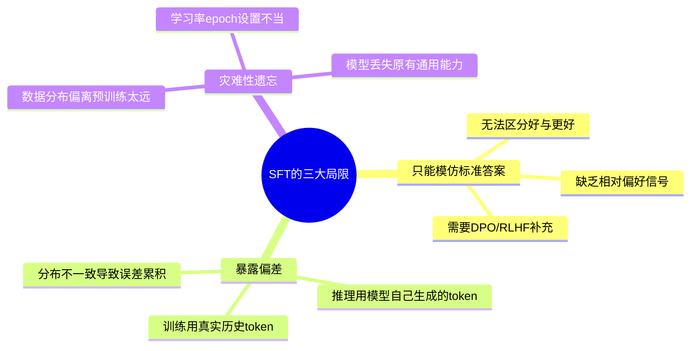

这些局限性的具体缓解方案将在第十一、十二、十三章详细展开。

---

## 第二章 大模型训练发展脉络与 Related Work

### 2.1 指令微调技术的演进历史

理解当前主流技术选择背后的历史逻辑，需要回顾这一领域的发展脉络。

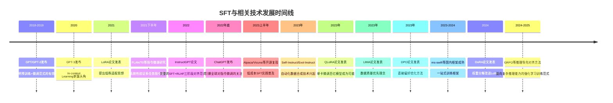

### 2.2 关键论文与技术脉络详解

**InstructGPT（2022）**：奠定现代"预训练-SFT-RLHF"三阶段对齐范式的基石。OpenAI团队系统性展示了：经过SFT和RLHF训练的1.3B参数模型，在人类评估中的偏好度可以显著超过未经对齐、参数量大得多的原始GPT-3（175B）。

**FLAN系列研究（2021-2022）**：Google团队系统性探索了"指令微调"（在大量不同任务、以自然语言指令统一表达的数据上进行微调）对模型零样本泛化能力的提升效果，证明当指令微调覆盖任务多样性足够广泛时，模型能较好泛化到未见过的新任务上。

**LoRA（2021）**：从"预训练模型微调过程中权重变化量具有低内在秩"这一假设出发，用极小参数增量实现接近全参数微调的效果，是PEFT领域最具影响力的奠基性工作。

**Alpaca/Vicuna（2023）**：斯坦福团队展示了即使使用规模不大（5万条左右）、由更强模型自动生成的指令数据，也可以以很低成本对开源基座模型进行SFT，获得具备相当程度指令跟随能力的模型，极大降低了SFT技术的实践门槛。

**Self-Instruct（2022）与Evol-Instruct（2023）**：这两项工作系统性解决了"如何低成本规模化生产高质量SFT数据"这一上游问题，将在第五章详细展开。

**QLoRA（2023）**：引入4bit量化技术，使单张消费级GPU微调数百亿参数模型成为可能。

**LIMA（2023）**：提出"Less Is More for Alignment"，即高质量少量数据（仅1000条）配合强大基座模型就能获得出色对齐效果，挑战了"数据越多越好"的朴素认知。

**DPO（2023）**：证明可以绕开"训练独立奖励模型+强化学习优化"的复杂流程，直接在偏好数据上进行类似监督学习的优化，将在第十二章详细展开其数学推导。

**DoRA（2024）**：对LoRA更新模式进行更精细分析，提出幅度-方向解耦改进思路。

### 2.3 开源训练框架的生态演进

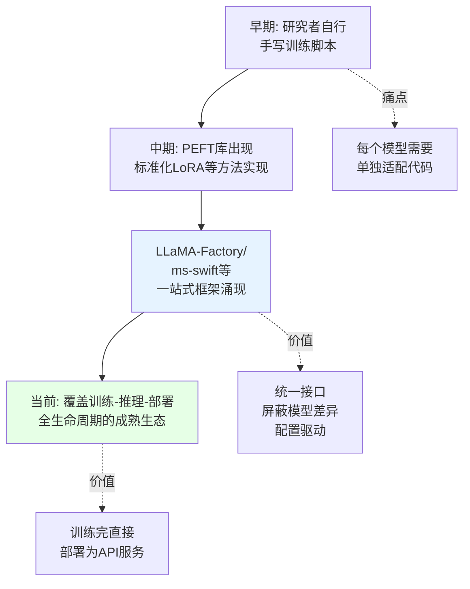

这类框架的出现本质上是社区对"重复造轮子"痛点的集体回应——早期每当有研究者想微调新发布的开源模型，往往需要重新研究该模型的特殊token设计、对话模板格式等细节。像ms-swift这样的框架通过统一的模型注册表和抽象接口层，让重复性适配工作被框架开发团队一次性完成。

---

## 第三章 SFT 基础原理

### 3.1 监督微调的数学表达

给定指令-响应数据对 $(x, y)$，其中 $x$ 是输入，$y = (y_1, ..., y_T)$ 是期望的输出序列，语言模型的训练目标是最大化条件概率：

$$P(y|x) = \prod_{t=1}^{T} P(y_t | x, y_1, ..., y_{t-1})$$

对应损失函数是交叉熵损失：

$$\mathcal{L}_{SFT} = -\sum_{t=1}^{T} \log P(y_t | x, y_{<t}; \theta)$$

这个公式在数学形式上与预训练的语言建模损失完全相同。**SFT与预训练的根本区别不在损失函数本身，而在于数据组织形式和损失计算范围的变化**。

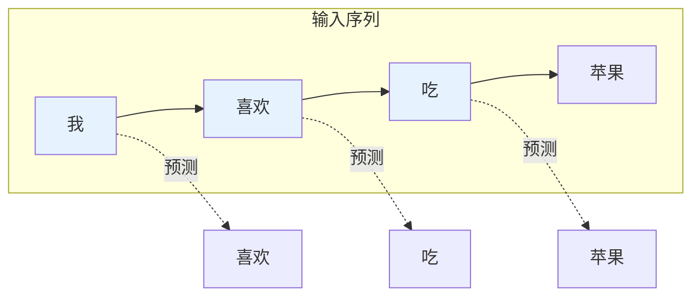

### 3.2 从交叉熵损失到困惑度：训练指标的正确解读

一个资深实践者必须理解：**训练过程中监控的loss数值本身，与模型的实际能力之间并非简单的线性关系**，这是初学者最容易掉入的陷阱之一。

交叉熵损失与困惑度（Perplexity, PPL）的关系为：

$$\text{PPL} = \exp\left(\frac{1}{T}\sum_{t=1}^{T} -\log P(y_t|x, y_{<t})\right) = \exp(\mathcal{L}_{SFT}/T)$$

困惑度可以直观理解为"模型在预测下一个token时，平均感到有多少个候选选项同样合理"。

**但需要特别警惕**：loss/困惑度持续下降，不必然代表模型"有用性"在提升。原因在于：

1. **loss衡量的是"对训练数据分布的拟合程度"，而不是"回答质量"**。模型完全可以通过记忆训练数据的表层模式（固定开头句式、特定用词习惯）来降低loss，实际推理能力、事实准确性并未提升，这正是"格式过拟合"现象在loss层面的解释。
2. **训练loss与验证loss分叉是过拟合的经典信号**，但即使验证loss也在下降，也不能完全排除模型在"过拟合验证集分布特征"而非获得真正泛化能力的可能性。

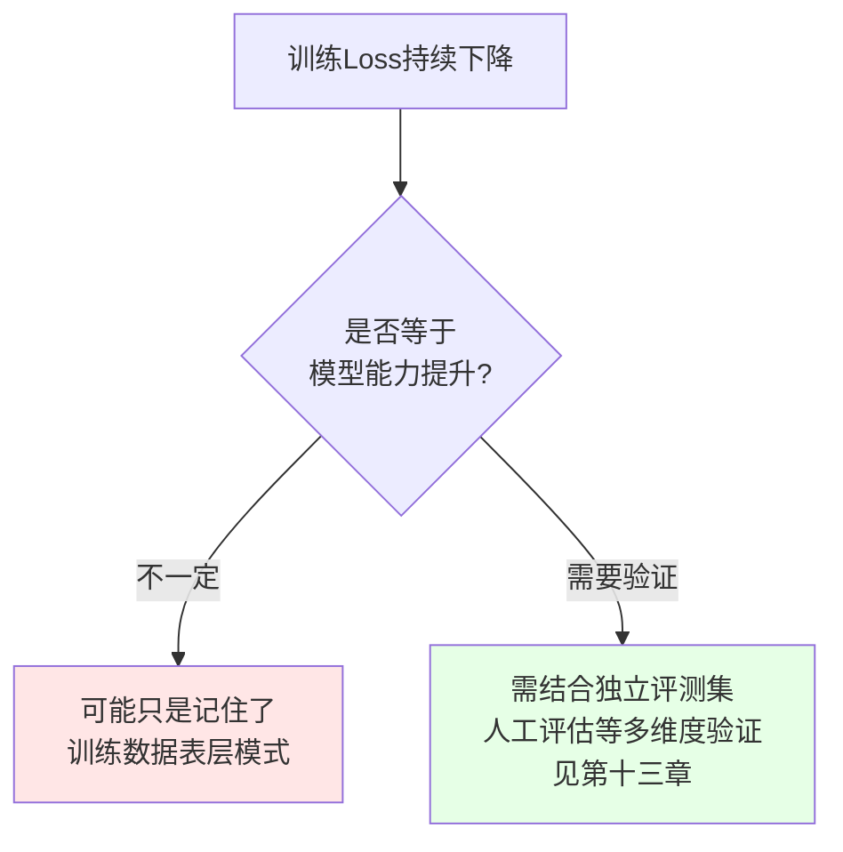

### 3.3 Loss Mask 机制：为什么不能对整个序列计算损失

假设一条SFT训练样本经过模板拼接后：

```
<system>你是一个有帮助的助手。</system>
<user>请解释一下光合作用。</user>
<assistant>光合作用是植物利用光能...</assistant>
```

如果对整个序列不加区分地计算交叉熵损失，模型会同时被训练去"生成用户的问题"和"生成助手的回答"，这在逻辑上是荒谬的。

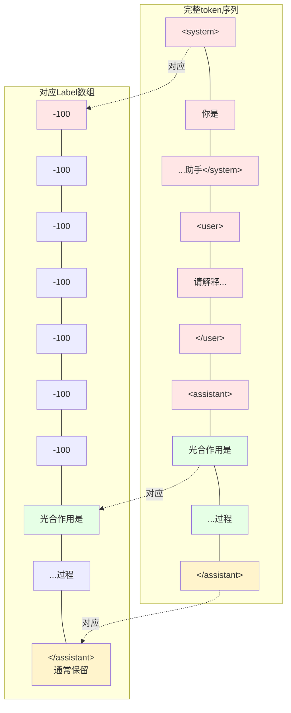

**-100这个特殊值是PyTorch `CrossEntropyLoss` 中约定俗成的"忽略此位置"标记**，在计算损失时被自动跳过。

**特殊token是否需要计入损失？** 多数实现会将EOS等结束标记纳入损失计算范围，教会模型"何时应该停止生成"——否则模型可能在推理时无法正确停止，产生无限重复生成的问题。

### 3.4 多轮对话中的 Loss Mask 策略

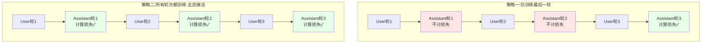

策略二是当前主流框架（包括ms-swift）普遍采用的方式，数据利用率更高。

### 3.5 Packing 与 Padding 的直观对比

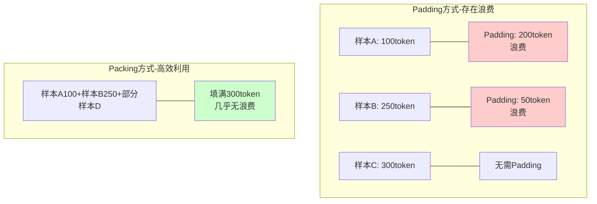

Packing技术的具体实现细节将在第八章工程优化部分深入展开。

---

## 第四章 数据处理与模板系统

### 4.1 对话模板（Chat Template）的本质

对话模板解决的问题是：如何将结构化对话数据转换为模型能够理解的扁平化纯文本序列。

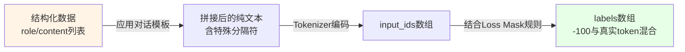

不同模型家族（Qwen、LLaMA、ChatGLM等）采用不同的模板格式，因为它们在预训练/SFT阶段就是按照各自特定格式训练的，**模板不匹配会导致模型对特殊token的语义理解出现偏差**。

这正是ms-swift这类框架的核心价值——**统一的模板抽象层**，框架内部为几十上百种主流开源模型预置了各自的对话模板定义。

### 4.2 模板设计中的关键细节

**System Prompt的处理**：训练数据中system prompt的"有无"和"内容"分布应尽量与实际部署场景保持一致，否则容易导致模型在推理时对system prompt的遵循度不稳定。

**特殊Token的对齐**：模板中使用的角色分隔符必须是tokenizer词表中已存在的、经过正确初始化的特殊token。如需扩充词表，新增token的embedding初始化通常需要用相近token的embedding做初始化，以避免破坏模型原有能力。

**工具调用（Function Calling）的模板扩展**：

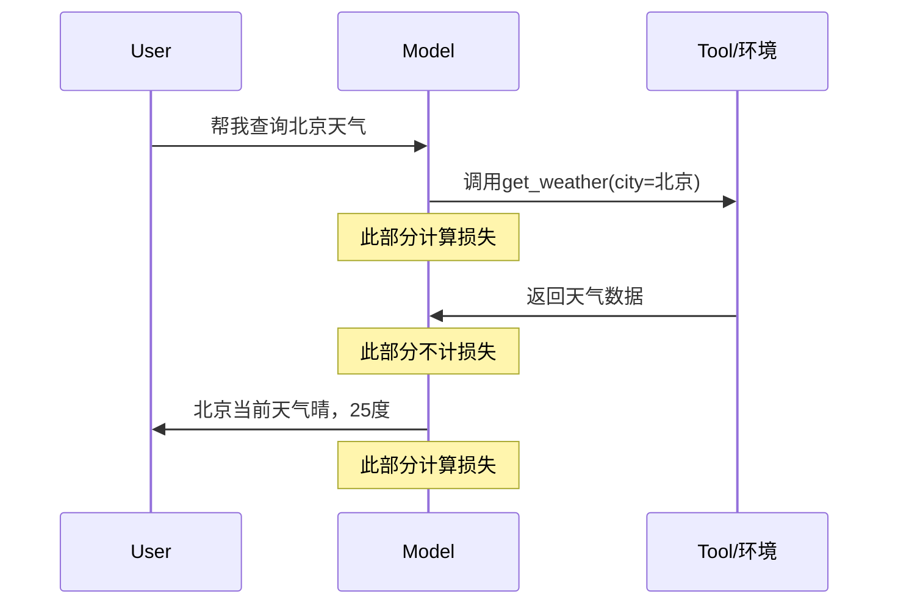

### 4.3 数据格式规范与数据集适配

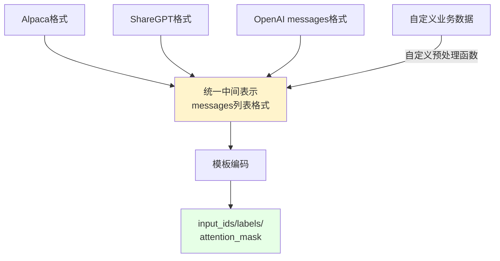

数据处理流程还包含：**长度过滤**、**数据去重**、**数据混合与配比**、**难度与质量筛选**，其中数据质量筛选相关的自动化流程将在第五章详细展开。

---

## 第五章 SFT 数据的来源与合成技术

SFT的效果上限很大程度上由数据质量决定，本章系统梳理主流数据构造方法。

### 5.1 数据来源的三种基本范式

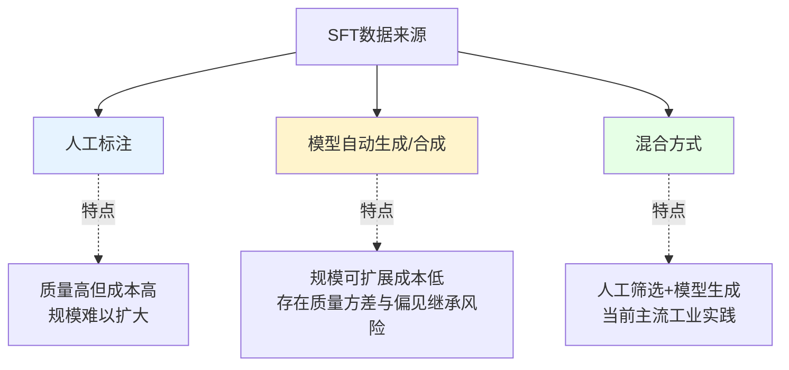

### 5.2 Self-Instruct：自举式指令数据生成

核心思路是利用一个已具备一定指令跟随能力的模型，通过精心设计的种子任务和提示模板，让模型自动生成大量新的"指令-输入-输出"三元组，经自动化过滤后加入训练集。


这种"自举"范式以极低人工成本快速扩展数据规模，但**生成数据的质量上限受制于用于生成的模型本身能力**，生成模型的系统性缺陷会通过合成数据被"传染"给微调后的目标模型。

### 5.3 Evol-Instruct：指令复杂度的渐进式演化

代表性应用是WizardLM系列模型的数据构造方法，核心洞察：**简单指令数据难以训练出能处理复杂任务的模型**，需要系统性提升指令难度和多样性。

演化策略分两类：**深度演化**（保持任务类型不变，增加指令复杂度）与**广度演化**（生成全新任务类型的指令，扩大任务多样性）。

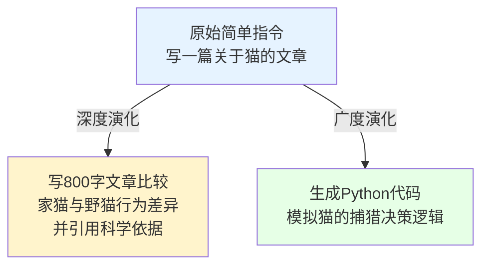

### 5.4 基于强模型的知识蒸馏式数据生成

利用能力更强的模型生成高质量回复，作为待训练模型的模仿目标，本质是一种知识蒸馏——蒸馏载体不是logits或中间层特征，而是自然语言形式的完整回复文本。

**需特别指出的工程与合规考量**：使用闭源模型API生成的数据用于训练开源或商用模型，往往涉及服务条款中关于"是否允许使用输出结果训练竞品模型"的限制条款，这是必须留意的合规风险点，而非纯技术问题。

### 5.5 数据质量的自动化评估维度

常见评估维度：**指令-回复相关性**、**回复完整性与详略程度**、**格式规范性**、**安全性与合规性**、**基于模型打分的整体质量评估**。

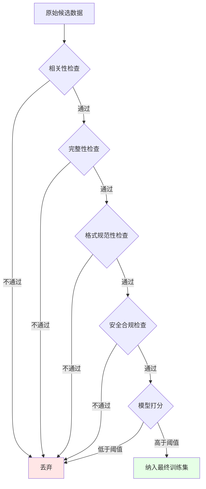

---

## 第六章 主流参数高效微调技术对比

### 6.1 为什么需要参数高效微调（PEFT）

全参数微调的显存开销随模型规模增长急剧上升。以70亿参数模型为例：

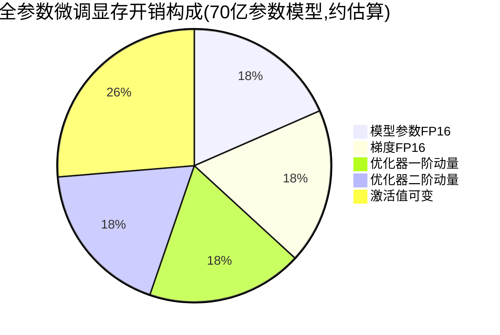

这直接催生了PEFT研究方向：**冻结绝大部分参数，只训练一小部分（通常0.1%-5%）可训练参数**。

### 6.2 LoRA：低秩适配

LoRA（2021）的核心洞察：预训练模型微调过程中权重变化量 $\Delta W$ 具有较低的"内在秩"。

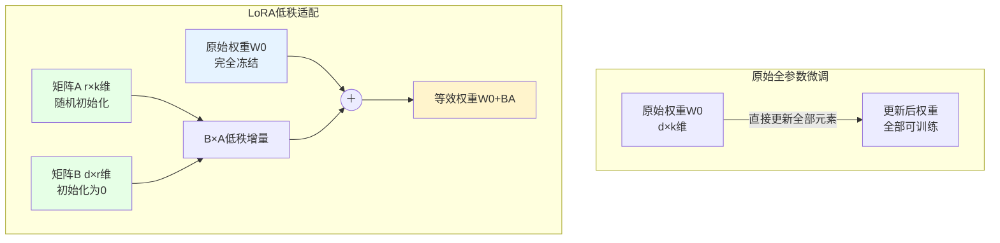

前向计算：$h = W_0 x + BAx$，其中 $A \in \mathbb{R}^{r \times k}$、$B \in \mathbb{R}^{d \times r}$，$r$ 远小于 $\min(d,k)$。训练时 $W_0$ 完全冻结，只有 $A$、$B$ 参与更新。**$B$初始化为全零，保证训练起点模型行为与原始预训练模型完全一致**。

训练完成后，$BA$可直接与$W_0$合并，**推理时不引入任何额外延迟**。

### 6.3 LoRA 秩（r）选择的理论依据

LoRA原始论文的关键实验发现：**当秩r从很小的值开始逐渐增大时，效果提升会出现明显边际递减**，甚至超过某个阈值后进一步增大r几乎不再带来提升，这被称为"秩饱和"现象，支持了LoRA方法论"微调增量信息存在较低内在秩上界"的核心假设。

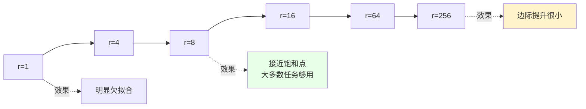

实践中选择r的考量因素：**任务复杂度**（简单风格迁移r=4-8即可，复杂推理增强可能需要r=32-64）、**训练数据规模**（数据量越大能支撑更高r而不至于过拟合）、**目标模块覆盖范围**（覆盖模块越多可适当降低单个模块r）。

另一常被忽视的超参数是**LoRA alpha（缩放因子）**：实际更新量为 $\frac{\alpha}{r}BAx$，常见经验法则是alpha=2r，但仍需实验验证最优组合。

### 6.4 QLoRA：量化与低秩适配的结合

```mermaid
graph LR
    A["基座模型权重<br/>NF4 4bit量化存储态"] -->|计算时反量化| B["BF16临时副本<br/>参与前向反向计算"]
    B -->|计算完成立即释放| A
    C["LoRA适配层<br/>BF16精度正常训练"] --> D[前向输出]
    B --> D

    style A fill:#e6f3ff
    style C fill:#e6ffe6
```

核心技术：**NF4量化**（专为正态分布权重设计的4bit数据类型）、**双重量化**（对量化常数本身再量化）、**分页优化器**（利用统一内存机制，显存压力大时自动换出优化器状态到CPU）。

### 6.5 DoRA：权重分解的低秩适配

```mermaid
graph TD
    W["预训练权重W"] --> DECOMP{分解}
    DECOMP --> M["幅度分量m<br/>向量,独立可训练"]
    DECOMP --> V["方向分量V/||V||<br/>通过LoRA方式更新"]

    M --> COMBINE((重组))
    V --> COMBINE
    COMBINE --> W2["更新后权重<br/>更接近全参数微调的学习模式"]

    style M fill:#ffe6cc
    style V fill:#e6ffe6
```

DoRA将权重分解为幅度和方向两个分量，方向分量用LoRA方式更新，幅度分量独立训练，使模型获得更接近全参数微调的表达自由度。

### 6.6 GaLore：基于梯度低秩投影的全参数训练

```mermaid
graph TD
    A["完整梯度矩阵<br/>高维"] -->|周期性SVD分解| B["低维子空间"]
    B --> C["优化器状态维护<br/>低维,省显存"]
    C -->|投影回原空间| D["应用到全部原始参数"]

    style B fill:#fff4cc
    style D fill:#e6ffe6
```

与LoRA系列不同，GaLore**最终更新的是模型全部原始参数**，理论上更接近全参数微调的效果上限，代价是周期性SVD分解带来的额外计算开销。

### 6.7 各方法对比总结

| 方法 | 核心思路 | 可训练参数占比 | 显存优势 | 推理延迟 | 效果上限 | 实现复杂度 |
|---|---|---|---|---|---|---|
| Full Fine-tuning | 全部参数更新 | 100% | 无 | 无 | 最高 | 低 |
| LoRA | 低秩矩阵近似增量 | 0.1%-2% | 高 | 可合并,无 | 接近全参数 | 低 |
| QLoRA | LoRA+4bit量化基座 | 0.1%-2% | 极高 | 需反量化合并 | 略低于LoRA | 中 |
| DoRA | 幅度方向解耦 | 略高于LoRA | 高 | 可合并 | 优于LoRA | 中 |
| GaLore | 梯度低秩投影 | 100%(优化器状态低秩) | 中高 | 无 | 接近全参数上限 | 高 |

```mermaid
quadrantChart
    title PEFT方法选择象限图
    x-axis 低显存需求 --> 高显存需求
    y-axis 低实现复杂度 --> 高实现复杂度
    quadrant-1 效果优先场景
    quadrant-2 复杂但省显存
    quadrant-3 简单省资源首选
    quadrant-4 效果与资源均衡
    "LoRA": [0.3, 0.25]
    "QLoRA": [0.1, 0.5]
    "DoRA": [0.35, 0.55]
    "GaLore": [0.5, 0.85]
    "Full FT": [0.9, 0.15]
```

实际选择路径：显存充足追求极致效果→全参数微调；显存有限但要接近全参数效果→LoRA默认选择；显存极度受限→QLoRA；愿意承担调试成本追求更好效果→DoRA。

---

## 第七章 ms-swift 框架架构解析 ⚠️

> **⚠️ 本章内容包含推测性描述，请对照官方最新文档核实**

### 7.1 框架定位与设计哲学

ms-swift（Scalable lightWeight Infrastructure for Fine-Tuning）是阿里巴巴ModelScope团队开发的大模型训练框架，核心定位是提供**开箱即用、覆盖模型全生命周期的一站式解决方案**。

```mermaid
graph TD
    A[ms-swift框架] --> B[训练]
    A --> C[推理]
    A --> D[部署]
    A --> E[评测]

    B --> B1[SFT]
    B --> B2[DPO/PPO/GRPO]
    B --> B3[预训练]

    C --> C1[vLLM集成]
    C --> C2[LMDeploy集成]

    D --> D1[OpenAI兼容API]

    E --> E1[主流评测基准]

    style A fill:#f9f,stroke:#333,stroke-width:3px
```

设计哲学体现在三点：**统一接口屏蔽底层差异**、**分层的技术栈依赖**（整合Transformers/PEFT/DeepSpeed/vLLM等成熟生态）、**训练方式的可插拔性**（Full/LoRA/QLoRA/DoRA通过参数配置切换）。

### 7.2 核心模块拆解

```mermaid
graph TD
    A[用户命令行输入] --> B[模型加载层]
    B --> C[数据处理层]
    C --> D[训练适配层]
    D --> E[训练执行层Trainer]
    E --> F[推理与部署层]

    B -.处理.-> B1[模型注册表<br/>架构差异封装]
    C -.处理.-> C1[统一中间表示<br/>模板编码<br/>Packing逻辑]
    D -.处理.-> D1[PEFT库集成<br/>LoRA/QLoRA配置]
    E -.处理.-> E1[分布式策略<br/>日志监控]
    F -.处理.-> F1[权重合并量化<br/>vLLM/LMDeploy部署]

    style A fill:#fff4e6
    style F fill:#e6ffe6
```

**模型加载层**：维护详尽的模型注册表，记录每个支持模型的加载方式、对应模板类型、LoRA应作用的具体模块名称等元信息。

**数据处理层**：将原始数据集转换为统一内部表示，通过模板系统编码为input_ids/attention_mask/labels三元组。

**训练适配层**：根据用户选择的训练范式对模型进行改造，与PEFT库紧密集成。

**训练执行层**：基于HuggingFace Transformers的Trainer类扩展，针对不同训练模式实现不同Trainer子类。

**推理与部署层**：提供LoRA权重合并、量化、部署为OpenAI API兼容服务的能力。

### 7.3 命令行与配置体系

```bash
swift sft \
    --model Qwen/Qwen2.5-7B-Instruct \
    --dataset your_dataset_path_or_name \
    --train_type lora \
    --lora_rank 8 \
    --lora_alpha 32 \
    --learning_rate 1e-4 \
    --num_train_epochs 3 \
    --per_device_train_batch_size 1 \
    --gradient_accumulation_steps 16 \
    --deepspeed zero2
```

> ⚠️ 以上命令为示意性质，具体参数名请以官方最新文档为准。

配置驱动模式的优势：降低使用门槛、便于实验管理复现、便于自动化流水线集成。

---

## 第八章 训练工程优化技术

### 8.1 分布式训练策略

```mermaid
graph TD
    A[分布式训练策略] --> B[数据并行DP]
    A --> C[DeepSpeed ZeRO]
    A --> D[FSDP]

    C --> C1["ZeRO-1<br/>分片优化器状态"]
    C --> C2["ZeRO-2<br/>+分片梯度"]
    C --> C3["ZeRO-3<br/>+分片模型参数"]

    B -.特点.-> B1[每卡完整模型副本<br/>梯度All-Reduce同步]
    C3 -.特点.-> C3F[支持超大模型<br/>通信开销增加]

    style C3 fill:#ffe6cc
```

ZeRO通过将优化器状态、梯度、模型参数分片存储到不同GPU，消除传统数据并行的显存冗余。ZeRO-3还支持将部分状态卸载到CPU内存甚至NVMe磁盘。

### 8.2 显存优化技术

```mermaid
graph LR
    A[显存优化技术组合] --> B[梯度检查点]
    A --> C[混合精度训练BF16]
    A --> D[Flash Attention]
    A --> E[梯度累积]

    B -.权衡.-> B1[显存降低数倍<br/>换取20-30%时间增加]
    D -.优势.-> D1[显存从O(n²)降至O(n)]

    style A fill:#f9f,stroke:#333
```

**梯度检查点**：只保留部分关键节点激活值，反向传播时重新计算其余部分，以计算换显存。

**Flash Attention**：通过分块计算和在线softmax技术，避免显式存储完整注意力权重矩阵，数学上完全等价但显存占用从平方级降至线性级。

### 8.3 Packing 技术的详细实现

```mermaid
graph TD
    subgraph 三条独立样本
    S1["样本A100token"]
    S2["样本B150token"]
    S3["样本C80token"]
    end

    S1 --> PACK[打包拼接<br/>总长度330]
    S2 --> PACK
    S3 --> PACK

    PACK --> MASK["块对角注意力掩码<br/>确保样本间不互相关注"]

    style MASK fill:#fff4cc
```

块对角掩码可视化（■表示可关注，□表示被掩盖）：

```mermaid
graph TD
    subgraph 块对角注意力掩码矩阵示意
    R1["样本A区域: ■■■□□□□□□"]
    R2["样本B区域: □□□■■■■□□"]
    R3["样本C区域: □□□□□□□■■"]
    end

    style R1 fill:#e6f3ff
    style R2 fill:#e6ffe6
    style R3 fill:#fff4cc
```

除注意力掩码，**位置编码**也需特殊处理——每条被打包的子样本应重置位置编码起点，以保持与推理时分布的一致性。成熟实现会结合Flash Attention提供的`cu_seqlens`高效处理变长序列。

### 8.4 学习率调度与训练稳定性

```mermaid
graph LR
    A["Warmup阶段<br/>3%-10%总步数"] --> B["峰值学习率<br/>Full FT:1e-5~5e-5<br/>LoRA:1e-4~5e-4"]
    B --> C["余弦退火/线性衰减"]

    style A fill:#fff4e6
    style B fill:#ffe6e6
    style C fill:#e6ffe6
```

---

## 第九章 多轮对话与长上下文处理

### 9.1 长上下文场景下的特殊挑战

```mermaid
graph TD
    A[长上下文SFT挑战] --> B[显存压力加剧]
    A --> C[序列并行需求]
    A --> D[位置编码外推问题]

    D --> D1["NTK-aware插值"]
    D --> D2["YaRN等RoPE变体"]

    style D fill:#ffe6cc
```

当SFT阶段处理的序列长度超出预训练阶段模型见过的最大长度时，直接使用原始RoPE位置编码会导致长距离位置表现急剧下降，即位置编码的"外推性"问题。

### 9.2 多轮对话数据的特殊考量

```mermaid
graph LR
    A["理想的多轮训练数据"] --> B["轮次分布多样化"]
    A --> C["历史依赖显式训练"]

    C -.反例.-> C1["各轮相互独立<br/>=空洞的多轮能力"]
    C -.正例.-> C2["第三轮:再详细说说第二点<br/>=必须正确指代内容"]

    style C2 fill:#e6ffe6
    style C1 fill:#ffe6e6
```

---

## 第十章 多模态 SFT

### 10.1 从纯文本到多模态的扩展

多模态SFT在核心思路上与纯文本SFT保持一致，但引入了若干特有技术环节。

### 10.2 多模态数据的模板与编码

```mermaid
graph TD
    A["图像输入"] --> B["视觉编码器<br/>CLIP/SigLIP"]
    B --> C["视觉特征向量"]
    C --> D["连接模块Connector"]
    D --> E["视觉Token序列"]

    F["文本输入"] --> G["文本Tokenizer"]
    G --> H["文本Token序列"]

    E --> I["拼接后统一序列"]
    H --> I

    I --> J["语言模型主干统一处理"]

    style B fill:#e6f3ff
    style D fill:#fff4cc
    style J fill:#e6ffe6
```

这种"视觉信息转化为伪Token序列，与文本Token拼接后统一处理"的架构范式，是当前主流多模态大模型（LLaVA、Qwen-VL系列等）的通用设计思路。

### 10.3 多模态 SFT 的损失计算与训练策略

```mermaid
graph TD
    A[多模态SFT训练策略选择] --> B["策略一:冻结视觉编码器<br/>只训练连接模块+语言模型LoRA"]
    A --> C["策略二:同时训练视觉编码器"]

    B -.适用.-> B1["视觉领域与预训练差异不大<br/>资源节省"]
    C -.适用.-> C1["特定领域图像<br/>需更大显存开销"]

    style B fill:#e6ffe6
    style C fill:#fff4cc
```

在损失计算层面，图像/音频对应的token位置不参与损失计算，只有assistant回复的文本部分参与——它们的角色类似于"输入信息"而非训练目标。

---

## 第十一章 灾难性遗忘：机制与缓解技术

### 11.1 灾难性遗忘的成因机制

灾难性遗忘（Catastrophic Forgetting）最早在传统神经网络的持续学习研究中被系统性讨论，核心机制：**当模型在新任务/新数据分布上进行梯度更新时，参数空间中原本编码"旧知识"的权重区域被覆盖或扰动，导致模型在旧任务上表现下降**。

在SFT场景下，表现为：模型获得目标领域能力的同时，其通用对话、常识推理等原有能力出现明显退化。

```mermaid
graph TD
    A["预训练模型<br/>通用能力强"] -->|激进SFT<br/>高学习率/纯领域数据/多epoch| B["领域SFT模型"]

    B --> C["领域任务能力↑"]
    B --> D["通用能力↓<br/>灾难性遗忘"]

    style C fill:#e6ffe6
    style D fill:#ffe6e6
```

### 11.2 缓解灾难性遗忘的主流技术方案

**方案一：数据混合（Data Replay）**。最常用、性价比最高的方案：在目标领域数据基础上混入一定比例通用能力数据。混合比例没有普适黄金标准，常见经验起点是**领域数据与通用数据保持在3:1到1:1之间**，需通过验证集上通用能力基准的变化曲线动态调整。

**方案二：更保守的训练强度控制**。使用更低学习率、减少训练epoch数、引入更充分warmup，从优化动力学角度限制遗忘严重程度。

**方案三：正则化约束方法**。以弹性权重巩固（EWC）为代表，识别对"旧任务"重要的参数（基于Fisher信息矩阵近似），在新任务损失中加入正则项：

$$\mathcal{L}_{total} = \mathcal{L}_{new} + \lambda \sum_i F_i (\theta_i - \theta_i^*)^2$$

其中 $F_i$ 是参数重要性权重，$\theta_i^*$ 是旧任务最优参数值。这类方法**在大模型SFT工业实践中应用相对较少**，主要因Fisher信息矩阵计算开销在数十亿参数规模下难以承受。

**方案四：结构性隔离——PEFT方法的天然优势**。LoRA等PEFT方法相比全参数微调，在缓解灾难性遗忘方面有天然结构性优势——基座模型原始权重被完全冻结，"旧知识"主要载体从未被直接修改。这也解释了为什么LoRA微调模型通常比同等强度全参数微调的模型表现出更好的通用能力保持度。

```mermaid
graph TD
    A[灾难性遗忘缓解技术] --> B[数据层面:混合回放<br/>性价比最高,首选方案]
    A --> C[训练强度控制]
    A --> D[正则化约束:EWC等<br/>学术常见,工业应用少]
    A --> E[结构性隔离:<br/>PEFT方法的天然优势]

    style B fill:#e6ffe6
    style D fill:#fff4cc
```

---

## 第十二章 SFT 之后：与 RLHF/DPO 的衔接

### 12.1 为什么 SFT 之后还需要进一步对齐

```mermaid
graph LR
    A[SFT训练信号] -.局限.-> A1["只有单一标准答案<br/>无法捕捉相对偏好"]
    B[DPO/RLHF训练信号] -.优势.-> B1["回答A比回答B更好<br/>相对比较信息"]

    A1 --> C["同样正确但质量有别的<br/>回答难以区分优劣"]
    B1 --> D["能精细塑造输出偏好"]

    style A1 fill:#ffe6e6
    style B1 fill:#e6ffe6
```

### 12.2 从 RLHF 到 DPO：数学推导

**经典RLHF优化目标**：在KL散度约束下最大化奖励模型给出的期望奖励：

$$\max_{\pi_\theta} \mathbb{E}_{x \sim D, y \sim \pi_\theta(y|x)}[r(x,y)] - \beta \mathbb{D}_{KL}[\pi_\theta(y|x) \| \pi_{ref}(y|x)]$$

其中 $r(x,y)$ 是奖励模型给出的标量奖励，$\pi_{ref}$ 是参考策略（通常是SFT模型本身），$\beta$ 控制KL约束强度。传统上通过PPO等强化学习算法优化，工程实现复杂（需同时维护策略、奖励、价值函数等多个网络）。

**DPO的核心洞察**：上述优化目标存在闭式解，最优策略 $\pi^*$ 满足：

$$\pi^*(y|x) = \frac{1}{Z(x)}\pi_{ref}(y|x)\exp\left(\frac{1}{\beta}r(x,y)\right)$$

代数变换反解出奖励函数：

$$r(x,y) = \beta\log\frac{\pi^*(y|x)}{\pi_{ref}(y|x)} + \beta\log Z(x)$$

**这一步是整个推导的精髓**：建立了奖励函数与策略间的直接映射。代入Bradley-Terry偏好模型：

$$P(y_w \succ y_l | x) = \sigma(r(x,y_w) - r(x,y_l))$$

由于 $Z(x)$ 项在做差时相互抵消，最终得到**完全不需要显式奖励模型**的优化目标：

$$\mathcal{L}_{DPO}(\pi_\theta; \pi_{ref}) = -\mathbb{E}_{(x,y_w,y_l)\sim D}\left[\log\sigma\left(\beta\log\frac{\pi_\theta(y_w|x)}{\pi_{ref}(y_w|x)} - \beta\log\frac{\pi_\theta(y_l|x)}{\pi_{ref}(y_l|x)}\right)\right]$$

这个损失函数形式上极其类似标准二分类问题，可直接通过监督学习方式优化，无需强化学习中的采样、价值估计、策略梯度等复杂机制。

```mermaid
graph TD
    subgraph 经典RLHF流程
    A1[SFT模型] --> A2[训练独立奖励模型<br/>需人工偏好标注]
    A2 --> A3[PPO强化学习优化<br/>需维护三个网络<br/>训练不稳定]
    A3 --> A4[对齐后模型]
    end

    subgraph DPO简化流程
    B1[SFT模型] --> B2[直接在偏好数据上<br/>做类似监督学习的优化]
    B2 --> B3[对齐后模型]
    end

    style A3 fill:#ffe6e6
    style B2 fill:#e6ffe6
```

需指出：DPO并非在所有场景下都能完全替代PPO——PPO类在线强化学习方法理论上能持续探索策略空间中未被偏好数据覆盖的区域，而DPO本质是离线优化方式，效果高度依赖偏好数据的覆盖广度。近期GRPO等方法正是在DPO简化优势与PPO在线探索能力间寻求新平衡。

### 12.3 SFT 模型作为后续对齐训练的基础

```mermaid
graph LR
    A[预训练模型] -->|SFT训练| B[SFT模型<br/>具备基本指令跟随能力]
    B -->|DPO/PPO/GRPO| C[对齐后模型]

    B -.关键作用.-> B1["为稀疏偏好信号<br/>提供有效学习起点<br/>SFT质量决定对齐上限"]

    style B fill:#fff4cc
    style B1 fill:#e6f3ff
```

几乎所有主流后续对齐技术都**依赖已经过SFT训练的模型作为起点**——如果起始模型连基本指令跟随能力都不具备，后续对齐训练很难有效引导模型学习复杂偏好模式。

---

## 第十三章 SFT 效果评估方法论

### 13.1 为什么不能仅依赖训练Loss

如第三章3.2节所讨论，训练/验证loss的下降只能说明模型在拟合训练数据分布上取得进展，无法直接等同于"实际应用价值的提升"。

### 13.2 主流评估基准与方法

```mermaid
graph TD
    A[SFT模型评估方法] --> B[自动化基准测试]
    A --> C[模型互评LLM-as-Judge]
    A --> D[人工评估]
    A --> E[生产环境A/B测试]

    B --> B1["MMLU/CMMLU<br/>知识与推理能力"]
    B --> B2["GSM8K/MATH<br/>数学推理能力"]
    B --> B3["HumanEval/MBPP<br/>代码生成能力"]
    B --> B4["IFEval<br/>指令遵循精确度"]

    C --> C1["MT-Bench<br/>多轮对话质量评分"]
    C --> C2["AlpacaEval<br/>与参考模型胜率对比"]

    D --> D1["人工标注质量评分<br/>成本最高但最可靠"]

    E --> E1["实际用户满意度"]

    style D fill:#fff4cc
    style E fill:#e6ffe6
```

**自动化基准测试**：优点是成本低、可复现，缺点是容易被"刷榜"——如训练数据意外混入与测试集高度相似的样本（数据污染），测试分数会失真，需通过n-gram重叠检测核查。

**LLM-as-Judge范式**：使用更强模型作为"裁判"打分或对比胜率。优势是能评估自动化基准难以覆盖的"主观质量"维度，但存在**裁判模型自身偏见传导**问题（如对"更长回答"的系统性偏好），需通过打乱顺序、多裁判交叉验证缓解。

**人工评估**：成本最高但仍是最可靠手段，尤其在安全性、事实准确性等高风险维度评估中难以被完全替代。

### 13.3 一个务实的评估流水线建议

```mermaid
graph LR
    A["训练过程中<br/>持续监控Loss"] --> B["训练完成后<br/>跑自动化基准测试"]
    B --> C["针对目标任务的<br/>专项测试集评估"]
    C --> D["LLM-as-Judge<br/>与基线模型对比"]
    D --> E["抽样人工评估<br/>核查安全性/事实性"]
    E --> F["小流量灰度上线<br/>观察真实业务指标"]

    style A fill:#e6f3ff
    style F fill:#e6ffe6
```

单一评估手段都存在盲区，只有多维度交叉验证，才能对SFT训练效果建立可靠信心——这是资深从业者与初学者的重要认知差异。

---

## 第十四章 技术发展路线图与未来展望

### 14.1 SFT技术演进的核心驱动力

```mermaid
graph TD
    A[效率驱动] --> A1[LoRA降低参数量]
    A --> A2[QLoRA降低显存]
    A --> A3[Flash Attention降低计算复杂度]
    A --> A4[Packing提升GPU利用率]

    B[效果驱动] --> B1[DoRA提升LoRA表达能力]
    B --> B2[GaLore逼近全参数效果]
    B --> B3[LIMA数据质量理念]

    C[范式驱动] --> C1[InstructGPT三阶段对齐]
    C --> C2[DPO简化偏好优化流程]
    C --> C3[GRPO面向复杂推理]

    D[工程化驱动] --> D1[PEFT库标准化]
    D --> D2[ms-swift等一站式框架]
    D --> D3[训练-推理-部署闭环]

    style A fill:#e6f3ff
    style B fill:#e6ffe6
    style C fill:#fff4cc
    style D fill:#ffe6cc
```

### 14.2 未来发展趋势展望

**数据质量自动化评估技术的进一步成熟**：如何自动化、规模化评估和筛选高质量SFT数据，将成为提升效果的重要杠杆。

**参数高效微调技术的持续演进**：LoRA及其变种仍在不断迭代，未来可能出现在参数效率、训练稳定性、效果上限三者间取得更好平衡的新方法。

**长上下文与多模态能力的进一步融合**：随着超长上下文理解需求增长，序列并行、位置编码外推等方向仍有大量优化空间。

**SFT与强化学习式对齐技术边界的进一步模糊化**：近期研究开始探索将SFT与偏好优化训练信号更紧密结合，可能重塑"SFT阶段"与"对齐阶段"传统二分框架的理解。

```mermaid
graph LR
    A[当前范式<br/>SFT与偏好对齐分离] -.演进方向.-> B[融合式训练范式<br/>单阶段同时利用<br/>监督信号+偏好信号]

    style A fill:#e6f3ff
    style B fill:#fff4cc,stroke-dasharray: 5 5
```

---

## 第十五章 实践建议与常见问题

### 15.1 数据层面的实践建议

**质量优先于数量**：LIMA等研究证明少量但精心筛选的高质量数据可能优于数万条质量参差不齐数据。

**保持数据分布与实际应用场景的一致性**：训练与部署场景分布差异是"线下评测好、线上实际差"这一常见落差的主要原因。

**警惕格式过拟合**：训练数据回答格式过于单一，模型容易记住表面格式而非任务本质。

### 15.2 训练超参数的调试建议

```mermaid
graph TD
    A[起步配置<br/>LoRA rank=8<br/>lr=1e-4<br/>2-3epoch] --> B{观察Loss曲线}
    B -->|欠拟合| C[增大rank<br/>提高学习率<br/>增加epoch]
    B -->|过拟合| D[降低学习率<br/>减少epoch<br/>增加数据多样性]
    B -->|正常收敛| E[结合下游任务<br/>评估微调效果<br/>见第十三章]

    style C fill:#fff4cc
    style D fill:#ffe6e6
    style E fill:#e6ffe6
```

密切关注训练过程中的**梯度范数**变化——异常剧烈波动或持续增长往往预示训练不稳定风险。

### 15.3 常见问题排查思路

```mermaid
graph TD
    A[常见问题] --> B["输出重复/无法停止生成"]
    A --> C["LoRA效果不明显"]
    A --> D["显存溢出OOM"]
    A --> E["通用能力明显退化"]

    B --> B1["核查EOS是否纳入Loss Mask<br/>推理配置是否与训练模板一致"]
    C --> C1["提高rank/扩大模块覆盖<br/>调整学习率/检查数据质量"]
    D --> D1["梯度检查点/Flash Attention<br/>ZeRO/QLoRA/截断长序列"]
    E --> E1["混入通用能力数据<br/>见第十一章缓解技术"]

    style A fill:#f9f,stroke:#333
```

---

## 第十六章 总结

本报告从SFT的基础原理出发，系统梳理了监督微调技术从数学形式、发展历史脉络、数据处理与合成、参数高效微调方法、工程优化技术、多轮对话与长上下文、多模态扩展、灾难性遗忘缓解、到与后续对齐训练衔接、效果评估方法论等多个维度的技术图景，并结合ms-swift这一代表性开源框架，分析了理论技术在工程实现层面的落地思路。

贯穿全文的核心主线是：**SFT看似数学形式简单，但真正的技术深度和工程挑战集中体现在"细节的正确处理"上**——无论是Loss Mask的精确边界、模板系统对模型差异的妥善封装、Packing技术对注意力掩码和位置编码的严谨处理，还是PEFT方法在参数效率与效果上限间的精细权衡，每个环节都直接影响最终效果和训练效率。

同样重要的是，一个成熟的SFT实践不应止步于"训练loss下降"，而需要建立起从数据质量把控、灾难性遗忘监控、到多维度效果评估的完整工程闭环，这是本报告修订版相比初版最重要的认知补充。

---

## 第十七章 学习路径建议

```mermaid
graph TD
    A["第一步:理论基础<br/>精读Transformer原理"] --> B["第二步:精读核心论文<br/>LoRA/QLoRA/DPO原始论文"]
    B --> C["第三步:动手实践<br/>小模型跑通完整SFT流程"]
    C --> D["第四步:源码研读<br/>深入ms-swift等框架实现"]
    D --> E["第五步:实际项目<br/>结合业务场景调优实践"]

    style A fill:#e6f3ff
    style E fill:#e6ffe6
```

建议从ms-swift官方仓库的示例入手，找一个较小的开源模型（如1.5B-3B参数规模），完整跑通一次LoRA SFT流程，观察数据处理后的实际样本内容（打印检查labels数组）、训练日志中的loss曲线变化，再逐步扩展到更复杂场景。这种"理论指导实践、实践验证理论"的迭代过程，是真正掌握这一领域技术的必经之路。

---

## 参考文献与延伸阅读方向

1. LoRA: Low-Rank Adaptation of Large Language Models
2. QLoRA: Efficient Finetuning of Quantized LLMs
3. DoRA: Weight-Decomposed Low-Rank Adaptation
4. GaLore: Memory-Efficient LLM Training by Gradient Low-Rank Projection
5. LIMA: Less Is More for Alignment
6. Direct Preference Optimization: Your Language Model is Secretly a Reward Model（详细数学推导见第十二章）
7. Training language models to follow instructions with human feedback (InstructGPT)
8. Finetuned Language Models Are Zero-Shot Learners (FLAN)
9. Self-Instruct: Aligning Language Models with Self-Generated Instructions
10. WizardLM: Empowering Large Language Models to Follow Complex Instructions (Evol-Instruct)
11. Overcoming catastrophic forgetting in neural networks (EWC原始论文)
12. Judging LLM-as-a-Judge with MT-Bench and Chatbot Arena
13. AlpacaEval相关方法论文档
14. FlashAttention 系列论文
15. ZeRO: Memory Optimizations Toward Training Trillion Parameter Models
16. ms-swift 官方 GitHub 仓库文档（https://github.com/modelscope/ms-swift）—— **请以此为准核实所有框架相关具体细节**