# SFT（有监督微调）技术全景报告
## ——原理、主流技术与 ms-swift 框架实现深度解析

> 报告版本：v1.0
> 编写日期：2026 年 7 月
> 调研对象：`https://github.com/modelscope/ms-swift`（截至 2026 年 7 月的 main 分支及公开 Release/文档）、LoRA/QLoRA/DoRA/GaLore 等 PEFT 系列论文、指令微调相关技术报告
> 报告定位：面向算法工程师、训练平台工程师与研究人员的 SFT 技术工程化参考手册

---

## 报告说明与阅读指南

本报告以"有监督微调（Supervised Fine-Tuning，SFT）"为核心主题，按照"理论原理 → 主流技术 → 工程实现（以 ms-swift 为例）→ 工程实践"的脉络展开。全文分为二十个章节，力求覆盖以下几个层面：

1. **原理层**：SFT 在大模型训练全流程（预训练 → SFT → 对齐）中的位置、数学建模、损失函数、训练目标与传统监督学习的异同。
2. **技术层**：以 LoRA 为核心的参数高效微调（PEFT）技术家族的演进脉络（LoRA → QLoRA → AdaLoRA → DoRA → rsLoRA → PiSSA → LoRA+ → LoRA-GA → GaLore 等），以及全参数微调、数据工程、训练稳定性技巧（NEFTune、Packing、Loss Scale、梯度检查点等）、分布式训练技术（ZeRO、FSDP、Megatron 并行）。
3. **工程层**：以 ModelScope 开源的 ms-swift（Scalable lightWeight Infrastructure for Fine-Tuning）框架为例，深入剖析其命令行体系、参数体系、Template（对话模板）体系、Tuner（微调器）体系、Trainer 体系、数据处理管线（含 Packing 实现）、分布式后端（DeepSpeed/FSDP/Megatron-SWIFT）、多模态训练特化设计、量化训练支持等，力图"从命令行一路追踪到损失函数计算"，把 SFT 的工程实现讲透。
4. **实践层**：给出可复用的训练配置模板、调参经验、常见故障排查思路，以及 SFT 与 DPO/GRPO/RLHF 等后续对齐技术的关系。

需要说明的是：ms-swift 是一个仍在快速演进的开源项目（本报告调研时其 README 已提及对 Qwen3.6、DeepSeek-V4、GLM-5.1 等"面向未来"的模型系列的支持声明，说明其文档/代码会持续滚动更新），因此报告中涉及的具体参数名、默认值、目录结构均以调研时可获得的公开信息（README、Releases、docs/source_en 文档、CLI 源码片段等）为准，并在正文中标注版本演进痕迹（例如 `--sft_type` 在 3.x 版本中更名为 `--train_type`）。读者在实际使用时，应以自己所用版本的 `swift sft --help` 输出为准。

---

## 目录

- 第一章 从预训练到对齐：SFT 在大模型技术栈中的位置
- 第二章 SFT 的数学原理与训练目标
- 第三章 指令数据工程：构建高质量 SFT 数据集
- 第四章 对话模板（Chat Template）与 ms-swift 的 Template 体系
- 第五章 全参数微调 vs 参数高效微调：路线之争
- 第六章 LoRA 原理精讲：低秩适配的数学本质
- 第七章 LoRA 技术家族演进：QLoRA / AdaLoRA / DoRA / rsLoRA / PiSSA / LoRA+ / LoRA-GA / GaLore
- 第八章 其他 PEFT 技术：Adapter / Prefix-Tuning / IA3 / BOFT / (IA)³ / ReFT / LLaMA-Pro / LongLoRA / LISA
- 第九章 训练稳定性与效率工程技巧
- 第十章 分布式训练体系：DeepSpeed ZeRO、FSDP 与 Megatron 并行
- 第十一章 ms-swift 框架总览：架构、设计哲学与代码地图
- 第十二章 ms-swift 参数体系深度解析
- 第十三章 ms-swift SFT 全链路源码级解析：从 `swift sft` 到 `trainer.train()`
- 第十四章 ms-swift 中的 Packing、损失掩码与序列级效率优化
- 第十五章 ms-swift 的 Tuner 体系实现：PEFT 集成与自研 Tuner
- 第十六章 量化训练：QLoRA/AWQ/GPTQ 在 ms-swift 中的落地
- 第十七章 多模态 SFT：ms-swift 对 MLLM 的特化设计
- 第十八章 分布式后端实战：DeepSpeed / FSDP / Megatron-SWIFT 在 ms-swift 中的配置
- 第十九章 训练评估、EvalScope 集成与效果验证
- 第二十章 SFT 与 DPO / GRPO / RLHF 的关系及技术演进路线
- 第二十一章 工程实践手册：训练配置模板、调参经验与故障排查
- 第二十二章 总结与展望
- 附录 A：核心命令行参数速查表
- 附录 B：参考文献与资料来源

---

## 第一章 从预训练到对齐：SFT 在大模型技术栈中的位置

### 1.1 三段式训练范式

当前主流大语言模型（LLM）的训练流程通常被划分为三个（或更多）阶段：

1. **预训练（Pre-training / Continue Pre-training, CPT）**：模型在海量无标注文本（网页、书籍、代码、论文等）上通过自回归语言建模（Causal Language Modeling, CLM）目标进行训练，学习通用的语言、世界知识与推理能力。这一阶段的产物通常被称为 Base 模型，其特点是"续写能力强，但不擅长遵循指令"——给定一个问题，Base 模型倾向于续写出更多类似的问题，而非直接作答。
2. **有监督微调（Supervised Fine-Tuning, SFT）**：在预训练模型的基础上，使用"指令-回复"（instruction-response）形式的标注数据，通过同样的语言建模损失（但只在回复部分计算损失）进行微调，使模型学会"理解指令并给出恰当回复"的行为模式。SFT 之后的模型通常称为 Chat 模型或 Instruct 模型。
3. **偏好对齐（Alignment / Preference Optimization）**：包括基于人类反馈的强化学习（RLHF，代表性算法 PPO）、直接偏好优化（DPO）、KTO、以及近年兴起的基于可验证奖励的强化学习（RLVR，代表性算法 GRPO），用于进一步矫正模型输出的风格、安全性、有用性，并在数学、代码等可验证任务上提升推理能力。

这三段式范式并非严格线性——工程实践中常常穿插重复：例如在 SFT 之后发现某类知识缺失，会插入一轮"继续预训练"或"混合预训练+SFT数据"的再训练；又如"以 SFT 得到的 LoRA 权重作为 DPO/GRPO 的初始化"（ms-swift 中通过 `--adapters` 与 `--ref_adapters` 支持这一链路）。

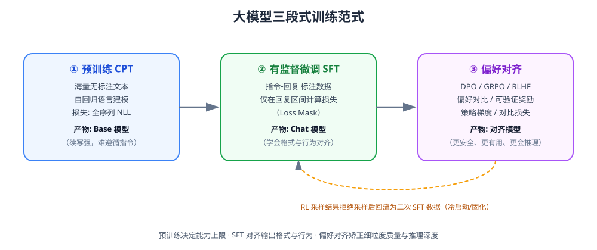

*图 1-1：预训练、SFT、偏好对齐三阶段的分工与产物，以及 RL 采样结果回流为二次 SFT 数据的迭代闭环。*

### 1.2 SFT 的角色定位

如果说预训练解决的是"模型是否具备知识和能力"，那么 SFT 解决的是"模型能否以人类期望的形式将能力表达出来"。学术界一个被广泛引用的直觉是：**预训练决定模型能力的上限，SFT 主要起到"格式对齐/行为诱导"的作用，而不是大幅注入新知识**。这一直觉在业界的工程实践中衍生出若干重要推论：

- SFT 数据的**质量与多样性**远比数量重要——LIMA（Less Is More for Alignment）等研究表明，仅用约 1000 条精心构造的高质量指令数据，就可以让 65B 模型达到接近 GPT-3.5/ChatGPT 的对话质量，这一现象被称为"表层对齐假说"（Superficial Alignment Hypothesis）：模型的知识和能力几乎全部在预训练阶段习得，对齐阶段只是教会模型以何种"分布"、何种"文体"、何种"交互协议"来调用这些已有能力。
- 如果 SFT 数据中包含大量模型预训练阶段未曾见过的知识（例如私有领域的事实性知识），单纯依靠 SFT 强行"注入"，容易导致过拟合、幻觉增多，此时更合理的路径是"先做增量预训练（CPT）补充领域知识，再做 SFT 做指令对齐"，这也是 ms-swift 将 `swift pt`（预训练）与 `swift sft` 并列作为两个独立子命令、并支持二者共享同一套数据管线与 Tuner 体系的原因。
- SFT 也是**灾难性遗忘（Catastrophic Forgetting）**的高发环节：如果 SFT 数据分布过窄（例如只包含单一任务/单一语言），模型在其余任务上的能力会显著退化。工程上常见的缓解手段包括：混入通用指令数据（如 Alpaca、ShareGPT 的一定比例）、控制学习率与训练轮数、使用参数高效微调（PEFT）限制可训练参数量、或使用弹性权重巩固（EWC）等正则化方法。

### 1.3 SFT 与 RLHF/DPO/GRPO 的分工

- **SFT** 使用的是"示范学习"（Demonstration Learning）范式：给定输入 x，模型直接模仿标注的输出 y，损失函数是逐 token 的交叉熵（下一章详细展开）。它对数据的要求是"每条样本给出一个正确/期望的回复"。
- **RLHF/DPO** 使用的是"偏好学习"（Preference Learning）范式：给定同一输入 x 下的一对（或多个）回复，标注哪个更好，模型学习"提高好回复的相对概率、降低差回复的相对概率"，而不是死板模仿某个绝对正确答案。这种范式更适合优化那些"没有唯一正确答案，但存在相对优劣"的目标，比如回复的礼貌程度、简洁度、安全性。
- **GRPO（Group Relative Policy Optimization）** 等 RLVR 算法进一步引入"可验证奖励"（例如数学题答案是否正确、代码是否通过单元测试），通过分组采样+组内相对优势估计的方式做策略梯度更新，省去了 PPO 中价值网络（Critic）的开销，是 2024-2026 年推理模型（如 DeepSeek-R1、Qwen3 的思维链版本）训练的主流技术之一。

在完整的工程链路中，SFT 往往充当"承上启下"的角色：一方面它把 Base 模型转化为具备基本指令遵循能力的 Chat 模型（如果没有 SFT，RLHF/DPO 阶段的探索效率会非常低，因为模型甚至不会输出"看起来像回答"的文本）；另一方面 SFT 阶段产出的模型（及其权重，如 LoRA adapter）通常直接作为 DPO/GRPO 阶段的初始策略（Policy）乃至参考模型（Reference Model）。ms-swift 的命令行设计也直接体现了这种分工：`swift pt`、`swift sft`、`swift rlhf`（内部按 `rlhf_type` 区分 dpo/kto/ppo/grpo/orpo/simpo 等）共享同一套 `Template`、`Dataset`、`Tuner` 基础设施，仅在 Trainer 与损失函数层面分叉，这是一种典型的"训练范式可插拔"架构设计。

### 1.4 本报告的技术调研边界

本报告聚焦 SFT（含其广义外延——预训练与 SFT 共用的工程基础设施），对 RLHF/DPO/GRPO 仅在与 SFT 直接相关（如权重复用、Loss 设计的对比）的范围内展开讨论，不做单独的强化学习算法推导。在框架层面，本报告以 ms-swift 为主要解剖对象，兼顾提及其依赖的上游生态（HuggingFace Transformers/PEFT/TRL、DeepSpeed、PyTorch FSDP、Megatron-LM、vLLM 等），因为 ms-swift 本质上是一个"训练编排与工程封装框架"，其大量核心能力（如具体的 Attention 实现、ZeRO 优化器）来自这些上游依赖，ms-swift 的核心价值在于**统一的命令行/参数体系、丰富的模型与数据集适配（600+ LLM、300+ MLLM）、开箱即用的 Template 与数据处理管线、以及对 CPT/SFT/RLHF/Embedding/Reranker 等多训练范式的统一编排**。

---

## 第二章 SFT 的数学原理与训练目标

### 2.1 自回归语言建模回顾

预训练与 SFT 在数学形式上使用的是同一族损失函数——自回归语言建模的负对数似然（Negative Log-Likelihood, NLL）。给定一个 token 序列 $x = (x_1, x_2, \ldots, x_T)$，模型参数为 $\theta$，语言模型定义了如下联合概率的链式分解：

$$P_\theta(x) = \prod_{t=1}^{T} P_\theta(x_t \mid x_{<t})$$

训练目标是最小化整条序列的负对数似然：

$$\mathcal{L}_{\text{LM}}(\theta) = -\sum_{t=1}^{T} \log P_\theta(x_t \mid x_{<t})$$

预训练阶段，$x$ 是原始文本的 token 序列，损失在几乎所有 token 上计算（除去 padding）。SFT 阶段的核心区别在于**引入了"损失掩码"（Loss Mask）**：一条 SFT 样本通常由"指令/上下文部分"（Prompt，含 system prompt、多轮历史、用户当前问题）与"回复部分"（Response，即模型应当生成的目标）拼接而成，训练时只在 Response 对应的 token 位置计算损失，Prompt 部分的 token 仅作为条件输入参与前向计算（提供上下文），不贡献梯度：

$$\mathcal{L}_{\text{SFT}}(\theta) = -\sum_{t \in \mathcal{M}} \log P_\theta(x_t \mid x_{<t})$$

其中 $\mathcal{M}$ 是回复部分 token 索引的集合（loss mask 为 1 的位置）。这一"只在答案区间算损失"的设计是 SFT 区别于纯语言建模预训练最本质的技术细节，也是几乎所有 SFT 框架（包括 ms-swift 的 `Template.encode`）必须正确实现的核心逻辑——如果误将 Prompt 部分也纳入损失计算，模型会被训练去"背诵/预测用户的问题"，这不仅浪费算力，还会拖累模型学习"回复分布"的效率，是训练框架中最容易出错、也最需要单元测试覆盖的环节之一。

### 2.2 多轮对话与角色掩码

现代 Chat 模型的 SFT 数据通常是多轮对话（multi-turn），形如：

```
<system> 你是一个有帮助的助手 </system>
<user> 问题1 </user>
<assistant> 回复1 </assistant>
<user> 问题2 </user>
<assistant> 回复2 </assistant>
```

在这种场景下，损失掩码需要精细到"只在每一轮 assistant 的内容 token 上为 1"，而 system/user 角色的 token（包括角色标记本身，如 `<|im_start|>user` 这类特殊 token）通常置 0。是否在 assistant 回复末尾的结束符（如 `<|im_end|>`）上计算损失，是一个需要显式约定的细节——大多数框架会将结束符也纳入损失区间，因为这是模型学习"何时停止生成"的关键信号；如果不计算，模型可能出现生成不停止、持续输出直到达到 `max_new_tokens` 的问题。

对于"是否要在历史轮次（非最后一轮）的 assistant 回复上也计算损失"，工程实践中存在两种策略：

- **全轮次计算损失**（默认策略，如 ms-swift 默认行为）：每一轮 assistant 回复都参与损失计算，这样一条多轮样本可以被更充分地利用，训练信号更密集。
- **仅最后一轮计算损失**：可以通过 `loss_scale` 机制中的 `last_round` 策略实现（ms-swift 支持 `--loss_scale last_round`），适用于历史轮次仅作为上下文、不希望模型模仿历史回复风格的场景（例如历史回复来自另一个模型或规则拼接，本身质量不足以作为学习目标）。

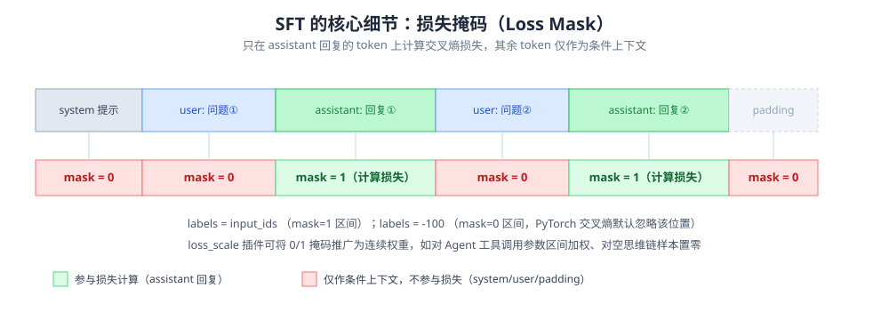

*图 2-1：多轮对话中损失掩码的 token 级示意——只有 assistant 回复区间的 token 参与交叉熵损失计算，其余角色的 token（含 padding）仅作为上下文条件参与前向计算。*

### 2.3 Loss Scale：加权损失掩码的推广

朴素的 0/1 掩码是"Loss Scale"机制的特例。更一般地，可以为每个 token 赋予一个非负权重 $w_t$：

$$\mathcal{L}_{\text{SFT}}(\theta) = -\sum_{t=1}^{T} w_t \cdot \log P_\theta(x_t \mid x_{<t})$$

ms-swift 提供了丰富的 `loss_scale` 策略（在其 `swift/plugin/loss_scale` 目录下以插件形式实现），典型场景包括：

- **`default`**：标准 0/1 掩码，仅在 response 部分计算损失，权重为 1。
- **`ignore_empty_think`**：面向推理模型（reasoning model）训练场景，如果某条数据的 `<think>...</think>` 思维链部分为空，则忽略其损失，避免模型学会"跳过思考直接给答案"这种非期望模式。
- **`hermes`／agent 相关 loss scale**：在 Agent/Tool-calling 数据格式中，对 "function call" 部分与"最终回答"部分赋予不同权重，例如提高工具调用参数（JSON 结构）部分的权重，因为这部分是格式敏感的关键信息，容错率低。
- **`react` 系列**：面向 ReAct 格式的 Agent 数据，对 Thought/Action/Observation 不同片段分别配置权重，Observation（环境返回，非模型生成）部分权重为 0。
- **`ConcatLossScale`（多策略叠加）**：2026 年的版本更新中，ms-swift 支持将多个 loss scale 策略"串联叠加"，例如 `last_round + ignore_empty_think + hermes` 可以同时实现"只对最后一轮计算损失 + 忽略空思维链 + 对 Agent 格式差异化加权"，这体现了 loss scale 机制从"单一策略选择"向"可组合的插件流水线"演进的趋势。

从数学上看，Loss Scale 本质上是在标准交叉熵损失前显式引入一个"样本/token 级别的重要性权重"，这与更早的工作如 Focal Loss（针对难易样本加权）、Prompt Masking（针对角色加权）思路一脉相承，只是在指令微调场景下被具体化为面向对话结构、Agent 结构的工程化实现。

### 2.4 序列长度与 Padding/Packing 对损失计算的影响

在 batch 训练中，一个 batch 内的多条样本长度往往不同，需要 padding 对齐到相同长度，padding 位置同样需要在 loss mask 中置 0（且在 attention mask 中标记为不可见）。为了提升 GPU 利用率、减少 padding 浪费的算力，业界普遍采用 **Packing（打包）** 技术：将多条短样本拼接到一个接近 `max_length` 的长序列中，通过样本边界处的 attention mask（或 position_ids 重置）确保拼接后的样本之间不会互相"看到"彼此的上下文，从而在数学上等价于分别训练多条短样本，但显著减少了 padding token 的比例，提高训练吞吐（GPU 有效算力利用率通常可提升 30%~100%，具体取决于原始数据长度分布的离散程度）。第十四章将结合 ms-swift 的源码详细展开 Packing 的具体实现（包括 Flash Attention 的变长注意力支持、`position_ids` 与 `attention_mask` 的构造细节）。

### 2.5 优化目标与传统监督学习的异同

从损失函数形式看，SFT 与传统 NLP 任务（如文本分类的交叉熵）并无本质区别，都是最大似然估计（MLE）。但 SFT 在实践中呈现出若干独特性质：

1. **超高维、超长序列的结构化输出空间**：传统分类任务输出空间是有限类别集合，SFT 的输出是长度可变的自然语言序列，其"正确性"评价远比分类任务复杂（可能存在多个同样合理的回复），这决定了 SFT 更依赖"数据质量"而非"损失函数设计"本身来传递监督信号。
2. **小学习率、少训练轮数**：由于 Base 模型已经具备强大的语言能力，SFT 阶段的学习率通常比预训练小 1~2 个数量级（如 ms-swift 文档给出的默认值：全参数训练 `learning_rate=1e-5`，LoRA 等 PEFT 方法 `learning_rate=1e-4`），训练轮数（epoch）也通常控制在 1~5 轮以内，过多轮次容易导致过拟合与灾难性遗忘。
3. **评估指标的主观性**：SFT 效果的评估很难像分类任务一样用单一准确率衡量，通常需要结合自动化评测集（如 MMLU、C-Eval 等知识/推理类客观题，或专门构造的对话质量评测）、模型打分（LLM-as-a-Judge，如 MT-Bench、AlpacaEval）、以及人工评估共同判断，这也是 ms-swift 集成 EvalScope 评测框架、将"训练"与"评估"打通为闭环的动机之一。

---

## 第三章 指令数据工程：构建高质量 SFT 数据集

### 3.1 数据是 SFT 效果的第一决定因素

工程实践与多篇研究（如 LIMA、Alpaca、Self-Instruct、WizardLM 系列论文）反复印证：在模型结构、训练超参数相对固定的前提下，**SFT 效果的方差主要来自数据质量、数据多样性与数据配比，而非算法细节**。这与预训练阶段"数据量为王"的直觉不同——SFT 阶段数据量存在明显的边际效益递减，"1000 条精心构造的数据"完全可能优于"10 万条粗糙爬取拼接的数据"。围绕这一核心认知，业界形成了一套相对成熟的数据工程方法论。

### 3.2 数据来源与构造方式

1. **人工标注**：由标注团队针对特定任务编写"指令-高质量回复"对，成本最高但质量可控性最强，OpenAI InstructGPT、Anthropic 的早期对齐工作大量依赖此类数据。
2. **模板+规则构造**：将已有的 NLP 任务数据集（如问答、摘要、翻译、分类）通过模板转化为指令格式，例如 FLAN、P3、Super-NaturalInstructions 等"指令化"数据集合，优点是规模大、任务覆盖广，缺点是模板化痕迹重、风格单一。
3. **模型蒸馏/自指令生成（Self-Instruct / Distillation）**：以强模型（如 GPT-4）为"教师"，通过种子指令+few-shot 提示自动生成大量新指令与对应回复，代表性工作包括 Self-Instruct、Alpaca（基于 text-davinci-003 蒸馏 5.2 万条数据）、WizardLM（Evol-Instruct，通过"指令进化"逐步增加指令复杂度）、ShareGPT（收集真实用户与 ChatGPT 的对话记录）等。这类方法目前是构建大规模 SFT 数据的主流手段，其核心挑战是**教师模型的错误/幻觉会被蒸馏进学生模型**，因此通常需要叠加规则过滤、模型自打分（Reward Model / LLM-judge 打分）等质量筛选环节。
4. **拒绝采样与自我提升（Rejection Sampling / Self-Training）**：使用当前模型对同一指令采样多条候选回复，通过验证器（如答案是否正确、单元测试是否通过）或打分模型筛选出高质量样本，再反馈用于下一轮 SFT，这一思路是 STaR、RFT（Rejection sampling Fine-Tuning）以及近年推理模型训练中"用强化学习/拒绝采样生成 SFT 冷启动数据"的通用范式（例如 DeepSeek-R1 技术报告中提到的"用 R1-Zero 生成的高质量推理链路做数据筛选，再用于 SFT 冷启动"）。

### 3.3 数据质量维度

一套成熟的数据质量评估体系通常从以下维度展开：

- **正确性（Correctness）**：回复内容是否事实正确、逻辑自洽，尤其是数学、代码、常识类问题。
- **完整性（Completeness）**：是否完整回答了指令中的所有子问题，是否有遗漏。
- **格式规范性（Format Compliance）**：是否符合指令要求的输出格式（如 JSON、Markdown 表格、特定语言）。
- **长度与信息密度**：过短的回复（如"是的""可以"）通常缺乏训练信号，过长的回复（尤其是水字数、重复啰嗦）会稀释有效信息并拖慢训练/推理速度；工程上常见做法是设定长度下限过滤掉过短样本，同时对异常长样本做截断或剔除。
- **多样性（Diversity）**：涵盖指令类型（问答、创作、代码、推理、多轮对话、Agent/工具调用等）、语言（中/英/多语种）、难度梯度（简单事实题到复杂多步推理题）、领域（通用、金融、医疗、法律等垂域）的分布均衡性。可以通过 embedding 聚类、指令长度/词汇多样性统计等手段量化。
- **去重与去污染（Deduplication & Decontamination）**：需要对训练数据做精确去重（哈希）与近似去重（MinHash/SimHash/embedding 相似度），并特别注意与下游评测集（如 MMLU、C-Eval、GSM8K 等 benchmark 的测试集）之间的数据污染问题——一旦评测集问题（或高度相似的改写）混入训练数据，评测分数将失去参考意义。
- **安全性（Safety）**：过滤或改写涉及暴力、色情、违法、隐私泄露等内容，同时构造适量的"拒绝/安全回复"数据以增强模型的安全对齐能力，但需要控制比例，避免模型出现"过度拒绝"（over-refusal）的负面效果。

### 3.4 数据配比与课程设计

多任务/多来源数据混合训练时，各来源的**采样比例（Data Mixture Ratio）**对最终效果影响显著。常见策略包括：

- **按任务类型均衡采样**：避免某一类数据（如代码）因绝对数量庞大而"淹没"其他类型数据的梯度信号。
- **难度课程学习（Curriculum Learning）**：部分工作尝试"先易后难"或"难度均匀打散"的样本排布策略，但在 SFT 场景下（相较预训练/RL）课程学习的收益尚存在争议，更多框架选择随机打散（shuffle）配合合理的数据配比来间接实现类似效果。
- **自我认知/身份数据（Self-Cognition Data）**：为了让模型准确回答"你是谁""你是谁开发的"等身份类问题，通常需要专门构造少量（几十到几百条）自我认知数据混入训练集，ms-swift 官方示例中提供了 `swift/self-cognition` 数据集，并通过 `--model_author`、`--model_name` 参数支持在训练时动态替换数据模板中的模型名/作者占位符，避免为每次品牌定制都重新标注数据。
- **通用能力"回炉"数据**：当 SFT 目标是强化某个垂直能力（如金融问答）时，工程上通常会同时混入一定比例（例如 10%~30%）的通用指令数据，以缓解在垂直数据上过拟合导致的通用能力衰退（灾难性遗忘），这是"重演/排练"（Replay）思想在 SFT 语境下的具体应用。

### 3.5 数据格式标准化

不同数据来源的原始格式千差万别（Alpaca 格式的 `instruction/input/output`、ShareGPT 格式的多轮 `conversations` 列表、OpenAI 的 `messages` 格式等），训练框架需要提供统一的数据规范并做格式转换。ms-swift 内部采用了以 **`messages`（OpenAI 风格的角色-内容列表）**为核心的标准中间表示，兼容 Alpaca 风格（`query/response/history` 或 `instruction/output`）与 ShareGPT 风格（`conversations` 列表，`from`/`value` 字段）等多种输入格式，并通过数据集注册机制（`register_dataset`/`DatasetMeta`）为每个内置数据集声明其预处理函数（`preprocess_func`），将原始格式统一转换为标准 `messages` 结构后再交给 Template 编码。这种"输入格式多样、内部表示统一"的设计，是所有成熟训练框架（不仅是 ms-swift，也包括 LLaMA-Factory、Axolotl 等同类项目）的共性架构选择，能够最大程度降低新增数据集的接入成本。

### 3.6 多模态与 Agent/工具调用数据的特殊性

随着多模态大模型（MLLM）与 Agent 场景的普及，SFT 数据格式进一步扩展：

- **多模态数据**：`messages` 中的 `content` 字段需要支持图像/视频/音频的混合内容（通常以 `<image>`、`<video>`、`<audio>` 等占位符 + 单独的媒体路径/URL 字段表示），还需要处理图像分辨率（`max_pixels`）、视频抽帧率（`fps`）、多图/多轮图文交织等复杂场景。特别地，在目标检测/视觉定位（Grounding）等任务中，一条数据可能对应"一个物体标签 + 多个边界框（bbox）"，需要在数据格式与 Template 编码逻辑上做专门支持。
- **Agent/工具调用数据**：需要在 `messages` 中额外支持 `tool`/`function` 角色，表示模型发起的函数调用请求及外部环境返回的调用结果，同时需要在 Prompt 中拼接"工具定义（Tool Schema）"，训练时通常需要对"工具调用参数生成"这部分内容做更严格的格式监督（如前述 loss_scale 加权），因为 JSON 参数哪怕一个字符出错都会导致下游调用失败。

综上，数据工程是 SFT 全流程中投入产出比最高、也最考验团队工程与业务理解能力的环节，其重要性通常超过对训练算法本身的微调，这也是本报告将其置于框架源码解析之前专门成章讨论的原因。

---

## 第四章 对话模板（Chat Template）与 ms-swift 的 Template 体系

### 4.1 为什么需要 Chat Template

预训练模型只认识"纯文本 token 序列"，而 SFT/推理阶段的对话数据是结构化的"角色-内容"列表（`messages`）。Chat Template 的作用就是定义一套**确定性的字符串拼接规则**，将结构化对话转换为模型实际"看到"的 token 序列，同时还要标注哪些区间是"输入上下文"、哪些区间是"训练目标（loss 计算区间）"。一个典型的模板需要定义：

- **特殊 token**：如 `<|im_start|>`、`<|im_end|>`（ChatML 风格）、`[INST]`、`[/INST]`（Llama 风格）、`<s>`、`</s>` 等 BOS/EOS/角色分隔符。
- **System Prompt 的拼接位置与默认值**。
- **多轮历史的拼接方式**（是否每轮都重复 system prompt，工具定义放在何处）。
- **生成提示（Generation Prompt）**：推理时需要在用户输入后追加"提示模型开始生成回复"的固定前缀（如 `<|im_start|>assistant\n`），这部分在训练时同样需要正确拼接，且不计入 loss。
- **停止条件（Stop Words / EOS token）**：模型何时应该停止生成。

不同模型家族（Qwen、Llama、GLM、InternLM、DeepSeek、Gemma、Mistral 等）的模板细节各不相同，这也是像 ms-swift 这样需要支持"600+ LLM、300+ MLLM"的框架必须投入大量工程去维护的核心模块——模板写错，哪怕训练损失曲线看起来正常下降，最终模型的实际对话表现也会出现错位（如角色混乱、无法正常停止生成、多轮对话上下文丢失等）。

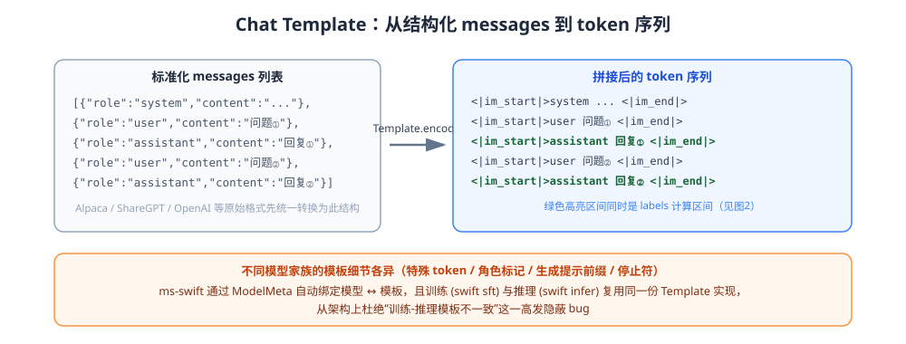

*图 4-1：Template 将标准化 messages 编码为实际 token 序列的过程，绿色高亮区间同时对应图 2-1 中的损失计算区间。*

### 4.2 ms-swift 的 Template 抽象设计

ms-swift 将"模板"设计为一个独立的可插拔组件（`swift/llm/template` 目录），核心是一个 `Template` 基类及针对具体模型家族的子类实现（如 `QwenTemplate`、`Llama3Template`、`ChatglmTemplate` 等），并通过模型元信息（`ModelMeta`/`TemplateMeta`）将"某个模型 ID"与"应使用的模板类型"自动关联，用户在命令行中通过 `--model` 指定模型后，框架会自动匹配正确的模板（也可以用 `--template` 显式覆盖）。这种"模型-模板自动绑定 + 允许手动覆盖"的设计，是 ms-swift 能够做到"开箱即用支持数百个模型"而不需要用户逐一了解每个模型模板细节的关键。

Template 类的核心方法通常包括：

- **`encode`**：接收一条标准化的 `messages`（含可能的多模态内容、工具定义），输出 `input_ids`、`labels`（即 loss mask 后的目标序列，非目标位置填充 `-100`，这是 PyTorch/HuggingFace 生态中"交叉熵损失忽略该位置"的标准约定）、`attention_mask`，以及多模态场景下的 `pixel_values`、`image_grid_thw` 等额外张量。
- **`_encode`（内部实现）**：按角色循环拼接 Prompt 前缀、正文内容、后缀，并根据角色决定该片段的 `labels` 是否置为真实 token id（assistant 部分）还是 `-100`（system/user/tool 部分）。
- **`_swift_encode`/`_jinja_encode`**：部分模型直接复用 HuggingFace `tokenizer.apply_chat_template` 提供的 Jinja2 模板（尤其是新版本 Transformers 生态推荐用 Jinja 模板统一描述对话格式），ms-swift 同时保留了自定义 Python 实现的模板（性能更好、更易定制 loss_scale 等训练专属逻辑）与 Jinja 模板兼容层。
- **多模态编码钩子**：针对图像/视频，Template 会调用对应模型的 Processor（如 Qwen2-VL 的 `image_processor`）完成像素预处理，并将图像 token 占位符替换为实际的图像 patch token 数量（这一数量通常取决于图像分辨率，因此模板编码与预处理往往是强耦合的）。

### 4.3 System Prompt、多轮拼接与截断策略

在实际训练中，Template 还需要处理若干工程细节：

- **默认 System Prompt**：若数据未显式提供 system 字段，是否使用模型默认的 system prompt（不同模型的默认值差异很大，有的为空，有的包含较长的安全声明），ms-swift 通过 `--system` 参数支持在训练/推理时统一覆盖或追加默认 system。
- **超长序列截断**：当拼接后的序列超过 `--max_length` 时，需要决定截断策略——是从左侧截断（丢弃早期历史轮次）还是直接丢弃整条样本（`--truncation_strategy`，可选 `delete` 或 `truncation_left` 等），截断不当可能破坏对话结构（如截断到一半的用户提问却保留了完整回复）。
- **多轮拆分为多条训练样本（Split by Round）**：部分实现会将一条 N 轮对话拆分成 N 条"以第 k 轮结尾"的独立训练样本以增加有效样本数，但更主流的做法（包括 ms-swift 默认策略）是保留完整多轮对话为一条样本、在所有 assistant 轮次上都计算损失，这样既保留了多轮上下文的完整性，又不会因拆分而重复计算前缀部分的前向开销（尤其是配合 Packing 时，保留完整对话对效率更友好）。

### 4.4 Template 版本演进与 Jinja 化趋势

值得关注的技术趋势是：早期各训练框架（FastChat、LLaMA-Factory 早期版本、ms-swift 早期版本）普遍采用"每个模型手写一个 Python 模板类"的方式维护对话格式，代码量大、维护成本高、且容易与 HuggingFace 官方 `tokenizer_config.json` 中自带的 `chat_template`（Jinja2 格式）产生"两套模板互相打架、结果不一致"的风险。近年来行业逐渐向"以 HuggingFace 官方 Jinja Chat Template 为唯一真源（Single Source of Truth）、训练框架仅负责在 Jinja 渲染结果基础上补充 loss mask 逻辑"的方向收敛，ms-swift 的模板体系也在持续做兼容与融合，力求"训练时的拼接结果"与"推理引擎（vLLM/SGLang 等）使用官方模板得到的拼接结果"保持严格一致，避免训练-推理模板不一致（Train-Inference Template Mismatch）这一在生产实践中屡见不鲜、却又极难排查的隐蔽 bug（其典型症状是：训练 loss 正常下降，但线上推理效果远差于训练时的评估效果）。

---

## 第五章 全参数微调 vs 参数高效微调：路线之争

### 5.1 全参数微调（Full-parameter Fine-Tuning, Full FT）

Full FT 更新模型的全部参数，理论上具备最强的表达能力上限，在数据充分、算力充分的情况下通常能取得最优效果，尤其适合以下场景：

- 目标任务与预训练分布差异较大（如领域迁移幅度大的垂直领域）；
- 拥有大规模、高质量的 SFT 数据（数十万条以上）；
- 对模型的最终效果要求达到极致，且算力/时间预算充裕。

但 Full FT 的工程代价高昂：

1. **显存开销**：以 Adam 优化器为例，除模型参数本身（如 bf16 下 2 bytes/参数）外，还需要存储一阶动量、二阶动量（通常各为 fp32，4 bytes/参数 ×2）、梯度（2~4 bytes/参数），保守估计需要约 16~20 bytes/参数的显存，一个 7B 模型全参数训练理论显存需求可达 100GB+（不含激活值），远超单卡显存容量，必须依赖 ZeRO/FSDP 等分布式显存切分技术（详见第十章）。
2. **存储与部署成本**：每次微调都会产出一份与原模型等大小的全量权重，多任务/多客户定制场景下存储成本线性增长。
3. **灾难性遗忘风险更高**：全部参数可自由更新，如果数据量不足或分布过窄，模型更容易"忘记"预训练阶段习得的通用能力。
4. **训练不稳定性**：全参数更新对学习率、warmup 策略更敏感，尤其在多模态模型中，视觉编码器（ViT）与语言模型的学习率通常需要分离配置（即前文提到的 `--vit_lr`、`--aligner_lr`），否则容易破坏预训练视觉特征。

### 5.2 参数高效微调（Parameter-Efficient Fine-Tuning, PEFT）

PEFT 的核心思想是：**冻结预训练模型的绝大部分参数，只引入/更新一小部分新增或选定参数**，以远低于 Full FT 的显存与存储开销，达到接近甚至持平 Full FT 的下游效果。PEFT 家族按照"参数插入方式"大致可分为几类：

- **重参数化类（Reparameterization-based）**：以 LoRA 及其变体为代表，通过低秩矩阵近似权重更新量，训练完成后可"合并"回原始权重，不引入额外推理延迟，是当前最主流的 PEFT 范式（详见第六、七章）。
- **附加模块类（Additive）**：如 Adapter（在 Transformer 层间插入小型瓶颈网络）、Prefix-Tuning/Prompt-Tuning（在输入或每层 KV 前追加可训练的"虚拟 token"向量）、(IA)³（对激活值做逐元素缩放）。
- **选择性微调类（Selective）**：只更新模型参数的一个子集，如只训练 bias 项（BitFit）、只训练部分层（Layer Freezing，ms-swift 中的 `--freeze_parameters` 支持按层名前缀冻结）、只训练新增层（LLaMA-Pro 的"块扩展"思路）。
- **混合类**：如 QLoRA 将"量化压缩基座权重"与"LoRA 微调"结合，AdaLoRA 将"重参数化"与"选择性/自适应秩分配"结合。

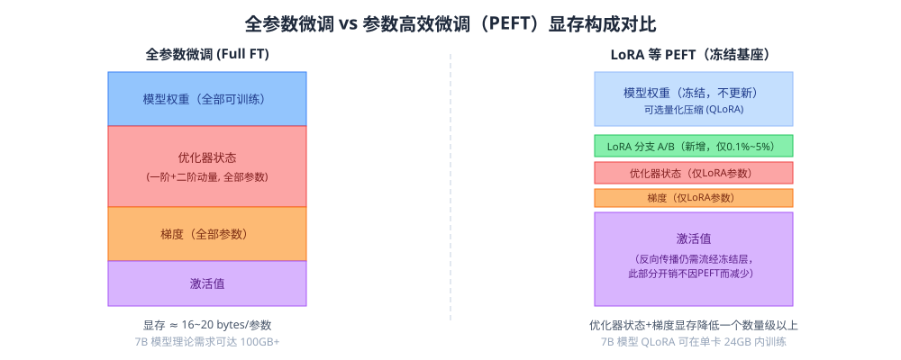

*图 5-1：全参数微调与 LoRA 类 PEFT 在权重、优化器状态、梯度、激活值四类显存构成上的直观对比。注意激活值开销并不会因使用 PEFT 而显著减少——这是 LoRA 训练速度提升不如显存节省那样明显的原因。*

### 5.3 两条路线的量化对比

| 维度 | 全参数微调 | LoRA 类 PEFT |
| --- | --- | --- |
| 可训练参数占比 | 100% | 通常 0.1%~5% |
| 显存需求（相对） | 高（需存全量优化器状态） | 低（优化器状态仅对应少量新增参数） |
| 训练速度 | 相对慢（尤其是大模型+多卡通信量大） | 相对快，但反向传播仍需流经冻结主干（除非配合量化/激活值优化） |
| 存储成本 | 每次微调产出等大小全量权重 | 每次微调仅产出几十 MB 到几百 MB 的 adapter 权重，便于多任务/多客户管理 |
| 灾难性遗忘风险 | 较高 | 较低（冻结参数天然起到正则化/知识保留作用） |
| 效果上限 | 理论最优 | 数据/任务简单时可持平 Full FT，任务复杂或数据规模巨大时可能存在差距 |
| 典型适用场景 | 大规模高质量数据、追求极致效果、有充裕算力预算 | 中小规模数据、多任务/多租户场景、资源受限环境、快速实验迭代 |

需要指出的是，"LoRA 效果不如 Full FT"并非绝对结论——大量工程实践与研究（包括 LoRA 原论文的实验）表明，在合理设置秩（rank）、学习率、目标模块（target_modules）的前提下，LoRA 在很多任务上可以取得与 Full FT 相当甚至更优的效果（部分归功于其隐式的正则化效应减少了过拟合）；但在需要大幅改变模型行为分布的场景（如大规模持续预训练式的知识注入、复杂推理能力的大幅提升）中，全参数微调或更大秩的 LoRA/更多目标模块通常仍具备优势。ms-swift 通过统一的 `--train_type full/lora/...` 参数将两条路线纳入同一套训练管线，使工程师可以用几乎相同的命令行、仅切换一个参数即可对比两条路线的效果与成本，这也是该类框架的核心工程价值之一。

### 5.4 折中路线：部分参数微调与混合策略

除了"全参 vs LoRA"的二元选择，实践中还发展出多种折中策略：

- **LoRA + 部分模块全量训练**：通过 `--modules_to_save` 指定 embedding、lm_head 等模块参与全量训练（这些模块参数量相对可控，但对新增词表/新增语言等场景的适配效果影响很大），其余模块使用 LoRA，兼顾效果与成本。
- **分层冻结 + 全参数训练**：如 LLaMA-Pro（块扩展后只训练新增层）、LISA（Layerwise Importance Sampled AdamW，随机采样部分层参与全参数训练，其余层临时冻结，动态切换）。
- **LoRA 与全参数分阶段训练**：先用 LoRA 做快速实验筛选出最优数据配比/超参数组合，最终阶段切换到全参数训练冲刺最优效果，这是资源有限团队常见的"低成本试错+高成本冲刺"两阶段策略。

---

## 第六章 LoRA 原理精讲：低秩适配的数学本质

### 6.1 核心假设：权重更新量具有低"内在秩"

LoRA（Low-Rank Adaptation，Hu et al., 2021/2022）的出发点是一个经验性假设——**大模型在下游任务微调过程中，权重的更新量 $\Delta W$ 具有较低的"内在秩"（intrinsic rank）**，即尽管原始权重矩阵 $W_0 \in \mathbb{R}^{d \times k}$ 维度很高，但真正需要学习的"变化量"可以用一个远低秩的矩阵很好地近似。这一假设与更早的"内在维度"（Intrinsic Dimension）研究一脉相承——大模型微调所需要探索的有效参数空间维度，远小于其名义参数量。

基于此假设，LoRA 将权重更新量参数化为两个低秩矩阵的乘积：

$$\Delta W = BA, \quad B \in \mathbb{R}^{d \times r}, \ A \in \mathbb{R}^{r \times k}, \quad r \ll \min(d, k)$$

微调时冻结原始权重 $W_0$，只训练 $A$、$B$，前向计算变为：

$$h = W_0 x + \Delta W x = W_0 x + BA x$$

初始化上，$A$ 通常采用高斯随机初始化（或 Kaiming 初始化），$B$ 初始化为全零矩阵，这样保证训练开始时 $\Delta W = BA = 0$，即微调起点与原始预训练模型完全一致，不会因随机初始化引入扰动破坏预训练能力，这是 LoRA 相比"随机初始化插入新模块"（如部分早期 Adapter 方法）更稳定收敛的重要原因之一。

### 6.2 缩放因子与超参数

实际实现中会引入一个缩放系数 $\alpha$（`lora_alpha`），最终更新量为：

$$\Delta W = \frac{\alpha}{r} BA$$

$\alpha/r$ 这一比例被称为"LoRA scaling"，其作用类似学习率的一个乘法因子：当调整秩 $r$ 时，通过保持 $\alpha/r$ 不变（即同步调整 $\alpha$），可以使不同秩设置下的有效更新幅度保持一致，减少调参时"改秩必须重新搜索学习率"的耦合负担。此外通常还会在 $A$、$B$ 之间加入 Dropout（`lora_dropout`）作为正则化手段，缓解小数据集上的过拟合。

LoRA 的核心超参数一览：

- **`r`（秩）**：决定 $\Delta W$ 的表达能力上限，常见取值 4/8/16/32/64/128。秩越大，可训练参数越多、拟合能力越强，但也更接近 Full FT 的过拟合风险与显存开销；实践中 8~64 是较常用区间，具体取决于任务复杂度与数据规模。
- **`lora_alpha`（缩放因子）**：常见做法是设置为 `r` 的 1~2 倍（如 `r=8, alpha=16` 或 `r=8, alpha=8`），也有研究提出 `alpha` 应远大于 `r`（如 rsLoRA，见下一章）以获得更稳定的梯度尺度。
- **`target_modules`（作用模块）**：LoRA 可以插入到 Transformer 的任意线性层，最常见的选择是 Attention 中的 Query/Key/Value/Output 投影（`q_proj/k_proj/v_proj/o_proj`），进阶配置会同时覆盖 FFN 中的 `gate_proj/up_proj/down_proj`，覆盖模块越多，拟合能力越强，但可训练参数量也线性增长。ms-swift 提供 `all-linear` 快捷选项，自动为模型中所有线性层挂载 LoRA（多模态模型中默认排除 ViT/Aligner 部分，除非显式配置）。
- **`lora_dropout`**：训练时对 LoRA 分支的 Dropout 比例，用于正则化。

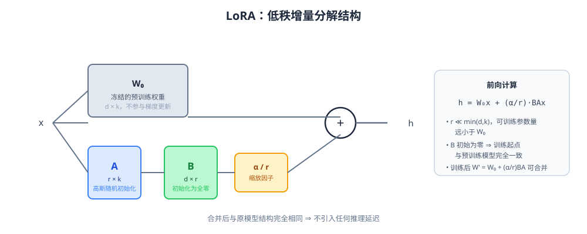

*图 6-1：LoRA 前向计算结构——冻结的 W₀ 与可训练的低秩分支 BA 并联相加，B 初始化为零保证训练起点与预训练模型一致。*

### 6.3 为什么 LoRA 不引入推理延迟

由于 $\Delta W = BA$ 与原始权重 $W_0$ 维度相同，在训练完成后可以直接将两者相加合并为一个新的权重矩阵 $W' = W_0 + \frac{\alpha}{r}BA$，替换回模型中，从而在推理时不需要额外计算 LoRA 分支、也不引入任何延迟或架构改动，这是 LoRA 相对 Adapter、Prefix-Tuning 等方法的一大优势（后两者在推理时都需要额外的前向计算或序列长度开销）。ms-swift 的 `swift export --merge_lora true` 命令即实现了这一合并操作，将 adapter 权重"烧录"进基座模型，输出一份可直接部署的完整模型权重。

需要注意的是，"合并"操作只在单一 adapter、且基座权重未被量化的情形下是精确无损的；如果基座模型是量化权重（如 QLoRA 场景下的 4-bit NormalFloat），合并前通常需要先反量化（dequantize）到高精度再相加，合并后可以选择重新量化或直接以高精度部署。

### 6.4 参数量与显存收益的定量分析

以 Qwen 系列 7B 模型、隐藏维度 $d_{model}=3584$、仅对 `q_proj/k_proj/v_proj/o_proj` 四个模块施加 `r=8` 的 LoRA 为例，单层新增可训练参数量约为：

$$4 \times (d_{model} \times r + r \times d_{model}) = 4 \times 2 \times 3584 \times 8 \approx 229{,}376$$

以 28 层估算，总可训练参数约 640 万，相较 7B（70 亿）参数的基座模型，占比不足 0.1%。可训练参数量的大幅减少直接带来两个收益：

1. **优化器状态显存大幅降低**：Adam 优化器需要为每个可训练参数额外存储一阶、二阶动量（通常 fp32，每参数 8 bytes），全参数训练下 7B 模型仅优化器状态就需要约 56GB，而 LoRA 场景下仅需几十 MB 到百余 MB，这是 LoRA 能够在单张消费级显卡（如 24GB 显存）上微调数十亿参数模型的核心原因。
2. **梯度显存降低**：只有 LoRA 分支参数需要保留梯度，冻结的基座权重梯度不需要计算与存储（结合 `requires_grad=False`）。

但需要注意：即便基座权重冻结，**反向传播仍然需要流经这些冻结层以计算前面 LoRA 分支的梯度**（链式法则要求梯度必须"穿过"冻结层才能传到更早的 LoRA 分支），因此 LoRA 训练相比"只训练最后几层"的传统微调，激活值显存开销与前向/反向计算量并不会成比例减少，只是节省了优化器状态与梯度存储，这也是为什么 LoRA 训练速度提升往往不如显存节省比例那样显著的原因，也是 QLoRA、梯度检查点等技术仍然在 LoRA 场景下具有意义的原因。

---

## 第七章 LoRA 技术家族演进：QLoRA / AdaLoRA / DoRA / rsLoRA / PiSSA / LoRA+ / LoRA-GA / GaLore

自 LoRA 提出以来，围绕"如何降低显存、如何提升拟合能力、如何加速收敛、如何更合理地分配秩预算"四个方向，学术界与工业界演化出了一个庞大的技术家族。ms-swift 作为覆盖面较广的训练框架，通过命令行参数（如 `--use_dora`、`--use_rslora`、`--init_weights pissa`、量化参数等）对其中的主流变体做了原生支持。本章逐一梳理这些方法的核心思想、与原始 LoRA 的差异，以及各自的适用场景。

### 7.1 QLoRA：量化基座 + LoRA 微调

QLoRA（Dettmers et al., 2023）解决的核心问题是"如何在极低显存下微调更大的模型"。其核心技术组合包括：

1. **4-bit NormalFloat（NF4）量化**：一种针对高斯分布权重设计的信息论最优的 4-bit 数据类型，相比朴素的 int4/fp4 量化，能在相同比特数下保留更多权重信息。
2. **双重量化（Double Quantization）**：对量化过程中产生的缩放常数（quantization constants）本身再做一次量化压缩，进一步节省显存（约每参数节省 0.37 bit）。
3. **分页优化器（Paged Optimizers）**：借助 NVIDIA 统一内存（Unified Memory）机制，在显存出现瞬时峰值（如梯度检查点重计算时）时自动将优化器状态换出到 CPU 内存，避免 OOM。
4. **在冻结的量化基座之上叠加标准 LoRA**：前向计算时将 4-bit 权重实时反量化为 bf16/fp16 参与矩阵乘法，反向传播的梯度只流向 LoRA 分支，基座权重全程保持量化状态、不参与梯度更新。

QLoRA 的意义在于证明了"量化基座 + 全精度 LoRA 微调"这一组合可以在几乎不损失效果（论文中报告的下游任务效果与 16-bit 全精度 LoRA 微调基本持平）的前提下，将微调一个 65B 模型所需显存从数百 GB 压缩到一张 48GB 显卡即可完成，是 PEFT 技术能够走向"消费级硬件微调超大模型"的关键里程碑。ms-swift 中通过 `--quant_method bnb --quant_bits 4`（或指定其他量化后端）并同时设置 `--train_type lora` 即可复现 QLoRA 式的训练配置，具体实现细节将在第十六章展开。

### 7.2 AdaLoRA：自适应秩分配

标准 LoRA 对模型中所有目标模块使用统一的秩 $r$，但直觉上不同层、不同模块对下游任务的重要性并不均等（如浅层可能更多承载通用语言特征，深层/特定模块可能对任务适配更关键）。AdaLoRA（Zhang et al., 2023）将权重更新量参数化为奇异值分解（SVD）形式：

$$\Delta W = P \Lambda Q$$

其中 $P$、$Q$ 近似正交，$\Lambda$ 是对角奇异值矩阵。训练过程中，AdaLoRA 会根据每个奇异值对应"重要性得分"（基于梯度敏感度的重要性度量）动态地对不重要的奇异值（及其对应的秩方向）进行剪枝，将有限的"秩预算"重新分配给更重要的模块/层，从而在总参数量预算不变的前提下提升整体拟合效果。ms-swift 支持 `--train_type adalora`，并暴露 `adalora_target_r`（剪枝后的平均目标秩）、`adalora_init_r`（初始秩，通常大于目标秩，为剪枝留出冗余）、`adalora_tinit`（初始的不剪枝预热步数）等超参数。AdaLoRA 相比标准 LoRA 的额外开销在于需要维护和更新重要性得分，训练速度略慢，但在秩预算紧张的场景下往往能取得更优的参数效率。

### 7.3 DoRA：权重分解低秩适配

DoRA（Weight-Decomposed Low-Rank Adaptation，Liu et al., 2024）的核心洞察是：将权重矩阵分解为"幅度"（magnitude）与"方向"（direction）两个分量分别分析——

$$W = m \cdot \frac{V}{\|V\|_c}$$

其中 $m$ 是一个逐列的幅度标量向量，$V/\|V\|_c$ 是归一化后的方向矩阵。DoRA 观察到，标准 LoRA 在微调过程中"幅度"与"方向"的变化模式与全参数微调（Full FT）的变化模式存在系统性差异，而这种差异可能是 LoRA 效果略逊于 Full FT 的原因之一。据此，DoRA 提出：保持方向分量沿用类似 LoRA 的低秩更新方式（用 $BA$ 增量近似方向变化），同时额外引入一个**可训练的幅度向量** $m$ 独立学习幅度缩放：

$$W' = m \cdot \frac{V_0 + BA}{\|V_0 + BA\|_c}$$

这一"幅度-方向解耦"的设计在多项基准测试中被报告能以几乎相同的可训练参数量取得优于标准 LoRA、更接近 Full FT 的效果，且同样不引入额外推理延迟（训练完成后幅度向量与方向矩阵可以重新合并为标准权重形式）。ms-swift 通过 `--use_dora true` 参数原生支持这一变体，可以与标准 LoRA 训练几乎无缝切换对比。需要注意的是，DoRA 由于需要额外计算矩阵范数归一化，训练速度相比标准 LoRA 略有下降。

### 7.4 rsLoRA：秩稳定缩放

rsLoRA（Rank-Stabilized LoRA，Kalajdzievski, 2023）指出，标准 LoRA 使用的缩放因子 $\alpha/r$ 在秩 $r$ 增大时会导致梯度尺度出现系统性偏差（随着 $r$ 增大，若 $\alpha$ 保持不变，学习信号会相对"稀释"，导致大秩配置下模型无法有效利用增加的秩容量、甚至性能不升反降）。rsLoRA 提出将缩放系数改为 $\alpha/\sqrt{r}$ 而非 $\alpha/r$，从理论上证明这一缩放方式能保证训练过程中前向/反向传播的梯度尺度不随秩的增大而系统性衰减，使得"增大秩即可稳定获得更强表达能力"的直觉在实践中真正成立。ms-swift 通过 `--use_rslora true` 支持该缩放策略，通常建议在使用较大秩（如 $r \geq 32$）时开启。

### 7.5 PiSSA：主奇异值与奇异向量自适应

PiSSA（Principal Singular values and Singular vectors Adaptation，Meng et al., 2024）改变的是 LoRA 的**初始化策略**而非结构。标准 LoRA 用随机初始化的 $A$（Kaiming）与全零的 $B$ 起步，而 PiSSA 首先对原始权重矩阵 $W_0$ 做奇异值分解 $W_0 = U\Sigma V^\top$，取其中最大的 $r$ 个奇异值及对应奇异向量来初始化 $A$、$B$（即"主成分"部分），而将 $W_0$ 中剩余的、奇异值较小的部分作为**残差项**继续冻结参与前向计算。这样一来，LoRA 分支从训练一开始就承载了原始权重矩阵中"最主要"的信息方向，相比随机初始化能收敛更快、最终效果也通常更优；同时由于初始化时 $\Delta W_{\text{init}} = A_0 B_0$ 恰好等于原权重的主成分近似而非零，PiSSA 需要额外从原始权重中减去这部分主成分（即"快速SVD"分解重构），保证初始模型输出与预训练模型完全一致。ms-swift 通过 `--init_weights pissa`（或 `pissa_niter_[迭代次数]` 指定快速 SVD 的迭代精度）支持这一初始化方案，且完全兼容标准 LoRA 的其余超参数与合并/导出流程。

### 7.6 LoRA+：差异化学习率

LoRA+（Hayou et al., 2024）从优化理论角度指出：在标准 LoRA 中 $A$、$B$ 使用相同学习率训练，随着模型宽度趋于无穷，$A$ matrix（乘在输入侧）与 $B$ matrix（乘在输出侧，初始化为零）对损失函数的梯度贡献存在系统性的不对称，使用相同学习率会导致训练效率次优。LoRA+ 提出为 $A$、$B$ 设置不同的学习率比例（通常 $B$ 的学习率应显著大于 $A$，论文建议比例在 $2^4$ 量级），可以在几乎不增加任何额外开销的前提下加快收敛速度、提升最终效果。这一思路较为"轻量"，容易在现有 LoRA 实现基础上直接叠加。

### 7.7 LoRA-GA / LoRA-Pro：基于梯度信息的初始化与优化

LoRA-GA（Low-Rank Adaptation with Gradient Approximation，Wang et al., 2024）提出用"全参数微调第一步的梯度方向"来指导 LoRA 的初始化，使得 LoRA 训练轨迹从一开始就逼近全参数微调的更新方向，从而缩小 LoRA 与 Full FT 之间的效果差距；后续工作 LoRA-Pro 进一步将这一思想扩展到优化过程的每一步（而不仅是初始化），通过调整 $A$、$B$ 的梯度使等效的 $\Delta W$ 更新方向与"假想的全参数梯度"对齐。这类方法通常需要在训练开始前后额外做一次或多次全参数梯度/初始化计算，工程实现复杂度高于前述几种方法，但报告的效果提升也更为明显，是目前学术界较为前沿、尚在向工业级框架渗透过程中的方向。

### 7.8 GaLore：面向全参数训练的低秩梯度投影

GaLore（Gradient Low-Rank Projection，Zhao et al., 2024）与前述方法有本质区别——**它不是一种 PEFT 方法，而是一种让全参数训练本身变得更省显存的优化器级技术**。GaLore 观察到，训练过程中梯度矩阵本身也呈现出低秩结构，因此提出将梯度投影到一个低秩子空间后再喂给优化器（如 Adam）计算动量与更新量，只需存储低秩空间内的优化器状态，再将更新量投影回原始参数空间应用到权重上。由于模型的**所有参数**仍然会被更新（不同于 LoRA 只更新新增的低秩分支），GaLore 理论上可以达到与全参数微调完全相同的表达能力上限，同时把优化器状态显存开销降低到接近 LoRA 的量级。GaLore 的代价是需要周期性地对梯度矩阵重新做 SVD 分解以更新投影子空间（带来额外计算开销），且由于本质仍是全参数更新，训练速度提升不如 LoRA 明显。GaLore 与其后续变体（Q-GaLore 结合量化进一步压缩、Flora 从理论上将其与 LoRA 联系起来解释为"梯度压缩"的特例）共同构成了"以全参数效果为目标、以低秩技术降显存"这一与 LoRA 平行的技术路线，在学术界受到持续关注，但截至本报告调研时，其在 ms-swift 等主流工程框架中的原生支持成熟度仍不及 LoRA 家族，更多作为前沿方向被研究者在独立代码库中验证。

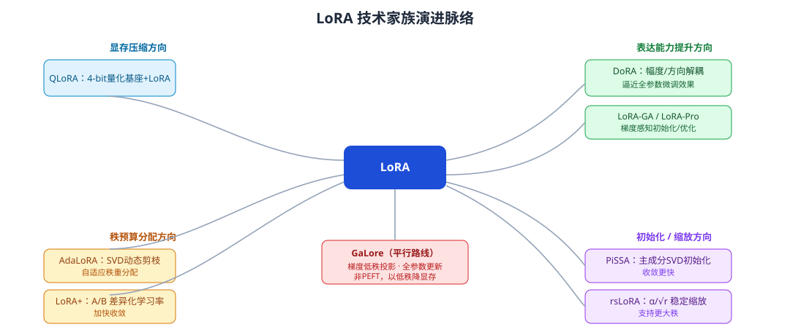

*图 7-1：LoRA 技术家族沿"显存压缩""表达能力提升""秩预算分配""初始化/缩放策略优化"四个方向演进，GaLore 则代表了以低秩技术压缩全参数训练显存的平行路线。*

### 7.9 家族方法对比小结

| 方法 | 核心改动点 | 额外开销 | 是否改变推理结构 | ms-swift 支持方式（示意） |
| --- | --- | --- | --- | --- |
| LoRA | 低秩增量分解 | 极低 | 否（可合并） | `--train_type lora` |
| QLoRA | 基座 4-bit 量化 + LoRA | 量化/反量化计算 | 否 | `--quant_bits 4 --train_type lora` |
| AdaLoRA | SVD 参数化 + 动态秩剪枝 | 重要性得分计算 | 否 | `--train_type adalora` |
| DoRA | 幅度/方向解耦 | 范数归一化计算 | 否（可合并） | `--use_dora true` |
| rsLoRA | 缩放因子改为 $\alpha/\sqrt r$ | 几乎无 | 否 | `--use_rslora true` |
| PiSSA | SVD 主成分初始化 | 初始化时一次性 SVD | 否 | `--init_weights pissa` |
| LoRA+ | A/B 差异化学习率 | 几乎无 | 否 | 可通过优化器分组自定义实现 |
| GaLore | 梯度低秩投影，全参数更新 | 周期性 SVD 分解 | 不适用（非PEFT） | 生态外部实现为主 |

这些方法之间并非互斥——例如 QLoRA 的量化与 DoRA 的幅度分解、rsLoRA 的缩放调整可以理论上叠加组合，ms-swift 的参数体系也支持这种"多开关自由组合"的配置方式，使工程师可以针对具体任务快速做消融实验，找到该场景下的最优组合。

---

## 第八章 其他 PEFT 技术：Adapter / Prefix-Tuning / IA3 / BOFT / FourierFT / ReFT / LLaMA-Pro / LongLoRA / LISA

除 LoRA 家族外，ms-swift 及广义 PEFT 生态还支持多种结构迥异的参数高效方法，本章逐一简述其原理与适用场景。

### 8.1 Adapter

Adapter（Houlsby et al., 2019）是最早的一批 PEFT 方法，在 Transformer 每层（通常是 Attention 与 FFN 子层之后）插入一个小型"瓶颈"网络：先降维（`down_proj`）、经过非线性激活、再升维（`up_proj`）回原始维度，并通过残差连接与原有输出相加。训练时冻结主干网络，只训练新插入的 Adapter 模块。与 LoRA 的关键区别在于：**Adapter 是串行插入的额外计算模块，推理时无法像 LoRA 一样"合并"消除额外延迟**（因为其中包含非线性激活函数，数学上不能等价合并为线性权重叠加），因此在对推理延迟敏感的场景中通常不如 LoRA 受欢迎，但其结构更灵活，在部分持续学习、模块化多任务场景中仍有价值。

### 8.2 Prefix-Tuning / Prompt-Tuning

Prefix-Tuning（Li & Liang, 2021）与 Prompt-Tuning（Lester et al., 2021）不改变模型权重，而是在输入序列前（或每一层 Attention 的 Key/Value 前）拼接一段可训练的"虚拟 token"向量（连续向量而非真实词表 token），模型在训练中只更新这些虚拟向量。这类方法参数量极小（有时仅数万到数十万），但由于占用了额外的"有效上下文长度"（虚拟 token 会挤占序列长度预算），且在小规模模型上表现不够稳定，在当前主流的大模型 SFT 实践中使用频率已明显低于 LoRA 系。

### 8.3 (IA)³：通过学习向量重新缩放激活

(IA)³（Infused Adapter by Inhibiting and Amplifying Inner Activations，Liu et al., 2022）为 Attention 的 Key/Value 与 FFN 的中间激活分别引入一个逐元素可训练的缩放向量（而非矩阵），前向计算变为对应激活值与该缩放向量做逐元素乘法。这是参数量最小的 PEFT 方法之一（通常仅需万级参数），推理时同样可以合并进相邻权重（把缩放向量乘进前一层权重矩阵）消除额外开销，是资源极度受限场景下的一个选项，但其表达能力上限也相应更低，更适合任务差异较小的微调场景。

### 8.4 BOFT / OFT：正交微调

正交微调（Orthogonal Fine-tuning, OFT）及其块状变体 BOFT（Butterfly Orthogonal Fine-Tuning）从另一个角度约束权重更新：不是加性地叠加 $\Delta W$，而是对原始权重施加一个**正交变换**（$W' = RW_0$，$R$ 为正交矩阵），利用正交变换"保范数、不改变权重矩阵行/列间夹角结构"的性质，从理论上被认为能更好地保留预训练模型的知识结构，缓解灾难性遗忘。BOFT 通过蝶形分解（Butterfly Factorization）高效参数化大型正交矩阵，在参数量和计算效率上做了针对性优化，使其可以在大模型上落地。ms-swift 将其作为 `--train_type boft` 提供支持，是相对小众但在部分对"知识保持"要求较高的场景（如持续学习、多轮增量微调）中具有独特价值的技术路线。

### 8.5 FourierFT：傅里叶域参数化

FourierFT（Gao et al., 2024）提出在傅里叶频域而非空间域参数化权重更新量：先在频域随机选定一组稀疏的频率分量作为可训练参数，训练完成后通过逆离散傅里叶变换（IDFT）将其变换回空间域的稠密权重更新矩阵。得益于傅里叶变换的能量集中特性，仅需极少数频率分量即可重构出具有全局结构的稠密更新矩阵，从而以比 LoRA 更少的可训练参数达到相近的效果，是"以变换域稀疏表示换取参数效率"这一思路的代表性方法。ms-swift 提供 `--train_type fourierft` 支持。

### 8.6 ReFT：表征微调

表征微调（Representation Fine-tuning, ReFT，Wu et al., 2024）与前述方法均"作用于权重矩阵"不同，ReFT 的干预对象是模型**隐藏层激活（表征）**本身：在特定层的隐藏状态上学习一个低秩的线性变换（干预函数），在推理时对该层的表征做实时编辑，而权重本身完全不变。这类方法的理论依据来自可解释性研究中"模型的许多行为/知识以线性方式编码在隐藏表征空间"的发现，其突出优势是可训练参数量可以做到比 LoRA 更少一个数量级，同时因为直接干预语义表征，在某些可控生成、行为编辑任务上展现出独特潜力，是 PEFT 与可解释性交叉的前沿方向之一。

### 8.7 LLaMA-Pro：块扩展

LLaMA-Pro（Wu et al., 2024）提出一种"结构扩展式"的高效微调思路：在原始 Transformer 的层与层之间插入若干新的、初始化为"恒等映射"（新增层的输出增量初始为零）的 Transformer 块，微调时**冻结所有原始层，只训练新插入的块**。由于原始层完全冻结，模型的通用能力得以完整保留，新增的领域适配能力则完全由新插入块承载，兼具"知识保留"与"能力扩展"两方面优势，代价是模型总层数（推理成本）会有所增加。ms-swift 通过 `--train_type llamapro`，配合 `--llamapro_num_new_blocks`（新增层总数）、`--llamapro_num_groups`（新增层的插入分组方式）参数支持该方法。

### 8.8 LongLoRA：面向长上下文扩展的高效微调

LongLoRA（Chen et al., 2023）并非通用 PEFT 方法，而是专门针对"如何低成本地将模型的上下文窗口从较短长度（如 4K）扩展到更长（如 32K/100K）"这一场景设计。其核心技术组合包括：**转移短注意力（Shifted Sparse Attention, S²-Attn）**——训练阶段用分组局部注意力（配合分组偏移，近似长程依赖）替代标准全量注意力以降低长序列训练的显存/计算开销（推理时仍可使用标准全量注意力，不影响效果一致性）；以及**可训练的 Embedding 与 Normalization 层 + LoRA**——在标准 LoRA 基础上额外解冻 Embedding 层与 LayerNorm/RMSNorm 层参与训练（这两类参数量很小但对长上下文的位置编码适配、数值稳定性影响较大）。ms-swift 支持 `--train_type longlora` 及配套的长度扩展相关参数，是训练长文档处理、长代码库理解等长上下文能力模型的重要工具。

### 8.9 LISA：层级重要性采样的全参数训练

LISA（Layerwise Importance Sampled AdamW，Pan et al., 2024）针对的问题是：全参数训练显存开销大，而 LoRA 表达能力有限，能否找到"接近全参数训练效果、又不需要全参数训练显存"的折中方案？LISA 的做法是：训练过程中动态、随机地只解冻一小部分层（如 2 或 8 层）参与本轮迭代的全参数更新，其余层临时冻结，每隔若干步重新采样一批新的层参与训练，如此循环。由于任意时刻只有少数层的参数、梯度、优化器状态需要驻留显存，LISA 可以用远低于全参数训练的显存开销，在多项基准上取得优于标准 LoRA、接近全参数训练的效果，是"选择性微调"路线中较具代表性的高性价比方案。需要注意 LISA 本质上仍是全参数训练的一种（只是分批次、采样式地训练），因此仅支持 `--train_type full` 场景下叠加（早期 ms-swift 文档中明确标注"LISA only supports full training"）。

### 8.10 方法选型的工程决策树

面对如此庞杂的 PEFT 方法家族，工程实践中给出如下简化的选型建议（并非绝对标准，需结合具体任务实验验证）：

1. **默认起点**：标准 LoRA（`r=8~32`，`target_modules=all-linear` 或至少覆盖 attention 全部投影层），这是当前性价比最高、生态最成熟、坑最少的默认选择。
2. **显存极度受限（如单卡 24GB 及以下训练 7B~14B 模型）**：QLoRA（4-bit 量化基座 + LoRA）。
3. **希望进一步逼近全参数微调效果、且不介意略微增加训练开销**：DoRA 或 rsLoRA（叠加在标准 LoRA 之上）。
4. **秩预算紧张、希望自动分配重要性**：AdaLoRA。
5. **追求极致参数效率（几千到几万参数）、任务相对简单**：(IA)³ 或 ReFT。
6. **希望最大程度保留原有能力、做增量能力扩展（如持续学习多个领域）**：LLaMA-Pro 或 BOFT。
7. **扩展上下文长度**：LongLoRA。
8. **显存介于 LoRA 与全参数训练之间、希望效果尽量逼近全参数**：LISA 或 GaLore（如生态支持）。
9. **数据/算力/时间预算充裕，效果优先**：全参数微调（Full FT），必要时结合 ZeRO-3/FSDP 分布式训练。

---

## 第九章 训练稳定性与效率工程技巧

### 9.1 混合精度训练

现代 SFT 训练几乎全部采用混合精度：模型权重、激活值以 bf16（推荐，数值范围与 fp32 一致、精度略低，训练更稳定，是当前主流选择）或 fp16（数值范围较窄，需配合 Loss Scaling 防止梯度下溢/上溢）存储与计算，而优化器状态（一阶/二阶动量）通常仍以 fp32 存储以保证数值稳定性。ms-swift 通过 `--torch_dtype bfloat16/float16/float32` 与 DeepSpeed/Transformers 的混合精度配置协同控制这一行为，默认在支持 bf16 的硬件（Ampere 及以上架构 GPU）上优先使用 bf16。

### 9.2 梯度检查点（Gradient Checkpointing / Activation Checkpointing）

标准反向传播需要保存前向计算中每一层的中间激活值以供反向传播计算梯度，这部分显存开销与模型层数、序列长度、batch size 近似成正比，往往是仅次于模型权重和优化器状态的第三大显存消耗来源。梯度检查点技术通过"以时间换空间"的策略——前向传播时只保存部分层（检查点）的激活值，反向传播时对未保存的中间层重新做一次局部前向计算来重新获得所需激活值——可以将激活值显存开销从与层数线性相关降低到与层数平方根相关，代价是增加约 20%~30% 的额外前向计算时间。ms-swift 默认开启 `--gradient_checkpointing true`，多模态场景下还提供 `--vit_gradient_checkpointing` 单独控制视觉编码器部分是否启用（因为 ViT 与 LLM 部分的显存/速度权衡取舍可能不同）。

### 9.3 Flash Attention 与高效注意力实现

标准注意力计算的显存复杂度为 $O(T^2)$（$T$ 为序列长度），FlashAttention（Dao et al., 2022/2023）通过分块计算（Tiling）+ 在线 Softmax（Online Softmax）+ 算子融合等技术，在数学上完全等价于标准注意力的前提下，将显存复杂度降低到 $O(T)$，同时通过减少 HBM（高带宽显存）与 SRAM 之间的数据搬运次数大幅提升实际计算吞吐（尤其在长序列场景下加速比可达数倍）。ms-swift 通过 `--attn_impl flash_attn`（或 `sdpa`、`eager` 等其他后端）支持配置注意力实现方式，绝大多数训练场景下建议默认开启 Flash Attention（需要硬件与依赖库版本支持）。Flash Attention 的变长支持（`flash_attn_varlen`）也是实现高效 Packing 训练的关键底层依赖（详见第十四章）。

### 9.4 NEFTune：噪声嵌入微调

NEFTune（Noisy Embedding Instruction Fine-Tuning，Jain et al., 2023）是一种极简但被报告效果显著的训练技巧：在训练前向传播中，对输入的 Embedding 层输出添加一定强度的均匀分布随机噪声（噪声强度通常与序列长度、Embedding 维度相关联的一个缩放系数 `neftune_noise_alpha` 控制，常用取值 5/10/15），仅在训练阶段添加、推理阶段不添加。其直觉类似于数据增强或对抗训练的正则化效应——通过在输入层引入受控扰动，迫使模型学到更鲁棒、泛化性更好的表征，减少对训练数据表面模式的过拟合。原论文报告在多个指令微调评测（AlpacaEval 等）上取得了显著的胜率提升，且几乎不增加额外训练开销。ms-swift 通过 `--neftune_noise_alpha` 参数原生支持，是一个"低成本高收益"的常用 trick。

### 9.5 学习率调度与 Warmup

SFT 训练通常采用带 Warmup 的学习率调度策略：训练最初若干步（或若干比例的总步数，如 `--warmup_ratio 0.03~0.1`）学习率从 0 线性增长到目标学习率，之后再按余弦退火（cosine，最常用）、线性衰减（linear）或常数（constant）等调度方式逐渐降低到接近 0。Warmup 的作用是避免训练初期（此时优化器动量估计尚不准确、模型对新数据分布尚未适应）使用过大学习率导致的梯度爆炸或训练不稳定。ms-swift 默认 `--lr_scheduler_type cosine`，并支持 `cosine_with_min_lr` 等变体以设置学习率下限，避免退火末期学习率过小导致训练"停滞"。

### 9.6 优化器选择

绝大多数 SFT 训练使用 AdamW（Adam with decoupled Weight Decay）优化器，其超参数默认值经过长期实践验证相对稳定（`adam_beta1=0.9`、`adam_beta2=0.95`或`0.999`、`adam_epsilon=1e-8`、`weight_decay=0.1`左右）。在显存极度受限场景下，也可选用 8-bit AdamW（通过 bitsandbytes 库将优化器状态量化到 8-bit 存储）、Adafactor（一种不需要存储完整二阶动量矩阵、通过行列分解近似的低显存优化器，常用于超大模型或 TPU 训练场景）等替代方案，ms-swift 通过 `--optim` 参数支持这些选项的切换。

### 9.7 梯度裁剪与数值稳定性

为防止个别异常样本（如极长序列、包含异常 token 的脏数据）导致梯度范数骤增引发训练发散，训练框架通常会设置全局梯度范数裁剪阈值（`--max_grad_norm`，常见默认值 1.0），当计算出的梯度范数超过该阈值时，按比例整体缩小所有梯度，保持梯度方向不变但控制其幅度。这是训练稳定性工程中最基础也最重要的防护措施之一，尤其在数据未经充分清洗、或使用较大学习率的场景下必不可少。

### 9.8 Liger Kernel 等算子融合优化

近年来，社区（尤其是围绕 ms-swift 依赖生态中出现的 `liger`标签，与其对多种模型的支持列表相印证）广泛采用算子融合技术进一步压缩显存、提升吞吐，代表性工作是 Liger Kernel——通过 Triton 编写融合算子（如将 RMSNorm、RoPE、SwiGLU、交叉熵损失等常见算子的前向反向计算融合为单个 GPU Kernel），减少中间结果的显存驻留与 Kernel Launch 开销，在几乎不影响数值精度和最终效果的前提下，可以带来可观的显存节省（尤其是交叉熵损失的融合实现，能避免朴素实现中"完整 logits 张量"占用的巨大显存，这在大词表模型——如中文大模型词表常达 15 万甚至更大——训练长序列时收益尤为明显）与训练速度提升。ms-swift 通过 `--use_liger_kernel`（或类似开关）与训练依赖集成的方式支持这一优化。

### 9.9 DFT Loss 与训练目标的进一步演进（拓展视角）

除标准交叉熵损失外，学术界也在探索针对 SFT 场景的损失函数改进，例如动态调整不同 token/样本权重以更好地平衡"简单样本"与"困难样本"对梯度的贡献（呼应 Focal Loss 的思路在指令微调场景下的再发现）、或结合序列级奖励信号做加权的"半监督"式损失设计。这类工作目前更多停留在研究阶段，工程框架中往往以 Loss Scale 插件的形式提供实验性支持（如前述 ms-swift 的 `loss_scale` 插件体系），尚未形成如"必须使用"的行业共识，但代表了 SFT 损失函数设计从"朴素交叉熵"向"结构感知、任务感知的加权损失"演进的技术趋势。

---

## 第十章 分布式训练体系：DeepSpeed ZeRO、FSDP 与 Megatron 并行

### 10.1 为什么需要分布式训练

即便使用 LoRA 等 PEFT 技术，超大模型（数百亿甚至数千亿参数）的**基座权重本身**（即便冻结、不更新梯度）仍然需要占用可观显存（例如 700 亿参数模型 bf16 权重本身即需约 140GB），远超单卡容量；而全参数微调场景下，权重+梯度+优化器状态的总显存需求更是单卡完全无法承载。因此，无论是 LoRA 还是全参数微调，训练百亿参数级以上模型都离不开分布式训练技术的支撑。分布式训练的核心思路是把"模型参数""优化器状态""激活值""计算量"等不同维度的负载切分到多张 GPU（乃至多台机器）上协同完成。

### 10.2 数据并行与 ZeRO 优化器

最基础的分布式策略是**数据并行（Data Parallelism, DP）**：每张 GPU 持有一份完整的模型副本，处理不同的数据分片，反向传播后通过 All-Reduce 通信同步梯度。朴素数据并行的问题在于每张卡都需要冗余存储完整的模型参数、梯度、优化器状态，显存效率低下。**ZeRO（Zero Redundancy Optimizer，微软 DeepSpeed 团队提出）**通过将这些冗余状态切分（Shard）到不同 GPU 上，分阶段消除冗余：

- **ZeRO Stage 1**：仅切分优化器状态（Optimizer States），每张卡只保存 1/N 的优化器状态，需要时通过通信获取完整状态；
- **ZeRO Stage 2**：在 Stage 1 基础上进一步切分梯度（Gradients）；
- **ZeRO Stage 3**：进一步切分模型参数本身（Parameters），是显存效率最高的模式——理论上模型总显存开销可以随 GPU 数量的增加而近似线性下降，代价是通信量相应增加（每次前向/反向都需要动态收集/释放参数分片）。

ms-swift 通过 `--deepspeed zero1/zero2/zero3/zero2_offload/zero3_offload` 等预设配置（底层对接 DeepSpeed 库的 JSON 配置文件）一键启用不同阶段的 ZeRO，其中 `_offload` 后缀表示进一步将优化器状态（乃至参数）卸载（Offload）到 CPU 内存甚至 NVMe 磁盘，以显存换取更大的可训练模型规模，代价是训练速度因 CPU-GPU 数据搬运而下降。工程实践中的一般选择原则是：**能不 Offload 就不 Offload**（速度优先），显存实在不足时才依次尝试 ZeRO-2 → ZeRO-3 → ZeRO-3 + Offload 的阶梯式升级。

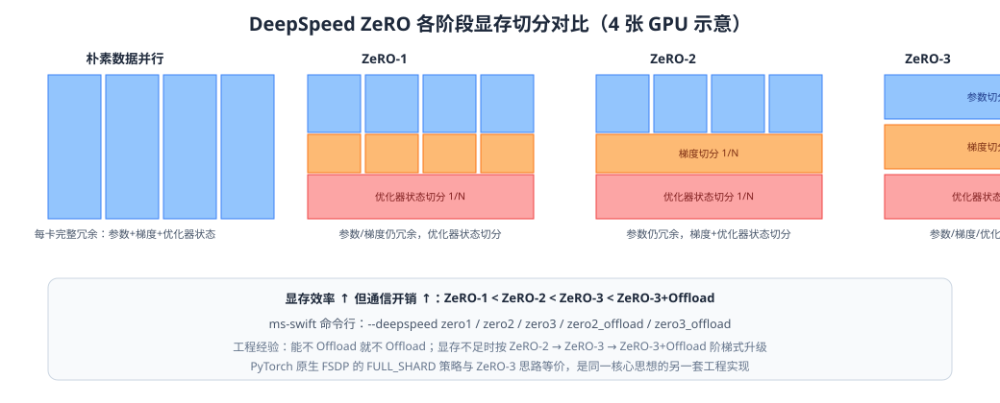

*图 10-1：朴素数据并行与 ZeRO-1/2/3 在参数、梯度、优化器状态三类冗余状态切分程度上的递进对比，切分越彻底、单卡显存占用越低，但通信开销也随之上升。*

### 10.3 全分片数据并行 FSDP

PyTorch 原生的 **FSDP（Fully Sharded Data Parallel）**与 DeepSpeed ZeRO-3 思路高度相似（同样是参数、梯度、优化器状态全切分），二者可以看作是同一核心思想的两套独立工程实现（DeepSpeed 是微软主导的第三方库，FSDP 是 PyTorch 官方原生支持），在功能特性、性能表现上各有优劣势，且随着版本演进两者的差距在不断缩小。ms-swift 同时支持两种后端（`--deepspeed` 与 `--fsdp` 系列参数），便于工程师根据自身软硬件环境、既有基础设施依赖（如是否已有成熟的 DeepSpeed 部署经验）灵活选择，也便于做横向性能对比。

### 10.4 张量并行、流水线并行与 Megatron-SWIFT

当模型规模进一步扩大（数千亿参数级），仅靠数据并行/ZeRO 切分显存已不足以应对单层参数矩阵本身过大（如超大词表 Embedding、超宽 FFN 层）带来的显存压力，或通信开销已成为主要瓶颈，此时需要引入**模型并行**技术：

- **张量并行（Tensor Parallelism, TP）**：将单个权重矩阵按行或列切分到不同 GPU 上，每张卡只计算矩阵乘法的一部分，通过精心设计的通信原语（All-Reduce/All-Gather）在层内完成结果同步，典型实现是 NVIDIA Megatron-LM 提出的针对 Transformer Attention/FFN 的切分方案。
- **流水线并行（Pipeline Parallelism, PP）**：将模型按层切分为若干"阶段"（Stage），分别部署在不同 GPU（组）上，通过将一个大 batch 切分为多个 micro-batch 以流水线方式送入不同阶段，减少"阶段间等待"造成的气泡（Bubble）开销。
- **上下文并行 / 序列并行（Context Parallelism, CP / Sequence Parallelism, SP）**：针对超长序列训练场景，将单条序列本身切分到不同 GPU 上分别计算注意力的不同片段，是应对长文档、长代码库等超长上下文训练显存瓶颈的关键技术。

**Megatron-SWIFT** 是 ms-swift 项目中专门对接 NVIDIA Megatron-LM / Megatron-Core 的子模块，为超大规模（尤其是 MoE 混合专家架构，如 DeepSeek 系列、Qwen3 的 MoE 变体）模型提供张量并行、流水线并行、专家并行（Expert Parallelism, EP，MoE 模型特有）、上下文并行等全套并行策略的原生支持，并通过 `mcore-bridge` 等配套工具实现 HuggingFace 格式权重与 Megatron-Core 内部权重格式之间的双向转换，使得"用 ms-swift 常规接口训练的模型"与"用 Megatron-SWIFT 超大规模并行训练的模型"能够在同一生态内无缝流转（例如先用标准接口在小规模上验证数据/超参数配置，再切换到 Megatron-SWIFT 做大规模训练）。根据本报告调研到的 Release 信息，Megatron-SWIFT 已扩展支持 FP8 训练、多种 MoE 路由负载均衡策略的组合配置、以及针对超长序列的上下文并行覆盖到 Embedding、生成式重排序（generative reranker）、序列分类、奖励模型等更多任务类型，反映出该子模块正从"支持基础 CPT/SFT"向"覆盖全训练范式的大规模并行基础设施"演进。

### 10.5 并行策略选型的工程经验

| 模型规模 | 推荐策略组合 |
| --- | --- |
| ≤ 7B，单卡可容纳 | 单卡 LoRA/QLoRA，或多卡数据并行 |
| 7B~30B，全参数微调 | ZeRO-2/3 或 FSDP（视通信带宽选择是否 Offload） |
| 30B~100B+ | ZeRO-3 + Offload，或引入张量并行（Megatron-SWIFT） |
| 100B+ 稠密模型 / MoE 模型 | Megatron-SWIFT：张量并行 + 流水线并行 +（MoE场景）专家并行，必要时叠加上下文并行处理长序列 |
| 超长序列（无论模型规模） | 上下文并行 / 序列并行 + Flash Attention 变长支持 |

需要强调的是，并行策略的选择不是单一维度的"越大越好"，而是需要综合考虑通信带宽（如是否有 NVLink/InfiniBand 高速互联）、显存容量、目标训练吞吐等多重约束做联合优化，这也是 Megatron-LM 类框架的配置参数（如 `tensor_model_parallel_size`、`pipeline_model_parallel_size`）往往需要结合具体集群拓扑反复调优的原因，属于大规模训练工程中较为专业、经验依赖性较强的领域。

---

## 第十一章 ms-swift 框架总览：架构、设计哲学与代码地图

### 11.1 项目定位

ms-swift（Scalable lightWeight Infrastructure for Fine-Tuning）是阿里巴巴 ModelScope 团队开源的大模型训练与推理一体化框架，其 README 明确定位为"使用 PEFT 或全参数的方式对 600+ LLM 与 300+ MLLM 进行 CPT/SFT/DPO/GRPO 等训练"，并有对应的 AAAI 2025 论文/技术报告作为学术支撑。该项目与另一 ModelScope 生态项目 EvalScope（评测）、以及底层依赖的 ModelScope Hub（模型/数据集托管，是 HuggingFace Hub 的国内替代/补充生态）共同构成了一套相对完整的"训练-评测-托管"闭环。

从功能覆盖面看，ms-swift 同时支持：

- **训练范式**：预训练（CPT/PT）、有监督微调（SFT）、人类反馈强化学习/偏好优化（RLHF，涵盖 DPO/KTO/PPO/GRPO/ORPO/SimPO 等具体算法）、Embedding 模型训练、Reranker（含生成式重排序）训练、序列分类任务训练、奖励模型（Reward Model）训练。
- **微调方式**：全参数（Full）与十余种 PEFT 方法（LoRA 及其家族、Adapter、Prefix、IA3、BOFT、FourierFT、ReFT、LLaMA-Pro、LongLoRA 等，见第七、八章）。
- **模型类型**：纯文本 LLM 与多模态 MLLM（图像/视频/音频），以及近期版本新增支持的扩散语言模型（DLLM，如 DiffusionGemma）、语音/TTS 模型（Qwen3-TTS）等更前沿的模型形态。
- **分布式后端**：原生 PyTorch DDP、DeepSpeed（ZeRO 1/2/3 及 Offload）、FSDP、以及面向超大规模/MoE 场景的 Megatron-SWIFT。
- **全生命周期工具链**：数据处理、训练、推理（`swift infer`，支持 transformers/vLLM/SGLang/LMDeploy 等多种推理后端）、评测（对接 EvalScope）、导出（`swift export`，含 LoRA 合并、量化导出）、部署（`swift deploy`，OpenAI 兼容 API 服务）、以及基于 Gradio 的零代码 Web-UI。

### 11.2 顶层代码地图

结合 ms-swift 公开的仓库目录结构、DeepWiki 技术文档梳理以及社区源码分析文章的交叉印证，其核心代码组织大致如下（目录/模块名以调研时可获得的信息为准，具体文件可能随版本演进有所调整）：

```
ms-swift/
├── swift/
│   ├── cli/                  # 命令行入口层：sft.py / infer.py / rlhf.py / export.py / deploy.py / eval.py / app.py 等
│   │                          # 每个文件仅做参数解析转发，真正的业务逻辑在 swift/llm 与 swift/megatron 下
│   ├── llm/
│   │   ├── train/            # 训练主流程：sft.py（SwiftSft 类）、rlhf.py、pt.py 等，串联 数据+模板+Tuner+Trainer
│   │   ├── template/         # 对话模板体系：Template 基类与各模型家族的模板注册（见第四章）
│   │   ├── dataset/          # 数据集加载、预处理、注册机制（register_dataset / DatasetMeta）
│   │   ├── model/            # 模型加载、ModelMeta 注册、模型与模板/量化方式的自动绑定关系
│   │   ├── argument/         # 参数体系：TrainArguments / SftArguments / RLHFArguments 等 dataclass 定义
│   │   ├── infer/             # 推理相关：transformers/vLLM/SGLang/LMDeploy 等后端适配
│   │   └── utils/             # 通用工具
│   ├── trainers/              # 对 HuggingFace Transformers Trainer / TRL Trainer 的封装与混入（Mixin）
│   │   ├── mixin.py            # TrainerMixin：注入 swift 特有的日志、保存、loss 计算等行为
│   │   ├── trainers.py         # 具体 Trainer 子类（Seq2SeqTrainer 封装等）
│   │   └── rlhf_trainer/       # DPO/KTO/PPO/GRPO 等 RLHF Trainer（部分对接/魔改自 TRL 库）
│   ├── tuners/                 # Tuner 体系：对 PEFT 库的封装 + ms-swift 自研 Tuner（LLaMA-Pro/LongLoRA 等）
│   │   └── Swift.prepare_model() 是核心入口，负责将 Tuner Config 注入基座模型，返回 SwiftModel 包装对象
│   ├── plugin/                  # 插件体系：loss_scale（第二章提及）、metric、callback、optimizer 等可插拔组件
│   ├── megatron/                # Megatron-SWIFT：对接 Megatron-Core 的训练器（trainers/base.py 等）
│   └── ui/                      # Web-UI（Gradio）
├── examples/                    # 海量开箱即用的训练脚本示例，按模型/任务/技术点分类组织
│   ├── models/                  # 按具体模型（Qwen3、GLM、Gemma4...）组织的最佳实践脚本
│   ├── megatron/                # Megatron-SWIFT 专项示例（含 FP8+LoRA 组合等）
│   └── train/                   # 通用训练技巧示例（packing、multi-node、lora 变体等）
└── docs/
    ├── source/                  # 中文文档
    └── source_en/                # 英文文档
```

### 11.3 分层设计哲学

从上述代码地图可以归纳出 ms-swift 的几条核心设计原则：

1. **CLI 层与业务逻辑层严格分离**：`swift/cli/*.py` 极薄，仅负责参数解析与转发到 `swift/llm/train/*.py` 中的 `xxx_main()` 函数，这种设计使得同样的训练能力既可以通过命令行调用，也可以通过 Python API（`from swift.llm import sft_main, TrainArguments`）以编程方式调用，便于集成进更大的 MLOps 流水线或 Notebook 交互式实验。
2. **参数体系以 dataclass 为核心、分层继承**：不同训练范式（SFT/RLHF/PT）的参数类通过继承复用公共基类（如通用的模型加载参数、数据集参数、Transformers `Seq2SeqTrainingArguments` 透传参数），特定范式再扩展自己独有的参数（如 RLHF 特有的 `beta`、`ref_model`），这种"基类共享 + 子类扩展"的组织方式既避免了重复定义，又保证了同一套数据/模型/模板基础设施可以被所有训练范式复用。
3. **Template、Tuner、Trainer 三大核心组件均支持插件式扩展**：新增一个模型的对话模板、新增一种 PEFT 方法、新增一种训练算法的 Trainer，理论上都可以通过"注册（register）"机制以插件形式接入，而不需要改动框架核心代码，这是该类框架能够快速跟进社区新模型、新算法（如新发布的 Qwen3.x、GLM-5.x 系列几乎第一时间被纳入支持列表）的架构基础。
4. **训练与推理复用同一套 Template/量化基础设施**：这是保证"训练时的数据拼接方式"与"推理时的数据拼接方式"严格一致（呼应第四章提到的 Train-Inference Template Mismatch 问题）的关键架构选择——`swift infer` 命令与 `swift sft` 命令共享同一个 `Template` 类实现，从根本上杜绝了"两套独立维护的模板代码逐渐漂移不一致"的风险。
5. **Megatron-SWIFT 作为独立但接口对齐的子系统**：面向超大规模训练的 Megatron-SWIFT 并非简单复用标准 Trainer，而是维护了一套独立的 `swift/megatron/trainers` 体系（如 `BaseMegatronTrainer` 抽象基类），但在命令行层面通过 `megatron sft`（而非 `swift sft`）暴露给用户，并尽量保持与标准 `swift sft` 相似的参数命名与使用习惯（如同样支持 `--tuner_type lora`），降低用户在"常规规模训练"与"超大规模训练"两种模式之间切换的学习成本。

### 11.4 与上游生态的关系

理解 ms-swift 的一个重要视角是：它并非从零实现所有底层能力，而是**在 HuggingFace Transformers、PEFT、TRL、DeepSpeed、PyTorch（FSDP）、Megatron-LM/Megatron-Core、vLLM/SGLang/LMDeploy 等成熟开源生态之上构建统一的编排层**，其核心增量价值体现在：

- **模型/数据集适配的广度**：为数百个模型家族预先适配好了对话模板、量化方式、多模态数据处理逻辑，用户无需自行处理这些高度琐碎且容易出错的细节。
- **训练范式的统一编排**：CPT/SFT/RLHF/Embedding/Reranker 等原本可能需要接入不同专门库（如 RLHF 训练常用 TRL，但 TRL 本身对模型适配广度、多模态支持、国产模型生态支持相对有限）才能完成的任务，被统一到同一套命令行与参数体系下。
- **本土化生态对接**：与 ModelScope Hub（模型/数据集下载）、EvalScope（评测）等国内生态深度集成，同时保留了对 HuggingFace 生态（`--use_hf true`）的兼容，是面向中文用户与国产大模型（Qwen、GLM、InternLM、Baichuan 等系列几乎在发布首日即被纳入支持）生态友好度最高的开源训练框架之一。
- **工程细节的持续打磨**：包括前述的 Loss Scale 插件体系、Packing 高效实现、多模态特化参数（`vit_lr`/`aligner_lr`/`freeze_vit`）等，这些"魔鬼在细节中"的工程能力，是决定一个训练框架在真实生产场景中是否好用的关键，也是本报告后续章节重点解析的对象。

---

## 第十二章 ms-swift 参数体系深度解析

### 12.1 参数分层与命名演进

ms-swift 的命令行参数在项目演进过程中经历过若干次重要的命名调整，理解这些调整有助于读者在阅读不同时期的文档/博客/脚本时不产生混淆：

- **微调类型参数**：早期版本（2.x 及更早）使用 `--sft_type`（可选 `lora`/`full`/`longlora`/`adalora`/`ia3`/`llamapro`/`adapter`/`vera`/`boft`/`fourierft`/`reft` 等），3.x 版本起统一更名为 `--train_type`，语义不变；而在更新的接口/文档片段中，也观察到以 `--tuner_type` 命名出现（与 `--train_type` 并存或替代关系），提示读者应以自己实际安装版本的帮助信息为准。
- **LoRA 目标模块参数**：早期为 `--lora_target_modules`，后统一简化为通用的 `--target_modules`（不再局限于 LoRA，其余 Tuner 同样复用该参数名），默认值在多模态场景与纯文本场景下有不同的智能推断逻辑（`all-linear` 快捷值的具体展开范围会区分是否包含视觉/对齐模块）。
- **量化位宽参数**：从早期的 `--quantization_bit` 演进为更明确的 `--quant_bits` / `--quant_method`（区分量化位宽与量化算法后端，如 bnb/awq/gptq/hqq）。
- **数据集采样后缀语法**：`--dataset` 支持形如 `AI-ModelScope/alpaca-gpt4-data-zh#500` 的写法，`#500` 表示从该数据集中采样 500 条，这种"数据集路径+采样数量"内联语法贯穿了 ms-swift 各版本，是其数据集参数设计中较为稳定、也颇具辨识度的一个特性，便于用户在命令行一行内完成"多数据源、按比例混合采样"的配置，无需额外编写数据混合脚本。

### 12.2 核心参数分类速览

结合调研到的官方文档片段，可将 ms-swift 训练相关的核心参数归纳为以下几大类：

**（1）模型与模板类**
- `--model`：模型 ID（ModelScope/HuggingFace Hub）或本地路径。
- `--template`：显式指定对话模板（不指定则根据 `--model` 自动推断）。
- `--system`：覆盖/追加默认 system prompt。
- `--model_author` / `--model_name`：配合 `swift/self-cognition` 数据集使用，动态替换自我认知数据模板中的占位符。
- `--use_hf`：是否使用 HuggingFace 生态（默认使用 ModelScope）。
- `--check_model` / `--model_kwargs`：模型完整性校验开关、模型专属额外参数（JSON 格式透传，如多模态的 `fps_max_frames`）。

**（2）数据集类**
- `--dataset`：支持多个数据源、内联采样数量、本地/远程路径混合传入。
- `--streaming`：是否使用流式（IterableDataset）加载，适合超大规模预训练数据（配合 `swift pt` 常用）。
- `--max_length`：单条样本的最大 token 长度，超长部分按截断策略处理。
- `--truncation_strategy`：截断策略（如 `delete` 丢弃整条超长样本，或从左截断）。
- `--packing`：是否启用序列打包（详见第十四章）。
- `--dataloader_num_workers`：数据加载并行进程数。

**（3）微调方式类**
- `--train_type`（或 `--tuner_type`）：`full` / `lora` / `longlora` / `adalora` / `llamapro` / `adapter` / `vera` / `boft` / `fourierft` / `reft` 等。
- `--target_modules`：LoRA 等 Tuner 的作用模块，`all-linear` 为快捷全覆盖选项。
- `--lora_rank` / `--lora_alpha` / `--lora_dropout`：标准 LoRA 三大超参。
- `--use_dora` / `--use_rslora`：DoRA / rsLoRA 开关。
- `--init_weights`：LoRA 初始化策略（`true`/`false`/`gaussian`/`pissa`/`pissa_niter_[n]` 等）。
- `--modules_to_save`：额外参与全量训练/保存的模块（如 `EMBEDDING`、`LN`、`lm_head`）。
- `--freeze_parameters`：全参数训练时按前缀冻结指定层。
- `--adapters`：加载已有 adapter 权重（用于续训、或作为 RLHF 阶段初始化）。

**（4）量化类**（详见第十六章）
- `--quant_method` / `--quant_bits`：量化后端与位宽（QLoRA 场景常用 `bnb` + `4`）。

**（5）优化与调度类**
- `--learning_rate`：全参数默认 `1e-5`，LoRA 等 PEFT 默认 `1e-4`。
- `--vit_lr` / `--aligner_lr`：多模态模型视觉编码器/对齐模块的独立学习率。
- `--lr_scheduler_type`：默认 `cosine`，支持 `cosine_with_min_lr` 等变体。
- `--warmup_ratio`：学习率预热比例。
- `--weight_decay` / `--adam_beta1` / `--adam_beta2` / `--adam_epsilon`：AdamW 超参。
- `--gradient_accumulation_steps`：梯度累积步数（在 CPT/SFT 中与增大 batch size 效果等价，但在 RLHF 训练中不完全等价，文档中特别提示了这一点，因为 RLHF 场景下同一 batch 内样本间的相对关系——如 DPO 的 chosen/rejected 配对、GRPO 的组内相对优势——对 batch 构造方式更敏感）。
- `--max_grad_norm`：梯度裁剪阈值。
- `--neftune_noise_alpha`：NEFTune 噪声强度。

**（6）训练流程与工程类**
- `--output_dir`：输出目录，默认自动生成 `output/<model_name>/<version-时间戳>` 形式的子目录。
- `--gradient_checkpointing` / `--vit_gradient_checkpointing`：梯度检查点开关。
- `--deepspeed`：DeepSpeed 预设配置（`zero1`/`zero2`/`zero3`/`zero2_offload`/`zero3_offload`）。
- `--num_train_epochs` / `--max_steps`：训练轮数/最大步数。
- `--eval_steps` / `--save_steps` / `--save_total_limit` / `--logging_steps`：评估、保存、日志频率控制。
- `--resume_from_checkpoint`：从检查点恢复训练（含优化器状态、随机种子、已训练数据进度）。
- `--full_determinism`：固定所有随机性来源，用于严格复现实验（会牺牲部分训练速度）。
- `--attn_impl`：注意力实现后端（`flash_attn`/`sdpa`/`eager`）。

**（7）多模态特化类**（详见第十七章）
- `--freeze_vit` / `--freeze_aligner`：是否冻结视觉编码器/对齐模块。
- `--vit_lr` / `--aligner_lr`：前述已提及。

**（8）RLHF 特化类**（延伸提及，便于理解 SFT-RLHF 的参数复用关系）
- `--rlhf_type`：`dpo`/`kto`/`ppo`/`grpo`/`orpo`/`simpo` 等。
- `--ref_model` / `--ref_adapters`：参考模型及其 adapter，支持直接复用 SFT 阶段产出的 LoRA 权重作为 DPO/GRPO 的参考模型初始化（`--adapters sft_ckpt --ref_adapters sft_ckpt`），体现了 SFT 与 RLHF 阶段权重资产的复用设计。
- `--beta`：偏好优化中控制"偏离参考模型程度"的核心超参数。

### 12.3 参数默认值背后的工程经验

值得注意的是几处默认值设计体现了社区长期实践积累的经验：

1. **`learning_rate` 因训练类型而异（全参数 `1e-5` vs LoRA `1e-4`）**：这一差异并非随意设置，而是反映了两种训练方式对学习率敏感度的本质不同——全参数训练由于更新的是全部预训练权重，过大的学习率容易直接破坏预训练知识；而 LoRA 由于是从零初始化的新增分支（且有 $\alpha/r$ 缩放因子进一步"稀释"实际更新幅度），需要相对更大的名义学习率才能在有限训练步数内充分收敛。
2. **`gradient_checkpointing` 默认开启**：反映了"默认场景下显存往往是瓶颈、训练速度可以适度让步"这一实用主义倾向，工程师可以在显存充裕时显式关闭以换取速度。
3. **多模态学习率的分离设计（`vit_lr`/`aligner_lr` 独立于 `learning_rate`）**：反映了视觉编码器（通常已经过大规模图文对比学习预训练，特征已相对成熟稳定）与语言模型主干（在 SFT 阶段需要更大幅度调整以适配新任务）在训练动态上的显著差异，如果统一使用同一学习率，容易出现"语言模型收敛不足、视觉编码器却被过度更新破坏原有视觉特征"的失衡状况，这是多模态大模型训练区别于纯文本 LLM 训练的一个重要工程细节。

---

## 第十三章 ms-swift SFT 全链路源码级解析：从 `swift sft` 到 `trainer.train()`

本章尝试还原 ms-swift 执行一次 `swift sft` 命令时的完整调用链路，帮助读者建立"命令行参数如何一步步转化为实际的模型前向/反向传播"的整体心智模型。该调用链路综合了官方 DeepWiki 技术文档梳理与社区源码分析文章的交叉印证。

### 13.1 完整调用链概览

```
用户执行:  swift sft --model Qwen/Qwen3-8B --train_type lora --dataset ... --output_dir output

  ① swift（console-script 可执行入口，由 setup.py 中的 entry_points 注册）
        │
  ② swift/cli/sft.py            —— CLI 子命令入口：解析 sys.argv，调用 sft_main()
        │
  ③ sft_main()  (swift/llm/train/sft.py)
        │        —— 顶层函数：接收 / 解析为 TrainArguments（或 SftArguments）dataclass 实例
        │        —— 内部 return SwiftSft(args).main()
        │
  ④ class SwiftSft(SwiftPipeline, TunerMixin):
        │        —— SwiftPipeline：训练/推理等各类 Pipeline 的公共基类，定义 main() 的标准生命周期
        │        —— TunerMixin：混入 Tuner 相关能力（准备/加载/保存 PEFT 权重等）
        │
        ├── self.main()
        │       ├── 加载 tokenizer / 模型（依据 --model 与 ModelMeta 自动匹配模型实现与量化方式）
        │       ├── 依据模型自动匹配 / 用户显式指定的 Template 实例化对话模板
        │       ├── 通过 Swift.prepare_model() 将 Tuner（LoRA/AdaLoRA/...或全参数配置）注入模型，
        │       │     得到 SwiftModel 包装对象（冻结/解冻相应参数，注册可训练模块）
        │       ├── 加载并预处理数据集（dataset 注册机制 → 标准化为 messages → Template.encode
        │       │     → 生成 input_ids / labels / attention_mask，可选执行 Packing）
        │       ├── 构造 DataCollator（负责 batch 内 padding、labels 对齐、多模态张量整理等）
        │       ├── 构造 Trainer（swift/trainers 下对 HF Seq2SeqTrainer 的封装子类，
        │       │     通过 TrainerMixin 注入 swift 特有的日志、保存、loss_scale 应用逻辑）
        │       └── self.run() → self.train(trainer)
        │
  ⑤ self.train(trainer)
        │        —— 调用 trainer.train(resume_from_checkpoint=...)
        │
  ⑥ trainer.train(...)   (来自 swift/trainers/trainers.py 中继承自 transformers.Seq2SeqTrainer 的类，
        │                  经 swift/trainers/mixin.py 中的 Mixin 类混入 swift 定制行为)
        │        —— 实际执行 HuggingFace Transformers 标准训练循环：
        │             for epoch in range(num_train_epochs):
        │               for batch in dataloader:
        │                 outputs = model(**batch)          # 前向传播，模型内部按 labels 计算交叉熵损失
        │                 loss = outputs.loss                # 若使用自定义 loss_scale，
        │                                                      #   则在 compute_loss 钩子中按 token 权重重新加权
        │                 loss.backward()                     # 反向传播（结合 DeepSpeed/FSDP 的分布式实现）
        │                 optimizer.step(); scheduler.step()  # 参数更新
        │             —— 周期性触发 evaluate()（若配置了 --eval_steps）与 save_checkpoint()
        │
  ⑦ 训练结束后，SwiftSft.main() further 调用保存逻辑：
        │        —— 保存最终 adapter 权重（PEFT 场景，通常仅几十~几百MB）或全量权重（Full 场景）
        │        —— 保存 args.json（记录本次训练的完整参数配置，供后续 `swift infer`/`swift export`
        │             自动读取，无需用户重复指定 --model/--system 等参数）
```

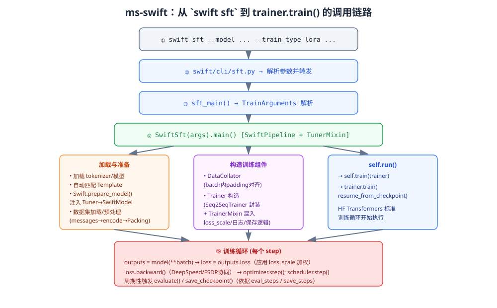

*图 13-1：`swift sft` 命令从 CLI 入口到训练循环执行的完整调用链路，虚线框展示了 `SwiftSft.main()` 内部"加载与准备 → 构造训练组件 → 启动训练循环"三个关键阶段的具体职责划分。*

### 13.2 关键设计点解读

**（1）`SwiftPipeline` 的生命周期抽象**：ms-swift 将"训练""推理""导出""部署"等不同命令行子命令，统一抽象为若干个共享 `main() → run()` 标准生命周期的 Pipeline 子类（如 `SwiftSft`、`SwiftInfer`、`SwiftExport`），每个 Pipeline 只需重写各自差异化的 `run()`/`train()`/`infer()` 等钩子方法，公共的参数解析、模型/模板加载逻辑则在基类中统一实现，避免各子命令各自为政、重复代码。这是一种典型的模板方法模式（Template Method Pattern）在训练框架架构设计中的应用。

**（2）`TunerMixin` 的职责边界**：Tuner 相关能力（如何根据 `--train_type` 构造对应的 PEFT Config、如何调用 `Swift.prepare_model()` 完成注入、训练结束后如何正确保存/合并权重）被抽离为独立的 Mixin 类，通过多重继承（`class SwiftSft(SwiftPipeline, TunerMixin)`）组合进具体 Pipeline，使得"训练流程编排"与"Tuner 具体实现细节"在代码组织上解耦，Tuner 体系的新增/修改不需要触碰 Pipeline 主干逻辑。

**（3）`swift/trainers/mixin.py` 对 HuggingFace Trainer 的"无侵入式增强"**：ms-swift 没有选择完全重写训练循环（这将带来巨大的维护成本、且难以及时跟进 Transformers 库本身的持续优化——如新的分布式后端支持、新的性能优化），而是选择通过 Mixin（混入类）的方式在 HuggingFace `Seq2SeqTrainer` 基础上"打补丁"式地注入 swift 特有的行为，例如：
   - 重写 `compute_loss`，在标准交叉熵基础上应用 `loss_scale` 插件计算出的 token 级权重；
   - 重写日志记录逻辑，输出更符合 ms-swift 用户习惯的训练进度信息（如同时展示当前学习率、已训练 token 数、剩余时间预估等）；
   - 重写保存逻辑，针对 PEFT 场景只保存 adapter 权重而非完整模型，针对多模态场景正确处理视觉编码器权重的保存/冻结状态。

   这种"依托上游生态、最小化侵入式扩展"的实现策略，是 ms-swift 能够以相对精简的自身代码库支撑起如此广泛的模型/训练范式覆盖的核心工程秘诀，也是众多同类国产训练框架（不仅限于 ms-swift）普遍采用的架构范式。

**（4）数据到模型输入的转换发生在 Dataset 预处理阶段而非 Collator 阶段**：即 `Template.encode` 在数据加载/预处理阶段就已经把原始的 `messages` 转换为 `input_ids`/`labels`，而不是延迟到 DataCollator 阶段才做（部分早期/简化实现框架会把这一步放在 Collator 里，导致每个 epoch 都要重复做模板拼接的字符串处理，效率较低）。ms-swift 将模板编码提前到 Dataset 层完成，使得该结果可以被 `datasets` 库的缓存机制、以及 `--streaming` 模式下的懒加载迭代器复用，是兼顾正确性与性能的工程选择；DataCollator 层则只负责相对轻量的 batch 内 padding 对齐操作。

### 13.3 与 Megatron-SWIFT 调用链的差异

对于超大规模训练场景，用户使用的是 `megatron sft` 而非 `swift sft` 命令，其底层调用链在"模型加载""并行策略初始化""数据分片""损失计算"等环节均有独立实现（`swift/megatron/trainers/base.py` 中的 `BaseMegatronTrainer` 作为抽象基类，覆盖 SFT 与 RLHF 两类场景）。一个值得关注的细节是：Megatron-SWIFT 内部使用 `get_packed_seq_params`（位于 `swift/megatron/trainers/utils.py`）来支持所谓的 **"thd" 格式的无填充（Padding-Free）训练**——即把一个 batch 内多条变长序列首尾相接打包为一条长序列（"thd" 指 total-tokens/heads/dim 的张量排布方式，是 Flash Attention 变长接口所使用的数据格式），彻底消除 padding token 带来的算力浪费，这与第十四章将详细展开的标准 `swift sft`（非 Megatron 路径）中的 Packing 实现在目标上是一致的，但具体的张量排布与底层 Kernel 依赖有所不同，体现了不同并行策略层级下"消除 padding 浪费"这一优化目标的不同工程实现路径。

---

## 第十四章 ms-swift 中的 Packing、损失掩码与序列级效率优化

### 14.1 Packing 的动机回顾

如第二章末尾所述，指令微调数据的长度分布往往高度离散（有的对话仅几十 token，有的长达数千 token），如果按传统方式对每个 batch 做 padding 对齐到 batch 内最大长度，短样本会被大量无效的 padding token 填充，这些 padding token 虽然不贡献损失，但仍然要参与前向/反向传播的矩阵运算（除非使用特殊的变长注意力实现），造成显著的算力浪费。Packing 技术通过把多条样本首尾拼接成接近 `max_length` 的长序列，从根本上消除了这种浪费。

### 14.2 Packing 的正确性前提：序列边界隔离

Packing 面临的核心工程挑战是：**必须保证被拼接在一起的不同样本之间，在 Attention 计算与位置编码上互不"串扰"**，否则等价于错误地把多条独立样本当作了一条有因果依赖关系的长对话，会污染训练信号、损害模型效果。实现这一隔离通常依赖两个机制的协同：

1. **块对角注意力掩码（Block-Diagonal Attention Mask）**：在拼接后的长序列中，每条原始样本对应一个"块"，Attention 计算时通过掩码强制每个 token 只能看到"同一块内、且在自己之前"的 token（因果 + 块内隔离），跨块的注意力得分被置为 $-\infty$（softmax 后趋于 0）。在使用 Flash Attention 的场景下，这一逻辑通常通过其专门的**变长序列接口**（如 `flash_attn_varlen_func`，需要传入 `cu_seqlens`——即每个子序列在拼接后长序列中的累积起止位置）高效实现，避免显式构造和存储一个巨大的 $T \times T$ 稠密掩码矩阵（这本身也会消耗大量显存，抵消 Packing 节省的收益）。
2. **位置编码重置（Position IDs Reset）**：每条子序列的 `position_ids` 应从 0（或模型约定的起始位置）重新开始编号，而不是随拼接后的全局位置连续递增，否则会给模型传递错误的相对位置信息（尤其是使用 RoPE 等相对位置编码的模型，位置错乱会直接影响注意力得分的计算）。

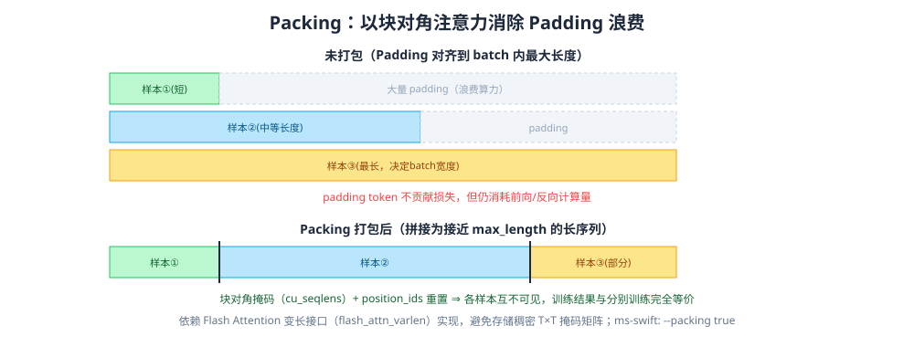

*图 14-1：未打包场景下短样本产生大量无效 padding；Packing 将多条样本拼接为接近 max_length 的长序列，配合块对角注意力掩码与位置编码重置，在数学上等价于分别训练，同时消除 padding 浪费。*

### 14.3 损失掩码与 Packing 的组合

Packing 不改变第二章所述的损失掩码逻辑本身——每条被打包进长序列的样本，其内部依然遵循"仅在 assistant 回复 token 上标签为真实 token id，其余位置标签为 -100（或对应 loss_scale 权重为 0）"的规则；Packing 只是在"序列拼接"这一层面做了优化，损失计算依然是在拼接后的长序列上、按位置索引精确匹配到每个原始样本自己的标签区间进行。因此 Packing 在数学上是**训练无损**的（前提是注意力隔离与位置重置正确实现），它改变的只是"计算效率"而非"训练目标"。

### 14.4 ms-swift 中 Packing 的工程实现要点

- **命令行开关**：通过 `--packing true` 启用，通常还需要配合选择合适的 `--max_length` 作为打包的目标长度上限（过大会增加显存峰值压力，过小则降低打包收益）。
- **依赖 Flash Attention 的变长接口**：Packing 训练要获得完整的效率收益，通常要求底层 Attention 实现（`--attn_impl flash_attn`）支持变长序列接口，若退化到朴素 `eager` 实现，则需要显式构造块对角掩码矩阵，效率提升会打折扣（甚至因为掩码矩阵本身的显存开销而在某些场景下得不偿失）。
- **动态打包策略**：具体打包算法（如何决定哪些样本拼接在一起以尽量减少"填不满"造成的剩余空隙）通常采用贪心装箱（Bin Packing）思路的近似算法（如"最先适应/最佳适应"变体），在数据预处理阶段一次性完成打包分组，而不是在每个训练 step 动态重新打包（后者会带来额外的运行时开销，且不利于结合数据缓存机制）。
- **与 Megatron-SWIFT "thd" 格式的呼应**：前一章提到的 `get_packed_seq_params` 正是 Megatron-SWIFT 场景下对同一思想的实现，二者共享"用 `cu_seqlens` 描述拼接边界、依赖底层 Kernel 的变长接口消除 padding"这一核心技术范式，只是分别服务于标准 Trainer 路径与 Megatron 并行路径。

### 14.5 Packing 对超参数选择的连带影响

启用 Packing 后，由于每个"样本"（此时实际上是一条打包后的长序列）所包含的有效训练样本数远多于未打包场景，`--per_device_train_batch_size` 通常需要相应调低（因为单条打包序列本身已经承载了多条原始样本的信息量），同时由于每个 step 处理的有效数据量增大，达到相同"有效训练轮数（epoch）"所需的 step 数会相应减少，工程师在启用 Packing 前后对比训练配置时需要注意这一联动关系，避免简单套用未打包场景下调好的超参数导致训练不足或过拟合。

### 14.6 多模态场景下 Packing 的额外复杂度

对图文混合数据做 Packing 时，还需要额外处理图像 token 与文本 token 混排后的位置编码一致性问题（部分多模态模型使用二维/三维 RoPE 处理图像的空间位置信息，如 Qwen2-VL 系列的 M-RoPE），以及不同样本携带的图像张量（`pixel_values`）如何在打包后的 batch 维度上正确拼接与索引回原始所属样本，这部分实现复杂度显著高于纯文本场景，也是多模态训练框架相较纯文本框架工程量陡增的一个典型体现。

---

## 第十五章 ms-swift 的 Tuner 体系实现：PEFT 集成与自研 Tuner

### 15.1 `Swift.prepare_model()`：统一的 Tuner 注入入口

无论用户通过命令行选择哪一种 `--train_type`，其底层都会归约到同一个核心 API：`Swift.prepare_model(model, config, ...)`。该函数接收一个已加载的 `torch.nn.Module`（基座模型）与一个 Tuner 配置对象（`LoRAConfig`、`AdaLoraConfig`、全参数场景下可能对应一个"空配置"或直接跳过注入），返回一个 `SwiftModel` 包装对象——这一包装对象在推理/前向接口上与原始 `nn.Module` 完全兼容（保证上层训练循环代码无需感知底层是否使用了 PEFT），但内部已经完成了"冻结哪些参数""新增哪些可训练模块""如何在 `state_dict()` 中区分基座权重与新增权重以便分别保存"等一系列职责。

### 15.2 对 PEFT 库的复用与扩展

对于 LoRA、AdaLoRA、IA3、Prefix-Tuning 等在 HuggingFace `peft` 库中已有成熟实现的方法，ms-swift 采用的策略是**直接复用 `peft` 库的底层 Config/Model 实现，自身只负责参数体系到 `peft.Config` 字段的映射转换、以及与自身 Template/Trainer 体系的对接**，这一策略的好处是可以直接享受 `peft` 库上游社区的持续维护与 bug 修复（`peft` 是 HuggingFace 官方维护、社区贡献者众多的成熟库），避免"重复造轮子"导致的维护负担与实现差异风险。前述 PyPI 文档片段中展示的 `from swift import Swift, LoRAConfig; model = Swift.prepare_model(model, config, ...)` 用法，清晰印证了这一"瘦封装、复用底层实现"的设计选择。

### 15.3 自研 Tuner：处理 PEFT 库未覆盖的方法

对于 LLaMA-Pro（块扩展，涉及对模型结构本身的修改——插入新的 Transformer 层，这已超出标准 PEFT 库"只在现有层上挂载适配模块"的范式）、LongLoRA（涉及训练阶段替换注意力计算逻辑为 S²-Attn）、LISA（涉及训练过程中动态切换哪些层参与梯度更新，需要与 Trainer 的训练循环深度配合）等结构性改动更大、或需要与训练循环深度耦合的方法，ms-swift 在自身的 `swift/tuners` 目录下提供了自研实现，这部分代码与标准 `peft` 库的 Config/Model 抽象保持接口层面的一致性（同样通过 `Swift.prepare_model()` 统一入口调用），但底层实现是 ms-swift 团队针对相应论文自行开发、维护的。这也是为什么某些较新或较冷门的 PEFT 变体（如本报告第七章提及的 LoRA-GA、GaLore）尚未被 ms-swift 原生收录——自研 Tuner 的接入需要投入专门的工程实现与验证成本，框架的方法覆盖广度天然滞后于学术论文的发表速度，这是所有工程框架相对学术前沿存在的正常"时间差"，也是本报告建议读者在使用框架内置方法之外、仍需持续关注一手论文与官方参考实现的原因。

### 15.4 多 Adapter 管理与切换

`SwiftModel` 包装对象还支持**同时加载/管理多个 Adapter**，并在推理时通过指定 Adapter 名称动态切换激活的适配器（`activate_adapter`），这对以下场景具有重要价值：

- **多任务/多客户服务复用同一基座模型**：只需为每个任务/客户训练一个轻量 Adapter（几十到几百 MB），推理服务加载一份基座模型权重，根据请求动态切换 Adapter，避免为每个任务/客户各自部署一份完整模型（数十 GB）带来的存储与显存浪费。
- **SFT 与 RLHF 阶段的 Adapter 复用**：如第十二章所述，`--adapters`/`--ref_adapters` 支持在 DPO/GRPO 训练中同时加载"待优化的策略模型 Adapter"与"作为参考基准、保持冻结的参考模型 Adapter"，二者可以是同一份 SFT 产出的权重（分别加载两次，一份继续训练、一份冻结用于计算 KL 散度等参考项），这种设计避免了在 RLHF 阶段重复存储两份完整的基座模型权重。

### 15.5 Tuner 与量化的协同（QLoRA 场景）

当 `--train_type lora` 与 `--quant_bits 4` 同时配置时，Tuner 注入逻辑需要与量化加载逻辑协同工作：模型加载阶段先以指定量化方式（如 bitsandbytes NF4）加载基座权重并保持冻结状态，随后 `Swift.prepare_model()` 在这一量化模型之上挂载标准精度（bf16/fp16）的 LoRA 分支参数，二者的协同正确性（尤其是量化权重与 LoRA 分支之间的数据类型转换、梯度是否被正确阻断在量化权重之外）是 QLoRA 类训练能否正常收敛的关键工程细节，第十六章将结合具体量化方案进一步展开。

---

## 第十六章 量化训练：QLoRA / AWQ / GPTQ 在 ms-swift 中的落地

### 16.1 训练时量化 vs 推理时量化

需要首先厘清一个容易混淆的概念：量化技术在大模型工程中存在两个目标不同的应用场景——

1. **训练时量化（Quantization-Aware Training 语境下的"基座量化+适配器微调"，即 QLoRA 范式）**：目的是**降低微调阶段的显存占用**，让原本无法在给定硬件上训练的大模型变得可训练，量化后的基座权重在训练全程保持冻结、不参与梯度更新，只有额外挂载的 LoRA 分支以标准精度参与训练。
2. **推理时量化（Post-Training Quantization, PTQ）**：目的是**降低部署阶段的显存占用与提升推理吞吐**，通常在训练完全结束（可能已完成 LoRA 合并）之后，对完整模型权重做一次性量化压缩用于生产部署，代表性算法包括 GPTQ（基于二阶信息的逐层量化误差补偿）、AWQ（Activation-aware Weight Quantization，基于激活值分布识别并保护"显著权重通道"）等。

ms-swift 对这两类场景均提供支持，前者对应 `swift sft` 训练阶段的 `--quant_method`/`--quant_bits` 参数，后者对应 `swift export` 命令的量化导出功能（`--quant_method awq/gptq --quant_bits 4` 等），二者虽然都叫"量化"，但作用阶段、优化目标、底层算法均不相同，工程师在配置参数时需要明确区分自己的诉求属于哪一类。

### 16.2 QLoRA 训练场景下的量化后端

在训练阶段实现"基座量化+LoRA微调"，ms-swift 主要依托 **bitsandbytes（bnb）** 库提供的 4-bit/8-bit 量化能力（即第七章介绍的 NF4 双重量化技术的具体实现库），通过 `--quant_method bnb --quant_bits 4`（或 `8`）在模型加载阶段完成基座权重的量化压缩。此外，部分场景下也可以基于已经预先做过 GPTQ/AWQ 量化的模型 checkpoint（这些量化模型直接从 ModelScope/HuggingFace Hub 下载，如社区发布的 `Qwen-XXB-Chat-GPTQ-Int4` 系列模型）继续挂载 LoRA 做微调，这种"复用现成 PTQ 量化权重 + LoRA"的组合与标准 QLoRA（训练时用 bnb 动态量化）在效果与工程细节上有所差异（GPTQ/AWQ 通常需要额外的校准数据集来确定量化参数，量化质量往往优于无校准数据的朴素动态量化，但灵活性略低——量化好的权重格式相对固定，兼容的 LoRA 挂载方式也需要框架专门适配支持）。

### 16.3 量化训练对显存的定量收益

以 bf16 权重（2 bytes/参数）相较 4-bit 量化权重（0.5 bytes/参数，实际因需要额外存储量化缩放常数，等效略高于 0.5 bytes）为例，仅基座权重存储本身即可获得约 4 倍的显存节省；结合 LoRA 本身带来的优化器状态/梯度显存节省（第六章已定量分析），QLoRA 相比标准 bf16 全参数微调，总体显存开销可降低一个数量级以上，这正是 QLoRA 论文能够在单张 48GB 显卡上完成 65B 模型微调（若用 bf16 全参数训练，理论上需要超过 1TB 显存）的核心原因。

### 16.4 量化训练的精度与速度权衡

量化训练并非没有代价：

- **反量化计算开销**：前向传播中，4-bit 权重需要实时反量化为 bf16/fp16 参与矩阵乘法，这一反量化过程本身消耗额外计算时间，因此 QLoRA 训练速度通常慢于同等条件下的标准精度 LoRA 训练（尽管显存大幅降低）。
- **精度损失**：尽管 NF4 等量化方案针对权重的统计分布做了信息论意义上的优化，相比 bf16/fp16 全精度权重仍不可避免存在一定精度损失，在极端敏感任务（如需要精确数值计算的场景）上可能观察到轻微效果下降，但在绝大多数指令遵循、对话类任务上，QLoRA 论文与后续大量复现工作报告的效果损失通常在可接受范围内（部分场景甚至观察不到统计显著的差异）。
- **量化与合并导出的兼容性**：如第六章所述，若基座为量化权重，LoRA 训练完成后的"合并（merge）"操作通常需要先将量化权重反量化到高精度，再与 LoRA 增量相加，之后可选择保持高精度导出（便于后续再次量化或直接部署）或重新量化为部署格式，ms-swift 的 `swift export --merge_lora true` 命令封装了这一流程细节。

### 16.5 量化方法的选型建议

| 场景 | 建议方案 |
| --- | --- |
| 显存极度受限，需要训练超出硬件承载能力的大模型 | QLoRA（bnb 4-bit + LoRA），训练阶段使用 |
| 已有 GPTQ/AWQ 量化底座，希望继续做少量任务适配 | 基于量化底座挂载 LoRA 继续微调 |
| 训练完成后追求最优推理性价比（吞吐/显存），且有校准数据 | AWQ 或 GPTQ 做训练后量化导出 |
| 追求训练效果最优、显存充裕 | 不量化，使用标准 bf16 全参数或 bf16 LoRA |

---

## 第十七章 多模态 SFT：ms-swift 对 MLLM 的特化设计

### 17.1 多模态模型的典型架构与训练特殊性

主流多模态大模型（MLLM）通常由三部分组成：**视觉/音频编码器**（如 ViT、CLIP/SigLIP 视觉塔，或音频领域的 Whisper 编码器）、**对齐模块/投影层（Aligner/Projector）**（负责将视觉/音频特征空间映射到语言模型的 Embedding 空间，可能是简单的线性/MLP 层，也可能是更复杂的 Q-Former、Resampler 等结构）、**语言模型主干（LLM Backbone）**。这三部分在预训练阶段往往经历不同的训练历程（视觉编码器通常来自大规模图文对比学习预训练如 CLIP，语言模型主干来自纯文本预训练，二者通过额外的图文对齐预训练阶段才被"缝合"到一起），这决定了在 SFT 阶段，三部分参数对学习率、是否冻结的敏感度存在显著差异，不能用统一策略"一刀切"处理。

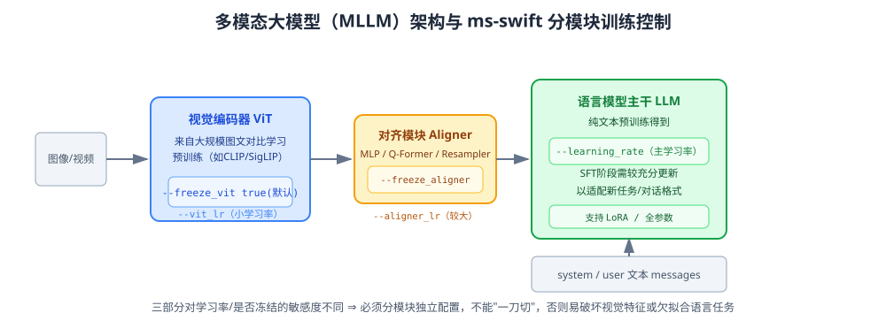

*图 17-1：MLLM 的三段式结构（视觉编码器 / 对齐模块 / 语言模型主干）及各自对应的 ms-swift 训练控制参数，三部分因预训练历程不同而需要独立配置学习率与冻结策略。*

### 17.2 ms-swift 的分模块训练控制

围绕上述特殊性，ms-swift 提供了细粒度的分模块训练控制参数：

- **`--freeze_vit`**：是否冻结视觉编码器，默认场景下（尤其是 LoRA 训练）常设为 `true`，仅在语言模型主干（以及可选的对齐模块）上做适配，因为视觉编码器的通用视觉特征提取能力通常已经足够强，过度微调反而可能造成视觉特征退化（尤其是在下游 SFT 数据规模远小于视觉编码器原始预训练数据规模的情况下）。
- **`--freeze_aligner`**：是否冻结对齐模块，默认值为 `true`；文档特别说明其行为会因训练方式不同而略有差异——全参数训练场景下，`freeze_aligner=true` 直接冻结该模块权重；而在 LoRA 训练场景（`target_modules=all-linear`）下，`freeze_aligner=true` 则意味着不为对齐模块中的线性层挂载 LoRA 分支（即该模块权重既不参与全参数更新，也不参与 LoRA 适配，完全保持预训练状态）。
- **`--vit_lr`**：当选择不冻结视觉编码器参与训练时，为其单独设置学习率（不同于语言模型主干的 `learning_rate`），实践中该值通常显著小于主干学习率，因为视觉编码器的预训练特征相对"娇贵"，过大学习率容易在几步内就破坏其原有表征质量。
- **`--aligner_lr`**：同理为对齐模块单独设置学习率，默认与 `learning_rate` 一致（因为对齐模块通常从零或较浅的预训练状态开始，需要更充分的更新幅度以完成新的模态对齐任务）。
- **`--vit_gradient_checkpointing`**：视觉编码器部分独立控制的梯度检查点开关，考虑到视觉编码器与语言模型主干在层数、计算特性上的差异，二者的显存/速度权衡取舍可能需要独立配置。

### 17.3 多模态数据格式与预处理参数

- **图像/视频分辨率控制**：`--model_kwargs '{"fps_max_frames": 12}'` 这类模型专属参数透传机制（因为不同模型对分辨率/帧率的处理方式、参数命名并不统一，无法用一套通用参数名覆盖所有模型），用于控制视频抽帧数量、图像最大像素数（`max_pixels`）等，这些参数直接影响输入 token 数量（进而影响显存与序列长度），是多模态训练调参中的关键旋钮。
- **纯文本与图文混合数据的联合训练**：ms-swift 明确支持在同一次 SFT 训练中混合纯文本数据与图文数据（文档中提到"支持使用纯文本数据、图文数据或二者混合进行训练"），这对保持多模态模型在纯文本任务上的能力（避免因图文 SFT 数据过度偏重视觉任务而导致纯文本能力退化）具有重要意义，也呼应了第三章提及的"混入通用数据缓解灾难性遗忘"的一般性数据工程原则在多模态场景下的具体应用。
- **Grounding（视觉定位）数据格式**：针对目标检测/视觉定位类任务，ms-swift 的数据格式明确支持"一个物体标签对应多个边界框（bbox）"的一对多标注结构，这是通用问答数据格式难以直接覆盖、需要专门扩展支持的数据形态，体现了框架在数据格式设计上需要兼顾任务多样性的工程考量。

### 17.4 多模态 Template 编码的额外复杂度

回到第四章提及的 Template 抽象，多模态场景下 `Template.encode` 需要额外完成：调用对应模型的图像/视频/音频 Processor 做像素级预处理（resize、归一化等）；根据预处理后的图像尺寸计算出该图像会被切分为多少个"图像 patch token"，并将 messages 中的图像占位符替换/展开为对应数量的特殊 token；正确处理多图、多轮图文交织场景下的 token 排布与位置编码（如前述的 M-RoPE 等二维/三维位置编码方案）。这部分逻辑的正确性直接决定了模型能否正确"看到"图像内容，是多模态 SFT 训练中最容易出现"训练损失正常下降、但推理效果异常差"这类隐蔽 bug 的高发环节，也是 ms-swift 需要为每个新接入的 MLLM 家族投入专门适配工作量的原因（这也解释了为什么该框架的 MLLM 支持数量"300+"相比 LLM 的"600+"体量更小——多模态适配的单位工程成本显著更高）。

---

## 第十八章 分布式后端实战：DeepSpeed / FSDP / Megatron-SWIFT 在 ms-swift 中的配置

### 18.1 单机多卡场景的典型配置模板

对于最常见的单机多卡（如 8×A100/H100）SFT 训练场景，一个典型的 ms-swift 命令行配置模板如下（以全参数预训练/微调为例，前文搜索结果中已印证类似写法）：

```bash
NPROC_PER_NODE=8 \
CUDA_VISIBLE_DEVICES=0,1,2,3,4,5,6,7 \
swift sft \
  --model Qwen/Qwen3-8B \
  --train_type full \
  --dataset '<your_dataset>' \
  --torch_dtype bfloat16 \
  --deepspeed zero2 \
  --num_train_epochs 3 \
  --per_device_train_batch_size 1 \
  --gradient_accumulation_steps 8 \
  --learning_rate 1e-5 \
  --lr_scheduler_type cosine \
  --warmup_ratio 0.03 \
  --gradient_checkpointing true \
  --attn_impl flash_attn \
  --save_steps 200 \
  --eval_steps 200 \
  --logging_steps 5 \
  --output_dir output
```

`NPROC_PER_NODE` 环境变量控制单机启用的进程（GPU）数量，底层由 `torchrun`（PyTorch 分布式启动器）拉起多进程，`swift` 命令内部对 `torchrun`/`accelerate launch` 等启动方式做了封装，用户通常不需要手动拼接 `torchrun` 命令行（尽管早期版本文档中也能看到直接调用 `torchrun --nproc_per_node=$N swift/cli/sft.py ...` 的写法，二者殊途同归）。

### 18.2 DeepSpeed 预设的选择依据

- **ZeRO-2（`--deepspeed zero2`）**：显存瓶颈主要来自优化器状态与梯度时的首选，通信开销相对 ZeRO-3 更低，训练速度损失较小，适合 7B~30B 级别模型在数据并行维度上进一步压榨单卡显存的场景。
- **ZeRO-3（`--deepspeed zero3`）**：模型参数本身已经无法在单卡容纳（如 30B+ 全参数训练）时的选择，通信开销更高（需要动态收集/释放参数分片），训练速度相比 ZeRO-2 通常有可观下降（具体幅度取决于集群互联带宽）。
- **Offload 变体（`zero2_offload`/`zero3_offload`）**：进一步将优化器状态（乃至参数）卸载到 CPU 内存，是"用时间换空间"的最后手段，通常只在显存实在无法满足需求、又缺乏更多 GPU 资源横向扩展时才考虑启用，因为 CPU-GPU 之间的 PCIe 带宽相比 GPU 间高速互联（NVLink/NVSwitch）低一到两个数量级，会显著拖慢训练速度。

### 18.3 FSDP 配置要点

FSDP 路径下，ms-swift 通常需要配合指定分片策略（`FULL_SHARD` 对应类似 ZeRO-3 的完全切分，`SHARD_GRAD_OP` 对应类似 ZeRO-2 的梯度+优化器状态切分）、自动包装策略（Auto Wrap Policy，决定按 Transformer Block 粒度切分模型）、以及是否启用 CPU Offload 等配置项，这些配置在 ms-swift 中通常通过专门的 `--fsdp` 系列参数或透传的 accelerate/FSDP 配置文件（YAML）指定。相比 DeepSpeed（需要额外安装、配置相对独立的 JSON 配置文件），FSDP 作为 PyTorch 原生组件，在环境依赖的简洁性上具有一定优势，是否选择 FSDP 还是 DeepSpeed，实践中更多取决于团队既有的工程习惯与基础设施沉淀，两者在主流场景下的效果与性能差距已相对有限。

### 18.4 多机多卡场景

多机训练需要额外配置 `NNODES`（节点数）、`NODE_RANK`（当前节点编号）、`MASTER_ADDR`/`MASTER_PORT`（主节点通信地址与端口）等分布式环境变量，ms-swift 的命令行使用方式与常规 PyTorch 分布式训练脚本的多机启动方式基本一致，同时对 DeepSpeed 多机场景下的 hostfile 配置也提供了兼容支持。多机训练场景下，节点间网络带宽（是否配备 InfiniBand/RoCE 高速互联）往往是决定 ZeRO-3/大模型并行训练能否达到预期吞吐的最关键硬件因素，超出软件框架本身能够优化的范畴。

### 18.5 Megatron-SWIFT 配置示例

对于超大规模或 MoE 模型训练场景，命令行切换为 `megatron sft`（前文搜索结果已给出示例）：

```bash
NPROC_PER_NODE=2 \
CUDA_VISIBLE_DEVICES=0,1 \
megatron sft \
  --model Qwen/Qwen3-4B-Instruct-2507 \
  --save_safetensors true \
  --dataset AI-ModelScope/alpaca-gpt4-data-zh \
  --tuner_type lora \
  --output_dir output
```

在更大规模场景下，还需要额外配置张量并行度（如 `--tensor_model_parallel_size`）、流水线并行度、（MoE 模型特有的）专家并行度、上下文并行度等参数，其配置原则需要结合第十章末尾给出的"模型规模-并行策略选型表"，并针对具体集群拓扑做实测调优。官方文档提到，通过专家并行技术，MoE 模型（如 Qwen3-30B-A3B）的训练可以获得"近 10 倍"的加速效果，这一显著提升源于 MoE 模型的稀疏激活特性与专家并行"每张卡只需存储/计算部分专家参数"的天然适配性，是超大规模 MoE 模型训练场景下几乎必须采用的并行策略。

### 18.6 FP8 训练与前沿数值精度技术

根据本报告调研到的 Release 信息，Megatron-SWIFT 已支持将 FP8（8-bit 浮点，通常指 NVIDIA Hopper/Blackwell 架构原生支持的 E4M3/E5M2 格式）训练与 LoRA 组合使用（`examples/megatron/fp8/lora`），FP8 相比 bf16 可以进一步提升计算吞吐（现代 GPU 的 FP8 Tensor Core 算力通常是 bf16 的数倍），但对训练数值稳定性提出更高要求，通常需要配合动态/混合精度的损失缩放策略与更精细的数值监控，是当前大规模训练领域最前沿、也仍在快速演进中的数值精度优化方向。

---

## 第十九章 训练评估、EvalScope 集成与效果验证

### 19.1 训练过程中的基础指标监控

SFT 训练过程中最基础的监控指标是**训练损失（train_loss）**与**验证损失（eval_loss）**——通过 `--eval_steps` 参数周期性在验证集上评估模型的语言建模损失，用于监控是否出现过拟合（train_loss 持续下降但 eval_loss 触底反弹）。此外常见的监控指标还包括当前学习率、梯度范数（是否频繁触发梯度裁剪，可能是数据异常或学习率过大的信号）、训练吞吐（tokens/sec 或 samples/sec，用于评估资源利用效率）等，这些指标通常通过 TensorBoard、Weights & Biases（W&B，`--report_to wandb`）、或 SwanLab（另一款国内训练可视化工具，ms-swift 生态中也有相应集成）等平台实时可视化。

### 19.2 语言建模损失的局限性

需要强调的是，eval_loss 只能反映"模型对验证集回复的预测概率高低"，并不能直接等价于"回复质量好坏"——一个语言建模损失较低的模型完全可能生成流畅但事实错误、或缺乏帮助性的回复。因此，eval_loss 更多用于监控训练动态的健康程度（是否收敛、是否过拟合），而不能作为评价模型最终能力的唯一依据，必须结合下游任务评测。

### 19.3 EvalScope 集成

ms-swift 与 ModelScope 生态下的评测框架 **EvalScope** 深度集成，支持在训练完成后（或通过独立的 `swift eval` 命令）对产出模型自动运行标准化评测集，涵盖：

- **知识与推理类客观题**：如 MMLU、C-Eval、CMMLU、GSM8K（数学）、HumanEval（代码）等，这类评测通常有标准答案，可以自动化打分，客观性强。
- **对话质量类主观评测**：如 MT-Bench、AlpacaEval 等采用"LLM-as-a-Judge"范式——用另一个能力更强的模型（如 GPT-4 或同等水位的裁判模型）对被测模型的回复打分或与基准回复做胜率对比，这类评测更贴近真实对话场景的质量感知，但存在裁判模型自身偏见（如偏好更长回复、偏好特定风格）带来的评测偏差风险，需要结合人工抽检交叉验证。
- **垂直领域评测**：针对特定行业（金融、法律、医疗等）的专项评测集，用于验证垂直领域 SFT 的实际效果。

将评测框架与训练框架打通为闭环（训练产出 checkpoint → 自动触发评测 → 评测结果反馈指导下一轮数据/超参数迭代），是成熟 MLOps 实践的标志性特征之一，也是 ms-swift 与 EvalScope 深度集成设计的核心价值所在——避免工程师需要手工编写胶水脚本对接训练产出物与评测框架输入格式。

### 19.4 人工评估与 A/B 测试

自动化评测无法完全替代人工评估，尤其在涉及主观体验（如创意写作质量、多轮对话的连贯性与"人格"一致性、安全边界的把握分寸）的场景下，构建小规模但高质量的人工评估流程（如盲测对比新旧模型、标注员按预设量表打分）仍然是验证 SFT 效果、决定是否上线新版本的重要（有时是最终决定性的）依据。工程实践中较为成熟的做法是"自动化评测做初筛与回归监控（防止明显的能力退化）+ 人工评估做最终质量把关"的两级评估体系。

---

## 第二十章 SFT 与 DPO / GRPO / RLHF 的关系及技术演进路线

### 20.1 从示范学习到偏好学习

如第一章所述，SFT 本质是"模仿学习"，其效果上限受限于标注数据本身的质量——模型无法学到比标注数据更好的行为模式（"你无法教出比你自己更懂的学生"，前提是模型只做模仿而不做探索）。RLHF/DPO 等偏好优化技术的引入，正是为了突破这一上限：通过让模型在同一问题上生成多个候选、比较优劣，模型有机会学到"标注者能够分辨优劣、但未必能亲自写出的更优行为"，这是偏好学习相比示范学习的本质优势——**评价一个答案的好坏通常比亲自生成一个最优答案更容易**，这一"评价比生成更容易"的不对称性正是整个 RLHF 范式成立的认知基础。

### 20.2 DPO：绕过显式奖励模型的直接偏好优化

传统 RLHF（如 InstructGPT 采用的 PPO 流程）需要先训练一个独立的奖励模型（Reward Model），再用强化学习（PPO）以该奖励模型的打分作为反馈信号优化策略模型，整个流程涉及奖励模型训练、策略模型训练、价值网络（Critic）训练三个独立组件，工程复杂度高、训练稳定性也相对脆弱（PPO 类在线强化学习算法对超参数敏感、容易出现奖励攻击/reward hacking 等问题）。DPO（Direct Preference Optimization，Rafailov et al., 2023）从理论上证明，在特定的奖励建模假设（Bradley-Terry 偏好模型）下，"先训练奖励模型再做 RL"这一两阶段流程，可以被数学等价地重新参数化为**直接在偏好数据对上做一个类似监督学习的对比损失优化**，不再需要显式训练奖励模型，也不需要在线采样与价值网络，大幅简化了工程实现，是 2023-2024 年偏好对齐技术从"重型 RL 流程"走向"轻量对比学习流程"这一趋势的代表性工作，后续的 KTO、ORPO、SimPO 等方法均可视为在 DPO 这一"离线偏好优化"范式内的进一步变体与改进。

### 20.3 GRPO：面向可验证奖励的强化学习

与 DPO 依赖"人类标注的成对偏好数据"不同，GRPO（Group Relative Policy Optimization，DeepSeek 团队提出，用于 DeepSeekMath 及后续 DeepSeek-R1 系列推理模型训练）面向的是**存在客观、可自动验证的奖励信号**的任务场景（如数学题是否得出正确答案、代码是否通过单元测试）。其核心机制是：对同一问题采样一组（Group）候选回复，根据验证器给出的（通常是稀疏的 0/1 或简单规则打分）奖励，计算组内相对优势（每个候选回复的奖励相对组内均值的偏离程度，并做标准化），以此作为策略梯度更新的优势估计，从而**省去了 PPO 中需要额外训练一个价值网络（Critic）来估计优势函数**这一环节，显著降低了强化学习训练阶段的显存与工程复杂度。GRPO 及同类 RLVR（基于可验证奖励的强化学习）方法是 2024-2026 年推理能力大幅提升（长思维链、自我反思、多步验证等"慢思考"行为的涌现）背后的核心训练技术，ms-swift 通过 `swift rlhf --rlhf_type grpo` 提供原生支持，是该框架紧跟前沿技术演进的又一体现。

### 20.4 SFT 冷启动在推理模型训练中的角色

值得特别指出的是，在当前主流的推理模型（Reasoning Model）训练范式中，SFT 并未因 RL 技术的兴起而被边缘化，反而承担着**"冷启动"（Cold Start）**这一关键角色：直接对 Base 模型做强化学习训练，往往因为模型尚不具备基本的格式遵循能力、探索效率低下而难以稳定收敛或收敛缓慢；因此主流实践（包括公开的 DeepSeek-R1 技术报告所述的训练流程）通常会先用少量高质量、包含完整思维链的 SFT 数据对 Base 模型做一轮"冷启动"微调，使其初步具备"以特定格式输出思考过程"的行为模式，再在此基础上开展大规模强化学习训练进一步提升推理能力；训练完成后，往往还会再做一轮基于 RL 模型采样生成、经过筛选的高质量数据的**二次 SFT**（有时称为"拒绝采样微调"或"蒸馏微调"），用于修正 RL 阶段可能引入的语言混杂、格式不稳定等副作用，并将强化学习阶段习得的推理能力进一步"蒸馏固化"融入普通的监督学习权重更新中。这种"SFT → RL → SFT"甚至多轮迭代的复合训练流程，是当前最前沿大模型训练 pipeline 的典型形态，SFT 技术的重要性不仅没有随 RL 技术的普及而降低，反而因为其在"冷启动"与"能力固化"两个关键节点上的不可替代性而愈发凸显。

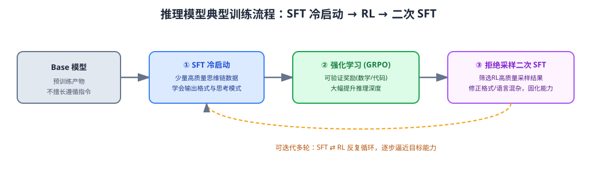

*图 20-1：当前推理模型训练的典型复合流程——SFT 冷启动赋予基本格式能力，RL（如 GRPO）大幅提升推理深度，拒绝采样二次 SFT 修正副作用并固化能力，整个流程可迭代多轮。*

### 20.5 SFT 与 RLHF 阶段的架构/工程复用

从 ms-swift 的架构设计可以进一步印证 SFT 与 RLHF 阶段的紧密耦合关系：二者共享同一套 Template（保证 SFT 训练时的对话格式与 RLHF 阶段完全一致，避免格式不一致导致偏好信号被噪声污染）、共享同一套 Tuner 体系（`--adapters`/`--ref_adapters` 支持 LoRA 权重跨阶段复用）、共享同一套数据集注册与预处理管线，只在 Trainer 层面（损失函数、是否需要参考模型前向计算 KL 散度、是否需要在线采样等）存在实质性分叉。这种工程架构上的"最大化复用、最小化分叉"设计原则，某种程度上也反映了 SFT 与 RLHF/DPO/GRPO 在技术本质上"同源而分流"的关系——它们都是在同一个预训练模型基础上、用不同形式的监督信号（示范 vs 偏好 vs 可验证奖励）引导模型行为对齐的不同技术路径，而非彼此割裂、需要独立技术栈支撑的不同领域。

---

## 第二十一章 工程实践手册：训练配置模板、调参经验与故障排查

### 21.1 从零开始一次 SFT 训练的标准工作流

1. **明确任务目标与评估标准**：先确定"训练完成后如何判断成功"（客观评测指标？人工评估通过率？线上业务指标？），评估标准应在数据构造之前就基本明确，避免"先训练后想评估方式"导致的返工。
2. **数据准备与质量把关**：按第三章方法论收集/构造数据，进行去重、去污染、质量过滤、格式标准化，并预留一部分数据作为验证集（切勿与训练集/下游评测集重叠）。
3. **基线实验（小规模、快速迭代）**：优先使用 LoRA（而非全参数）在较小数据子集上跑通全流程，验证数据格式、Template 拼接、Loss Mask 是否正确（可以通过 `swift infer` 加载训练中间 checkpoint 手动检查若干样本的实际生成效果，或直接打印/检查 `input_ids`/`labels` 的解码结果确认拼接与掩码逻辑无误），这一步的意义在于"快速试错、尽早暴露数据/工程 bug"，而非追求最终效果。
4. **超参数搜索**：在基线跑通的基础上，围绕学习率、LoRA 秩、训练轮数等关键超参数做小规模网格/随机搜索，选出较优组合。
5. **规模化训练**：使用全量数据、选定的最优超参数配置，视资源情况选择 LoRA/QLoRA/全参数 + 合适的分布式后端，完成正式训练。
6. **评估与迭代**：结合自动化评测（EvalScope）与人工评估综合判断效果，根据评估中发现的具体短板（如某类任务表现差、某种回复风格不理想）针对性补充/调整数据，重复 3-6 步直至达到预期效果。
7. **导出与部署**：使用 `swift export` 完成 LoRA 合并（如需要）与量化导出，通过 `swift deploy` 或对接 vLLM/SGLang 等推理引擎完成生产部署，务必验证部署时使用的对话模板与训练时严格一致。

### 21.2 常见超参数调优经验

- **学习率**：是影响 SFT 效果最敏感的超参数之一。若观察到训练损失下降过快后迅速停滞在较高水平、或生成内容出现明显重复/退化，通常提示学习率偏大；若训练损失下降极其缓慢、多轮训练后模型行为几乎无变化，提示学习率偏小。建议以框架默认值（全参数 `1e-5`，LoRA `1e-4`）为起点，按 2~5 倍步长做小范围搜索。
- **训练轮数（epoch）**：SFT 数据量较小（几千到几万条）时，1~3 轮通常已经足够，超过 3~5 轮往往开始出现过拟合迹象（eval_loss 触底反弹，或模型开始"背诵"训练数据中的具体表述而丧失泛化的回复能力）；数据量较大（十万条以上）时可以适当增加轮数，但仍需密切监控验证集表现。
- **LoRA 秩（rank）**：任务越复杂（需要模型学习的新行为模式越丰富）、数据规模越大，越需要更大的秩以获得足够的表达能力；简单的风格/格式适配任务，较小的秩（如 4~8）通常已经足够，盲目增大秩不仅增加训练开销，在数据不足时还可能加剧过拟合风险。
- **Batch Size 与梯度累积**：受限于显存，单卡实际 batch size（`per_device_train_batch_size`）通常只能设为较小值（甚至 1），此时通过增大 `gradient_accumulation_steps` 达到期望的等效全局 batch size（通常 SFT 场景下等效全局 batch size 在 32~256 之间是较常见区间，需结合学习率联动调整——更大的 batch size 通常可以配合略高的学习率）。
- **Warmup 比例**：数据量较小、训练步数较少的场景，建议使用相对更大的 warmup 比例（如 0.05~0.1），保证模型有足够步数"温和过渡"到目标学习率，避免训练初期即出现不稳定。

### 21.3 常见故障排查思路

**（1）显存溢出（OOM）**
- 优先检查是否已开启 `gradient_checkpointing`；
- 降低 `per_device_train_batch_size`（可通过增大梯度累积步数补偿等效 batch size）；
- 降低 `max_length`（如果数据长度分布允许）；
- 切换到更高阶的 ZeRO Stage（zero2 → zero3）或开启 Offload；
- 若使用全参数训练且显存仍然不足，考虑切换到 LoRA/QLoRA；
- 多模态场景下检查是否可以降低图像分辨率（`max_pixels`）或视频抽帧数（`fps_max_frames`）。

**（2）训练损失不下降或下降后停滞在高位**
- 检查数据格式与 Template 拼接是否正确（最常见的根因之一，尤其是自定义数据集接入时）；
- 检查学习率是否设置过小；
- 检查是否存在大量异常/低质量数据稀释了有效训练信号；
- 检查 loss mask 是否被错误应用（如整条样本 labels 全部为 -100，导致该 batch 无有效损失贡献）。

**（3）训练损失正常下降，但推理效果差**
- 极大概率是**训练-推理模板不一致**（见第四章），需要逐字节比对训练时 Template 编码结果与推理时（`swift infer` 或线上推理引擎）实际使用的拼接结果是否完全一致；
- 检查生成参数（temperature、repetition_penalty、停止词列表）是否与训练预期匹配；
- 检查是否存在 EOS/结束符相关的 token 处理差异（如训练时使用的结束符与推理引擎期望的停止 token 不一致，导致模型"该停不停"或提前截断）。

**（4）过拟合迹象明显（验证集效果差、模型"背诵"训练数据）**
- 减少训练轮数；
- 增大数据多样性、扩充数据规模；
- 降低 LoRA 秩或改用更强正则化（增大 `lora_dropout`、增大 `weight_decay`）；
- 混入更多通用数据稀释过拟合信号。

**（5）灾难性遗忘（通用能力明显退化）**
- 混入更高比例的通用指令数据；
- 降低学习率、减少训练轮数；
- 优先考虑 LoRA/PEFT 而非全参数微调；
- 考虑采用第八章介绍的、专门针对知识保留优化的方法（如 BOFT、LLaMA-Pro）。

**（6）多机多卡训练启动失败/挂起**
- 检查 `MASTER_ADDR`/`MASTER_PORT`/`NNODES`/`NODE_RANK` 等分布式环境变量是否在所有节点上正确且一致地设置；
- 检查节点间网络连通性与防火墙端口开放情况；
- 检查各节点上依赖库版本（PyTorch、DeepSpeed、CUDA、NCCL 版本）是否严格一致，版本不一致是多机训练最常见的"隐蔽坑"之一。

### 21.4 训练脚本工程化建议

生产环境下建议将训练配置从命令行内联参数迁移到 YAML/JSON 配置文件统一管理（ms-swift 支持配置文件方式传参），便于版本控制（Git 跟踪配置变更历史）、便于自动化流水线批量提交不同配置的对比实验、也便于团队协作时的配置复用与审查。同时建议为每次正式训练建立标准化的实验记录规范（记录数据版本、代码版本、完整超参数配置、评估结果），这是保证团队长期迭代效率、避免"某个效果好的模型无法复现"这一常见工程陷阱的基础实践。

---

## 第二十二章 总结与展望

### 22.1 核心结论回顾

1. **SFT 的本质是"格式与行为的对齐"，而非知识注入**：预训练决定模型能力上限，SFT 教会模型以何种协议、何种分布调用已有能力，这一认知决定了数据质量与多样性远比数据规模重要，也决定了 SFT 阶段应对"注入大量新知识"的诉求保持谨慎（更合理的路径是先做增量预训练）。
2. **损失掩码是 SFT 区别于普通语言建模的核心工程细节**：只在"回复"区间计算损失、以及围绕此衍生出的多轮对话掩码、Loss Scale 加权、Agent/工具调用差异化加权等机制，是所有 SFT 框架必须正确实现的基础设施，也是最容易出现隐蔽 bug 的环节。
3. **LoRA 家族是当前 PEFT 技术的绝对主流**，其技术演进呈现出清晰的脉络：从"低秩增量近似"（LoRA）到"量化压缩基座"（QLoRA）、"自适应秩分配"（AdaLoRA）、"幅度方向解耦"（DoRA）、"缩放稳定性修正"（rsLoRA）、"信息量最优初始化"（PiSSA）、"差异化学习率"（LoRA+）、"梯度感知初始化/优化"（LoRA-GA/LoRA-Pro），每一步改进都针对标准 LoRA 的某个具体局限展开，共同构成了一个仍在快速演进、尚未完全收敛的活跃研究方向。
4. **训练稳定性与效率工程（NEFTune、Packing、Flash Attention、梯度检查点、算子融合）**虽不改变训练的数学本质，却是决定"能否在给定预算下训练出可用模型"的现实关键，其重要性在工程实践中往往不亚于算法本身的选择。
5. **ms-swift 代表了当前国内开源社区在训练框架工程化方面的成熟实践**：通过"CLI 薄封装 + 参数体系分层复用 + Template/Tuner/Trainer 三大组件插件化"的架构设计，在支撑起数百个模型家族、十余种微调方法、多种训练范式（CPT/SFT/RLHF/Embedding/Reranker）、多种分布式后端（DeepSpeed/FSDP/Megatron）的同时，保持了相对精简的自身代码库与"依托上游生态、最小化侵入式扩展"的工程哲学，是理解现代大模型训练工程化实践的优秀样本。
6. **SFT 与 RLHF/DPO/GRPO 并非替代关系，而是"同源分流、紧密协作"的关系**：在当前主流的推理模型训练范式中，SFT 承担着"冷启动"与"能力固化蒸馏"两个关键节点的不可替代作用，其重要性随着 RL 技术的普及不降反升。

### 22.2 技术演进趋势展望

基于本报告的调研，可以观察到若干值得持续关注的技术演进方向：

- **PEFT 效果进一步逼近全参数微调**：DoRA、LoRA-GA、LoRA-Pro 等方法持续缩小 LoRA 与 Full FT 之间的效果差距，未来是否会出现"效果与全参数完全无差异、成本却维持 PEFT 量级"的方法，是学术界持续探索的重要方向。
- **梯度低秩投影（GaLore 系）作为全参数训练降本的另一条路线**，与 LoRA 系"限制更新自由度"的路线形成互补，二者的边界（何时选择哪条路线）以及是否存在更优的统一框架，值得持续关注。
- **训练数据工程的自动化与智能化**：随着强模型能力的提升，"用模型自身或更强模型自动生成、自动筛选、自动配比训练数据"的自动化数据工程流水线（Self-Instruct、拒绝采样、数据质量打分模型等技术的进一步成熟与规模化落地）正在部分取代纯人工标注，成为 SFT 数据生产的主流范式，这对数据工程团队的核心能力要求正从"标注执行"转向"数据流水线设计与质量监控"。
- **SFT-RL 复合训练范式的进一步精细化**："SFT 冷启动 → RL 训练 → 拒绝采样二次 SFT"这一复合流程本身可能进一步演化出更多轮次、更精细的阶段划分（如针对不同能力模块分阶段强化），训练框架需要为这种"多阶段、权重资产跨阶段复用"的复杂流程提供更完善的原生支持（ms-swift 目前的 `--adapters`/`--ref_adapters` 机制已是这一方向的早期实践）。
- **超长上下文与多模态训练的工程复杂度持续增加**：随着上下文窗口从数万 token 向数十万乃至百万 token 演进，上下文并行/序列并行技术将从"可选优化"变为"必需基础设施"；多模态模型向更多模态（视频、3D、具身智能传感器数据等）扩展，也将持续推高训练框架在数据处理、Template 编码、并行策略层面的工程复杂度。
- **训练与推理基础设施的进一步融合**：Template 一致性、量化格式兼容性等"训练-推理断层"问题的解决方案，正从"框架内部尽量保证一致"向"训练与推理引擎共享同一套底层规范（如统一的 Chat Template 标准、统一的量化格式标准）"演进，这将进一步降低模型从训练到部署的工程摩擦成本。

### 22.3 对工程团队的建议

对于希望落地 SFT 训练能力的工程团队，本报告基于上述调研给出以下建议：

1. **优先投入数据工程而非算法调优**：在大多数实际业务场景中，数据质量与配比对最终效果的边际贡献远高于超参数或 PEFT 方法的精细调优，应将更多资源投入到数据构造、清洗、评估流水线的建设上。
2. **善用成熟开源框架而非从零造轮子**：如 ms-swift 这类已经过大量模型/场景验证的开源框架，能够显著降低"模板拼接错误""分布式训练配置踩坑"等基础工程风险，团队应将精力聚焦在业务特定的数据与评估环节，而非重复实现框架已经解决的通用能力。
3. **建立"训练-评估"闭环而非"一次性训练"**：SFT 效果的持续提升依赖于评估反馈驱动的多轮迭代，应尽早建立自动化评测与人工评估相结合的效果验证体系，而不是把训练当作一次性任务。
4. **保持对前沿技术的跟踪与审慎验证**：PEFT 技术家族与 RL 对齐技术仍在快速演进，团队应保持对新方法（如本报告提及的 DoRA、GRPO 等）的关注，但落地前应在自己的具体任务与数据上做充分的小规模验证，避免盲目追逐论文报告的基准数据而忽视自身场景的特殊性。

---

## 附录 A：核心命令行参数速查表（以 ms-swift 3.x/4.x 系文档为主要参考）

### A.1 通用训练参数

| 参数 | 说明 | 常见默认值/取值 |
| --- | --- | --- |
| `--model` | 模型 ID 或本地路径 | 无默认，必填 |
| `--train_type`（或 `--tuner_type`） | 微调方式 | `lora`（默认）/`full`/`longlora`/`adalora`/`llamapro`/`adapter`/`vera`/`boft`/`fourierft`/`reft` |
| `--dataset` | 数据集，支持多个来源与内联采样 `#N` 语法 | 无默认，必填 |
| `--torch_dtype` | 训练精度 | `bfloat16`（推荐）/`float16`/`float32` |
| `--output_dir` | 输出目录 | 默认自动生成 `output/<model>/<version>` |
| `--num_train_epochs` | 训练轮数 | 常见 1~3 |
| `--per_device_train_batch_size` | 单卡 batch size | 常见 1~4（视显存） |
| `--gradient_accumulation_steps` | 梯度累积步数 | 与 batch size 联动配置 |
| `--learning_rate` | 学习率 | 全参数默认 `1e-5`；LoRA 等 PEFT 默认 `1e-4` |
| `--lr_scheduler_type` | 学习率调度 | 默认 `cosine` |
| `--warmup_ratio` | 预热比例 | 常见 0.03~0.1 |
| `--weight_decay` | 权重衰减 | 默认约 0.1 |
| `--max_length` | 最大序列长度 | 视数据/显存而定，常见 2048~8192+ |
| `--gradient_checkpointing` | 梯度检查点 | 默认 `true` |
| `--attn_impl` | 注意力实现 | `flash_attn`/`sdpa`/`eager` |
| `--packing` | 序列打包 | 默认 `false`，建议长文本/多样本长度离散场景开启 |
| `--neftune_noise_alpha` | NEFTune 噪声强度 | 常见 5/10/15 |
| `--deepspeed` | DeepSpeed 预设 | `zero1`/`zero2`/`zero3`/`zero2_offload`/`zero3_offload` |
| `--save_steps` / `--eval_steps` / `--logging_steps` | 保存/评估/日志频率 | 视训练总步数而定 |
| `--resume_from_checkpoint` | 断点续训 | 指定 checkpoint 路径 |

### A.2 LoRA 及其变体相关参数

| 参数 | 说明 |
| --- | --- |
| `--target_modules` | 作用模块，`all-linear` 为快捷全覆盖 |
| `--lora_rank`（或 `--lora_r`） | LoRA 秩，常见 8/16/32/64 |
| `--lora_alpha` | 缩放因子，常见为 `lora_rank` 的 1~2 倍 |
| `--lora_dropout` | LoRA 分支 Dropout |
| `--use_dora` | 是否启用 DoRA |
| `--use_rslora` | 是否启用 rsLoRA 缩放 |
| `--init_weights` | LoRA 初始化策略，`pissa`/`pissa_niter_[n]`/`gaussian` 等 |
| `--modules_to_save` | 额外全量训练/保存的模块，如 `EMBEDDING`/`LN`/`lm_head` |
| `--adalora_target_r` / `--adalora_init_r` / `--adalora_tinit` | AdaLoRA 专属参数 |
| `--llamapro_num_new_blocks` / `--llamapro_num_groups` | LLaMA-Pro 专属参数 |

### A.3 量化相关参数

| 参数 | 说明 |
| --- | --- |
| `--quant_method` | 量化后端，`bnb`/`awq`/`gptq`/`hqq` 等 |
| `--quant_bits` | 量化位宽，常见 `4`/`8` |

### A.4 多模态相关参数

| 参数 | 说明 |
| --- | --- |
| `--freeze_vit` | 是否冻结视觉编码器 |
| `--freeze_aligner` | 是否冻结对齐模块（全参数场景下为冻结权重；LoRA 场景下为不挂载 LoRA） |
| `--vit_lr` | 视觉编码器独立学习率 |
| `--aligner_lr` | 对齐模块独立学习率 |
| `--vit_gradient_checkpointing` | 视觉编码器梯度检查点开关 |
| `--model_kwargs` | 模型专属参数透传，如 `'{"fps_max_frames": 12}'` |

### A.5 RLHF 相关参数（延伸参考）

| 参数 | 说明 |
| --- | --- |
| `--rlhf_type` | `dpo`/`kto`/`ppo`/`grpo`/`orpo`/`simpo` 等 |
| `--ref_model` / `--ref_adapters` | 参考模型及其 adapter |
| `--adapters` | 加载已有 adapter（用于续训或作为 RLHF 初始化） |
| `--beta` | 偏好优化中控制偏离参考模型程度的核心超参数 |

> 提示：以上参数名与默认值基于本报告调研时可获得的公开文档、Release 说明与社区源码分析整理，ms-swift 项目仍在活跃演进中，具体参数可能随版本更新有所调整（如历史上 `--sft_type` → `--train_type`、`--lora_target_modules` → `--target_modules`、`--quantization_bit` → `--quant_bits` 等命名迁移），建议读者在实际使用前以 `swift sft --help` 或对应版本官方文档为准。

---

## 附录 B：参考文献与资料来源

### B.1 框架与工程文档
1. ModelScope, *ms-swift: Use PEFT or Full-parameter to CPT/SFT/DPO/GRPO 600+ LLMs and 300+ MLLMs*, GitHub 仓库：`https://github.com/modelscope/ms-swift`（含 README、Releases、`docs/source_en/Instruction/` 系列文档、`examples/` 训练脚本示例）。
2. ms-swift 历史版本文档快照：`swift.readthedocs.io`（v2.x～v4.x 各版本 Command-line-parameters 文档），用于交叉印证参数命名的版本演进。
3. ms-swift DeepWiki 技术文档梳理（`deepwiki.com/modelscope/ms-swift`），提供调用链路、Trainer/Tuner/Megatron 子系统的结构化说明。
4. 社区源码分析文章：《【LLM】ms-Swift大模型训练框架源码分析》等公开技术博客，用于交叉验证 `swift sft → sft_main() → SwiftSft(args).main()` 调用链路细节。
5. Qwen 官方文档中关于 ms-swift 训练 Qwen3 系列模型的实践指南（`qwen.readthedocs.io`）。

### B.2 PEFT / LoRA 家族核心论文
6. Hu, E. J., et al. *LoRA: Low-Rank Adaptation of Large Language Models*. 2021/2022.
7. Dettmers, T., et al. *QLoRA: Efficient Finetuning of Quantized LLMs*. 2023.
8. Zhang, Q., et al. *AdaLoRA: Adaptive Budget Allocation for Parameter-Efficient Fine-Tuning*. 2023.
9. Liu, S.-Y., et al. *DoRA: Weight-Decomposed Low-Rank Adaptation*. 2024.
10. Kalajdzievski, D. *A Rank Stabilization Scaling Factor for Fine-Tuning with LoRA (rsLoRA)*. 2023.
11. Meng, F., et al. *PiSSA: Principal Singular Values and Singular Vectors Adaptation of Large Language Models*. 2024.
12. Hayou, S., Ghosh, N., Yu, B. *LoRA+: Efficient Low Rank Adaptation of Large Models*. 2024.
13. Wang, S., et al. *LoRA-GA: Low-Rank Adaptation with Gradient Approximation*. 2024.
14. Zhao, J., et al. *GaLore: Memory-Efficient LLM Training by Gradient Low-Rank Projection*. 2024.
15. Kopiczko, D. J., et al. *VeRA: Vector-based Random Matrix Adaptation*. 2024.
16. Zhang, L., et al. *LoRA-FA: Memory-efficient Low-rank Adaptation for LLM Fine-tuning*. 2023.
17. Liu, H., et al. *(IA)³: Few-Shot Parameter-Efficient Fine-Tuning is Better and Cheaper than In-Context Learning*. 2022.
18. Houlsby, N., et al. *Parameter-Efficient Transfer Learning for NLP (Adapter)*. 2019.
19. Li, X. L., Liang, P. *Prefix-Tuning: Optimizing Continuous Prompts for Generation*. 2021.
20. Lester, B., et al. *The Power of Scale for Parameter-Efficient Prompt Tuning*. 2021.
21. Liu, W., et al. *BOFT: Orthogonal Finetuning via Butterfly Factorization*. 2024（及 OFT 原始工作）。
22. Gao, Z., et al. *Parameter-Efficient Fine-Tuning with Discrete Fourier Transform (FourierFT)*. 2024.
23. Wu, Z., et al. *ReFT: Representation Finetuning for Language Models*. 2024.
24. Wu, C., et al. *LLaMA Pro: Progressive LLaMA with Block Expansion*. 2024.
25. Chen, Y., et al. *LongLoRA: Efficient Fine-tuning of Long-Context Large Language Models*. 2023.
26. Pan, R., et al. *LISA: Layerwise Importance Sampling for Memory-Efficient Large Language Model Fine-Tuning*. 2024.

### B.3 训练稳定性与效率技术
27. Dao, T., et al. *FlashAttention: Fast and Memory-Efficient Exact Attention with IO-Awareness*. 2022；*FlashAttention-2*. 2023.
28. Jain, N., et al. *NEFTune: Noisy Embeddings Improve Instruction Finetuning*. 2023.
29. Rajbhandari, S., et al. *ZeRO: Memory Optimizations Toward Training Trillion Parameter Models*. 2020（DeepSpeed 相关）。
30. Shoeybi, M., et al. *Megatron-LM: Training Multi-Billion Parameter Language Models Using Model Parallelism*. 2019（及后续 Megatron-Core 相关工程演进）。

### B.4 数据工程与指令微调
31. Zhou, C., et al. *LIMA: Less Is More for Alignment*. 2023.
32. Taori, R., et al. *Alpaca: A Strong, Replicable Instruction-Following Model*. 2023.
33. Wang, Y., et al. *Self-Instruct: Aligning Language Models with Self-Generated Instructions*. 2022/2023.
34. Xu, C., et al. *WizardLM: Empowering Large Language Models to Follow Complex Instructions (Evol-Instruct)*. 2023.

### B.5 偏好对齐与强化学习（延伸参考）
35. Ouyang, L., et al. *Training language models to follow instructions with human feedback (InstructGPT)*. 2022.
36. Rafailov, R., et al. *Direct Preference Optimization: Your Language Model is Secretly a Reward Model*. 2023.
37. Ethayarajh, K., et al. *KTO: Model Alignment as Prospect Theoretic Optimization*. 2024.
38. Shao, Z., et al. *DeepSeekMath: Pushing the Limits of Mathematical Reasoning in Open Language Models (GRPO)*. 2024.
39. DeepSeek-AI. *DeepSeek-R1: Incentivizing Reasoning Capability in LLMs via Reinforcement Learning*. 2025（技术报告，关于 SFT 冷启动与拒绝采样二次 SFT 流程的公开描述）。

> 说明：以上论文列表基于公开检索到的题录信息与摘要片段整理，部分文献的具体发表年份/版本以其正式发布渠道（如 arXiv、会议论文集）为准；本报告在正文中对相关方法的技术原理描述，综合了检索到的论文摘要、相关工作引用片段与后续研究对其思想的转述，力求准确但不排除个别细节存在与原始论文表述的微小出入，建议对关键技术细节有严格依赖的读者，进一步查阅对应论文原文核实。

---

## 结语

本报告以 SFT（有监督微调）为核心主题，从数学原理、数据工程、PEFT 技术家族演进，到 ms-swift 框架的架构设计与源码级实现细节，再到分布式训练、多模态特化、量化训练、评估验证与工程实践，力求构建一份体系完整、层次清晰、兼具理论深度与工程可操作性的技术参考资料。SFT 技术本身仍在快速演进——无论是 PEFT 方法家族的持续创新，还是 SFT 与强化学习范式日益紧密的协同关系，都提示我们这是一个远未定型、值得持续投入研究与工程实践的技术领域。希望本报告能够为相关工程团队与研究人员提供一份有价值的参考。