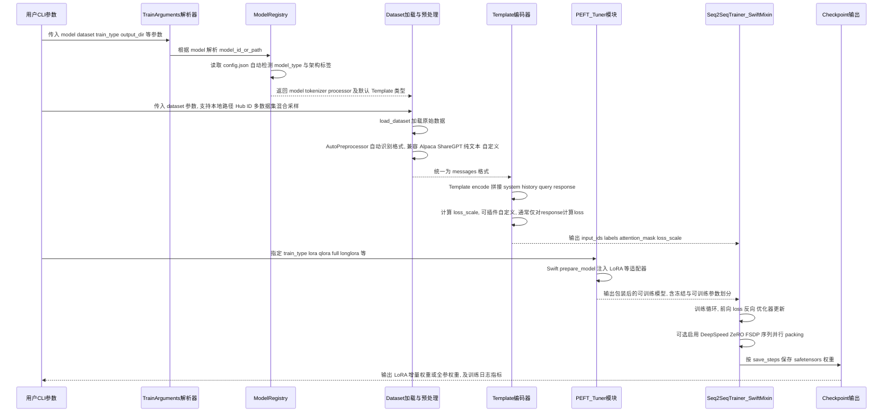
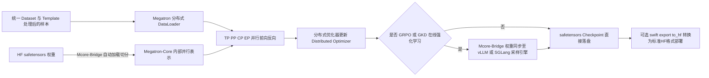
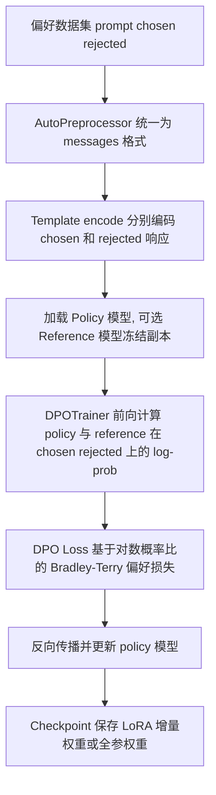
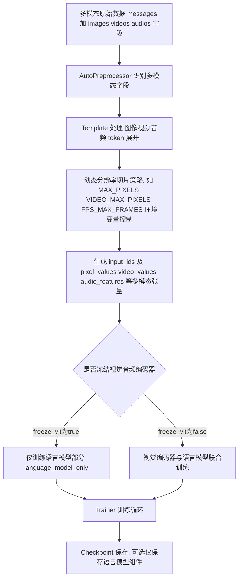
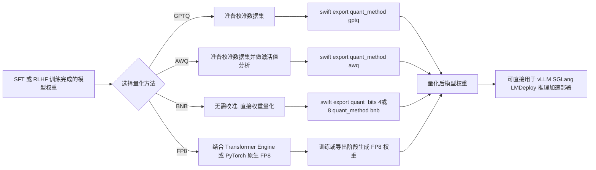
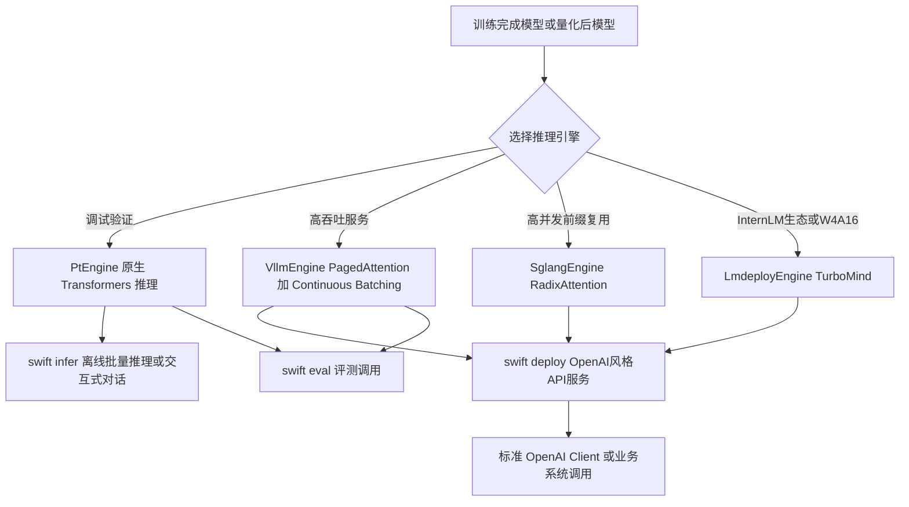
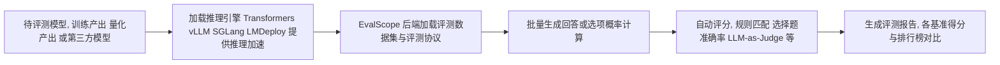

# ms-swift 技术架构与全场景应用深度分析报告

**报告版本**：v1.0
**分析对象**：modelscope/ms-swift（魔搭社区大模型与多模态大模型训练/推理/评测/量化/部署框架）
**分析时间**：2026 年 7 月
**参考版本**：ms-swift v4.x（基于公开 GitHub 仓库、README、官方文档 swift.readthedocs.io 及 DeepWiki 技术解析整理）

---

## 目录

1. 概述与项目定位
2. 整体技术架构总览
3. 核心技术栈全景表
4. 场景一：监督微调（SFT）与继续预训练（CPT）全流程解析
5. 场景二：Megatron-SWIFT 大规模分布式训练
6. 场景三：人类偏好对齐（DPO/KTO/RM/PPO 等经典 RLHF）
7. 场景四：GRPO 强化学习算法族与 Rollout 推理加速架构
8. 场景五：多模态大模型训练场景
9. 场景六：Embedding / Reranker / 序列分类训练场景
10. 场景七：模型量化场景（AWQ/GPTQ/BNB/FP8）
11. 场景八：推理加速与服务化部署场景
12. 场景九：模型评测场景（EvalScope 集成）
13. 跨场景公共基础设施：Template、Dataset、Plugin、CLI/Python API、Web-UI
14. 与同类训练框架的对比分析
15. 优势总结与局限性分析
16. 总结与展望

---

## 1. 概述与项目定位

### 1.1 项目简介

ms-swift（Scalable lightWeight Infrastructure for Fine-Tuning，简称 SWIFT）是阿里巴巴魔搭（ModelScope）社区官方开源、并已被 AAAI 2025 收录论文化的大模型与多模态大模型全生命周期工程框架。与许多仅聚焦"训练"环节的微调工具不同，ms-swift 的设计理念是"training is not the end"（训练不是终点），因此它把模型开发生命周期中的预训练（CPT）、监督微调（SFT）、人类对齐（RLHF/GRPO 等强化学习）、推理加速、模型评测、模型量化、模型部署这七个环节全部纳入统一框架之中，形成了一条完整的、可通过命令行 / Python API / Web-UI 三种交互方式驱动的工程闭环。

截至本报告撰写时，ms-swift 已支持 600+ 纯文本大模型（如 Qwen 系列、DeepSeek-R1、GLM 系列、InternLM3、Llama4、Mistral 等）与 300+ 多模态大模型（如 Qwen-VL/Qwen-Omni 系列、InternVL、MiniCPM-V、Ovis、GLM-V、DeepSeek-VL2、Llava、Phi 系列、GOT-OCR2 等）。这一庞大的模型覆盖面本身就是其架构设计的直接产物：通过"模型注册表 + Template 抽象 + Preprocessor 抽象"的三层解耦，新模型的接入成本被压缩到"注册元信息 + 适配对话模板"这一相对轻量的工作量上。

### 1.2 设计哲学

从公开的架构文档与社区讨论中可以归纳出 ms-swift 的四条核心设计哲学：

1. **全链路覆盖，而非单点能力**：训练完成不代表工作结束，ms-swift 内建推理、评测、量化、部署能力，并让这些能力在同一套 Template / Dataset / 参数体系下无缝衔接，用户不需要在多个工具之间手动转换数据格式或模型格式。
2. **拥抱主流生态而非另起炉灶**：ms-swift 的模型加载层基于 HuggingFace `transformers`，数据处理层基于 HuggingFace `datasets`，标准训练器基于 `transformers.Seq2SeqTrainer` 封装（叠加 `SwiftMixin` 增强），偏好对齐训练器复用并深度改造自 HuggingFace `TRL`，大规模并行训练层对接 NVIDIA `Megatron-Core`，推理加速层对接 `vLLM`、`SGLang`、`LMDeploy`，量化层对接 `AutoGPTQ`/`AutoAWQ`/`bitsandbytes`，评测层对接魔搭自研的 `EvalScope`。这种"缝合"而非"重写"的策略使 ms-swift 能够低成本地跟随社区最新技术进展。
3. **插件化与可扩展性**：损失函数（loss_type）、损失缩放（loss_scale）、训练器（trainer）、优化器（optimizer）、回调（callback）、评价指标（metric）、奖励函数（reward function）、多轮推理调度器（multi-turn scheduler）等均可通过插件（plugin）机制进行自定义扩展，无需修改框架源码。
4. **分层适配不同能力用户**：既提供极简的命令行一键训练（`swift sft`、`swift rlhf`、`swift infer`），也提供可编程的 Python API（`swift.llm` 模块下的 `get_model_tokenizer`、`load_dataset`、`get_template` 等函数），还提供 Gradio 驱动的 Web-UI，覆盖从"跑通即可"到"深度定制"的不同需求层级。

### 1.3 命名体系与命令入口

ms-swift 对外暴露的核心命令行入口按场景划分，形成了一套"动词化"的任务命令族：

| 命令 | 对应场景 |
|---|---|
| `swift pt` | 预训练（Pretraining，使用生成式模板） |
| `swift sft` | 监督微调（含 CPT 继续预训练、全参/LoRA/QLoRA 等 PEFT 微调） |
| `swift rlhf` | 人类对齐统一入口，通过 `--rlhf_type` 参数分流到 DPO/KTO/ORPO/CPO/SimPO/RM/PPO/GRPO/GKD 等具体算法 |
| `swift rollout` | 启动独立的 vLLM/SGLang 采样（rollout）服务，服务于 GRPO 等在线强化学习的 Server 模式 |
| `swift infer` | 离线/交互式推理 |
| `swift deploy` | 启动 OpenAI 接口风格的模型服务 |
| `swift export` | 模型格式转换、权重合并（merge-lora）、量化导出、HF↔Megatron 权重互转 |
| `swift eval` | 模型评测，底层调用 EvalScope |
| `swift app` / `swift web-ui` | 启动 Gradio 图形化界面 |
| `megatron pt` / `megatron sft` / `megatron rlhf` | Megatron-SWIFT 大规模并行训练对应命令 |

这种命令设计使得同一套底层模块（Template、Dataset、Model Registry）可以在不同任务命令之间复用，是"全流程一致性"体验的直接来源。


---

## 2. 整体技术架构总览

### 2.1 分层架构图

ms-swift 的整体架构可以归纳为「六层」结构：交互层、任务编排层、数据与模板层、模型与算法层、分布式与加速层、生态对接层。下图（Mermaid 流程图）展示了各层之间的关系：

```mermaid
flowchart TB
    subgraph L1["交互层 Interaction Layer"]
        A1["CLI 命令行 swift sft rlhf infer deploy export eval"]
        A2["Python API swift.llm swift.tuners swift.megatron"]
        A3["Web-UI Gradio 图形界面"]
    end

    subgraph L2["任务编排层 Orchestration Layer"]
        B1["SwiftSft SwiftRLHF SwiftInfer SwiftDeploy SwiftExport SwiftEval"]
        B2["Argument 解析与校验 TrainArguments RLHFArguments InferArguments"]
    end

    subgraph L3["数据与模板层 Data and Template Layer"]
        C1["Dataset Registry 加 load_dataset"]
        C2["AutoPreprocessor MessagesPreprocessor"]
        C3["Template 体系 encode decode 多模态占位符处理 loss_scale"]
    end

    subgraph L4["模型与算法层 Model and Algorithm Layer"]
        D1["Model Registry MODEL_MAPPING ModelMeta"]
        D2["PEFT Tuners LoRA QLoRA DoRA LongLoRA GaLore LISA ReFT Llama-Pro"]
        D3["Trainer 族 Seq2SeqTrainer 结合 SwiftMixin DPOTrainer GRPOTrainer PPOTrainer RMTrainer GKDTrainer"]
    end

    subgraph L5["分布式与加速层 Distributed and Acceleration Layer"]
        E1["DeepSpeed ZeRO 1 2 3"]
        E2["FSDP FSDP2"]
        E3["Megatron-Core TP PP CP EP ETP VPP SP 加 Mcore-Bridge"]
        E4["Flash-Attention Liger-Kernel Unsloth 算子加速"]
        E5["序列并行 Ulysses Ring-Attention"]
    end

    subgraph L6["生态对接层 Ecosystem Integration Layer"]
        F1["推理引擎 Transformers vLLM SGLang LMDeploy"]
        F2["量化引擎 AutoGPTQ AutoAWQ bitsandbytes FP8"]
        F3["评测后端 EvalScope"]
        F4["模型与数据集仓库 ModelScope Hub HuggingFace Hub"]
    end

    L1 --> L2 --> L3 --> L4 --> L5 --> L6
```



### 2.2 核心模块清单与职责

| 模块 | 关键类/函数 | 主要职责 |
|---|---|---|
| Model Registry | `MODEL_MAPPING`、`ModelMeta`、`get_model_tokenizer` | 记录模型 ID、模型架构标签（是否 MoE、是否多模态、attention 实现等）、默认 Template 绑定关系，是"新增模型接入"的核心登记点 |
| Template 系统 | `Template` 类、`get_template`、`Template.encode/decode` | 负责把 `messages` 格式的对话数据编码为模型可训练的 `input_ids/labels/loss_scale`，并处理多模态占位符（图像/音频/视频 token 展开）、工具调用（Agent/Function Calling）格式 |
| Dataset 系统 | `load_dataset`、`DATASET_MAPPING`、`AutoPreprocessor`、`MessagesPreprocessor` | 统一将各种原始数据格式（Alpaca、ShareGPT、纯文本、自定义 jsonl 等）转换为内部统一的 `messages` 消息格式 |
| Tuner/PEFT 模块 | `swift.tuners` 下的 `LoRAConfig`、`Swift.prepare_model` | 提供参数高效微调方法的统一接口，兼容并扩展了 HuggingFace `peft` 库 |
| 标准训练核心 | `Seq2SeqTrainer`（继承自 `transformers.Trainer`，叠加 `SwiftMixin`） | CPT/SFT 等常规训练任务的执行核心，负责 loss 计算、梯度更新、checkpoint 管理、日志上报 |
| RLHF 训练核心 | `DPOTrainer`、`KTOTrainer`、`CPOTrainer`、`ORPOTrainer`、`RMTrainer`、`PPOTrainer`（基于 TRL 改造） | 人类偏好对齐类算法的训练执行核心 |
| GRPO 训练核心 | `GRPOTrainer` | GRPO 及其算法族（DAPO/GSPO/SAPO/CISPO/RLOO/Reinforce++/CHORD 等）的在线强化学习训练执行核心，内部耦合了 rollout（采样）与 actor（策略更新）两个子流程 |
| Megatron-SWIFT | `BaseMegatronTrainer`、`GPTBridge`（Mcore-Bridge） | 大规模分布式训练执行核心，负责把 HuggingFace 格式权重与 Megatron-Core 内部表示进行双向桥接，并驱动 TP/PP/CP/EP 等并行策略 |
| 推理引擎适配层 | `PtEngine`、`VllmEngine`、`SglangEngine`、`LmdeployEngine` | 统一推理接口，屏蔽底层推理引擎差异，供 `swift infer`/`swift deploy`/`swift eval`/GRPO rollout 共用 |
| 量化导出模块 | `swift export --quant_method awq/gptq/bnb/fp8` | 调用第三方量化库对训练完成的模型进行低比特量化并导出 |
| 评测模块 | `swift eval`，底层依赖 `evalscope` | 对文本/多模态模型进行标准化 benchmark 评测 |
| Web-UI | 基于 Gradio 构建 | 将上述所有命令行能力封装为可视化操作面板 |

### 2.3 训练流水线的统一抽象

无论是 CPT、SFT，还是 DPO/GRPO 等对齐算法，ms-swift 在工程实现上都遵循同一条抽象流水线：

```
原始数据集（本地文件/ModelScope Hub/HF Hub）
        │  load_dataset()
        ▼
统一 messages 格式数据集（AutoPreprocessor 自动识别格式并转换）
        │  Template.encode()
        ▼
Token 化样本（input_ids / labels / loss_scale / 多模态张量）
        │  DataCollator（支持 padding_free、packing、序列并行切分）
        ▼
批次数据 batch
        │  Trainer.training_step()
        ▼
前向传播（模型 + 可选 PEFT 适配器）→ 损失计算（可插件自定义 loss_type）
        │
        ▼
反向传播 + 优化器更新（可选 DeepSpeed/FSDP/Megatron 并行通信）
        │
        ▼
Checkpoint 保存（safetensors，支持 LoRA 增量权重与合并权重分别保存）
```

这条流水线的关键价值在于：**Megatron-SWIFT 与标准 Transformers 路径共用同一套 Dataset 和 Template 处理模块**（这一点在官方文档中被明确强调："Megatron-SWIFT uses the same dataset and template processing modules as ms-swift, thus supporting techniques such as packing, loss scale, and agent training"），这意味着用户从单卡 LoRA 微调切换到千卡 Megatron 并行预训练时，数据预处理逻辑无需任何改动，极大降低了"规模化"的迁移成本。


---

## 3. 核心技术栈全景表

下表汇总了 ms-swift 在各功能域所依赖或集成的第三方开源实现，是理解其"缝合式"架构的关键索引。

| 功能域 | 依赖/集成的第三方开源项目 | 用途说明 |
|---|---|---|
| 基础深度学习框架 | PyTorch (≥2.0) | 底层张量计算与自动微分 |
| 模型与 Tokenizer 加载 | HuggingFace `transformers` | 模型结构定义、权重加载、Tokenizer/Processor |
| 数据集处理 | HuggingFace `datasets` | 数据集加载、map/filter 等批处理操作、缓存机制 |
| 参数高效微调 | HuggingFace `peft`（LoRA/AdaLoRA/IA3 等）+ ms-swift 自研扩展（LongLoRA、LLaMA-Pro、LISA、ReFT、Fourier Ft、DoRA 支持增强等） | 提供并扩展 LoRA 系列轻量化训练方法 |
| 标准训练循环 | `transformers.Seq2SeqTrainer`（叠加 `SwiftMixin`） | CPT/SFT 任务训练主循环、日志、Checkpoint 管理 |
| 偏好对齐算法 | HuggingFace `TRL`（DPOTrainer/KTOTrainer/CPOTrainer/ORPOTrainer/PPOTrainer/RewardTrainer 等的基类） | DPO/KTO/CPO/SimPO/ORPO/RM/PPO 等算法的核心实现基础，ms-swift 在此基础上做多模态适配、插件化改造 |
| 分布式数据并行/显存优化 | Microsoft `DeepSpeed`（ZeRO-1/2/3）、PyTorch 原生 `FSDP`/`FSDP2` | 大模型多卡/多机数据并行训练时的显存切分与通信优化 |
| 大规模模型并行 | NVIDIA `Megatron-Core`（TP/PP/CP/EP/ETP/VPP/SP） | 千亿参数级/MoE 模型的张量并行、流水线并行、上下文并行、专家并行 |
| 权重桥接 | `Mcore-Bridge`（ms-swift/ModelScope 自研，独立开源仓库 modelscope/mcore-bridge） | 实现 HuggingFace safetensors ↔ Megatron-Core 内部权重表示的双向无损转换，支持 LoRA 增量权重转换 |
| 显存/速度优化算子 | `Flash-Attention`（2/3/4 版本可选）、`Liger-Kernel`（Triton 融合算子）、`Unsloth`（算子级加速）、`GaLore`/`Q-GaLore`（梯度低秩投影降显存） | Attention 计算加速、显存节省、训练吞吐提升 |
| 序列并行 | Ulysses 序列并行、Ring-Attention | 支持超长序列（长文本/长视频）训练时对 Attention 计算与显存进行跨卡切分 |
| 强化学习采样加速 | `vLLM`（PagedAttention）、`SGLang`（RadixAttention） | 为 GRPO 等在线 RL 算法提供高吞吐 rollout 采样能力 |
| 推理服务引擎 | `vLLM`、`SGLang`、`LMDeploy`、原生 `transformers` | 离线/在线推理加速，供 `swift infer`/`swift deploy`/`swift eval` 复用 |
| 模型量化 | `AutoGPTQ`（GPTQ）、`AutoAWQ`（AWQ）、`bitsandbytes`（BNB/QLoRA）、FP8（基于 Transformer Engine/PyTorch 原生 FP8） | 训练后量化（PTQ）与量化感知训练（如 QLoRA） |
| 模型评测 | `EvalScope`（魔搭社区自研评测框架） | 100+ 标准评测数据集（含 MMLU、CMMLU、GSM8K、HumanEval、MathVista 等文本与多模态基准）的统一评测后端 |
| 模型/数据集托管 | ModelScope Hub、HuggingFace Hub | 模型权重与数据集的下载、缓存与推送（push_to_hub） |
| 可视化交互 | Gradio | Web-UI 图形化界面 |
| 实验跟踪 | SwanLab / Wandb / TensorBoard（可选集成） | 训练指标可视化 |
| 硬件适配 | 昇腾 NPU（CANN 生态）、AMD ROCm、MetaX 等国产异构硬件适配层 | 支持非 NVIDIA GPU 硬件上的训练与推理 |

从这张表可以看出 ms-swift 本质上是一个"集成器"（Integrator）而非"重造轮子者"（Reinventor）：它的核心竞争力不在于发明全新的底层算子或并行算法，而在于**把这些分散在不同社区、接口风格迥异的开源组件，通过统一的 Template/Dataset/Argument 抽象粘合成一套一致的使用体验**，并在粘合过程中填补了各组件之间的功能空白（例如多模态模型的 Megatron 并行支持、GRPO 的 Megatron 加速版本等，这些往往是原生 Megatron-LM 或原生 TRL 所不具备的能力）。


---

## 4. 场景一：监督微调（SFT）与继续预训练（CPT）全流程解析

这是 ms-swift 最基础、使用频率最高的场景，命令入口为 `swift sft`（微调）与 `swift pt`（预训练，内部会自动切换为"生成式模板"，即不区分 prompt/response 而是对整段文本计算 loss）。

### 4.1 场景流程图



### 4.2 各组件详解

**（1）数据输入与格式**

ms-swift 内部统一使用 `messages` 格式（类似 OpenAI ChatML 风格的对话列表结构，每条包含 `role` 与 `content`），支持的原始数据源格式包括：

- Alpaca 格式（`instruction`/`input`/`output`）
- ShareGPT/多轮对话格式（`conversations` 列表）
- 纯文本格式（用于 CPT 继续预训练，无需 QA 结构）
- 自定义 jsonl（用户可通过 `--dataset <本地路径>` 直接传入，也可通过注册自定义 `Preprocessor` 类支持特殊字段结构）
- 多模态数据格式（`messages` 中嵌入 `<image>`/`<video>`/`<audio>` 占位符，配合 `images`/`videos`/`audios` 字段传入媒体路径或 base64）

`AutoPreprocessor` 是 v3 版本之后引入的关键抽象，它取代了早期版本中大量针对不同数据源手写的转换脚本，通过启发式规则自动判断输入数据的原始结构并转换为统一 `messages` 格式，显著降低了自定义数据集的接入门槛。

**（2）Template 编码器**

`Template` 类是 ms-swift 架构中承上启下的关键组件，其核心方法 `encode()` 完成以下工作：

- 按照模型对应的对话模板（chat template）拼接 system prompt、历史多轮对话（history）、当前问题（query）与目标答案（response）；
- 对多模态输入，将 `<image>` 等占位符替换/展开为模型 Vision Encoder 所需的图像 token 序列（不同模型的图像 token 展开规则差异很大，例如 Qwen-VL 系列使用动态分辨率切分，InternVL 系列使用固定 tile 数），这部分逻辑是 ms-swift 支持 300+ 多模态模型的核心工作量所在；
- 计算 `loss_scale`：决定序列中哪些 token 参与 loss 计算（通常只对 assistant 回复部分计算 loss，用户输入部分 mask 掉），并支持通过插件自定义更细粒度的 loss 权重方案（例如工具调用场景中对不同段落赋予不同权重）；
- 支持 Agent/Function Calling 格式的编码，处理 `tool_calls`、`tool_response` 等特殊角色。

**（3）Tuner/PEFT 模块**

`swift.tuners` 在 HuggingFace `peft` 基础上进行了扩展和统一封装，`--train_type` 参数支持的取值包括：

- `full`：全参数微调
- `lora`：标准 LoRA
- `qlora`：结合 `bitsandbytes` 量化的 QLoRA（先量化基座权重降低显存，再叠加 LoRA 训练）
- `longlora`：面向长上下文场景的稀疏局部注意力 LoRA 变体
- `llamapro`：Llama-Pro 方式（插入并仅训练新增的 Transformer Block）
- `adalora`、`dora`（Weight-Decomposed LoRA）、`fourierft`（傅里叶域参数化）、`reft`（Representation Fine-Tuning）
- `galore`/`q-galore`：通过梯度低秩投影降低全参训练时优化器状态显存占用
- `lisa`：Layer-wise Importance Sampling，每步只解冻部分层参与训练以降低显存

**（4）Trainer 训练核心**

标准场景下训练器是 `Seq2SeqTrainer`，它继承自 `transformers.Trainer/Seq2SeqTrainer`，并通过 `SwiftMixin` 注入了 ms-swift 特有能力，包括：

- 自定义 `loss_type` 插件接口（默认交叉熵，可替换为聚焦特定 token 的加权损失等）
- `padding_free`（变长序列拼接训练，避免 padding 浪费算力，需配合 Flash-Attention 的变长接口）
- `packing`（多条短样本打包进一个训练序列以提升 GPU 利用率）
- 断点续训、多机多卡下的 checkpoint 一致性保存
- 与 DeepSpeed ZeRO-1/2/3、FSDP/FSDP2 的无缝集成（通过 `--deepspeed`/`--fsdp` 参数一键切换）

**（5）输入输出总结表**

| 阶段 | 输入 | 输出 |
|---|---|---|
| 模型加载 | `--model`（模型 ID 或本地路径） | 模型对象、Tokenizer/Processor、模型元信息（ModelMeta） |
| 数据加载与预处理 | `--dataset`（一个或多个数据源，支持 `#N` 采样条数语法混合多数据集） | 统一 `messages` 格式的 `datasets.Dataset` 对象 |
| Template 编码 | messages 格式样本 | `input_ids`、`labels`、`attention_mask`、`loss_scale`、多模态张量（`pixel_values` 等） |
| Tuner 注入 | 原始模型 + `--train_type` | 包装后的可训练模型（含冻结/可训练参数划分信息） |
| 训练循环 | batch 数据 + 模型 | loss 标量、梯度、更新后的模型参数 |
| Checkpoint 保存 | 训练状态 | LoRA 增量权重（`adapter_model.safetensors`）或全参权重、训练配置快照、日志 |

### 4.3 显存与速度优化技术组合

在 SFT/CPT 场景中，ms-swift 提供了丰富的显存/速度优化选项组合，用户可以按显存预算灵活拼装：

- **算子级加速**：`--attn_impl flash_attn`（可细分 flash_2/flash_3/flash_4）、`--use_liger_kernel true`（启用 Liger-Kernel 融合算子，降低激活值显存并提升吞吐）、Unsloth 兼容加速引擎；
- **显存切分策略**：DeepSpeed ZeRO-2/ZeRO-3（优化器状态/梯度/参数三级切分）、FSDP/FSDP2（PyTorch 原生全切片数据并行）；
- **序列维度优化**：`padding_free` 变长拼接、`packing` 样本打包、序列并行（Ulysses/Ring-Attention）用于超长序列场景；
- **参数高效方法**：LoRA/QLoRA/DoRA/GaLore/LISA 等降低可训练参数量或优化器状态显存；
- **精度策略**：BF16/FP16 混合精度、FP8 训练（v4 之后在 Megatron-SWIFT 路径中支持 `fp4_format`/`fp4_recipe` 等更激进的低精度训练参数）。

这种"多维度可组合优化"的设计，使得同一个训练任务可以根据硬件条件（从单卡消费级显卡到千卡集群）灵活伸缩，这也是 ms-swift 在其自我定位中反复强调的"轻量化"（lightweight）特性的具体体现。


---

## 5. 场景二：Megatron-SWIFT 大规模分布式训练

### 5.1 场景定位

当模型规模达到十亿至千亿参数级别（尤其是 MoE 架构模型），单纯依赖 DeepSpeed ZeRO 或 FSDP 的数据并行切分已经难以兼顾训练速度与硬件利用率，此时需要引入模型并行（Tensor/Pipeline/Expert Parallelism）。Megatron-SWIFT 是 ms-swift 对接 NVIDIA `Megatron-Core` 的子系统，通过 `megatron pt`/`megatron sft`/`megatron rlhf`（含 Megatron GRPO/GKD）等命令提供该能力，官方数据显示其在 MoE 模型训练速度上有显著提升。

### 5.2 核心难题与 Mcore-Bridge 的解决方案

原生 Megatron-LM 使用门槛较高的核心原因在于：其内部权重表示（按 TP/PP 切分后的分片张量、专家并行下的专家分布）与 HuggingFace safetensors 权重格式差异巨大，模型接入、权重转换、checkpoint 续训都需要大量手写脚本。ms-swift 为此推出了独立开源子项目 **Mcore-Bridge**（`modelscope/mcore-bridge`），提供以下能力：

1. **直接加载 safetensors**：用户无需手动执行"HF→Megatron"转换脚本，Mcore-Bridge 在训练启动时自动完成权重加载与切分映射；
2. **直接保存 safetensors**：训练产出的 checkpoint 直接以 safetensors 格式落盘，无需额外转换即可用于 vLLM/SGLang/LMDeploy/transformers 等主流推理框架部署；
3. **LoRA 增量权重双向转换**：支持 Megatron 侧 LoRA 训练结果转换为 HF 格式的 LoRA adapter，也支持反向导入；
4. **Megatron→vLLM 权重同步**：为在线强化学习（GRPO/GKD）场景中"训练侧用 Megatron、采样侧用 vLLM"的混合架构提供高效的权重同步通道（并提供 `--offload_bridge true` 参数，将中间张量卸载到 CPU 内存以缓解权重同步时的 GPU 显存压力）；
5. **多机超大规模模型转换**：支持跨多机对千亿参数模型进行权重切分与合并转换；
6. **多架构兼容**：兼容 Dense、MoE、多模态（Vision-Language）等多种模型结构。

Mcore-Bridge 的存在本质上是把"框架适配"这一原本需要用户手工完成的高门槛工作，下沉为框架内部的自动化能力，这也是官方文档中"Making Megatron training as simple and user-friendly as transformers"这一表述的具体所指。

### 5.3 并行策略清单

Megatron-SWIFT 通过命令行参数暴露了 Megatron-Core 的全部主流并行维度：

| 并行策略 | 参数 | 作用 |
|---|---|---|
| 张量并行 Tensor Parallelism | `--tensor_model_parallel_size` | 将单层内的矩阵乘法切分到多张 GPU，降低单卡显存占用，适合层内计算量大的场景 |
| 流水线并行 Pipeline Parallelism | `--pipeline_model_parallel_size` | 将模型按层切分到不同 GPU/节点，通过微批次（micro-batch）流水线化降低气泡（bubble）率 |
| 上下文并行 Context Parallelism | `--context_parallel_size`（CP） | 沿序列长度维度切分，用于超长上下文训练，v4 之后扩展到 embedding/reranker/seq_cls/reward_model 等更多任务类型 |
| 专家并行 Expert Parallelism | `--expert_model_parallel_size`（EP） | 将 MoE 模型的不同专家分布到不同 GPU，是 MoE 大模型训练提速的关键 |
| 专家张量并行 | ETP | 专家内部再叠加张量并行，用于超大专家场景 |
| 虚拟流水线并行 | VPP (Virtual Pipeline Parallelism) | 通过虚拟流水线阶段进一步降低流水线气泡 |
| 序列并行 | `--sequence_parallel`（SP） | 与 TP 配合，将 LayerNorm/Dropout 等操作也切分到多卡，进一步降低显存 |

这些并行维度可以自由组合（例如 TP×PP×EP×CP 四维并行），由 Megatron-Core 底层的通信拓扑负责编排，ms-swift 只是将这些参数以一致的命令行接口暴露出来，并保证与自身 Dataset/Template 层无缝对接。

### 5.4 场景流程图



### 5.5 与标准路径的差异与协同

Megatron-SWIFT 并非取代标准的 Transformers 训练路径，而是作为其"规模化补充"：中小模型或对易用性要求高的场景仍建议走 `swift sft`/`swift rlhf` 标准路径；当模型规模、集群规模跨越某个阈值（尤其是超大 MoE 模型）时，切换到 `megatron sft`/`megatron rlhf` 路径可获得数量级的训练速度提升。由于两条路径共享 Dataset/Template 层，用户的迁移成本主要集中在并行维度参数的配置上。

### 5.6 涉及的关键第三方开源实现

- NVIDIA `Megatron-Core`（原 Megatron-LM 的模块化重构版本，提供 TP/PP/CP/EP 等并行原语）
- NVIDIA `Transformer Engine`（FP8/FP4 混合精度训练支持，配合 Megatron-SWIFT 的 `fp4_format`/`fp4_recipe`/`fp4_param_gather` 等参数）
- `modelscope/mcore-bridge`（权重桥接，ModelScope 自研独立开源项目）
- NCCL（多卡/多机通信后端）


---

## 6. 场景三：人类偏好对齐（DPO/KTO/RM/PPO 等经典 RLHF）

### 6.1 场景定位

除在线强化学习（GRPO 族，见第 7 章）外，ms-swift 通过统一命令 `swift rlhf --rlhf_type <算法名>` 支持一系列基于"离线偏好数据"或"经典 Actor-Critic"范式的对齐算法，覆盖：

- **偏好优化类**：DPO（Direct Preference Optimization）、ORPO（Odds Ratio Preference Optimization）、SimPO（Simple Preference Optimization）、CPO（Contrastive Preference Optimization）
- **非配对偏好类**：KTO（Kahneman-Tversky Optimization，只需二元好/坏标签而非严格的 chosen/rejected 配对）
- **奖励建模**：RM（Reward Model 训练，为后续 PPO/GRPO 提供奖励信号）
- **经典 RLHF**：PPO（Proximal Policy Optimization，Actor-Critic 范式，依赖独立的 Reward Model 与 Value Model）
- **知识蒸馏类对齐**：GKD（Generalized Knowledge Distillation，结合教师模型输出进行策略蒸馏）

### 6.2 场景流程图（以 DPO 为例）



### 6.3 各算法核心组件与差异

| 算法 | 是否需要 Reference 模型 | 是否需要独立 Reward/Value 模型 | 数据格式要求 | 核心思路 |
|---|---|---|---|---|
| DPO | 是（可通过 LoRA 场景下与基座共享而节省显存） | 否 | 配对数据 (chosen, rejected) | 将 RLHF 的强化学习目标重参数化为可直接优化的分类式损失，避免显式训练奖励模型 |
| ORPO | 否 | 否 | 配对数据 | 在 SFT 损失基础上叠加 odds ratio 惩罚项，一步完成微调与对齐 |
| SimPO | 否 | 否 | 配对数据 | 使用平均对数概率作为隐式奖励，去除 DPO 中显式的 reference 模型依赖，降低显存与工程复杂度 |
| CPO | 否（或轻量） | 否 | 配对数据 | 对比式偏好优化，常用于机器翻译等序列到序列任务的偏好对齐 |
| KTO | 是 | 否 | 非配对二元标签（好/坏） | 基于前景理论（prospect theory）的效用函数建模，适用于难以构造严格配对数据的场景 |
| RM | 不适用 | 训练目标本身即为 Reward Model | 配对偏好数据 | 训练一个打分模型，输出标量奖励，用于后续 PPO/GRPO |
| PPO | 是 | 是（Reward Model + Value Model） | 提示数据（在线采样生成响应） | 经典 Actor-Critic 强化学习，通过裁剪目标函数限制策略更新幅度 |
| GKD | 教师模型代替 reference | 否 | 提示 + 教师模型可在线生成 | 结合知识蒸馏与策略优化，让学生模型模仿教师模型的生成分布 |

### 6.4 组件与技术依赖

上述所有算法的训练器核心均基于 HuggingFace `TRL` 库的对应实现（`DPOTrainer`/`KTOTrainer`/`CPOTrainer`/`ORPOTrainer`/`PPOTrainer`/`RewardTrainer`）进行继承与改造，ms-swift 在此基础上补充了：

- 多模态偏好数据的 Template 适配（使 DPO/KTO 等算法可直接用于图文对齐场景）；
- 与 PEFT/LoRA、DeepSpeed、FSDP、Megatron 并行体系的统一对接（原生 TRL 对大规模并行的支持相对有限）；
- 插件化的 Reward Model 逻辑（`reward_model_plugin`），允许用户自定义奖励计算方式而不依赖单一打分模型输出格式；
- 统一的命令行/数据集/Template 体验，使得从 SFT 切换到 DPO 只需替换 `--rlhf_type` 与数据集格式，无需更换工具链。

### 6.5 输入输出总结

| 阶段 | 输入 | 输出 |
|---|---|---|
| 数据准备 | 偏好数据（chosen/rejected 或二元标签） | 统一 messages 格式偏好数据集 |
| 模型准备 | SFT 后的基座模型（作为 policy 与 reference 起点） | policy 模型 + 冻结 reference 模型（部分算法可省略） |
| 训练 | batch 偏好样本对 | 更新后的 policy 模型权重、对齐相关指标（如 chosen/rejected 奖励差值、准确率） |
| 输出 | 训练完成的 policy 模型 | LoRA/全参权重，可继续走推理/量化/部署流程 |

---

## 7. 场景四：GRPO 强化学习算法族与 Rollout 推理加速架构

### 7.1 场景定位

GRPO（Group Relative Policy Optimization）是 DeepSeek-R1 等推理模型训练中广泛使用的强化学习算法，其核心思想是用"组内相对优势"替代 PPO 中独立训练的 Value Model，并将 KL 散度惩罚直接纳入损失函数以提升训练稳定性。ms-swift 围绕 GRPO 构建了一整套在线强化学习基础设施，并扩展支持了同源的算法变体族：**GRPO、DAPO、GSPO、SAPO、CISPO、CHORD、RLOO、Reinforce++** 等。这是 ms-swift 目前更新最活跃、工程复杂度最高的场景之一。

### 7.2 核心架构难题：训练与采样的资源协同

GRPO 类在线 RL 算法的每一步训练都需要：（1）用当前策略模型对一批 prompt 进行采样生成多条候选回复（rollout）；（2）对候选回复计算奖励；（3）基于组内相对奖励计算优势并更新策略参数。其中第（1）步的采样效率直接决定了整体训练吞吐，而传统 HuggingFace `generate()` 接口的采样速度远不及专用推理引擎。为此，ms-swift 引入 `vLLM`/`SGLang` 作为 rollout 采样引擎，并设计了两种资源部署模式：

**模式一：Colocate（共卡模式）**
- 训练与推理共享同一批 GPU，rollout 推理服务在 Trainer 内部启动；
- 训练阶段释放/训练暂停时 vLLM sleep 让出显存（通过 `vllm_gpu_memory_utilization` 参数控制），二者分时复用显存；
- 优点：无需额外机器，部署简单；缺点：显存竞争容易导致 OOM，需要精细调参（如降低 `vllm_gpu_memory_utilization`、控制 `vllm_max_num_seqs`）。

**模式二：Server（分离模式）**
- 通过独立命令 `swift rollout` 启动专用 vLLM/SGLang 采样服务（可配置自身的张量并行 `--tensor_parallel_size` 与数据并行 `--data_parallel_size`）；
- 训练进程通过网络请求该服务获取采样结果，训练资源与推理资源物理隔离；
- 优点：训练与采样互不争抢显存，可独立扩缩容；缺点：需要额外机器/GPU，涉及跨进程/跨机通信开销。

### 7.3 场景流程图

```mermaid
sequenceDiagram
    participant Trainer as GRPOTrainer_Actor
    participant Rollout as Rollout引擎_vLLM_SGLang
    participant Reward as 奖励函数或奖励模型
    participant Opt as 策略优化

    Trainer->>Rollout: 同步最新策略权重, Megatron场景经Mcore-Bridge桥接
    Trainer->>Rollout: 发送一批 prompt, 请求 num_generations 条候选回复
    Rollout-->>Trainer: 返回采样得到的候选回复, 高吞吐生成
    Trainer->>Reward: 对每条回复计算奖励, 内置 reward_funcs 或自定义 plugin
    Reward-->>Trainer: 返回奖励标量
    Trainer->>Opt: 组内归一化计算相对优势 GRPO核心, 结合KL散度惩罚
    Opt->>Trainer: 更新策略模型参数
    Trainer->>Trainer: 记录 reward reward_std frac_reward_zero_std 等训练指标
```

### 7.4 算法族差异简述

| 算法 | 关键改进点 |
|---|---|
| GRPO | 用组内相对优势替代独立 Value 模型，KL 惩罚直接嵌入损失 |
| DAPO | Decoupled Clip and Dynamic Sampling，动态过滤零方差组、解耦裁剪上下界以缓解熵坍缩 |
| GSPO | Group Sequence Policy Optimization，在序列级而非 token 级上做重要性采样修正，缓解长序列训练的方差问题 |
| SAPO | 在采样/优势计算策略上进一步调整以提升样本利用效率 |
| CISPO | Clipped Importance Sampling Policy Optimization，改进重要性采样裁剪机制 |
| CHORD | 结合模仿学习信号与强化学习信号的混合优化目标 |
| RLOO | REINFORCE Leave-One-Out，用留一法估计基线以降低方差，省去 Value 模型 |
| Reinforce++ | 对经典 REINFORCE 算法的稳定性/效率改进版本 |

这些变体均通过 `--rlhf_type` 或算法专属参数在同一 `GRPOTrainer` 框架下切换，体现了 ms-swift"以插件/参数扩展算法而非另起训练器"的工程思路。

### 7.5 奖励函数插件体系

GRPO 场景的奖励来源高度多样化，ms-swift 通过 `--reward_funcs` 参数与 `--external_plugins` 插件机制支持：

- **内置规则奖励**：格式正确性（`format`）、数学答案正确性、代码执行正确性等；
- **自定义规则奖励**：用户编写 Python 插件文件，实现自定义奖励函数（如上文搜索中出现的 `external_countdown`、`table_edit_distance_strict` 等业务定制奖励）；
- **奖励模型打分**：通过 `reward_model_plugin` 接入训练好的 Reward Model；
- **多奖励加权组合**：支持 `reward_weights` 参数对多个奖励函数的输出加权求和；
- **多轮/Agent 场景**：支持自定义多轮推理调度器（multi-turn scheduler）与环境交互逻辑，用于工具调用型 Agent 的强化学习训练。

### 7.6 Megatron GRPO：规模化在线强化学习

针对超大模型（尤其 MoE）的 GRPO 训练，ms-swift 推出了 Megatron GRPO 路径（`megatron rlhf --rlhf_type grpo`），核心难点在于：Megatron 训练侧的模型权重是按 TP/PP/EP 切分的分布式表示，而 vLLM/SGLang 采样侧通常需要完整或不同切分方式的权重；Mcore-Bridge 在此场景下承担了"训练侧分布式权重 → 采样侧推理引擎权重"的实时同步转换职责，并通过 `--offload_bridge` 等参数缓解同步过程中的显存峰值问题。2025 年 11 月起 ms-swift 进一步推出 **Megatron-Ray** 支持，探索用 Ray 分布式调度框架编排训练进程与 rollout 进程之间的资源分配与通信，以应对超大规模集群下的调度复杂性。

### 7.7 输入输出总结

| 阶段 | 输入 | 输出 |
|---|---|---|
| Rollout 采样 | 当前策略权重 + prompt 批次 | 每个 prompt 对应的多条候选回复（group） |
| 奖励计算 | 候选回复（+ 可选 ground truth/执行环境反馈） | 每条回复的标量奖励 |
| 优势计算 | 组内奖励集合 | 归一化后的相对优势（advantage） |
| 策略更新 | 优势 + 候选回复对数概率 | 更新后的策略模型权重 |
| 权重同步 | Actor 侧最新权重 | Rollout 引擎侧同步后的采样用权重 |


---

## 8. 场景五：多模态大模型训练场景

### 8.1 场景定位

ms-swift 支持的 300+ 多模态大模型覆盖视觉问答（VQA）、图像描述（Captioning）、光学字符识别（OCR）、目标检测/定位（Grounding）、视频理解、语音识别/合成（ASR/TTS）、全模态（Omni，图文音视频统一输入）等任务类型，代表模型包括 Qwen3-VL/Qwen3-Omni、InternVL3.5、MiniCPM-V-4、Ovis2.5、GLM4.5-V、DeepSeek-VL2、Llava、Phi4、GOT-OCR2 等。多模态场景在工程上与纯文本场景共享同一套 CPT/SFT/DPO/GRPO 训练命令，差异主要体现在 Template 层与数据层。

### 8.2 场景流程图



### 8.3 关键技术点

**（1）Template 层的多模态适配**：这是 ms-swift 支撑如此广泛多模态模型覆盖面的核心工作量所在。不同模型的图像/视频编码规则差异巨大——例如 Qwen 系列采用基于像素总量的动态分辨率切分（通过 `MAX_PIXELS`、`VIDEO_MAX_PIXELS`、`FPS_MAX_FRAMES` 等环境变量控制切分粒度与显存/精度的权衡），InternVL 系列采用固定数量的图像 tile 切分策略。ms-swift 为每个已注册的多模态模型单独实现对应的 Template 处理逻辑，并通过 `ModelMeta` 中的架构标签统一调度。

**（2）视觉/音频编码器的冻结策略**：多模态训练中一个常见的显存/效果权衡点在于是否联合训练视觉编码器（ViT）。`--freeze_vit` 参数控制该行为；当设置为 `true` 时，只训练语言模型部分（可配合 `language_model_only` 参数只加载/训练/保存语言模型组件，进一步节省显存与存储）；设置为 `false` 时进行端到端联合训练，通常能获得更好的视觉理解效果但显存开销显著增加。需要注意的是，前文提到的"仅提取 positive/negative token 位置 logits"等显存优化手段在 `freeze_vit=false` 时不可用，这体现了不同优化技术之间存在互斥的工程约束。

**（3）跨场景复用**：多模态模型同样可以走 CPT（继续预训练，见 4 章）、SFT、DPO（多模态偏好对齐，如图文一致性偏好）、GRPO（如视觉推理任务的强化学习，训练模型生成带有正确视觉定位的推理链）等全部训练范式，也可以使用 Megatron-SWIFT 进行大规模并行训练（v4 之后 Megatron-SWIFT 已支持多模态模型如 Qwen3-VL 的分布式训练）。

**（4）任务专属数据格式**：OCR 任务通常使用 `<ref>`/`<box>` 等定位标记扩展 messages 格式；目标检测任务的输出格式需要包含坐标信息；ASR/TTS 任务需要额外的音频特征提取与音频 token 化处理。

### 8.4 输入输出总结

| 阶段 | 输入 | 输出 |
|---|---|---|
| 多模态数据加载 | messages + images/videos/audios 路径或 base64 | 统一多模态 messages 格式 |
| Template 编码 | 多模态 messages | input_ids + 视觉/音频张量 + 展开后的图像/视频/音频 token 序列 |
| 训练 | 多模态批次数据 | 更新后的模型权重（语言模型部分 ± 视觉/音频编码器部分） |

---

## 9. 场景六：Embedding / Reranker / 序列分类训练场景

### 9.1 场景定位

除生成式任务外，ms-swift 也支持训练判别式/表示学习类模型，具体包括：

- **Embedding 模型训练**：训练文本（或多模态，如 GME 系列）向量表示模型，用于语义检索、RAG 系统中的召回环节；
- **Reranker（含 Generative Reranker）训练**：训练对候选文档/答案进行相关性重排序的模型；
- **序列分类（seq_cls）训练**：训练文本分类/打分类任务模型。

### 9.2 关键工程特性

- **对比学习损失**：Embedding 模型训练通常采用对比学习损失（如 InfoNCE 类损失），需要构造正负样本对，ms-swift 提供相应的数据格式与损失插件支持；
- **Generative Reranker 显存优化**：针对生成式重排序模型训练 lm_head 部分显存占用过高的问题，ms-swift 进行了专项优化——只提取 positive/negative token 位置对应的 logits，而非物化完整词表大小的 logits 矩阵，这在大词表模型上可以显著降低训练时的峰值显存；
- **非 padding_free 训练支持**：v4 之后 embedding 与 generative_reranker 任务支持非 padding_free 的训练方式，扩大了适用场景；
- **Megatron 并行支持扩展**：上下文并行（CP）已扩展支持 embedding、generative_reranker、seq_cls、reward_model 等任务类型，使这些判别式任务也能受益于长序列大规模并行训练。

### 9.3 输入输出总结

| 阶段 | 输入 | 输出 |
|---|---|---|
| 数据准备 | 查询-正例-负例三元组（Embedding）或候选列表+标注相关性（Reranker）或文本-标签对（seq_cls） | 统一数据格式 |
| 训练 | 批次数据 | 更新后的 Embedding/Reranker/分类模型权重 |
| 部署 | 训练完成的模型 | 可接入向量检索系统或 RAG 流程 |

---

## 10. 场景七：模型量化场景（AWQ/GPTQ/BNB/FP8）

### 10.1 场景定位

量化的目标是在尽量保持模型效果的前提下降低推理显存占用与提升推理速度，ms-swift 通过 `swift export` 命令统一驱动多种主流量化方法的导出流程。

### 10.2 支持的量化方法与差异

| 量化方法 | 依赖库 | 特点 |
|---|---|---|
| GPTQ | `AutoGPTQ` | 基于二阶误差补偿的逐层量化算法，需要少量校准数据（calibration dataset），4/8-bit 量化效果较稳定，是目前应用最广泛的 PTQ 方法之一 |
| AWQ | `AutoAWQ` | Activation-aware Weight Quantization，通过分析激活值分布识别对精度影响大的"显著权重通道"并优先保护，通常比 GPTQ 在低比特下有更好的精度保留 |
| BNB (bitsandbytes) | `bitsandbytes` | 支持 8-bit/4-bit（NF4）量化，是 QLoRA 训练时的核心依赖（训练阶段量化基座+LoRA微调），也可用于纯推理场景的量化 |
| FP8 | Transformer Engine / PyTorch 原生 FP8 | 8-bit 浮点量化，相比整数量化在动态范围上更有优势，通常需要 Hopper 及以上架构 GPU 支持，v4 之后进一步扩展到 FP4（`fp4_format`/`fp4_recipe`） |

### 10.3 场景流程图



### 10.4 与 LoRA 权重合并的协同流程

在实际工程中，量化导出通常与 LoRA 权重合并配合使用：先通过 `--merge_lora true` 将 LoRA 增量权重合并入基座模型得到完整权重，再对合并后的权重执行 GPTQ/AWQ 量化导出。v4 版本还支持在设置 `--merge_lora true` 时同时保存 LoRA 增量权重与合并权重两份产物，便于用户按需选择。

### 10.5 输入输出总结

| 阶段 | 输入 | 输出 |
|---|---|---|
| 权重合并（可选） | 基座模型 + LoRA adapter | 合并后的完整权重 |
| 量化 | 完整权重 + 校准数据集（GPTQ/AWQ 需要） | 低比特量化权重（如 4-bit/8-bit safetensors） |
| 部署 | 量化权重 | 可直接被 vLLM/SGLang/LMDeploy 加载推理 |

---

## 11. 场景八：推理加速与服务化部署场景

### 11.1 场景定位

ms-swift 通过统一推理引擎适配层，将 `swift infer`（离线/交互式推理）、`swift deploy`（OpenAI 接口风格服务化部署）、`swift eval`（评测）、GRPO rollout（在线采样）等多个场景的推理需求，路由到统一背后的多种推理引擎实现。

### 11.2 支持的推理引擎对比

| 推理引擎 | 核心技术 | 适用场景 |
|---|---|---|
| Transformers（原生 PyTorch） | HuggingFace `generate()` | 调试、小规模验证、无需额外依赖的场景 |
| vLLM | PagedAttention（显存分页管理）、Continuous Batching | 高吞吐服务化部署、GRPO rollout 采样，是目前应用最广泛的开源推理引擎 |
| SGLang | RadixAttention（前缀缓存复用）、结构化生成 | 高并发多轮对话、结构化输出场景，前缀共享率高的场景效率优势明显 |
| LMDeploy | TurboMind 推理引擎 | 与 InternLM 生态结合紧密，同时支持 W4A16 等特定量化推理 |

### 11.3 场景流程图



### 11.4 关键能力

- **OpenAI 接口兼容**：`swift deploy` 启动后暴露与 OpenAI API 兼容的 `/v1/chat/completions` 等接口，使得下游业务系统可以零改造接入（只需替换 base_url）；
- **LoRA 热插拔推理**：支持在推理阶段动态加载/切换多个 LoRA adapter（`--adapters`），无需为每个 LoRA 变体单独合并部署一份完整模型；
- **多模态推理**：推理层同样复用 Template 系统处理多模态输入，环境变量（如 `MAX_PIXELS`、`VIDEO_MAX_PIXELS`）在推理阶段同样生效，保证训练/推理处理逻辑一致性；
- **投机解码（Speculative Decoding）**：支持通过 vLLM 的推测解码机制（如模型自带的 MTP 多token预测头）加速自回归生成，尽管实际使用中仍可能遇到特定模型的兼容性问题（如社区反馈的 Qwen3-Next MTP 投机解码报错案例）；
- **Web-UI 与 Gradio App**：`swift app`/`swift web-ui` 提供图形化的对话测试界面。

### 11.5 输入输出总结

| 阶段 | 输入 | 输出 |
|---|---|---|
| 引擎初始化 | 模型权重（+ 可选量化/LoRA 配置） | 已加载的推理引擎实例 |
| 推理请求 | prompt/messages（+ 可选多模态输入） | 生成文本（流式或一次性返回） |
| 服务化部署 | 推理引擎实例 | 兼容 OpenAI 协议的 HTTP 服务 |

---

## 12. 场景九：模型评测场景（EvalScope 集成）

### 12.1 场景定位

`swift eval` 命令以魔搭社区自研的 **EvalScope** 作为评测后端，支持对文本与多模态模型进行标准化的能力评测，覆盖 100+ 评测数据集，典型基准包括通用能力（MMLU、CMMLU、C-Eval）、数学推理（GSM8K、MATH）、代码能力（HumanEval、MBPP）、多模态理解（MathVista、MMBench 等）。

### 12.2 场景流程图



### 12.3 关键特性

- **推理加速复用**：评测阶段可复用训练/推理场景中已集成的 vLLM/SGLang 引擎，大幅缩短大规模评测集的评测耗时；
- **文本与多模态统一评测**：同一套评测框架下支持纯文本模型与多模态模型的评测协议；
- **自定义评测集**：支持用户接入自定义评测数据集与评分逻辑；
- **与训练闭环衔接**：评测结果可直接反馈到模型选择/超参调整决策中，形成"训练→评测→再训练"的迭代闭环。

### 12.4 输入输出总结

| 阶段 | 输入 | 输出 |
|---|---|---|
| 评测配置 | 模型 + 评测数据集列表 | 评测任务配置 |
| 评测执行 | 模型 + 数据集 | 模型在各基准上的原始生成结果 |
| 评分与汇总 | 原始生成结果 + 标准答案/评分规则 | 各基准得分、评测报告 |


---

## 13. 跨场景公共基础设施

以上九大场景之所以能够以高度一致的体验交付给用户，根本原因在于 ms-swift 有一套贯穿所有场景的公共基础设施层。本章对这些"隐藏在场景背后"的公共组件做集中说明，避免在前述章节中重复展开。

### 13.1 Template 系统：模型接入的核心枢纽

Template 系统是 ms-swift 架构中复用度最高的组件——CPT、SFT、DPO、GRPO、多模态训练、推理、部署、评测全部依赖同一套 Template 定义。其价值体现在：

- **一次注册，处处生效**：新模型接入时只需在 `MODEL_MAPPING` 中注册其 `ModelMeta`（含默认 Template 类型），该模型即可自动获得训练、推理、评测、部署的全部能力，无需为每个场景单独适配；
- **generation-template 概念的去除**：早期版本中"获取 base model 用于续写"与"获取 instruct model 用于对话"需要区分不同的模板，v3 之后通过 `use_generate_template` 参数统一控制，简化了 CPT 场景（对 base 模型继续预训练）的使用方式；
- **消息格式的统一收敛**：Template 与 Dataset 模块共同拥抱 `messages` 格式作为内部统一表示，减少了历史版本中多套格式并存导致的兼容性问题。

### 13.2 Dataset 系统与插件化预处理

- `load_dataset()` 是数据加载的统一入口，支持从 ModelScope Hub、HuggingFace Hub、本地文件路径加载，并支持通过 `#N` 语法对超大数据集进行采样截断，以及通过空格分隔的多数据集混合训练语法；
- `AutoPreprocessor` 让框架能够自动识别并转换多种历史数据格式，是"用户友好性"的重要保障；
- 支持自定义 `Preprocessor` 子类注册，应对业务方特殊数据结构。

### 13.3 插件（Plugin）体系

ms-swift 通过 `--external_plugins` 参数支持用户以独立 Python 文件的形式扩展框架行为，可扩展点包括（但不限于）：

| 可扩展点 | 典型用途 |
|---|---|
| `loss_type` | 自定义损失函数（如聚焦特定 token、多任务加权损失） |
| `loss_scale` | 自定义哪些 token 参与 loss 计算及其权重 |
| `trainer` | 自定义训练循环逻辑 |
| `optimizer` | 自定义优化器（如分层学习率策略） |
| `callback` | 训练过程中的自定义回调（如特殊日志、早停策略） |
| `metric` | 自定义评估指标 |
| `reward_funcs`（GRPO） | 自定义奖励函数，支撑各类业务规则奖励或环境交互奖励 |
| `reward_model_plugin` | 自定义奖励模型打分逻辑 |
| 多轮推理调度器（GRPO Agent 场景） | 自定义多轮工具调用/环境交互流程 |

这套插件体系是 ms-swift 应对"千行代码即可扩展新算法/新业务需求"这一诉求的核心手段，也是社区贡献者能够以较低成本为框架添加新能力（如新的 GRPO 变体算法）的技术基础。

### 13.4 CLI / Python API / Web-UI 三种交互方式

- **CLI**：面向快速验证与生产脚本化场景，所有参数通过命令行 flag 传入，便于与 Shell 脚本、任务调度系统（如 Slurm、K8s Job）集成；
- **Python API**：`swift.llm` 模块暴露 `get_model_tokenizer`、`load_dataset`、`get_template`、`EncodePreprocessor` 等函数级接口，供需要深度定制训练流程（如自定义训练循环、与其他框架混合使用）的开发者调用；
- **Web-UI**：基于 Gradio 构建，将训练、推理、评测、量化的参数配置与执行过程可视化，降低非工程背景用户的使用门槛，是 ms-swift"分层适配不同能力用户"设计哲学的具体呈现。

### 13.5 硬件生态适配

ms-swift 的分布式与加速层不仅面向 NVIDIA GPU，还专项适配了：

- **昇腾 NPU（华为 Ascend + CANN 生态）**：包括 Megatron 后端的专项参数适配（如特定环境变量 `USE_MCORE_GDN` 用于 Qwen3.5 系列在 NPU 上的兼容性处理）；
- **AMD ROCm**：提供专门的 AMD 支持文档与适配说明；
- **MetaX 等国产算力芯片**：官方已支持在 MetaX 硬件上进行强化学习训练。

这一多元硬件适配能力，是 ms-swift 区别于多数以 NVIDIA CUDA 生态为唯一假设的训练框架的显著特征之一，也直接服务于国内产业界在算力自主可控背景下的实际部署需求。


---

## 14. 与同类训练框架的对比分析

本章将 ms-swift 与业界几款主流/新锐大模型训练框架进行系统性对比，包括 LLaMA-Factory、Axolotl、Unsloth、HuggingFace TRL、verl、OpenRLHF、以及原生 Megatron-LM。对比信息综合自各项目公开文档、社区技术博客与实践反馈，力求呈现相对客观的定位差异而非单一优劣结论。

### 14.1 ms-swift vs LLaMA-Factory

这是国内社区讨论最多的一组对比，两者在底层技术选型上高度相似（均基于 `transformers`/`datasets`/`peft`/`trl` 构建），差异主要体现在架构定位与功能广度上：

| 维度 | ms-swift | LLaMA-Factory |
|---|---|---|
| 核心定位 | 训练+推理+评测+量化+部署的全生命周期一体化框架 | 以"模型训练"为核心，模块设计为 Model Loader / Data Worker / Trainer 三大件 |
| 全流程能力 | 推理、部署、评测均为一等公民，深度集成 vLLM/SGLang/LMDeploy/EvalScope | 也支持推理/评测能力，但集成深度与丰富度相对有限 |
| 大规模并行 | 原生集成 Megatron-Core（TP/PP/CP/EP/ETP/VPP），配套 Mcore-Bridge 权重桥接 | 近期也开始探索 Megatron 支持，但成熟度与 ms-swift 相比起步较晚 |
| 强化学习覆盖 | GRPO 算法族覆盖面广（GRPO/DAPO/GSPO/SAPO/CISPO/RLOO/Reinforce++等），并有 Megatron GRPO 规模化路径 | 支持 PPO/DPO/KTO 等经典对齐算法，GRPO 支持也在跟进但算法族覆盖相对较窄 |
| 易用性与文档 | 命令行/API 灵活，但学习曲线相对陡峭，中文文档为主 | Web UI（LLaMaBoard）友好度高，新手教程与社区踩坑经验积累丰富，上手门槛更低 |
| 生态绑定 | 与阿里云 PAI 平台、ModelScope 模型/数据集生态结合更紧密 | 生态相对中立，社区用户基数大、issue 反馈速度快 |
| 适用人群画像 | 企业级大规模训练需求、深度依赖阿里云/魔搭生态的团队、需要前沿 RL 算法的研究者 | 个人开发者/小团队快速验证微调效果、教学与入门场景 |

一个被广泛引用的社区总结是：LLaMA-Factory 的优势更多来自"用户基数大、踩坑沉淀多"带来的网络效应，而非底层技术代差；ms-swift 的差异化优势集中体现在参数与算法定制的丰富度（如 loss 计算位置、MoE 负载均衡策略等更底层的可调项）、Megatron 支持的成熟度，以及全流程闭环的深度集成。

### 14.2 ms-swift vs Axolotl / Unsloth

- **Axolotl**：与 ms-swift 定位接近，同样基于 `transformers`/`peft`/`trl`/`DeepSpeed` 构建，以 YAML 配置文件驱动训练任务为特色，社区在英文用户群体中活跃度较高；相较 ms-swift，Axolotl 在多模态模型覆盖面、Megatron 大规模并行、GRPO 算法族丰富度上通常不占优势，但其配置文件驱动的方式对习惯声明式配置的团队更友好。
- **Unsloth**：专注于通过手写 Triton 算子和显存管理技巧，在单卡/少卡场景下实现比同等条件下更高的 LoRA/QLoRA 训练速度与更低的显存占用，是"训练速度优化专家"型工具；但其多模态模型支持、RLHF/GRPO 覆盖面、全流程部署能力相对有限。值得注意的是，ms-swift 本身也在其加速技术栈中集成/兼容了 Unsloth 的部分加速引擎能力，二者在这一维度上并非完全互斥关系，而是有一定协同集成。

### 14.3 ms-swift vs HuggingFace TRL

TRL 是 HuggingFace 官方推出的偏好对齐算法库（DPO/PPO/GRPO/KTO 等训练器的"正统实现来源"），也是 ms-swift 自身 RLHF 训练核心所依赖的底层库之一。二者的关系更接近"底层库"与"上层集成框架"：

- TRL 提供算法层面高质量、与 HuggingFace 生态无缝衔接的参考实现，适合需要对算法细节做精细控制、或希望紧跟 HuggingFace 官方最新特性的研究者直接使用；
- ms-swift 在 TRL 基础上补齐了模型覆盖面（尤其是多模态与国产模型）、大规模并行训练支持、插件化扩展、以及训练后推理/部署/量化/评测的一体化能力，更适合需要"开箱即用的完整工程链路"而非"底层算法库"的团队。

### 14.4 ms-swift vs verl / OpenRLHF（RLHF 专项框架）

verl（字节跳动/火山引擎主导的强化学习框架）与 OpenRLHF 是专门面向大规模 RLHF/RL 训练设计的框架，与 ms-swift 在 GRPO/PPO 等在线强化学习场景上构成直接竞争：

| 维度 | ms-swift | verl | OpenRLHF |
|---|---|---|---|
| 定位 | 全生命周期框架，RL 只是其中一环 | 专注大规模 RLHF/RL 训练，工业部署成熟度高（尤其 FSDP2 与 AMD 生态支持完善） | 专注 RLHF 训练，早期即支持 Ray + vLLM + DeepSpeed 的高效架构组合 |
| 训练/推理资源编排 | Colocate/Server 两种模式，Megatron-Ray 探索中 | 成熟的 Actor-Rollout-Reward-Ref 多角色分布式编排架构，Ray 原生调度 | Ray + vLLM 分布式架构，PPO/GRPO 效率优化经验丰富 |
| 多模态支持 | 目前多模态强化学习支持最全面 | 以文本任务为主，多模态支持相对新兴 | 以文本任务为主 |
| 国产硬件适配 | 昇腾 NPU 深度适配，AMD/MetaX 亦有支持 | AMD 生态支持完善 | 相对以 NVIDIA 生态为主 |
| 上手门槛 | 中等（命令行+参数丰富） | 较高（Ray 分布式概念、多角色配置） | 中等偏高 |

一份公开对比分析给出的场景化建议是：工业级大规模部署可优先考虑 verl（FSDP2 成熟、AMD 生态完善），多模态强化学习场景优先考虑 ms-swift（视觉模型支持最全），国产化硬件深度适配需求同样优先考虑 ms-swift（昇腾 NPU 深度适配）。这一判断与本报告的架构分析结论基本一致。

### 14.5 ms-swift vs 原生 Megatron-LM

原生 Megatron-LM/Megatron-Core 是并行训练能力的"源头"，其并行策略的性能上限通常是各类上层框架的参照基准，但原生使用需要用户自行处理模型接入、权重格式转换、数据预处理、checkpoint 管理等大量工程细节，学习曲线陡峭。ms-swift 的 Megatron-SWIFT 子系统（尤其是 Mcore-Bridge）相当于在原生 Megatron-Core 之上叠加了一层"易用性适配层"，用略微的抽象开销换取了大幅降低的接入与使用成本，这也是多数追求"生产力优先"而非"极限性能微调"团队的合理选择。

### 14.6 综合对比表

| 框架 | 核心定位 | 大规模并行成熟度 | 多模态支持 | RLHF/RL算法覆盖 | 易用性 | 典型适用场景 |
|---|---|---|---|---|---|---|
| ms-swift | 全生命周期一体化 | 高（Megatron-Core+Mcore-Bridge） | 最全面（300+模型） | 广（GRPO族+经典RLHF） | 中 | 企业级、魔搭/阿里云生态、多模态+RL场景 |
| LLaMA-Factory | 训练为核心，兼顾易用性 | 中（起步较晚） | 较好 | 较广 | 高 | 个人/小团队快速微调、教学入门 |
| Axolotl | YAML配置驱动训练 | 中 | 一般 | 中等 | 高 | 声明式配置偏好团队 |
| Unsloth | 训练速度/显存优化专家 | 低（非其定位） | 有限 | 有限 | 高 | 单卡/少卡极致效率场景 |
| HuggingFace TRL | RLHF算法官方参考实现 | 依赖上层集成 | 有限 | 算法实现权威 | 中（需要一定工程能力） | 算法研究、精细化控制 |
| verl | 大规模RLHF专项框架 | 高（FSDP2成熟） | 新兴 | 专精 | 中低（Ray概念） | 工业级大规模RL训练 |
| OpenRLHF | RLHF专项框架 | 中高 | 有限 | 专精 | 中低 | RLHF研究与工程化 |
| 原生Megatron-LM | 并行训练底层引擎 | 最高（性能基准） | 需自行适配 | 需自行集成 | 低 | 追求极限性能、有专业团队支持 |


---

## 15. 优势总结与局限性分析

### 15.1 核心优势

1. **全生命周期闭环能力**：这是 ms-swift 相较大多数同类工具最本质的差异化优势。训练、推理、评测、量化、部署共享同一套 Model Registry、Template、Dataset、Argument 体系，用户无需在多个割裂工具间反复转换数据/模型格式，显著降低了"从实验到生产"的工程摩擦成本。
2. **模型覆盖面行业领先**：600+ 纯文本模型、300+ 多模态模型的支持规模，使其成为国内社区中模型适配最全面的开源训练框架之一，尤其是对国产模型（Qwen、GLM、DeepSeek、InternLM 等）与国产多模态模型的适配速度通常快于国际同类项目。
3. **大规模并行训练能力成熟**：Megatron-SWIFT 配合 Mcore-Bridge，将原生 Megatron-Core 陡峭的学习曲线大幅拉平，同时保留了其在超大规模/MoE 模型训练上的性能优势，是少数能将"易用性"与"千卡级并行能力"同时兼顾的开源框架。
4. **强化学习算法族覆盖全面且迭代迅速**：GRPO/DAPO/GSPO/SAPO/CISPO/RLOO/Reinforce++等前沿算法的快速跟进能力，配合 Colocate/Server 双模式的资源编排设计与插件化奖励函数体系，使其在推理模型（Reasoning Model）训练这一当前热点领域具有较强竞争力。
5. **插件化架构降低深度定制成本**：loss_type、reward_funcs、trainer、optimizer 等多个维度的插件扩展点，使得社区贡献者和企业用户能够以相对较低的代码量将新算法、新业务规则接入框架，而不必侵入式修改框架核心代码。
6. **多元硬件生态适配**：对昇腾 NPU、AMD ROCm、MetaX 等非 NVIDIA 硬件的原生支持，契合国内算力自主可控的产业趋势，这是许多国际主流框架尚未充分覆盖的能力维度。

### 15.2 局限性与挑战

1. **学习曲线相对陡峭**：相较 LLaMA-Factory 等以 Web UI 和新手教程见长的框架，ms-swift 的参数体系庞大、命令行选项众多，对新手用户不够友好；英文文档与英文社区讨论的丰富度也相对逊色于中文生态，这在一定程度上限制了其在国际开发者社区中的渗透率。
2. **社区反馈与踩坑成本**：从公开 Issue 可以看到，GRPO 多机多卡训练、vLLM 权重同步（Megatron 场景下的 NCCL/通信配置问题）等前沿功能仍存在不少边界情况的兼容性问题，反映出快速迭代前沿能力所伴随的稳定性代价。
3. **超大规模在线 RL 的资源编排仍在演进中**：相较 verl 等已经形成成熟 Actor-Rollout-Reward-Ref 多角色 Ray 分布式编排范式的专项 RL 框架，ms-swift 的 Colocate/Server 模式仍主要围绕"训练与采样引擎"的资源协同展开，Megatron-Ray 等更彻底的分布式调度能力尚处于较新的探索阶段，在超大规模（数千卡级别）RL 训练的工程成熟度上，与专项框架相比可能仍有一定差距。
4. **"大而全"带来的复杂度成本**：全生命周期覆盖在带来一体化体验的同时，也意味着框架代码库本身体量庞大、抽象层级较多，这对于只想深度定制单一环节（例如只想魔改 loss 计算细节）的研究者而言，理解框架内部实现的成本可能高于使用更"轻量单一职责"的专项库（如直接使用 TRL 或裸写 Megatron 脚本）。
5. **与特定生态的绑定**：尽管 ms-swift 本身是完全开源且中立的项目，但其部分特性（如与 ModelScope Hub 的深度集成、与阿里云 PAI 平台的协同）在实际使用体验上对身处该生态的用户更为顺滑，脱离该生态的用户可能需要额外配置工作。

### 15.3 场景化选型建议（供参考，非绝对结论）

- 若目标是**快速验证一个 7B 级模型的 LoRA 微调效果**，且团队工程能力有限，LLaMA-Factory 的 Web UI 路径可能提供更平滑的初次体验；
- 若目标是**企业级生产环境下的全流程模型迭代**（训练→评测→量化→部署一体化，且需要长期维护多个模型版本），ms-swift 的一体化闭环设计价值更为凸显；
- 若目标是**千卡级 MoE 大模型预训练/继续预训练**，ms-swift 的 Megatron-SWIFT + Mcore-Bridge 组合在易用性与规模化能力的平衡上具有明显优势；
- 若目标是**前沿推理模型的强化学习训练**（尤其涉及多模态推理场景），ms-swift 当前较为全面的 GRPO 算法族覆盖与多模态适配能力值得优先评估；
- 若目标是**超大规模（数千卡）纯文本 RLHF 工业部署**，verl 等专项 RL 框架在资源编排成熟度上可能更具参考价值；
- 若目标是**单卡/少卡场景下追求极致训练速度**，可评估 Unsloth 或 ms-swift 中对 Unsloth/Liger-Kernel 等加速引擎的兼容能力；
- 若身处**阿里云/魔搭生态或需要国产异构算力（昇腾/AMD/MetaX）深度适配**，ms-swift 的生态协同与硬件适配优势更为直接。

---

## 16. 总结与展望

ms-swift 作为魔搭社区官方维护的大模型与多模态大模型全生命周期工程框架，其核心价值并不在于发明某一项颠覆性的底层算法或系统技术，而在于以"Template + Dataset + Model Registry + Plugin"四位一体的抽象设计，将 HuggingFace `transformers`/`peft`/`datasets`/`TRL`、NVIDIA `Megatron-Core`、`vLLM`/`SGLang`/`LMDeploy`、`AutoGPTQ`/`AutoAWQ`/`bitsandbytes`、`EvalScope` 等分散于不同社区的优秀开源组件，粘合成一条从预训练、监督微调、人类对齐（包括经典 RLHF 与 GRPO 强化学习族）、多模态训练、判别式任务训练，到模型量化、推理加速、服务化部署、标准化评测的完整工程流水线。

这种"集成式创新"的价值在大模型工程实践中具有现实意义：模型开发从来不是一个孤立的训练动作，而是"数据处理→训练→评测→压缩→上线→迭代"的持续循环，工具链的碎片化往往是实际生产中效率损耗的主要来源之一。ms-swift 通过统一的数据格式（messages）、统一的模型注册与模板体系、统一的参数命名规范，显著降低了这一循环中的格式转换与工具切换成本。

展望未来，随着大模型技术向更大规模（万亿参数级 MoE）、更强推理能力（长链推理、Agentic 强化学习）、更广泛模态（全模态 Omni 模型、具身智能）演进，ms-swift 所面临的核心工程挑战将集中在：（1）训练与在线推理资源编排的进一步成熟化，向 Ray 等更彻底的分布式调度范式演进（Megatron-Ray 已是初步信号）；（2）在保持"易用性"标签的同时持续追赶专项框架在极限规模下的性能与稳定性；（3）多模态强化学习、Agent 强化学习等新兴范式的算法与工程支持深化；（4）异构算力生态（NPU/AMD/其他国产芯片）适配的持续投入。这些方向也代表着当前整个大模型训练框架领域的共同演进趋势，ms-swift 作为一个高度活跃、迭代速度快、模型覆盖面行业领先的开源项目，在这一趋势中处于较为有利的竞争位置。

---

*本报告基于 ms-swift 项目公开的 GitHub 仓库（README、Releases、Issues）、官方文档站点（swift.readthedocs.io）以及 DeepWiki 技术解析等公开信息整理分析，力求客观呈现其技术架构与场景化实践，具体版本细节与参数命名可能随项目版本迭代而变化，建议读者以官方最新文档为准进行实际操作验证。*
